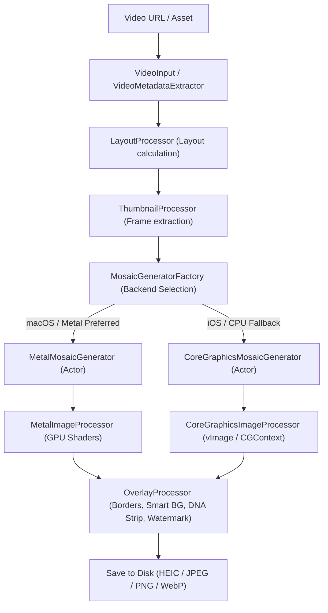
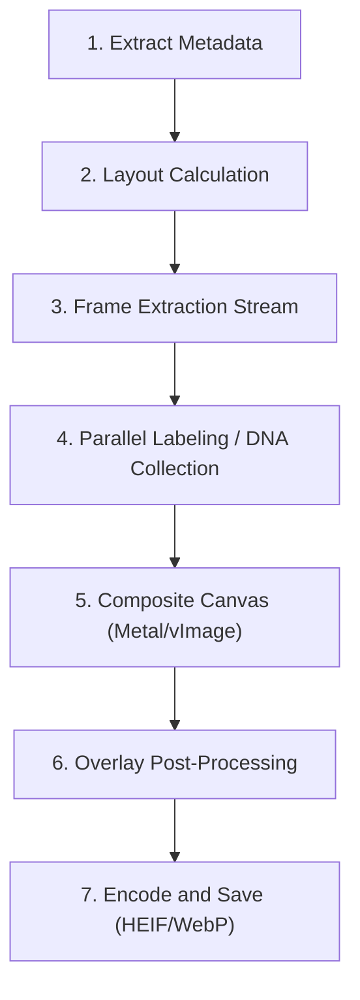
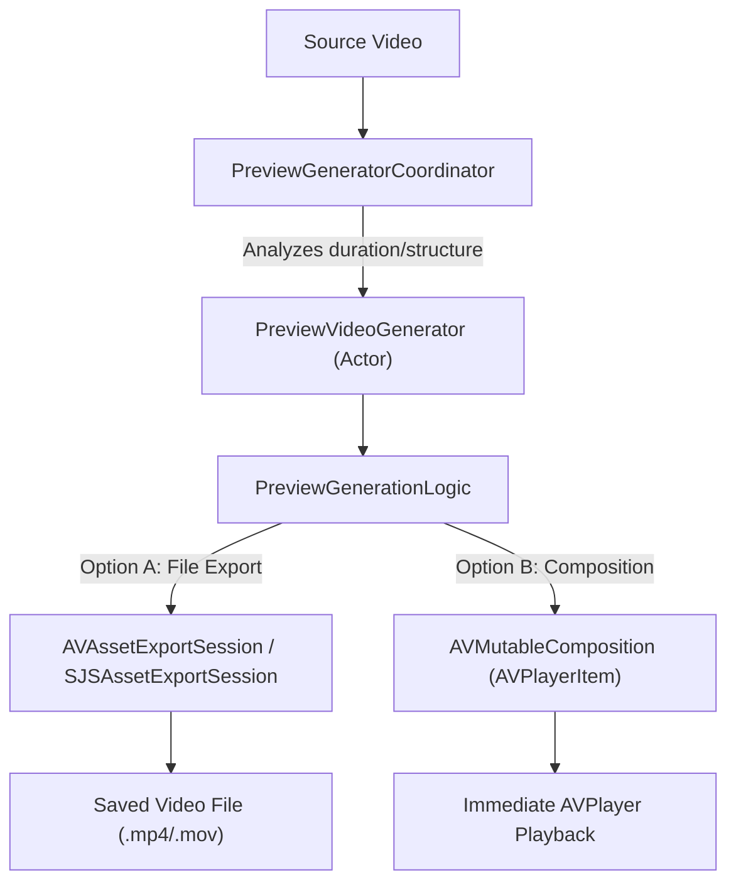

# MosaicKit Architecture & Deep Dive

This document provides a highly detailed mapping and structural breakdown of **MosaicKit**, a Swift package built to generate high-performance video mosaics (contact sheets) and preview videos (highlight reels) with advanced overlays, under strict thread safety and modern concurrency models (Swift 6.2).

---

## 1. Executive System Architecture

MosaicKit is designed around a **Dual-Engine architecture**, optimizing performance dynamically based on the host platform's hardware features. 

*   **GPU Engine (`MetalMosaicGenerator`)**: Targeted primarily at macOS, exploiting GPGPU pipelines via custom Metal compute kernels for scaling, blending, compositing, and visual overlays.
*   **CPU Engine (`CoreGraphicsMosaicGenerator`)**: Universal (iOS & macOS fallback), using Apple's high-performance **vImage (Accelerate Framework)** SIMD instructions and **Core Graphics** vector rendering.

Both engines implement a unified asynchronous interface, coordinated by high-level managers supporting robust concurrency throttling to prevent thread explosion or out-of-memory crashes on resource-constrained devices.



---

## 2. Shared Interface and Dynamic Engine Binding

### `MosaicGeneratorProtocol`
The contract governing all mosaic generation engines. It is declared as an `async` interface and constrains implementations to Swift `Actor` types to isolate mutable state:
```swift
public protocol MosaicGeneratorProtocol: Actor {
    func generate(for video: VideoInput, config: MosaicConfiguration, forIphone: Bool) async throws -> URL
    func generateMosaicImage(for video: VideoInput, config: MosaicConfiguration, forIphone: Bool) async throws -> CGImage
    func generateallcombinations(for video: VideoInput, config: MosaicConfiguration) async throws -> [URL]
    func cancel(for video: VideoInput)
    func cancelAll()
    func setProgressHandler(for video: VideoInput, handler: @escaping @Sendable (MosaicGenerationProgress) -> Void)
    func getPerformanceMetrics() -> [String: Any]
}
```

### `MosaicGeneratorFactory`
Determines which backend to spin up. It checks platforms, hardware configurations (e.g., Apple Silicon vs Intel, dedicated AMD/NVIDIA GPUs on macOS), and memory capacity (requiring $\ge$ 8GB for optimal macOS Metal execution):
1.  **`.auto`**: Resolves to `MetalMosaicGenerator` on macOS and `CoreGraphicsMosaicGenerator` on iOS.
2.  **`.preferMetal`**: Forces Metal on macOS (throwing an error if absent) or gracefully falls back to Core Graphics on iOS.
3.  **`.preferCoreGraphics`**: Forces Core Graphics on either platform.

---

## 3. The Mosaic Generation Pipeline

The generation process consists of 7 discrete pipeline stages:



### Phase 1: Video Metadata Extraction
*   **Component**: `VideoMetadataExtractor` / `VideoInput`
*   **Actions**: Loads the `AVAsset`, extracts container tracks, calculates raw dimension details, checks frame rates, calculates average bitrates, and resolves codecs (H.264, HEVC, ProRes, etc.).
*   **Design**: Leverages Swift async-await to non-blockingly load metadata properties (`asset.load(.duration)`).

### Phase 2: Layout Processing
*   **Component**: `LayoutProcessor`
*   **Actions**: Evaluates the aspect ratio of the source video against the target aspect ratio of the mosaic, factoring in target thumbnail counts.
*   **Algorithms**:
    *   **Classic**: Uniform grids of equal dimensions.
    *   **Custom**: Three-zone layout containing a large high-emphasis central thumbnail flanked by smaller top and bottom bands.
    *   **Auto**: Queries screen metrics (via `NSScreen` / `UIScreen`), optimizes reading sizes based on backing scale factor, and calculates row/column counts using readability scoring factors.
    *   **Dynamic**: Center-emphasized variable-size layouts.
    *   **iPhone**: Mobile-optimized layouts keeping the vertical scrolling constraint in mind.
*   **Caching**: Employs an internal memory cache (`layoutCache`) keyed by structural layout parameters to bypass recalculation.

### Phase 3: Frame Extraction Stream
*   **Component**: `ThumbnailProcessor`
*   **Actions**:
    *   Generates extraction timestamps uniformly or logarithmic-spaced across the duration of the media.
    *   Creates and configures an `AVAssetImageGenerator`, disabling aperture/transient adjustments, optimizing dimensions (`apertureMode = .productionAperture`), and requesting hardware decoding through VideoToolbox.
    *   Implements an asynchronous generator stream `extractFramesStream()` yielding `(Int, CGImage, String)` tuples sequentially (since `AVAssetImageGenerator` is not safe for concurrent invocation).
    *   **Robustness**: Features a retry block targeting failed frame extractions, rendering uniform placeholder "blank" frames if an extraction fails repeatedly.

### Phase 4: Parallel Labeling and Color DNA Collection
*   **Component**: `FrameColorCollector` & `ThumbnailProcessor.addTimestampToImage`
*   **Actions**:
    *   Using `withThrowingTaskGroup`, each extracted frame is dispatched to a parallel worker task.
    *   **FrameColorCollector**: A thread-safe actor that collects average colors from raw frames in parallel. These form the visual "Color DNA" strip.
    *   **Timestamp Drawing**: Renders exact frame timestamps (e.g. `01:24:12`) and frame counts in the corner of the thumbnail using CoreGraphics raster operations.

### Phase 5: Canvas Compositing (GPU vs CPU)
*   **Component**: `MetalImageProcessor` vs `CoreGraphicsImageProcessor`
    *   **Metal Pipeline**: 
        *   Creates a single large destination `MTLTexture`.
        *   Yields images into a processing stream directly mapped to Metal.
        *   Uses a `scaleTexture` compute kernel (using bi-linear/bi-cubic interpolation) followed by `compositeTextures` to render the frame onto the shared texture.
        *   Draws borders around tiles using `addBorder` kernel and fills backgrounds with the `fillTexture` kernel.
    *   **Core Graphics Pipeline**:
        *   Sets up a raw memory pixel-buffer context.
        *   Resizes thumbnails using the high-performance **vImage (Lanczos Resampling)** function `vImageScale_ARGB8888`.
        *   Composites them onto the master canvas via `CGContext.draw` with alpha-blending support.

### Phase 6: Post-Processing and Smart Overlays
*   **Component**: `OverlayProcessor`
*   **Actions**:
    *   **Color DNA Strip**: If enabled, composites a colorful ribbon below or above the video frame matching the exact chronological sequence of average scene colors.
    *   **Metadata Header**: Emits a text banner detailing codec, format, frame rate, duration, file size, title, and file size.
    *   **Watermarks**: Integrates watermarks with flexible opacity and scaling.

### Phase 7: Encoding and Serialization
*   **Component**: `VideoFormat` (HEIF, JPEG, PNG, GIF, WebP)
*   **Actions**:
    *   Converts the resulting CGImage into data using `CGImageDestination`.
    *   Includes specialized target encoders such as WebP (via `webp.swift`) and HEIC with adjustable compression qualities.
    *   Saves the final asset to the designated output folder.

---

## 4. Highlight Preview Video Generation

MosaicKit also houses a comprehensive subsystem for generating dynamic video previews (highlight reels) under `Sources/Processing/Preview`.



### Core Architecture
*   **`PreviewVideoGenerator` (Actor)**: Isolates preview generation tasks. It leverages an underlying static pipeline coordinator (`PreviewGenerationLogic`) to slice high-interest video clips.
*   **`PreviewGeneratorCoordinator`**: A batch-management coordinator regulating simultaneous video exports based on CPU cores and available system memory.

### Features
1.  **Non-destructive Composition**: Can output an `AVMutableComposition` instantly loaded into an `AVPlayerItem`. This allows media players to play a highlight reel immediately without waiting for video exports.
2.  **Export Session Wrappers**: Utilizes `SJSAssetExportSession` to downscale media, control audio mixing parameters, and maintain hardware-accelerated video encodings.
3.  **Active Concurrency Limits**: Auto-calculates safe limits ($\text{concurrency} = \min(\text{cores}-1, \frac{\text{Memory}}{500\text{MB}}, 8)$) to preserve device UI responsiveness.

---

## 5. Thread Safety and the Concurrency Model

MosaicKit uses Swift 6's strict concurrency boundaries:

| Class | Concurrency Primitive | Role |
|---|---|---|
| `MetalMosaicGenerator` | `actor` | Isolates GPU context, command pipelines, and task states. |
| `CoreGraphicsMosaicGenerator` | `actor` | Isolates vImage buffer memory pools and state variables. |
| `PreviewVideoGenerator` | `actor` | Isolates video composition and task cancellation maps. |
| `PreviewGeneratorCoordinator` | `actor` | Isolates batch counts, task lists, and thread metrics. |
| `FrameColorCollector` | `actor` | Accumulates color metrics concurrently from individual frame tasks. |
| `MetalImageProcessor` | `@unchecked Sendable` | Handled via structural thread-safe designs. Metrics are isolated under a `Mutex`. |
| `CoreGraphicsImageProcessor` | `@unchecked Sendable` | Protects its internal reusable buffer pool via `NSLock`. |

### Robust Resource Optimization
To prevent heavy garbage collection sweeps and memory churn:
*   `CoreGraphicsImageProcessor` implements a lock-protected **vImage_Buffer Pool** (`bufferPool`), reusing raw allocations across frames instead of allocating/deallocating large memory structures on every single thumbnail.
*   `MetalImageProcessor` employs a `CVMetalTextureCache` ensuring **zero-copy texture creation** when mapping `CVPixelBuffer` structures from hardware video decoders straight to GPU textures.

---

## 6. Structural Model Guide

All configuration options are highly structured, conforming to both `Codable` and `Sendable`:

### `MosaicConfiguration`
The unified structural manifest containing:
*   `density`: Structuring thumbnail count rules via `DensityConfig`.
*   `layout`: Regulating sizing, grids, and types via `LayoutConfiguration`.
*   `format`: Encoding guidelines (`.heic`, `.jpg`, `.png`, `.webp`, `.gif`) via `VideoFormat`.
*   `overlay`: Rules for titles, timestamp placements, margins, watermarks, and Color DNA.

### `DensityConfig`
Configures extraction rates, mapping levels from extra-extra-large (XXL - 25% spacing intervals) down to extra-extra-small (XXS - 400% spacing intervals) to fit any client size/performance requirement.

---

## 7. Testing Infrastructure

The suite relies on the new **Swift Testing** framework (declaring tests via `@Test` and validating logic using `#expect` and `#require` macros):

*   **Location**: `Tests/MosaicKitTests/`
*   **Asset Bundles**: Ships with a test video embedded directly in `Tests/MosaicKitTests/embeddedAsset/` for regression testing on actual hardware decoders.
*   **Coverage**: Thoroughly maps error boundaries, configuration adjustments, layout engines, watermarking filters, parallel coordinations, and GIF generation logic.
