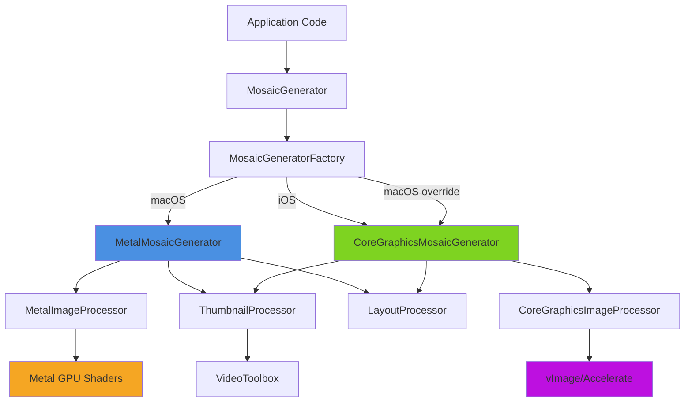

# Architecture Overview

Understanding MosaicKit's dual-platform architecture and component design.

@Metadata {
    @PageImage(purpose: card, source: "architecture-diagram")
}

## Overview

MosaicKit is built on a modular, platform-aware architecture that optimizes image processing for each platform while maintaining a unified API. The library uses a factory pattern to transparently select the best implementation based on the target platform and user preferences.

## High-Level Architecture



## Core Components

### Entry Point Layer

**MosaicGenerator**

The primary public API that applications interact with. This class:
- Provides a simple, unified interface for mosaic generation
- Delegates to platform-specific implementations via the factory pattern
- Handles VideoInput creation from URLs
- Manages logging and error propagation

```swift
public final class MosaicGenerator {
    private let internalGenerator: Any?
    private let generatorPreference: GeneratorPreference
    
    public init(preference: GeneratorPreference = .auto) throws
    public func generate(from: URL, config: MosaicConfiguration, 
                        outputDirectory: URL) async throws -> URL
    public func generateBatch(from: [URL], config: MosaicConfiguration, 
                             outputDirectory: URL) async throws -> [URL]
}
```

### Factory Layer

**MosaicGeneratorFactory**

Responsible for creating the appropriate generator implementation:

```swift
public enum MosaicGeneratorFactory {
    public enum GeneratorPreference {
        case auto              // Platform default
        case preferMetal       // macOS Metal (fallback to CG on iOS)
        case preferCoreGraphics // CG on both platforms
    }
    
    static func createGenerator(preference: GeneratorPreference) throws 
        -> any MosaicGeneratorProtocol
}
```

Decision logic:
1. `.auto`: Metal on macOS, Core Graphics on iOS
2. `.preferMetal`: Metal on macOS (requires GPU), falls back to CG on iOS
3. `.preferCoreGraphics`: CG on both platforms

### Protocol Layer

**MosaicGeneratorProtocol**

Defines the contract that both implementations must fulfill:

```swift
public protocol MosaicGeneratorProtocol: Actor {
    func generate(for: VideoInput, config: MosaicConfiguration, 
                 forIphone: Bool) async throws -> URL
    func generateallcombinations(for: VideoInput, 
                                config: MosaicConfiguration) async throws -> [URL]
    func cancel(for: VideoInput)
    func cancelAll()
    func setProgressHandler(for: VideoInput, 
                           handler: @escaping @Sendable (MosaicGenerationProgress) -> Void)
    func getPerformanceMetrics() -> [String: Any]
}
```

This protocol enables:
- Uniform interface across implementations
- Type-safe factory pattern
- Easy A/B testing between Metal and Core Graphics
- Seamless platform switching

### Implementation Layer

#### MetalMosaicGenerator (macOS)

Actor-based generator leveraging Metal GPU acceleration:

**Key Features:**
- GPU-parallel frame processing
- High-quality texture scaling with bilinear/trilinear filtering
- Alpha-blended compositing using Metal shaders
- Batch processing (20 frames per command buffer)
- Hardware-accelerated blur effects

**Performance Characteristics:**
- Best for: Large batches, high-resolution outputs, Apple Silicon Macs
- Memory: GPU memory pooling, texture reuse
- Concurrency: GPU command buffer parallelization

```swift
public actor MetalMosaicGenerator: MosaicGeneratorProtocol {
    private let metalProcessor: MetalImageProcessor
    private let layoutProcessor: LayoutProcessor
    private let thumbnailProcessor: ThumbnailProcessor
    
    // Actor-isolated state
    private var generationTasks: [UUID: Task<URL, Error>]
    private var frameCache: [UUID: [CMTime: CGImage]]
}
```

#### CoreGraphicsMosaicGenerator (iOS & macOS)

Actor-based generator using Core Graphics with Accelerate framework:

**Key Features:**
- vImage-accelerated scaling (Lanczos interpolation)
- Hardware-accelerated alpha blending via CGContext
- Core Image blur effects
- Efficient memory management with buffer reuse

**Performance Characteristics:**
- Best for: iOS devices, testing, systems without adequate GPU
- Memory: Explicit buffer management, immediate cleanup
- Concurrency: CPU parallelization via Swift concurrency

```swift
public actor CoreGraphicsMosaicGenerator: MosaicGeneratorProtocol {
    private let cgProcessor: CoreGraphicsImageProcessor
    private let layoutProcessor: LayoutProcessor
    private let thumbnailProcessor: ThumbnailProcessor
    
    // Actor-isolated state
    private var generationTasks: [UUID: Task<URL, Error>]
    private var frameCache: [UUID: [CMTime: CGImage]]
}
```

### Processing Layer

#### LayoutProcessor

Calculates optimal thumbnail layouts using multiple algorithms:

```swift
public final class LayoutProcessor {
    public func calculateLayout(
        originalAspectRatio: CGFloat,
        mosaicAspectRatio: AspectRatio,
        thumbnailCount: Int,
        mosaicWidth: Int,
        density: DensityConfig,
        layoutType: LayoutType
    ) -> MosaicLayout
}
```

Supports five layout algorithms:
1. **Custom**: Three-zone layout with centered large thumbnails
2. **Classic**: Traditional grid arrangement
3. **Auto**: Screen-aware adaptive layout
4. **Dynamic**: Center-emphasized with variable sizes
5. **iPhone**: Fixed-width vertical scrolling

See <doc:LayoutAlgorithms> for detailed algorithm descriptions.

#### ThumbnailProcessor

Extracts frames from video using VideoToolbox hardware acceleration:

```swift
final class ThumbnailProcessor {
    func extractThumbnails(
        from: URL,
        count: Int,
        density: DensityConfig,
        config: MosaicConfiguration
    ) async throws -> [CMTime: CGImage]
}
```

**Frame Distribution Strategy:**
- First third: 20% of frames
- Middle third: 60% of frames (captures most action)
- Last third: 20% of frames
- Skips first/last 5% to avoid fade effects

#### Platform-Specific Image Processors

**MetalImageProcessor** (macOS)

GPU-accelerated image composition using Metal shaders:

```swift
final class MetalImageProcessor {
    private let device: MTLDevice
    private let commandQueue: MTLCommandQueue
    private let pipelineState: MTLComputePipelineState
    
    func composeMosaic(
        layout: MosaicLayout,
        thumbnails: [CGImage],
        config: MosaicConfiguration
    ) throws -> CGImage
}
```

**CoreGraphicsImageProcessor** (iOS & macOS)

CPU-optimized image composition with vImage:

```swift
final class CoreGraphicsImageProcessor {
    func composeMosaic(
        layout: MosaicLayout,
        thumbnails: [CGImage],
        config: MosaicConfiguration
    ) throws -> CGImage
}
```

## Data Flow

### Mosaic Generation Flow

1. **Input Processing**
   ```
   Video URL → VideoInput (metadata extraction via AVAsset)
   ```

2. **Layout Calculation**
   ```
   LayoutProcessor → MosaicLayout (dimensions, positions)
   ```

3. **Frame Extraction**
   ```
   ThumbnailProcessor + VideoToolbox → [CMTime: CGImage]
   ```

4. **Image Composition**
   ```
   Metal/CG Processor → Final mosaic CGImage
   ```

5. **Output Generation**
   ```
   CGImage + OutputFormat → HEIF/JPEG/PNG file
   ```

### Concurrency Model

**Actor Isolation:**
Both generator implementations are actors, ensuring thread-safe access:

```swift
// All methods are implicitly async and actor-isolated
await generator.generate(for: video, config: config)
```

**Batch Processing:**
Uses structured concurrency with dynamic limits:

```swift
try await withThrowingTaskGroup(of: URL.self) { group in
    for video in videos {
        group.addTask {
            try await self.generate(for: video, config: config)
        }
    }
}
```

**Dynamic Concurrency Limits:**
```swift
// Memory-based: max(2, physicalMemory / 4GB)
// CPU-based: max(2, processorCount - 1)
// Final: min(memory, cpu, configured limit)
```

## Performance Characteristics

### Metal Implementation (macOS)

**Advantages:**
- 3-5x faster than Core Graphics for large batches
- Efficient GPU memory management
- Parallel texture processing
- Hardware-accelerated effects

**Trade-offs:**
- Requires Metal-capable GPU
- GPU memory limitations on older Macs
- Slightly higher initialization overhead

**Best For:**
- Apple Silicon Macs (M1/M2/M3)
- Large batch processing (10+ videos)
- High-resolution outputs (5K+)
- Modern dedicated GPUs

### Core Graphics Implementation (iOS & macOS)

**Advantages:**
- Available on all platforms
- Predictable memory usage
- No GPU dependencies
- Excellent for single-file processing

**Trade-offs:**
- CPU-bound performance
- Slower for large batches
- Higher CPU utilization

**Best For:**
- iOS devices (only option)
- Single video processing
- Systems without Metal
- Testing and development

## Memory Management

### Metal Path

```swift
// Texture pooling
private var textureCache: CVMetalTextureCache

// Command buffer batching (20 frames per buffer)
for batch in thumbnails.chunked(20) {
    let commandBuffer = commandQueue.makeCommandBuffer()
    // ... encode batch
    commandBuffer.commit()
}

// Automatic GPU memory cleanup via Metal's resource management
```

### Core Graphics Path

```swift
// Explicit buffer management
var sourceBuffer = vImage_Buffer(...)
defer { sourceBuffer.data.deallocate() }

// Immediate cleanup
context.flush()
thumbnails.removeAll()
```

## Error Handling

Comprehensive error types for different failure modes:

```swift
public enum MosaicError: LocalizedError {
    case layoutCreationFailed(Error)
    case imageGenerationFailed(Error)
    case saveFailed(URL, Error)
    case invalidDimensions(CGSize)
    case invalidConfiguration(String)
    case metalNotSupported
    case processingFailed(String)
}
```

## Platform Detection

Factory uses compile-time and runtime checks:

```swift
#if os(macOS)
// Check Metal availability
guard MTLCreateSystemDefaultDevice() != nil else {
    throw MosaicError.metalNotSupported
}
return try MetalMosaicGenerator()
#elseif os(iOS)
return try CoreGraphicsMosaicGenerator()
#endif
```

## Extension Points

### Custom Layout Algorithms

Extend `LayoutProcessor` with custom algorithms:

```swift
extension LayoutProcessor {
    func calculateMyCustomLayout(...) -> MosaicLayout {
        // Your layout logic
    }
}
```

### Custom Image Processors

Implement custom processing pipelines:

```swift
protocol ImageProcessor {
    func composeMosaic(...) throws -> CGImage
}
```

## See Also

- <doc:PlatformStrategy>
- <doc:PerformanceGuide>
- <doc:LayoutAlgorithms>
- ``MosaicGeneratorProtocol``
- ``MosaicGeneratorFactory``
