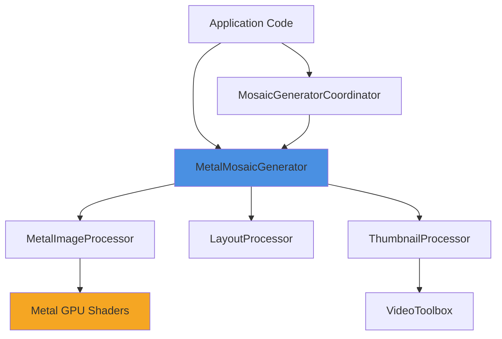

# Architecture Overview

Understanding MosaicKit's Metal-based architecture and component design.

@Metadata {
    @PageImage(purpose: card, source: "architecture-diagram")
}

## Overview

MosaicKit is built on a single Metal GPU backend used on every supported platform (macOS, iOS,
macCatalyst). There is no factory or platform-selection wrapper — `MetalMosaicGenerator` is the
sole public entry point and is constructed directly.

## High-Level Architecture


```mermaid
graph TB
    App[Application Code]

    App --> Metal[MetalMosaicGenerator]
    App --> Coord[MosaicGeneratorCoordinator]
    Coord --> Metal

    Metal --> MetalProc[MetalImageProcessor]

    MetalProc --> GPU[Metal GPU Shaders]

    Metal --> Layout[LayoutProcessor]
    Metal --> Thumb[ThumbnailProcessor]

    Thumb --> VT[VideoToolbox]

    style Metal fill:#4A90E2
    style GPU fill:#F5A623
```

## Core Components

### Entry Point Layer

**MetalMosaicGenerator**

The primary public API that applications interact with. This actor:
- Conforms to ``MosaicGeneratorProtocol``
- Owns the Metal, layout, and thumbnail-extraction pipeline for one generator instance
- Tracks in-flight generation tasks per `VideoInput` for cancellation and progress reporting

```swift
public actor MetalMosaicGenerator: MosaicGeneratorProtocol {
    public init(layoutProcessor: LayoutProcessor = LayoutProcessor()) throws

    public func generate(for video: VideoInput, config: MosaicConfiguration,
                         forIphone: Bool = false) async throws -> URL
    public func generateMosaicImage(for video: VideoInput, config: MosaicConfiguration,
                                    forIphone: Bool) async throws -> CGImage
    public func generateallcombinations(for video: VideoInput,
                                        config: MosaicConfiguration) async throws -> [URL]
}
```

For batches, wrap it in ``MosaicGeneratorCoordinator`` (or use the `createDefaultMosaicCoordinator`/
`createMosaicCoordinatorWithMetal` convenience functions), which adds CPU/memory-aware
concurrency limits and per-video cancellation on top of a single generator instance.

### Protocol Layer

**MosaicGeneratorProtocol**

Defines the contract that both implementations must fulfill:

```swift
public protocol MosaicGeneratorProtocol: Actor {
    func generate(for video: VideoInput, config: MosaicConfiguration,
                 forIphone: Bool) async throws -> URL
    func generateMosaicImage(for video: VideoInput, config: MosaicConfiguration,
                             forIphone: Bool) async throws -> CGImage
    func generateallcombinations(for video: VideoInput,
                                config: MosaicConfiguration) async throws -> [URL]
    func cancel(for video: VideoInput)
    func cancelAll()
    func setProgressHandler(for video: VideoInput,
                           handler: @escaping @Sendable (MosaicGenerationProgress) -> Void)
    func getPerformanceMetrics() -> [String: Any]
}
```

This protocol enables:
- A single, testable interface in front of the Metal engine
- Seamless actor-isolated concurrency

**Key Features of `MetalMosaicGenerator`:**
- GPU-parallel frame processing
- High-quality texture scaling with bilinear/trilinear filtering
- Alpha-blended compositing using Metal shaders
- Batch processing (20 frames per command buffer)
- Hardware-accelerated blur effects

**Performance Characteristics:**
- Best for: Large batches, high-resolution outputs, Apple Silicon Macs
- Memory: GPU memory pooling, texture reuse
- Concurrency: GPU command buffer parallelization

### Processing Layer

#### LayoutProcessor

Calculates optimal thumbnail layouts using multiple algorithms, cached by
`(aspectRatio, thumbnailCount, mosaicWidth, density, layoutType)`:

```swift
public final class LayoutProcessor {
    public func calculateLayout(
        originalAspectRatio: CGFloat,
        mosaicAspectRatio: AspectRatio,
        thumbnailCount: Int,
        mosaicWidth: Int,
        density: DensityConfig,
        layoutType: LayoutType
    ) -> MosaicLayout
}
```

Supports five layout algorithms:
1. **Custom**: Three-zone layout with centered large thumbnails
2. **Classic**: Traditional grid arrangement
3. **Auto**: Screen-aware adaptive layout
4. **Dynamic**: Center-emphasized with variable sizes
5. **iPhone**: Fixed-width vertical scrolling

See <doc:LayoutAlgorithms> for detailed algorithm descriptions.

#### ThumbnailProcessor

Extracts frames from video using `AVAssetImageGenerator`, hardware-accelerated via VideoToolbox:

```swift
public final class ThumbnailProcessor: Sendable {
    public func extractThumbnails(
        from file: URL,
        layout: MosaicLayout,
        asset: AVAsset,
        preview: Bool = false,
        accurate: Bool = false,
        progressHandler: ((Double) -> Void)? = nil
    ) async throws -> [(image: CGImage, timestamp: String)]
}
```

**Frame Distribution Strategy:**
- First third: 20% of frames
- Middle third: 60% of frames (captures most action)
- Last third: 20% of frames
- Skips first/last 5% to avoid fade effects

#### MetalImageProcessor

GPU-accelerated image composition using Metal shaders:

```swift
public final class MetalImageProcessor: @unchecked Sendable {
    public func generateMosaic(
        from frames: [(image: CGImage, timestamp: String)],
        layout: MosaicLayout,
        metadata: VideoMetadata,
        config: MosaicConfiguration,
        metadataHeader: CGImage? = nil,
        forIphone: Bool = false,
        progressHandler: (@Sendable (Double) -> Void)? = nil
    ) async throws -> CGImage
}
```

## Data Flow

### Mosaic Generation Flow

1. **Input Processing**
   ```
   Video URL → VideoInput (metadata extraction via AVAsset)
   ```

2. **Layout Calculation**
   ```
   LayoutProcessor → MosaicLayout (dimensions, positions)
   ```

3. **Frame Extraction**
   ```
   ThumbnailProcessor + VideoToolbox → [(image: CGImage, timestamp: String)]
   ```

4. **Image Composition**
   ```
   MetalImageProcessor → Final mosaic CGImage
   ```

5. **Output Generation**
   ```
   CGImage + OutputFormat → HEIF/JPEG/PNG file
   ```

### Concurrency Model

**Actor Isolation:**
`MetalMosaicGenerator` is an actor, ensuring thread-safe access:

```swift
// All methods are implicitly async and actor-isolated
await generator.generate(for: video, config: config)
```

**Batch Processing:**
Uses structured concurrency with dynamic limits:

```swift
try await withThrowingTaskGroup(of: URL.self) { group in
    for video in videos {
        group.addTask {
            try await self.generate(for: video, config: config)
        }
    }
}
```

**Dynamic Concurrency Limits:**
```swift
// Memory-based: max(2, physicalMemory / 4GB)
// CPU-based: max(2, processorCount - 1)
// Final: min(memory, cpu, configured limit)
```

## Performance Characteristics

### Metal Implementation (all platforms)

**Advantages:**
- 3-5x faster than CPU rendering for large batches
- Efficient GPU memory management with texture reuse
- Parallel texture processing
- Hardware-accelerated effects (blur, gradients, shadows)
- Unified memory on iOS / Apple Silicon: zero CPU↔GPU copies

**Trade-offs:**
- Requires Metal-capable GPU (guaranteed on iOS 26+, macOS 26+)
- Slightly higher initialization overhead (~50-100ms for shader compilation)

**Best For:**
- Any Apple Silicon device
- Large batch processing (10+ videos)
- High-resolution outputs (5K+)

## Memory Management

### Metal Path

```swift
// Texture pooling via CVMetalTextureCache
private var textureCache: CVMetalTextureCache

// Command buffer batching (20 frames per buffer)
for batch in thumbnails.chunked(20) {
    let commandBuffer = commandQueue.makeCommandBuffer()
    // ... encode batch
    commandBuffer.commit()
    await commandBuffer.completed()
}

// Automatic GPU memory cleanup via Metal's resource management
```

## Error Handling

Comprehensive error types for different failure modes:

```swift
public enum MosaicError: LocalizedError {
    case layoutCreationFailed(Error)
    case imageGenerationFailed(Error)
    case saveFailed(URL, Error)
    case invalidDimensions(CGSize)
    case invalidConfiguration(String)
    case generationFailed(Error)
    case fileExists(URL)
    case contextCreationFailed
    case imageCreationFailed
    case invalidVideo(String)
    case metalNotSupported
    case processingFailed(String)
}
```

`MosaicError.metalNotSupported` is a reserved case for callers to use in their own Metal-availability
checks; MosaicKit itself surfaces a missing/unusable Metal device through `MetalProcessorError`
instead (see below), propagated unwrapped from `MetalMosaicGenerator.init()`.

## Metal Availability Check

`MetalImageProcessor.init()` (invoked internally by `MetalMosaicGenerator.init()`) verifies Metal at
construction time and throws `MetalProcessorError.deviceNotAvailable` if no device is present:

```swift
public enum MetalProcessorError: Error {
    case deviceNotAvailable
    case commandQueueCreationFailed
    case libraryCreationFailed
    // ...
    case commandBufferExecutionFailed(context: String, underlying: String)
}
```

```swift
do {
    let generator = try MetalMosaicGenerator()
} catch MetalProcessorError.deviceNotAvailable {
    // No usable Metal device — required on every platform this package targets
    // (macOS 26+, iOS 26+, macCatalyst 26+), so this should only happen in
    // unusual sandboxed/virtualized environments.
}
```

## See Also

- <doc:PlatformStrategy>
- <doc:PerformanceGuide>
- <doc:LayoutAlgorithms>
- ``MosaicGeneratorProtocol``
- ``MetalMosaicGenerator``
- ``MosaicGeneratorCoordinator``
