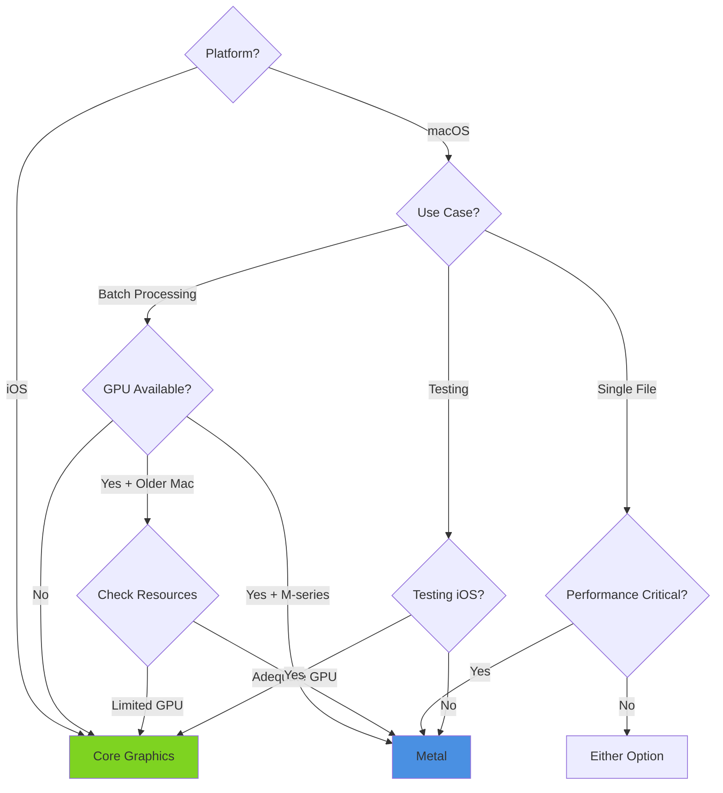

# Platform-Specific Processing Strategy

Understanding how MosaicKit optimizes for macOS and iOS platforms.

## Overview

MosaicKit uses a dual-engine architecture to maximize performance on each platform. This document explains the technical decisions behind the platform-specific implementations and when to choose each approach.

## Platform Selection Matrix

| Platform | Default Engine | Alternative | Use Case |
|----------|---------------|-------------|----------|
| **macOS** | Metal GPU | Core Graphics | Production use / Testing |
| **iOS** | Core Graphics | N/A | Only option |
| **Mac Catalyst** | Core Graphics | N/A | iOS compatibility |

## macOS: Metal GPU Acceleration

### Why Metal on macOS?

Metal provides significant performance advantages for image processing tasks:

1. **Parallel Processing**: GPUs excel at processing thousands of pixels simultaneously
2. **Dedicated Hardware**: Offloads work from CPU, maintaining system responsiveness
3. **Unified Memory (Apple Silicon)**: Zero-copy texture access on M-series chips
4. **Hardware Filters**: Built-in support for high-quality scaling and compositing

### Metal Architecture

```swift
public actor MetalMosaicGenerator {
    private let metalProcessor: MetalImageProcessor
    
    // Core Metal resources
    private let device: MTLDevice
    private let commandQueue: MTLCommandQueue
    private let pipelineState: MTLComputePipelineState
}
```

**Key Components:**

**Metal Shaders** (Resources/Shaders/):
- Kernel functions for image compositing
- GPU-parallel pixel processing
- Alpha blending operations

**Texture Management:**
```swift
// Efficient texture creation from CGImage
let textureDescriptor = MTLTextureDescriptor.texture2DDescriptor(
    pixelFormat: .rgba8Unorm,
    width: width,
    height: height,
    mipmapped: false
)
textureDescriptor.usage = [.shaderRead, .shaderWrite]
let texture = device.makeTexture(descriptor: textureDescriptor)
```

**Command Buffer Batching:**
```swift
// Process 20 frames per command buffer to avoid GPU timeout
for batch in thumbnails.chunked(20) {
    let commandBuffer = commandQueue.makeCommandBuffer()
    // Encode batch operations
    commandBuffer.commit()
}
```

### Metal Performance Profile

**Strengths:**
- Large batch processing (10+ videos): 3-5x faster than Core Graphics
- High-resolution outputs (4K, 5K, 8K): GPU scaling is very efficient
- Complex visual effects: Hardware-accelerated blur, gradients, shadows

**Limitations:**
- GPU memory constraints on older Intel Macs (4-8GB VRAM)
- Initialization overhead (~50-100ms for shader compilation)
- Requires Metal-capable hardware

**Optimal Scenarios:**
```swift
// Best for batch processing on Apple Silicon
let generator = try MosaicGenerator(preference: .preferMetal)

let config = MosaicConfiguration(
    width: 5120,        // High resolution
    density: .xxs       // Maximum frames
)

// Process many videos
let mosaics = try await generator.generateBatch(
    from: Array(videos.prefix(50)),  // Large batch
    config: config,
    outputDirectory: outputDir
)
```

### When to Avoid Metal on macOS

1. **Insufficient GPU Resources:**
   - Intel Macs with integrated graphics (Intel HD/Iris)
   - Older dedicated GPUs with < 2GB VRAM
   - Systems running GPU-intensive applications simultaneously

2. **Development/Testing:**
   - Testing iOS behavior without an iOS device
   - Comparing performance between implementations
   - Debugging image processing logic

3. **Single File Processing:**
   - One-off mosaic generation where initialization overhead matters
   - Quick previews with minimal frames

```swift
// Use Core Graphics for single files on older Macs
let cgGenerator = try MosaicGenerator(preference: .preferCoreGraphics)
let mosaic = try await cgGenerator.generate(from: url, config: config, outputDirectory: dir)
```

## iOS: Core Graphics + vImage

### Why Core Graphics on iOS?

iOS uses Core Graphics with Accelerate framework optimizations:

1. **Platform Availability**: Metal compute shaders have limitations on iOS
2. **Energy Efficiency**: CPU-based processing with NEON optimizations
3. **Predictable Performance**: Consistent behavior across all iOS devices
4. **Memory Control**: Explicit buffer management for mobile constraints

### Core Graphics Architecture

```swift
public actor CoreGraphicsMosaicGenerator {
    private let cgProcessor: CoreGraphicsImageProcessor
    
    // vImage buffers for accelerated operations
    func processWithVImage() {
        var sourceBuffer = vImage_Buffer(...)
        var destBuffer = vImage_Buffer(...)
        
        // High-quality scaling with Lanczos
        vImageScale_ARGB8888(
            &sourceBuffer,
            &destBuffer,
            nil,
            kvImageHighQualityResampling
        )
    }
}
```

**Key Components:**

**vImage Acceleration:**
```swift
import Accelerate

// Lanczos interpolation for high-quality scaling
let error = vImageScale_ARGB8888(
    &sourceBuffer,
    &destBuffer,
    nil,
    kvImageHighQualityResampling  // Lanczos kernel
)
```

**Hardware-Accelerated Compositing:**
```swift
// CGContext uses hardware acceleration on iOS
let context = CGContext(
    data: nil,
    width: width,
    height: height,
    bitsPerComponent: 8,
    bytesPerRow: 0,
    space: CGColorSpaceCreateDeviceRGB(),
    bitmapInfo: CGImageAlphaInfo.premultipliedLast.rawValue
)

context.draw(image, in: rect)  // Hardware-accelerated on iOS
```

**Core Image Effects:**
```swift
// Gaussian blur for gradients
let filter = CIFilter(name: "CIGaussianBlur")
filter?.setValue(ciImage, forKey: kCIInputImageKey)
filter?.setValue(10.0, forKey: kCIInputRadiusKey)
```

### Core Graphics Performance Profile

**Strengths:**
- Excellent single-file performance
- Predictable memory usage
- Energy-efficient on mobile devices
- Available on all iOS devices

**Limitations:**
- CPU-bound (no GPU parallelization)
- Slower for large batches compared to Metal on macOS
- Higher CPU utilization

**Optimal Scenarios:**
```swift
// Best for iOS production apps
let generator = try MosaicGenerator()  // Auto-selects CG on iOS

let config = MosaicConfiguration(
    width: 2048,        // Mobile-appropriate resolution
    density: .m         // Balanced frame count
)

// Process one video at a time
let mosaic = try await generator.generate(
    from: videoURL,
    config: config,
    outputDirectory: outputDir
)
```

## Platform Comparison

### Performance Benchmarks

Based on internal testing with 1080p video, 100 frames:

| Scenario | Metal (macOS) | Core Graphics (macOS) | Core Graphics (iOS) |
|----------|---------------|----------------------|---------------------|
| Single mosaic (2K) | 2.3s | 3.1s | 4.5s |
| Single mosaic (5K) | 3.8s | 8.2s | N/A (too large) |
| Batch 10 videos (2K) | 18s | 35s | 52s |
| Batch 10 videos (5K) | 32s | 89s | N/A |

**Test System:**
- macOS: M2 MacBook Pro 16GB
- iOS: iPhone 14 Pro

### Memory Usage

| Implementation | Single Mosaic | Batch (10) | Peak Memory |
|---------------|---------------|------------|-------------|
| Metal (macOS) | 250MB | 450MB | GPU + RAM pooling |
| Core Graphics (macOS) | 180MB | 1.2GB | RAM only |
| Core Graphics (iOS) | 150MB | 800MB | RAM only |

## Choosing the Right Implementation

### Decision Tree



### Code Examples

**Automatic Selection (Recommended):**
```swift
// Platform-appropriate default
let generator = try MosaicGenerator()
```

**Explicit Metal (macOS Production):**
```swift
#if os(macOS)
let generator = try MosaicGenerator(preference: .preferMetal)
#endif
```

**Force Core Graphics (Cross-Platform Testing):**
```swift
// Test iOS behavior on macOS
let generator = try MosaicGenerator(preference: .preferCoreGraphics)

// Compare implementations
let metalGen = try MosaicGenerator(preference: .preferMetal)
let cgGen = try MosaicGenerator(preference: .preferCoreGraphics)

let metalTime = ContinuousClock().measure {
    try await metalGen.generate(from: url, config: config, outputDirectory: dir)
}

let cgTime = ContinuousClock().measure {
    try await cgGen.generate(from: url, config: config, outputDirectory: dir)
}

print("Metal: \(metalTime), Core Graphics: \(cgTime)")
```

## Platform-Specific Optimizations

### macOS Metal Optimizations

**Texture Pooling:**
```swift
private var textureCache: CVMetalTextureCache
CVMetalTextureCacheCreate(nil, nil, device, nil, &textureCache)
```

**Unified Memory (Apple Silicon):**
```swift
// Zero-copy texture access on M-series
let buffer = device.makeBuffer(
    bytesNoCopy: pixelData,
    length: dataSize,
    options: .storageModeShared
)
```

**Asynchronous Execution:**
```swift
commandBuffer.addCompletedHandler { _ in
    // Cleanup on GPU completion
}
commandBuffer.commit()
// Continue CPU work immediately
```

### iOS Core Graphics Optimizations

**vImage Buffer Reuse:**
```swift
// Reuse buffers to avoid allocations
private var bufferPool: [vImage_Buffer] = []

func getBuffer() -> vImage_Buffer {
    return bufferPool.popLast() ?? allocateNewBuffer()
}

func returnBuffer(_ buffer: vImage_Buffer) {
    bufferPool.append(buffer)
}
```

**Memory Warnings:**
```swift
// Clear caches on memory pressure
NotificationCenter.default.addObserver(
    forName: UIApplication.didReceiveMemoryWarningNotification,
    object: nil,
    queue: .main
) { _ in
    Task {
        await generator.clearCaches()
    }
}
```

**Progressive Loading:**
```swift
// Extract frames progressively for memory control
for timeRange in timeRanges.chunked(20) {
    let frames = try await extractFrames(in: timeRange)
    let partialMosaic = try await composePartial(frames)
    // Immediately release frames
    frames.removeAll()
}
```

## Testing Both Implementations on macOS

MosaicKit makes it easy to compare implementations:

```swift
import XCTest
import MosaicKit

final class PerformanceTests: XCTestCase {
    func testMetalVsCoreGraphics() async throws {
        let url = Bundle.module.url(forResource: "test", withExtension: "mp4")!
        let config = MosaicConfiguration.default
        let outputDir = FileManager.default.temporaryDirectory
        
        // Test Metal
        let metalGen = try MosaicGenerator(preference: .preferMetal)
        let metalStart = ContinuousClock.now
        let metalResult = try await metalGen.generate(
            from: url,
            config: config,
            outputDirectory: outputDir
        )
        let metalDuration = metalStart.duration(to: .now)
        
        // Test Core Graphics
        let cgGen = try MosaicGenerator(preference: .preferCoreGraphics)
        let cgStart = ContinuousClock.now
        let cgResult = try await cgGen.generate(
            from: url,
            config: config,
            outputDirectory: outputDir
        )
        let cgDuration = cgStart.duration(to: .now)
        
        print("Metal: \(metalDuration)")
        print("Core Graphics: \(cgDuration)")
        print("Speedup: \(cgDuration / metalDuration)x")
        
        // Verify results match
        let metalImage = try loadImage(from: metalResult)
        let cgImage = try loadImage(from: cgResult)
        XCTAssertEqual(metalImage.width, cgImage.width)
        XCTAssertEqual(metalImage.height, cgImage.height)
    }
}
```

## Platform-Specific Debugging

### Metal Debugging (macOS)

Enable Metal API validation:
```swift
// In Xcode scheme:
// Product → Scheme → Edit Scheme
// Run → Diagnostics → Metal API Validation
```

Check GPU usage:
```bash
# Monitor GPU utilization
sudo powermetrics --samplers gpu_power -i 1000
```

### Core Graphics Debugging (iOS)

Enable Instruments profiling:
```swift
// Profile with Time Profiler instrument
// Look for vImageScale_ARGB8888 and CGContext operations
```

Memory graph debugging:
```swift
// Xcode → Debug → Memory Graph
// Look for CGImage retention
```

## See Also

- <doc:Architecture>
- <doc:PerformanceGuide>
- ``MosaicGeneratorFactory``
- ``MetalMosaicGenerator``
- ``CoreGraphicsMosaicGenerator``
