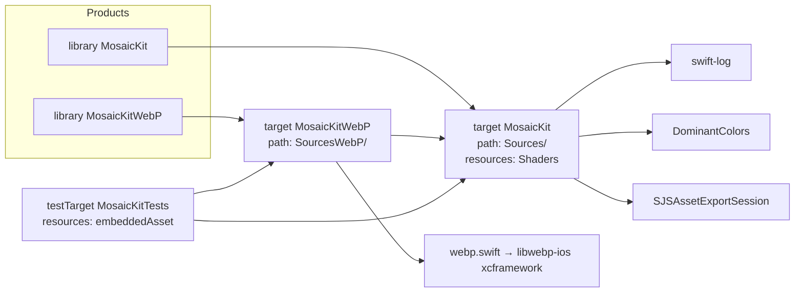
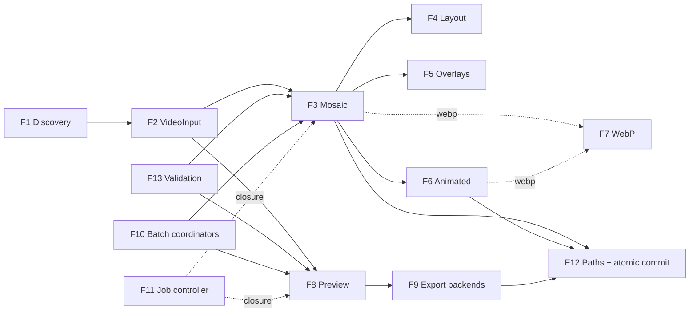
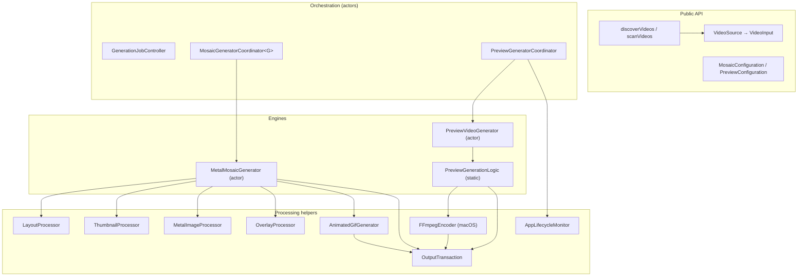
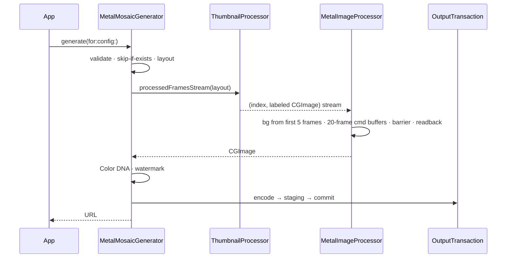
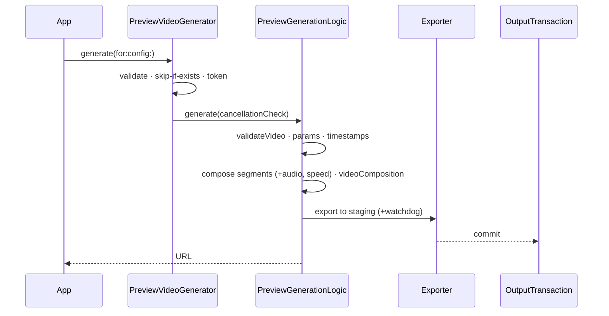
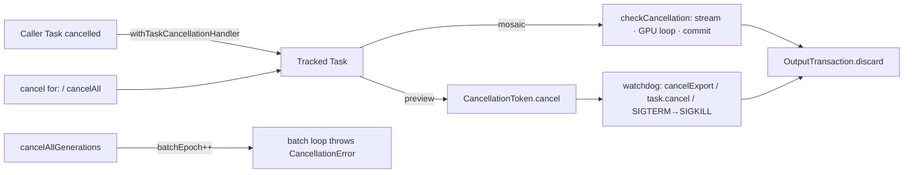
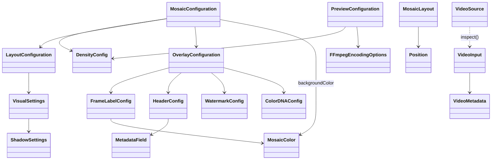

# MosaicKit — Codebase Knowledge Base

> **Purpose of this document.** A self-contained "brain dump" of the MosaicKit repository that
> another engineer or LLM can use to implement features, fix bugs, and refactor safely without
> first re-reading the whole codebase.
>
> **Status:** complete (all six analysis phases done), dated 2026-09-25.
>
> **Snapshot:** `main` @ `8f0c82f` ("Update swift.yml"). The README advertises release line
> **1.7.0**, and an unreleased revert of its frame source is noted. All 20 file anchors were
> re-verified against `main` in the final pass. Related open PRs:
> - **#33**: iOS CI scheme + 8-bit test fixture (CI green).
> - **#34**: ffmpeg cancellation watchdog (macOS CI green).
>
> **Conventions used here**
> - All paths are relative to the repository root.
> - File anchors use `[[F:path#line-range#hash8]]`, where `hash8` is the first 8 hex chars of the
>   file's SHA-256 at the snapshot above. If the hash no longer matches, re-verify the claim.
> - "**⚠ Finding**" marks something that disagrees with other docs or is likely to surprise you.

---

## Executive summary

**What it is.** MosaicKit is a Swift 6.2 package for macOS/iOS/macCatalyst 26+. It turns videos
into two kinds of visual summary:
- **mosaics / contact sheets**: one still image, optionally with an animated GIF/HEICS/WebP
  version;
- **previews / highlight reels**: a short video built from clips of the source, exported to a
  file or returned as an `AVPlayerItem`.

It runs entirely on-device: AVFoundation decoding, Metal compositing, and ImageIO,
AVAssetExportSession, SJS, or an external ffmpeg for encoding.

**How it is built.**
- Codable config structs (`MosaicConfiguration`, `PreviewConfiguration`) and inspected inputs
  (`VideoInput`) feed two actor engines, `MetalMosaicGenerator` and `PreviewVideoGenerator`.
- Coordinator actors on top add batching, concurrency limits, cancellation, and preview retry.
  `GenerationJobController` adds job and attempt IDs.
- Every output is published through `OutputTransaction` (staging file + rename).
- There is no database or network access. The only persistent "schema" is the Codable model
  graph (§5.3).

**What matters most before changing code:**
1. The persisted identity of configs and outputs (Codable keys, enum raw values,
   `configurationHash`, filenames) must stay stable (§4.1 rules 2–4).
2. The heavy CPU steps of mosaic generation run on the generator actor. Preview export hops to
   the main actor. Throughput is a hard requirement: the bounded 1.7.0 frame source was reverted
   for being 30–45 % slower (§2.6).
3. Output publication is atomic for `overwrite == true`. The no-overwrite path uses a
   placeholder because `link(2)` fails on SMB. A destination-aware strategy is planned (§F12).

**Top issues** (register in §4.2):

| Priority | Issue |
|---|---|
| High | **I-1** rotated/portrait sources are stretched |
| High | **I-2** the ffmpeg scale filter distorts non-16:9 and portrait video |
| Medium | **I-3** ffmpeg HEVC forced to 30 fps |
| Medium | **I-4** no-overwrite placeholder race |
| Medium | **I-8** `.dynamic` layout overlaps and clips cells |
| Medium | **I-12** preview skip-if-exists never matches |
| Medium | **I-16** slow ffmpeg cancellation (fix in #34) |
| Medium | **I-20** `.nochange` animation holds all frames in memory |
| Medium | **I-22** 10-bit H.264 is undecodable on iOS (fixture fixed in #33) |
| Medium | **I-24** strict `MosaicConfiguration` decoding breaks older saved configs |

**Most valuable platform addition:** iOS/macOS 27
`AVAssetExportSession.configureForResumableExport()`, which lets interrupted preview exports
resume instead of restarting (§4.9).

## How to read this document

| Level | Read | For |
|---|---|---|
| **High-level overview** | Executive summary, Part 1 | What the library does, features and their business purpose, how they fit together |
| **Mid-level technical notes** | Part 2 (architecture), Part 3 (per feature) | How data flows, where code runs, how each feature works, and edge cases |
| **Deep reference** | Part 4 (must-know, issue register, roadmap), Part 5 (API, schema, errors, cookbook), Part 6 (consolidated roadmap), appendices | Before changing code; lookups |

Each Part ends with a "wrap-up" subsection. These are the working log of the phase that
produced the Part: decisions, open questions, and next steps at that time. **§4.2 (issue
register) and Part 6 hold the current status.** Where a wrap-up item was later corrected, the
correction is marked inline.

## Table of contents

- [Executive summary](#executive-summary) · [How to read this document](#how-to-read-this-document)
1. [Part 1 — High-Level Overview](#part-1--high-level-overview)
   1. [What MosaicKit is](#11-what-mosaickit-is)
   2. [Who uses it](#12-who-uses-it)
   3. [Tech stack & dependencies](#13-tech-stack--dependencies)
   4. [Package products & targets](#14-package-products--targets)
   5. [Repository structure](#15-repository-structure)
   6. [Feature catalog & business purpose](#16-feature-catalog--business-purpose)
   7. [How the features interact](#17-how-the-features-interact)
   8. [Public entry points at a glance](#18-public-entry-points-at-a-glance)
   9. [Which existing docs to trust](#19-which-existing-docs-to-trust)
   10. [Early findings (status tracked in §4.2)](#110-early-findings-status-tracked-in-42)
   11. [Phase 1 wrap-up](#111-phase-1-wrap-up)
2. [Part 2 — System Architecture](#part-2--system-architecture)
   1. [Architectural style](#21-architectural-style-in-one-paragraph)
   2. [Component map](#22-component-map)
   3. [Mosaic data flow](#23-mosaic-data-flow-f3f7)
   4. [Preview data flow](#24-preview-data-flow-f8f9)
   5. [Orchestration layer](#25-orchestration-layer-f10f11)
   6. [Concurrency & isolation](#26-concurrency--isolation-model)
   7. [Cancellation model](#27-cancellation-model)
   8. [Error model](#28-error-model)
   9. [Cross-cutting concerns](#29-cross-cutting-concerns)
   10. [Third-party boundaries](#210-third-party-integration-boundaries)
   11. [Build, test & CI](#211-build-test--ci-architecture)
   12. [Phase 2 wrap-up](#212-phase-2-wrap-up)
3. [Part 3 — Feature-by-Feature Analysis](#part-3--feature-by-feature-analysis)
   - [F1 Discovery](#f1--video-discovery) · [F2 Input](#f2--video-input--inspection) · [F3 Mosaic](#f3--mosaic-generation) · [F4 Layout](#f4--layout-engine) · [F5 Overlays](#f5--overlays--annotations) · [F6 Animated](#f6--animated-export-gif--heics--animated-webp) · [F7 WebP](#f7--optional-webp-support)
   - [F8 Preview](#f8--preview-video-highlight-reel) · [F9 Export backends](#f9--preview-export-backends) · [F10 Batch](#f10--batch-coordination) · [F11 Jobs](#f11--explicit-job-lifecycle) · [F12 Output & publication](#f12--output-paths-idempotency--atomic-publication) · [F13 Validation](#f13--up-front-validation--typed-errors)
   - [3.14 Interaction matrix](#314-cross-feature-interaction-matrix) · [3.15 Capabilities](#315-how-the-features-combine-into-product-capabilities) · [3.16 Wrap-up](#316-phase-3-wrap-up)
4. [Part 4 — Things You Must Know Before Changing Code](#part-4--things-you-must-know-before-changing-code)
   - [4.1 Rules card](#41-the-rules-card-read-this-first) · [4.2 Issue register](#42-verified-issue-register) · [4.3 Performance](#43-performance-hotspots--budgets) · [4.4 Security](#44-security-implications) · [4.5 Business rules](#45-hard-coded-business-rules--constants)
   - [4.6 Design decisions](#46-non-obvious-design-decisions--likely-rationale) · [4.7 Tricky code](#47-tricky-code-explained) · [4.8 Checklists](#48-change-checklists) · [4.9 iOS/macOS 27 roadmap](#49-platform-roadmap-ios--macos-27-apis-relevant-to-mosaickit) · [4.10 Wrap-up](#410-phase-4-wrap-up)
5. [Part 5 — Technical Reference & Glossary](#part-5--technical-reference--glossary)
   - [5.1 Glossary](#51-glossary) · [5.2 Public API](#52-public-api-reference) · [5.3 Model schema](#53-model-relationship-diagram-the-persisted-schema) · [5.4 Status reference](#54-progress--status-reference) · [5.5 Error catalog](#55-error-catalog) · [5.6 Cookbook](#56-usage-cookbook) · [5.7 Output naming](#57-output-artifact-naming-reference) · [5.8 Docs map](#58-documentation-map) · [5.9 Wrap-up](#59-phase-5-wrap-up)
6. [Part 6 — Consolidated Findings, Roadmap & Maintenance](#part-6--consolidated-findings-roadmap--maintenance)
   - [6.1 Roadmap](#61-recommended-roadmap-prioritized) · [6.2 Open questions](#62-open-questions-still-unresolved) · [6.3 Maintenance](#63-keeping-this-document-current) · [6.4 Decisions](#64-maintainer-decisions-2026-09-26)
7. [Appendix A — File Index](#appendix-a--file-index)
8. [Appendix B — Assumptions](#appendix-b--assumptions)
9. [Appendix C — State Block](#appendix-c--state-block)

---

## Part 1 — High-Level Overview

### 1.1 What MosaicKit is

MosaicKit is a **Swift Package (library, not an app)** that turns video files into two kinds of
visual summaries:

1. **Video mosaics / contact sheets.** One large still image (HEIF, JPEG, PNG, or WebP)
   containing a grid of frames sampled across the whole video. You can add a metadata header,
   per-frame timestamps, a watermark, and a "Color DNA" strip. The package can also produce an
   **animated** version (GIF, HEICS, or animated WebP) made from the same frames.
2. **Preview videos / highlight reels.** A short video (default ~60 s) made from many short clips
   spread evenly across the source. It can be exported to a file (`.mp4`/`.mov`/`.m4v`) or
   returned as an in-memory `AVPlayerItem` for immediate playback.

Everything runs on-device with Apple frameworks: AVFoundation for decoding and export, Metal
compute shaders for compositing, and ImageIO for encoding. On macOS, previews can optionally be
transcoded by an external `ffmpeg` binary.

- **Platforms:** macOS 26+, iOS 26+, macCatalyst 26+ (`Package.swift` `platforms:`)
  [[F:Package.swift#8#f02eefa2]].
- **Language/tooling:** Swift 6.2 (`swift-tools-version: 6.2`), strict concurrency (CI builds
  iOS with `SWIFT_STRICT_CONCURRENCY=complete`).
- **License:** Apache 2.0 (`LICENSE`).
- **Size:** about 13.4k lines of Swift in `Sources/` + `SourcesWebP/`, 160 lines of Metal, and about 5.6k lines
  of tests in `Tests/`.

### 1.2 Who uses it

The package is a library. Nothing in this repo is an end-user app. Its consumers are:

| Consumer type | What they need from MosaicKit | Evidence |
|---|---|---|
| **Media-library / video-manager apps (macOS & iOS)** | Thumbnail sheets for browsing large collections of videos, and previews that play without re-encoding | `generateComposition` returns an `AVPlayerItem`; batch coordinators; `scanVideos`/`discoverVideos` folder scanning; `overwrite == false` skip-if-exists for incremental runs |
| **Batch / archival pipelines (CLI tools, daemons, XPC services)** | Unattended, resumable bulk generation with predictable output paths | `enableAppLifecycleMonitor = false` and `enableExportRetry = false` exist specifically for daemons/CLI (`Sources/Models/PreviewConfiguration.swift`); `outputDirectoryTemplate`/`filenameTemplate`; `.ffmpeg` export mode |
| **Apps with persisted work queues** | Stable job IDs, pause, retry, and cancel | `GenerationJobController`, `VideoSource` (Codable, no I/O on construction) |
| **Web/social publishing workflows** | Web-friendly formats and animated teasers | `.webp` still/animated output, `GifSize` presets, `AspectRatio.vertical` (9:16) |

The fields `postID` and `VideoMetadata.custom`, plus the removed `serviceName`/`creatorName`
fields (README "New in 1.3.0"), show that the library was first built for an app that organized
downloaded videos by **service/creator/post**. That coupling has mostly been removed, but a few
traces remain. For example, `{service}` and `{creator}` are still listed as filename tokens in
the `MosaicConfiguration.filenameTemplate` doc comment.

### 1.3 Tech stack & dependencies

**Apple frameworks used (all first-party):**

| Framework | Used for | Main files |
|---|---|---|
| AVFoundation | Asset loading, metadata, frame extraction (`AVAssetImageGenerator`), composition (`AVMutableComposition`), export (`AVAssetExportSession`) | `ThumbnailProcessor.swift`, `MosaicFrameSource.swift`, `VideoMetadataExtractor.swift`, `Preview/PreviewVideoGenerator.swift` |
| VideoToolbox | Hardware decode (implicitly through AVFoundation) | `MetalMosaicGenerator.swift` imports it |
| Metal | GPU compute kernels for scale, composite, fill, border, and shadow | `MetalImageProcessor.swift`, `Shaders/MetalShaders.metal` |
| CoreGraphics / CoreImage / ImageIO / UniformTypeIdentifiers | Text/overlay rasterization, `CGImageDestination` encoding (HEIF/JPEG/PNG/GIF/HEICS) | `ThumbnailProcessor.swift`, `OverlayProcessor.swift`, `AnimatedGifGenerator.swift` |
| QuartzCore (Core Animation) | Burned-in timestamp pills in preview video (`AVVideoCompositionCoreAnimationTool`) | `Preview/PreviewVideoGenerator.swift` |
| OSLog | Logging (`Logger(subsystem:category:)`) and `OSSignposter` performance intervals | nearly every processing file |
| Synchronization | `Mutex` for lock-protected state (`CancellationToken`, WebP registry) | `WebPSupport.swift`, `PreviewVideoGenerator.swift` |
| AppKit / UIKit | Lifecycle notifications and platform font/color/image types | `AppLifecycleMonitor.swift`, `PreviewVideoGenerator.swift`, `MosaicKitWebP.swift` |

**Third-party SPM dependencies** (`Package.swift`, pinned in `Package.resolved`):

| Package | Pinned | Linked into | Actual use |
|---|---|---|---|
| `apple/swift-log` | 1.10.1 | `MosaicKit` | **⚠ Finding: declared but never imported.** No `import Logging` exists in `Sources/`, `Tests/`, or `Examples/`. All logging uses OSLog's `Logger(subsystem: "com.mosaicKit", …)`. `CLAUDE.md` says to use swift-log `Logger(label:)`; the code does not. |
| `DenDmitriev/DominantColors` | 1.2.2 | `MosaicKit` | Dominant-color extraction for the gradient mosaic background (`MetalImageProcessor.swift` ~L593–601) |
| `samsonjs/SJSAssetExportSession` | 0.4.0 | `MosaicKit` | `.sjs` preview export mode; its `VideoOutputSettings.Codec` type also appears in the public models (`VideoFormat.swift`, `PreviewConfiguration.swift`, `PreviewExportDescription.swift`) |
| `awxkee/webp.swift` (→ `libwebp-ios` 1.1.1, a **binary xcframework**) | 1.1.2 | **`MosaicKitWebP` only** | Still and animated WebP encoding |

**Runtime (non-SPM) dependency:** an external `ffmpeg` executable. It is needed only for
`PreviewExportMode.ffmpeg` on macOS, and its path is supplied through
`PreviewConfiguration.ffmpegBinaryPath`.

**Tooling:**
- SwiftPM is the real build system: `swift build` and `swift test`.
- `Makefile` + `scripts/*.sh` are an **agent/xcodebuild scaffold** (`xcbuild.sh`, `task.sh`,
  simulator runners). `scripts/xcbuild.sh` exists and the Makefile uses it as `XCBUILD`, but
  every target builds `MosaicKit.xcodeproj` / `-scheme MosaicKit`, and **no `.xcodeproj` exists**
  in the repo. Treat the Makefile as unusable as configured. (`CLAUDE.md` used to claim "There is no
  Makefile"; corrected on 2026-09-26.)
- `.spi.yml` builds DocC for the Swift Package Index (macOS + iOS, Swift 6.2).
- `MosaicKitTests.xctestplan` is an Xcode test plan.

### 1.4 Package products & targets



**Why WebP is split out** (see `Sources/Processing/WebPSupport.swift` and the `Package.swift`
comments): a binary xcframework anywhere in a target's dependency graph breaks Xcode SwiftUI
Preview JIT for every client that links it. The core target therefore only declares the
`MosaicKitWebPEncoding` protocol and a `Mutex`-guarded registry
(`MosaicKitWebPSupport.encoder`). Clients that want WebP link `MosaicKitWebP` and call
`MosaicKitWebP.register()` once at startup. Without that call, any WebP request throws
`MosaicKitWebPError.encoderNotRegistered`. `MosaicConfiguration.validate()` checks this before
any work starts.

**⚠ Finding:** `Examples/README.md` says to run `swift run SimpleExample` and similar commands
(`CLAUDE.md` said so too until 2026-09-26). `Package.swift` declares **no executable targets**, so those commands cannot
work as the package stands. The files in `Examples/` are reference snippets only.

### 1.5 Repository structure

```
.
├── Package.swift / Package.resolved   SPM manifest (2 library products, 1 test target)
├── Sources/                           → target "MosaicKit"
│   ├── Models/                        Codable+Sendable value types (configs, inputs, progress)
│   │   ├── MosaicConfiguration.swift  Mosaic config, output-path/filename templating, OutputFormat,
│   │   │                              AnimatedFormat, GifCreationMode, GifSize, MosaicColor
│   │   ├── PreviewConfiguration.swift Preview config, PreviewExportMode, extract-count math, paths
│   │   ├── ConfigurationValidation.swift  validate() for DensityConfig / MosaicConfiguration / PreviewConfiguration
│   │   ├── DensityConfig.swift        7 density presets (XXL…XXS) + custom
│   │   ├── LayoutConfiguration.swift  LayoutType, AspectRatio, VisualSettings, BorderColor, ShadowSettings
│   │   ├── MosaicLayout.swift         Computed layout (positions, sizes) + ASCII debug art
│   │   ├── OverlayConfiguration.swift FrameLabel / Header / Watermark / ColorDNA configs
│   │   ├── VideoInput.swift           Inspected video (metadata) — the unit of work everywhere
│   │   ├── VideoSource.swift          Lightweight Codable source ref + inspect() + VideoInput.validate()
│   │   ├── VideoFormat.swift          Preview containers + native/SJS presets + ExportMaxResolution
│   │   ├── FFmpegEncodingOptions.swift  Codec/CRF/preset/resolution for ffmpeg export
│   │   ├── PreviewExportDescription.swift  "What will this export produce?" description for UI
│   │   └── PreviewGenerationProgress.swift Preview status/progress/result types
│   ├── Processing/
│   │   ├── MetalMosaicGenerator.swift  ★ Main mosaic entry point (actor)
│   │   ├── MosaicGeneratorProtocol.swift  Actor-constrained generator protocol
│   │   ├── MosaicGeneratorCoordinator.swift  ★ Batch/concurrency manager (generic actor) + progress/result types
│   │   ├── GenerationJobs.swift       ★ GenerationJobController (job/attempt IDs, pause/retry)
│   │   ├── LayoutProcessor.swift      Thumbnail count + 5 layout algorithms + cache
│   │   ├── ThumbnailProcessor.swift   Frame extraction/streaming, labels, metadata header rendering
│   │   ├── MosaicFrameSource.swift    Pull-based, single-consumer bounded frame source
│   │   ├── MetalImageProcessor.swift  Metal pipeline + DominantColors background
│   │   ├── OverlayProcessor.swift     Color DNA strip, watermark, average color
│   │   ├── AnimatedGifGenerator.swift GIF/HEICS/WebP animation writer
│   │   ├── OutputTransaction.swift    Staging file + atomic rename/exclusive-create commit
│   │   ├── WebPSupport.swift          WebP encoder injection point
│   │   ├── VideoMetadataExtractor.swift  AVFoundation metadata (actor)
│   │   ├── ProcessingError.swift / VideoError.swift  MosaicError, LibraryError, VideoError
│   │   └── Preview/
│   │       ├── PreviewVideoGenerator.swift  ★ Preview entry point (actor) + PreviewGenerationLogic
│   │       ├── PreviewGeneratorCoordinator.swift  ★ Preview batch manager + background retry
│   │       ├── FFmpegEncoder.swift     Passthrough export + ffmpeg Process (macOS)
│   │       ├── AppLifecycleMonitor.swift  Foreground-wait gate (singleton actor)
│   │       └── PreviewError.swift
│   ├── Shaders/MetalShaders.metal     5 kernels: scaleTexture, compositeTextures, fillTexture, addBorder, addShadow
│   ├── VideoInputScanner.swift        scanVideos / discoverVideoSources / discoverVideos
│   └── MosaicKit.docc/                DocC catalog (8 articles)
├── SourcesWebP/MosaicKitWebP.swift    → target "MosaicKitWebP" (DefaultMosaicKitWebPEncoder + register())
├── Tests/MosaicKitTests/              Swift Testing suites (19 files) + embeddedAsset/test_video.mp4
├── Examples/                          5 illustrative .swift files (NOT wired as SPM targets)
├── Media.xcassets/                    test_video dataset (same fixture, for Xcode)
├── .github/workflows/                 swift.yml (macOS + iOS Simulator CI), claude*.yml
├── scripts/, Makefile, tasks/         Agent/xcodebuild scaffolding (see §1.3)
└── README.md, DOCUMENTATION.md, CONTRIBUTING.md, CLAUDE.md, AGENTS.md,
    MosaicKit-DeepDive.md, spec.md    Human/agent docs (reliability varies — §1.9)
```

★ = primary public entry points.

### 1.6 Feature catalog & business purpose

Each feature has a stable ID (F1…F13) that later phases reuse.

| ID | Feature | Business purpose | Primary code |
|---|---|---|---|
| **F1** | **Video discovery** | Turn a folder of videos into a work list without the app writing its own file-walking code. | `scanVideos(in:recursive:)` (lenient, legacy), `discoverVideoSources` (no I/O), `discoverVideos(in:recursive:metadataConcurrency:)` (throwing, bounded concurrency, results in filename order). All in `Sources/VideoInputScanner.swift`. Recognizes 15 extensions (mp4, mov, mkv, webm, ts, mxf, …). |
| **F2** | **Video input & inspection** | Load the metadata that sizing and labels depend on (duration, dimensions, fps, codec, bitrate, size) once, validate it, and make it serializable for queues. | `VideoSource` (Codable; `inspect()` loads metadata), `VideoInput` (inspected; `init(from:)` throws, while the legacy `init(url:…) async` never throws and falls back to the values you passed in), `VideoInput.validate()`, `VideoMetadataExtractor` actor. |
| **F3** | **Mosaic generation** | Core product: a single image that summarizes a whole video, for browsing, cataloguing, and sharing. | `MetalMosaicGenerator.generate(for:config:forIphone:) → URL`, `generateMosaicImage(…) → CGImage` (in memory, nothing saved), `generateallcombinations` (3 widths × 7 densities, always HEIF). Rejects videos shorter than **5 s**. |
| **F4** | **Layout engine** | Choose how many frames and how to arrange them so the sheet is readable at the target size and aspect ratio. | `LayoutProcessor.calculateThumbnailCount` + `calculateLayout`. 5 `LayoutType`s: `custom` (default, three-zone), `classic`, `auto` (screen-aware, not cached), `dynamic`, `iphone`. 5 `AspectRatio`s. `DensityConfig` scales frame count from 0.25× to 4×. |
| **F5** | **Overlays & annotations** | Make the sheet informative and brandable: timestamps show *where* each frame comes from, the header shows *what* the file is, the watermark shows ownership, and Color DNA gives a visual fingerprint. | `OverlayConfiguration` (`FrameLabelConfig`, `HeaderConfig` with `MetadataField`s, `WatermarkConfig`, `ColorDNAConfig`). Rendering is split between `ThumbnailProcessor` (labels, header), `OverlayProcessor` (DNA, watermark), and `MetalImageProcessor` (borders/shadow, dominant-color background). |
| **F6** | **Animated export** | A lightweight animated teaser (GIF/HEICS/WebP) for places where a big still or a video is not suitable. | `MosaicConfiguration.gifMode` (`.disabled` / `.withMosaic` / `.gifOnly`), `gifSize`, `animatedFormat` (default `.webp`), `gifFps` (default 10). Written by `AnimatedGifGenerator.save`. |
| **F7** | **Optional WebP support** | Offer web-optimized output without making every client pay the SwiftUI-Preview cost of a binary xcframework. | `MosaicKitWebP` product, `MosaicKitWebPEncoding` protocol, `MosaicKitWebPSupport.encoder` registry. |
| **F8** | **Preview video (highlight reel)** | A short watchable summary of a long video. It can play instantly (`AVPlayerItem`) or be saved to a file for sharing or storage. | `PreviewVideoGenerator.generate(for:config:progressHandler:) → URL` and `generateComposition(…) → AVPlayerItem`. Implemented by `PreviewGenerationLogic` (validate → timestamps → compose → export). Clip count comes from `PreviewConfiguration.extractCount(forVideoDuration:)`, which is a density base (4…48) plus a log-duration adjustment. |
| **F9** | **Preview export backends** | Trade speed, quality, and control: `.native` = simplest (Apple presets), `.sjs` = codec/bitrate/resolution control, `.ffmpeg` = best compression/codec choice on macOS. | `PreviewExportMode`; `exportWithNativeSession`, `exportWithSJSSession`, `exportWithFFmpeg` → `FFmpegEncoder` (passthrough `.mov` then `ffmpeg` transcode). Supporting types: `nativeExportPreset`, `SjSExportPreset`, `ExportMaxResolution`, `FFmpegEncodingOptions`, `PreviewExportDescription`. |
| **F10** | **Batch coordination** | Process many videos quickly without exhausting CPU, RAM, or hardware encoders, with per-video progress and correct cancellation. | `MosaicGeneratorCoordinator<Generator>`: dynamic limit = min(cores/2, RAM / (width·density/2000 GB)), minimum 2. `PreviewGeneratorCoordinator`: dynamic limit capped at **2** because of VideoToolbox encoder channels, plus a foreground-wait/stall retry up to 3×. Both use a `batchEpoch` so a cancelled batch stops. |
| **F11** | **Explicit job lifecycle** | Let apps with persisted queues track *jobs* (stable ID) and *attempts* (new ID per retry), and pause, retry, or cancel them independently of the video URL. | `GenerationJobController` actor, `GenerationJobID`, `GenerationAttemptID`, `GenerationJobState`, `GenerationJobSnapshot`. It wraps any `() async throws -> URL` closure; work starts only when `value(for:)` is awaited. |
| **F12** | **Output paths & atomic commit** | Predictable, idempotent output locations (skip work already done), and encoders never write directly to the final path. With `overwrite == false` there is a brief zero-byte placeholder window; see §2.9. | `MosaicConfiguration.generateOutputDirectory` / `generateFilename` / `animatedOutputURL` / `configurationHash`, `createOutputSubdirectory`, `outputDirectoryTemplate` and `filenameTemplate` tokens, `overwrite`. `OutputTransaction` (hidden `.mosaickit-<UUID>.<ext>` staging file → `rename(2)`, or with `overwrite == false` an exclusive `fopen("wx")` claim followed by rename). The preview side has its own equivalents in `PreviewConfiguration`. |
| **F13** | **Up-front validation & typed errors** | Fail fast with actionable messages before spending GPU, decoder, or encoder time. | `DensityConfig.validate`, `MosaicConfiguration.validate`, `PreviewConfiguration.validate`, `VideoInput.validate`; error enums `MosaicError`, `LibraryError`, `VideoError`, `PreviewError`, `MetalProcessorError`, `MosaicKitWebPError`. |

**Cross-cutting capabilities** (these are not features themselves; Phase 2 covers them):
cancellation propagation (tracked tasks, `withTaskCancellationHandler`, `CancellationToken`),
progress reporting (`MosaicGenerationProgress`/`Status`, `PreviewGenerationProgress`/`Status`),
performance metrics (`getPerformanceMetrics()` dictionaries, `OSSignposter` intervals), and
background/lifecycle handling (`AppLifecycleMonitor`, `ProcessInfo.beginActivity` on macOS during
preview export).

### 1.7 How the features interact



(Also stored as `codebase-analysis-docs/assets/feature-map.mmd`. The mosaic pipeline flowchart
is in `codebase-analysis-docs/assets/mosaic-pipeline.mmd`.)

**The two main flows:**

- **"Make a contact sheet":** F1/F2 produce a `VideoInput` → F13 validates `MosaicConfiguration`
  → F3 checks F12 paths (skip if the output exists) → F4 sizes the grid → frames stream through
  F5 labeling and color sampling into the Metal compositor → the F5 DNA strip and watermark are
  applied → F12 commits atomically → optionally F6 writes the animation next to the mosaic (via
  F7 if WebP).
- **"Make a highlight reel":** F2 `VideoInput` → F13 validates `PreviewConfiguration` → F8
  computes extract count/duration/speed → builds an `AVMutableComposition` (optionally with
  timestamp overlays) → returns an `AVPlayerItem` **or** hands off to F9 (native/SJS/ffmpeg) →
  F12-style staged commit.

**How they fit together:**

- The mosaic path and the preview path **share `VideoInput` and `DensityConfig`** (both use the
  same seven density names). They also share **`OutputTransaction`**: the mosaic save, the
  animated export, and all three preview exporters publish through it. A change to that type
  affects both product lines. Otherwise they are separate: configs, generators, coordinators,
  error enums, and path-templating code. A mosaic and a preview of the same video are
  independent jobs.
- **F6 depends on F3's layout.** The animation reuses `layout.thumbCount` and the mosaic's output
  directory and filename (`animatedOutputURL` = `"<gifSize> -" + mosaic base name + ext`).
  `.gifOnly` still runs layout calculation but skips compositing. In the `overwrite == false`
  early-exit path, F3 will **backfill a missing animation** next to an existing mosaic.
- **F10 wraps F3/F8. F11 is an alternative to F10, not a layer on top of it.**
  `GenerationJobController` does not know about coordinators. It runs any closure (typically
  `MetalMosaicGenerator().generate…` or `PreviewVideoGenerator().generate…`). The spec
  (`spec.md`) describes a much larger service/plan/batch-handle API. **Only the small
  `GenerationJobController` has been implemented.**
- **F12 drives incremental processing.** The skip-if-exists early return depends on the resolved
  path being deterministic. For mosaics it is. For previews in the default naming mode it is not
  (see §1.10 item 3).

**Combined value:** an app can scan a library (F1) and batch-generate (F10) a browsable,
annotated contact sheet (F3–F5) for each video, plus a playable teaser (F8/F9) or an animated
thumbnail (F6). Idempotent paths (F12) allow re-running cheaply as new files arrive. Job control
(F11) and validation (F13) keep this manageable in long-running or user-facing apps.

### 1.8 Public entry points at a glance

| Task | Call | Returns |
|---|---|---|
| Inspect one file | `try await VideoInput(from: url)` or `try await VideoSource(url:).inspect()` | `VideoInput` |
| Scan a folder | `try await discoverVideos(in: folder, recursive: true)` | `[VideoInput]` (sorted by filename) |
| One mosaic → file | `try await MetalMosaicGenerator().generate(for: video, config: config)` | `URL` |
| One mosaic → memory | `try await generator.generateMosaicImage(for:config:)` | `CGImage` |
| Mosaic batch | `try createDefaultMosaicCoordinator().generateMosaicsforbatch(videos:config:progressHandler:)` or `generateMosaicsForFiles(_:config:…)` | `[MosaicGenerationResult]` |
| One preview → file | `try await PreviewVideoGenerator().generate(for:config:)` | `URL` |
| One preview → player | `try await PreviewVideoGenerator().generateComposition(for:config:)` | `AVPlayerItem` |
| Preview batch | `PreviewGeneratorCoordinator().generatePreviewsForBatch(…)` / `generatePreviewCompositionsForBatch(…)` | `[PreviewGenerationResult]` / `[PreviewCompositionResult]` |
| Job control | `GenerationJobController().submit { … }` then `value(for:)`, `pause`, `retry`, `cancel`, `snapshot(for:)` | `GenerationJobID`, `URL` |
| Enable WebP | `MosaicKitWebP.register()` (link `MosaicKitWebP`) | — |
| Cancel | `generator.cancel(for:)` / `cancelAll()`; `coordinator.cancelGeneration(for:)` / `cancelAllGenerations()`; or cancel the awaiting `Task` | — |

Default values worth knowing:

- **`MosaicConfiguration()`:** width 5120, density `.m`, `.heif`, quality 0.4, `.custom` layout,
  metadata header on, movie-color background on, `animatedFormat` `.webp`.
- **`MosaicConfiguration.default`:** width 4000, density `.xl`. This differs from the plain
  initializer's defaults.
- **`PreviewConfiguration()`:** 60 s, `.m`, `.mp4`, quality 0.8, `.native` export.

### 1.9 Which existing docs to trust

| Doc | Reliability | Notes |
|---|---|---|
| Source code | **Authoritative** | Always verify against it. |
| `README.md` | High, with exceptions | Current through 1.7.0, but the 1.7.0 "bounded pull-based stream" note describes a design that was later **reverted** for performance (§2.6). Other exception: "New in 1.6.2" says the default `ExportMaxResolution` is **4K**, but the code defaults to **"1080p"** (§1.10 item 4). The installation snippet still says `from: "1.2.0"`. |
| `CLAUDE.md` / `AGENTS.md` | High (rewritten 2026-09-26) | Both files are identical except for the title and first paragraph, and point agents to this document first. Earlier errors (swift-log, "no Makefile", `swift run` examples, nonexistent workflows, `Models/AspectRatio.swift`, Core Graphics/vImage, `VideoFormat` as the mosaic format) are corrected. Keep the two files in sync. |
| `MosaicKit-DeepDive.md` | **Stale — do not trust architecture sections** | Describes the removed dual engine (`CoreGraphicsMosaicGenerator`, `MosaicGeneratorFactory`, vImage buffer pool) and a `.gif` still format. The coordinator concurrency formula it gives is for previews only, and the cap of 8 it quotes is really 2. |
| `spec.md` | **Design intent, only partly implemented** | Describes a `GenerationRequest/Plan`, `JobHandle/BatchHandle`, checkpoint ledger, and a single processing-service actor. None of these exist. What does exist: `VideoSource`, `OutputTransaction`, `MosaicFrameSource`, validation, `GenerationJobController`. |
| `Sources/MosaicKit.docc/*` | High, reviewed | `Architecture.md` is accurate but shows the array-based `generateMosaic(from:)` rather than the streaming path. `PreviewExporting.md` matches the stall timeouts. `BackgroundProcessing.md` is current. `PerformanceGuide.md` benchmark numbers are unverified. `PlatformStrategy.md` is historical context. |

### 1.10 Early findings (status tracked in §4.2)

These were found during the initial scan. Their verified status now lives in the §4.2
register:

| Item | Now tracked as |
|---|---|
| 1 | I-23 |
| 2 | §4.5 constants |
| 3 | I-12 |
| 4 | I-13 |
| 5 | I-24 |
| 6 | I-25 |
| 7 | resolved (§2.6) |
| 8 | §5.2.3 |
| 9 | I-25 |

1. **swift-log is an unused dependency.** Code uses OSLog only. Subsystem strings are also
   inconsistent: `"com.mosaicKit"` in most files, but `"com.mosaickit"` (lowercase k) in
   `PreviewVideoGenerator.swift` and `PreviewConfiguration.swift`. This matters when filtering
   logs in Console.
2. **Mosaic output-dimension limit.** `MetalMosaicGenerator` rejects `config.width > 16_384`
   inside generation (not in `validate()`) and videos shorter than 5 s, both as
   `MosaicError.invalidVideo`.
   [[F:Sources/Processing/MetalMosaicGenerator.swift#171-179#07857fa0]]
3. **Preview skip-if-exists never matches in default naming mode.** With `fullPathInName ==
   false` and no `filenameTemplate`, `PreviewConfiguration.generateFilename` embeds a
   run-time timestamp (`yyyy-MM-dd_HH-mm-ss`). As a result, `overwrite == false` never finds an
   existing file, and each run writes a new preview.
   [[F:Sources/Models/PreviewConfiguration.swift#517-565#bb8d3160]]
4. **Preview max-resolution default mismatch.** `_exportMaxResolutionRaw` defaults to `"1080p"`
   (the declaration, the decoder fallback, and the `init(…maxResolution:)` fallback all agree).
   Comments in two initializers say "defaults to 4K", and the README says 4K.
5. **`MosaicConfiguration` decoding is strict.** `gifMode`, `gifSize`, `animatedFormat`,
   `gifFps`, `overwrite`, and the other fields use `decode`, not `decodeIfPresent`. Only
   `createOutputSubdirectory` and the two templates are tolerant. Configs persisted before those
   fields existed will fail to decode.
6. **`generateallcombinations` ignores most of the caller's config.** It builds fresh HEIF
   configs (quality 0.4, default layout, metadata on, accurate timestamps) and does not use
   the caller's `outputdirectory`, overlay, or templates.
7. *(Resolved in §2.6: guarded by `NSRecursiveLock`; OK.)* **`LayoutProcessor` is a non-`Sendable` `final class` with mutable state.**
   `mosaicAspectRatio` and a 64-entry cache (guarded by `stateLock`) are shared by the
   generator actor.
8. **Several `MosaicConfiguration` initializers have conflicting animation defaults.** The main
   initializer uses `gifSize .nochange` and `.webp`. The overlay initializer without `gifMode`
   uses `.small` and `.webp`. The deprecated `forIphone:` initializer uses `.nochange` and
   `.gif`. The "density-only" initializer sets width 2500, quality 0.3, and **turns off** the
   movie-color background.
9. **Dead code in `MetalMosaicGenerator`.** `extractFramesWithVideoToolbox`,
   `calculateExtractionTimes`, and `calculateAspectRatio` are private and never called.
   Extraction really goes through `ThumbnailProcessor.processedFramesStream`.

### 1.11 Phase 1 wrap-up

**Decisions / findings**
- MosaicKit is a single-backend (Metal) Apple-platform library with two independent product
  lines, **Mosaic** (F3–F7) and **Preview** (F8–F9). They are joined by shared input (F1–F2),
  orchestration (F10–F11), and output/validation infrastructure (F12–F13).
- Source code is the only fully reliable reference. `MosaicKit-DeepDive.md` and parts of
  `CLAUDE.md`/`AGENTS.md` are stale.

**Open questions** (carried into the State Block)
- How exactly does `MetalImageProcessor.generateMosaicStream` bound GPU submissions, and how does
  it use `MosaicFrameSource` versus `ThumbnailProcessor.processedFramesStream`?
- Details of the `LayoutProcessor` formulas (thumbnail count vs. density vs. width) and the cache
  key contents.
- How the preview composition handles speed-up (`playbackSpeed`), audio, and orientation, and how
  the three export paths commit output (do they all use `OutputTransaction`?).
- `FFmpegEncoder` process lifecycle: termination, diagnostics, and temp cleanup.
- What the tests actually cover and which ones are skipped in CI (`MOSAICKIT_SUITE_MODE=none`).

**Next steps (Phase 2):** read `MetalImageProcessor.swift`, `ThumbnailProcessor.swift` (stream +
header), `LayoutProcessor.swift`, the rest of `PreviewVideoGenerator.swift` (compose/export),
`FFmpegEncoder.swift`, `PreviewGeneratorCoordinator.swift`, `VideoMetadataExtractor.swift`, the
error files, and the DocC `Architecture.md`/`PerformanceGuide.md`. Then produce component maps,
sequence diagrams, and the concurrency/cancellation model.

---

## Part 2 — System Architecture

> Phase 2 goal: map every major component, how data moves through it, where each piece of code
> runs (actor / main actor / global executor), how cancellation and errors propagate, and the
> cross-cutting concerns. Feature IDs (F1–F13) are defined in §1.6.

### 2.1 Architectural style in one paragraph

MosaicKit is a **layered, actor-based media-processing library**:

- **Configuration** lives in immutable-by-value `Codable`/`Sendable` structs (`MosaicConfiguration`,
  `PreviewConfiguration`, `VideoInput`, …).
- **Public engines are actors.** `MetalMosaicGenerator` and `PreviewVideoGenerator` own per-job
  bookkeeping (tracked tasks, progress handlers, cancellation tokens).
- **The heavy lifting is delegated to non-actor helpers.** These are either stateless static
  namespaces (`PreviewGenerationLogic`, `FFmpegEncoder`, `OverlayProcessor`,
  `AnimatedGifGenerator`) or `Sendable` classes (`ThumbnailProcessor`, `MetalImageProcessor`,
  `LayoutProcessor` with an internal lock).
- **Coordinator actors sit on top.** `MosaicGeneratorCoordinator`, `PreviewGeneratorCoordinator`,
  and `GenerationJobController` add batching, admission control, and lifecycle.

There is **no persistence layer, no network I/O, and no database**. The only external side
effects are:

- reading video files;
- writing output files (through staging and an atomic commit);
- spawning an `ffmpeg` process (macOS, opt-in);
- creating temp files (ffmpeg passthrough).

> **Note on the "database schema" requirement of the brief:** there is no database. The
> equivalent "schema" is the Codable model graph. It is diagrammed in Part 5 (Phase 5).

### 2.2 Component map



Full version with more edges: `codebase-analysis-docs/assets/component-map.mmd`.

#### Component catalog

| Component | Kind / isolation | Owned mutable state | Talks to |
|---|---|---|---|
| `MetalMosaicGenerator` | `actor` | `generationTasks[videoID][attemptID]`, `imageGenerationTasks`, `progressHandlers[videoID]` + revision UUIDs, perf counters | `LayoutProcessor`, `ThumbnailProcessor(config: .default)`, `MetalImageProcessor`, `OverlayProcessor`, `AnimatedGifGenerator`, `OutputTransaction` |
| `MosaicGeneratorCoordinator<Generator>` | generic `actor` | `activeTasks[videoID]`, `activeImageTasks[videoID]`, `progressHandlers[videoID]`, `batchEpoch`, `concurrencyLimit` | one shared `Generator` instance |
| `PreviewVideoGenerator` | `actor` | `progressHandlers[videoID]`, `cancellationTokens[attemptID] = (sourceID, token)` | `PreviewGenerationLogic` |
| `PreviewGenerationLogic` | `struct` of static funcs; `generate` is nonisolated, `generateComposition` is **`@MainActor`** | none | AVFoundation, `SJSAssetExportSession`, `FFmpegEncoder`, `OutputTransaction` |
| `PreviewGeneratorCoordinator` | `actor` | `activeTasks[attemptID]`, `activeCompositionTasks[attemptID]`, `taskSources[attemptID] = videoID`, `batchEpoch`, `concurrencyLimit` | one `PreviewVideoGenerator`, `AppLifecycleMonitor.shared` |
| `GenerationJobController` | `actor` | `records[jobID] = (snapshot, task?, operation)` | the caller's closure only |
| `LayoutProcessor` | `public final class` (not `Sendable`); `NSRecursiveLock` guards `calculateLayout` and the aspect-ratio property | `storedAspectRatio`, `layoutCache` (≤ 64 entries) | `NSScreen` / `UIScreen` (for `.auto`) |
| `ThumbnailProcessor` | `final class: Sendable` (immutable) | none (config snapshot, `decodeQualityScale` clamped 1…4) | `AVAssetImageGenerator`, CoreText/CoreGraphics |
| `MetalImageProcessor` | `final class: @unchecked Sendable` | `MTLDevice`, one `MTLCommandQueue`, 4 pipelines, `CVMetalTextureCache`, `CIContext`, metrics `Mutex` | Metal, DominantColors, CoreImage |
| `OverlayProcessor` | `enum` (static) | none | CoreGraphics |
| `AnimatedGifGenerator` | `struct` (static `save`) | none | ImageIO, `MosaicKitWebPSupport` |
| `FFmpegEncoder` | `enum` (static); `encode`/`exportPassthrough` are **`@MainActor`**, `runFFmpeg` nonisolated | none | `Process`, `AVAssetExportSession` |
| `OutputTransaction` | internal `struct` | staging URL | Darwin `rename`, `fopen("wx")` |
| `AppLifecycleMonitor` | `actor`, singleton `shared` | `isInBackground`, waiter continuations | `NotificationCenter` (UIKit/AppKit) |
| `VideoMetadataExtractor` | internal `actor` | none | `AVURLAsset`, `FileManager` |
| `MosaicFrameSource` / `MosaicImageDecoder` | internal `actor` / class | index, times | **Not on the live path.** Only `ThumbnailProcessor.makeFrameSource` builds one, and nothing calls that method. |

### 2.3 Mosaic data flow (F3–F7)



Full sequence including the coordinator: `codebase-analysis-docs/assets/mosaic-sequence.mmd`.

#### Stage-by-stage table

The stage body is `MetalMosaicGenerator.generate`
[[F:Sources/Processing/MetalMosaicGenerator.swift#101-381#07857fa0]].

| # | Stage | Code | Runs on | Key facts |
|---|---|---|---|---|
| 0 | Validate | `MosaicConfiguration.validate()` [[F:Sources/Models/ConfigurationValidation.swift#15-66#83f12470]] | caller → actor | Checks geometry, quality, fps, colors, and whether WebP is registered. |
| 1 | Skip-if-exists | inside `generate` | generator actor | Uses one `referenceDate` for both the check and the save, so `{time}` resolves identically. With `.withMosaic`, a missing animation is backfilled. |
| 2 | Duration / AR | inside `generate` | generator actor | Uses `video.duration` if known, else loads it. Rejects `< 5 s`, `width > 16 384`, and non-finite dimensions. Aspect ratio = `video.width / video.height`. `preferredTransform` is **not** applied, so rotated sources use raw dimensions. |
| 3 | Thumbnail count | `LayoutProcessor.calculateThumbnailCount` [[F:Sources/Processing/LayoutProcessor.swift#645-675#94d44727]] | generator actor | `count = clamp((width/200 + 10·ln(duration)) × density.factor, 4, 800)`. `.auto` uses the largest screen instead: `(screenW / (160·scale)) × (screenH / (160·scale / videoAR))`, capped at 800. |
| 4 | Layout | `LayoutProcessor.calculateLayout` [[F:Sources/Processing/LayoutProcessor.swift#88-150#94d44727]] | generator actor (under `NSRecursiveLock`) | Cache key: `aspectRatio-originalAR-count-width-density-layoutType`. `.auto` is never cached. Invalid input returns an **empty** layout, which later throws "Empty mosaic layout". `.iphone` forces width 1200, 1 column, max height 8000. |
| 5 | Aspect normalization | `mutableConfig.updateAspectRatio(AspectRatio.findNearest(to: layout.mosaicSize))` | generator actor | The config passed down may carry a **different** `layout.aspectRatio` than the caller set. Path/filename generation still uses the caller's original `config`. |
| 6 | Header | `ThumbnailProcessor.createMetadataHeader` | generator actor (synchronous CPU) | Only when `includeMetadata`. Height is added on top of the layout height. |
| 7 | Frame extraction | `ThumbnailProcessor.processedFramesStream` [[F:Sources/Processing/ThumbnailProcessor.swift#138-190#5a6a2b0c]] | producer `Task` on the global executor | One `AVAssetImageGenerator` with the batched `images(for:)` API. `maximumSize` = largest cell × `decodeQualityScale` (1). Tolerance ±1 s, or 0 when `useAccurateTimestamps`. Sampling: first 20 % of frames in the first 33 % of the 5–95 % window, 60 % in the middle, 20 % in the last third [[F:Sources/Processing/ThumbnailProcessor.swift#511-544#5a6a2b0c]]. Any `.failure` throws: mosaics are strict (**no placeholder frames**). |
| 8 | Labeling + color sampling | same | child tasks, **≤ 8 in flight** | Each frame is labeled (`addTimestampToImage`). If Color DNA is on, `OverlayProcessor.averageColor` goes into `FrameColorCollector`. Results are yielded **out of order**; the index travels with each frame. |
| 9 | Background | `processImagesToMTLTexture` [[F:Sources/Processing/MetalImageProcessor.swift#580-700#260cc3a9]] | caller of `generateMosaicStream` (nonisolated) | Takes the first ≤ 5 frames. Up to 3 of them go to `DominantColors` (`.fair`, `.euclidean`, excluding black, white, and gray). The 3 lightest colors form a diagonal gradient, blurred with a CIGaussianBlur of radius 12. Falls back to gray 0.1 (or 0.5 inside the helper). When `useMovieColorsForBg == false`, uses a solid `backgroundColor`. |
| 10 | Compositing | `generateMosaicStream` [[F:Sources/Processing/MetalImageProcessor.swift#863-997#260cc3a9]], `processBatch` @L999, `renderFrame` @L1076 | nonisolated async | One setup command buffer (fill + header), awaited. Frames are then rendered in **20-frame command buffers**, committed without waiting. Each frame: `createTexture(from: CGImage)`, `scaleTexture` if the size differs, `compositeTexture`, optional `addBorder`. The shadow path draws a CPU `CGContext` shadow and composites that. Duplicate or out-of-range indices throw. **All** positions must be filled, or it throws "Missing mosaic frames". |
| 11 | GPU sync + readback | `synchronizeGPU` @L1057, `createCGImage(from:)` | nonisolated | An empty barrier command buffer is committed last and awaited. GPU errors from completion handlers are collected in `CommandBufferErrorState` and rethrown as `MetalProcessorError.commandBufferExecutionFailed`. |
| 12 | Post overlays | `OverlayProcessor.applyColorDNA`, `applyWatermark` | generator actor (synchronous CPU) | Returns a new `CGImage`. A `nil` result (failure) silently keeps the previous image. |
| 13 | Encode + commit | `saveMosaic` [[F:Sources/Processing/MetalMosaicGenerator.swift#743-852#07857fa0]] | generator actor (synchronous CPU) | Output path = `generateOutputDirectory` + `generateFilename`. Encodes with `CGImageDestination` (HEIF embeds a thumbnail, `HasAlpha = false`), or the injected WebP encoder, into the staging file. Then `OutputTransaction.commit()`. |
| 14 | Animation | `extractFramesForGif` + `AnimatedGifGenerator.save` | generator actor → global | This is a **second, full decode pass** with a separate generator: `.large` caps at 1280×720, `.small` at 960×540. Missing frames are skipped and then checked by count, so any missing frame throws. `frameDelay = 1 / gifFps`. |

**Progress reported to handlers** (`MosaicGenerationProgress.progress`):

| Status | Progress value |
|---|---|
| `.countingThumbnails` | 0 |
| `.computingLayout` | 0 |
| `.creatingMosaic` | `0.7 + 0.299 × p`, where p comes from the GPU: 0.15, 0.25, 0.25–0.95 per batch, 0.95, 1.0 |
| `.savingMosaic` | 0.9, then 0.999 |

- The coordinator adds `.queued`/`.inProgress` at 0 and `.completed` at 1.0.
- `.extractingThumbnails` is declared but **never emitted**. There is no progress signal during
  decoding; the first frames arrive before 0.745.

### 2.4 Preview data flow (F8–F9)



Full sequence including the coordinator retry: `codebase-analysis-docs/assets/preview-sequence.mmd`.

#### Stage-by-stage table

The body is `PreviewGenerationLogic.generate`
[[F:Sources/Processing/Preview/PreviewVideoGenerator.swift#255-392#18cbd999]].

| # | Stage | Code | Key facts |
|---|---|---|---|
| 0 | Validate + skip | `PreviewVideoGenerator.generate` | `PreviewConfiguration.validate()`. Skip-if-exists only works with deterministic filenames (see §1.10 item 3). |
| 1 | Keep-alive | `ProcessInfo.beginActivity([.userInitiated, .idleSystemSleepDisabled, .automaticTerminationDisabled])` | **macOS only**. Held for the whole generation. |
| 2 | Asset + validation | `validateVideo` | `AVURLAsset` with precise timing. Requires ≥ 1 video track and `duration ≥ extractDuration × extractCount`, otherwise throws `PreviewError.insufficientVideoDuration`. |
| 3 | Parameters | `PreviewConfiguration.extractCount(forVideoDuration:)` / `calculateExtractParameters` | `count = base(density) + k·ln(duration)`, with k = 8 if duration > 30 min, else 4. Base counts: XXL 4, XL 8, L 12, **M 16**, S 24, XS 32, XXS 48; custom = 16 × factor. `extractDuration = targetDuration / count`. If `minimumExtractDuration` is set and not met, playback speeds up (capped by `maximumPlaybackSpeed`). |
| 4 | Timestamps | `calculateExtractTimestamps` | Same 20/60/20 weighting over 5–95 % as mosaics. Starts are clamped so each extract fits. Near-duplicates (< 10 ms apart) are removed, so the actual count can be **lower** than planned. |
| 5 | ffmpeg preflight | `FFmpegEncoder.validate(binaryPath:)` | Resolves symlinks, then checks the file exists and is executable. Runs **before** composition. |
| 6 | Compose | `composeVideoSegments` [[F:Sources/Processing/Preview/PreviewVideoGenerator.swift#599-766#18cbd999]] | One composition video track (source `preferredTransform` copied) plus an optional audio track. For each segment: insert video, then audio, then `composition.scaleTimeRange` if speed ≠ 1. Segments are validated. Audio mix uses `.timeDomain` pitch correction only when speed ≠ 1. Overlay cues (first ≤ 1 s of each extract) are collected. |
| 7 | Video composition | `buildVideoComposition` [[F:Sources/Processing/Preview/PreviewVideoGenerator.swift#768-855#18cbd999]] | Target size = the preset's forced size (native) or the ffmpeg `maxResolution`; otherwise the `exportMaxResolution` cap, swapped for portrait. Only downscales. Returns **`nil`** when no scaling and no overlays are needed, so no render pass happens. Always uses the legacy `AVMutableVideoComposition` path on purpose (the code comment explains that the new Configuration API drops the scale transform). |
| 8a | Export `.native` | `exportWithNativeSession` [[F:Sources/Processing/Preview/PreviewVideoGenerator.swift#1453-1607#18cbd999]] — **`@MainActor`** | `AVAssetExportSession(preset: effectiveExportPreset)`, `allowsParallelizedExport` (macOS), `shouldOptimizeForNetworkUse`. Progress comes from `states(updateInterval: 5)`. The export itself runs in `Task.detached(priority: .userInitiated)`. |
| 8b | Export `.sjs` | `exportWithSJSSession` [[F:Sources/Processing/Preview/PreviewVideoGenerator.swift#1110-1325#18cbd999]] | `SJSAssetExportSession.ExportSession`. Codec and bitrate come from `videoSettings(for: compressionQuality, …)` or the `SjSExportPreset`. The render size is capped by `exportMaxResolution`. Runs as a **stored** detached task so it can be cancelled (SJS has no `cancelExport`). |
| 8c | Export `.ffmpeg` | `FFmpegEncoder.encode` (`@MainActor`) → `exportPassthrough` → `runFFmpeg` | Temp dir: `ffmpegTempFolder`, or `$TMPDIR/MosaicKitFFmpeg/<UUID>/` (auto-deleted). Requires **≥ 500 MB** free on the temp volume. Stage 1 exports a `.mov` (Passthrough preset, or **HighestQuality when an audio mix exists**; the `videoComposition` is intentionally not applied). Stage 2 runs `Process` with the arguments from `FFmpegEncodingOptions.buildArguments` (no shell). Progress is parsed from `time=` in stderr; the last 8 KB of stderr is kept for errors. |
| 9 | Commit | `OutputTransaction` (all three exporters) | Staging file sits next to the final file (same volume, so the rename is atomic). |

**Stall/cancel watchdogs** (these are the cause of `PreviewError.exportStalled`):

| Exporter | Poll interval | Stall timeout | Action taken |
|---|---|---|---|
| native / SJS | 1 s | 120 s (macOS) / 60 s (iOS) without progress change | `cancelExport()` / `exportTask.cancel()` |
| ffmpeg passthrough | 1 s | 120 s | `cancelExport()` |
| ffmpeg process | 2 s | 120 s without progress, or **3600 s** total | `SIGTERM`, then `SIGKILL` after 2 s if still running |

**Progress mapping:**

| Status | Range |
|---|---|
| `.analyzing` | 0–0.05 |
| `.composing` | 0.05–0.10 |
| `.encoding` | 0.10–1.0 (ffmpeg: passthrough 0.10–0.30, transcode 0.30–1.0) |

- Native maps `.pending`/`.waiting` to `.queued` at 0.
- `PreviewProgressDelivery` serializes callbacks and drops anything that arrives after a
  terminal status.

**Composition-only path** (`generateComposition`, `@MainActor`) differs from file export in
three ways:

- stages 5 and 8 are skipped;
- overlay cues are **never** included (Core Animation tools don't work with live
  `AVPlayerItem`);
- `customTargetSize` is `nil`, so only the `exportMaxResolution` cap (default "1080p") applies.

It returns an `AVPlayerItem` with `videoComposition` and `audioMix` attached.

### 2.5 Orchestration layer (F10–F11)

| Aspect | `MosaicGeneratorCoordinator` | `PreviewGeneratorCoordinator` | `GenerationJobController` |
|---|---|---|---|
| Admission | Sliding window over `withThrowingTaskGroup`: add until `active ≥ limit`, then `group.next()` | Same pattern | None. Work starts lazily when `value(for:)` is awaited. |
| Auto limit (`concurrencyLimit == 0`) | `min(max(2, activeCores/2), max(2, RAM_GB / (width·density.factor/2000)))`, computed **once per batch** | `min(max(2, cores−1), max(2, RAM_GB/0.5), 2)`, so **≤ 2**, re-read on every loop iteration | — |
| Mid-batch limit change | Applied only if a non-zero explicit limit was set | Always re-read | — |
| Task priority | single: `.userInitiated`; batch child: `.medium` | batch file: `.medium`; batch composition: `.utility`; single: inherits | inherits |
| Tracking key | **`video.id`**, so two concurrent jobs for the same `VideoInput` overwrite each other's entry | **attempt UUID** plus `taskSources` (safe) | `GenerationJobID` / `GenerationAttemptID` |
| Batch cancel | `batchEpoch += 1`. The loop checks it before each dequeue and after each result; children re-check before starting. | Same | `cancelAll()` cancels every record |
| Retry | none | `executeWithBackgroundRetry`: up to **3 attempts**, 1 s sleep, only for `exportStalled` or `AVFoundationErrorDomain −11847` (operation interrupted) [[F:Sources/Processing/Preview/PreviewGeneratorCoordinator.swift#462-513#86e177ee]] | explicit `retry(_:)` (new attempt ID) |
| Foreground gate | none | `AppLifecycleMonitor.waitUntilForeground()` before each attempt. It is **compiled only for non-macOS** (`#if !os(macOS)`) and only when `enableAppLifecycleMonitor`. | none |
| File-URL batch | `generateMosaicsForFiles` builds `VideoInput(url:)` lazily inside each child (a non-throwing init; metadata may be missing) | — | — |

- `prioritizeVideos` (shortest and lowest-resolution first) exists but is **not used**;
  `prioritizedVideos = videos`.
- Batch results come back in **completion order**, not input order.
- `GenerationJobController` does not call coordinators. It reports progress only as 0 → 1, and
  it never moves to `pausing` or `retryScheduled` (those states are declared but unused).

### 2.6 Concurrency & isolation model

**Rule of thumb:** actors hold bookkeeping, helpers do the work. Three facts matter most when you
change code:

1. **Mosaic generation body runs on the `MetalMosaicGenerator` actor.**
   - The tracked `Task<URL, Error> { … }` is created inside an actor method, so it inherits
     actor isolation. You can see this in the code: it calls actor methods such as
     `trackPerformance` without `await`.
   - Therefore these synchronous CPU steps run *on the actor* and serialize across all
     concurrent generations that share one generator (the coordinator shares one):
     - layout;
     - metadata header rendering;
     - Color DNA and watermark;
     - **`saveMosaic` encoding**, which includes a full-size HEIF/JPEG `CGImageDestinationFinalize`.
   - Frame decoding and GPU compositing run off-actor (the `ThumbnailProcessor` producer task;
     `MetalImageProcessor` is nonisolated async), so different jobs overlap only in those phases.
   - *Impact:* raising the coordinator's `concurrencyLimit` gives less than linear speedup.
     To be measured in Phase 4.
2. **All generations that share a `MetalMosaicGenerator` share one `MTLCommandQueue`.**
   - `synchronizeGPU` commits a barrier and waits for **every** earlier command buffer on that
     queue, including buffers from other concurrent videos. Jobs are coupled at the GPU level.
3. **Parts of the preview pipeline hop to the main actor.**
   - `generateComposition`, `exportWithNativeSession`, `FFmpegEncoder.encode`, and
     `exportPassthrough` are `@MainActor`. The actual export runs in detached tasks and the main
     actor mostly just awaits.
   - **A host that blocks the main thread**, for example a CLI tool waiting on a semaphore
     instead of using `async main`, **will deadlock `.native`/`.ffmpeg` exports and
     compositions**.

**Isolation summary:**

| Code | Executes on |
|---|---|
| `MetalMosaicGenerator.generate` body, `saveMosaic`, header/DNA/watermark | `MetalMosaicGenerator` actor |
| `ThumbnailProcessor.processedFramesStream` producer + labeling children | global concurrent executor |
| `MetalImageProcessor.generateMosaicStream` | global (nonisolated async); GPU completion handlers on Metal threads |
| `PreviewGenerationLogic.generate`, compose, SJS export | global (nonisolated static async) |
| native export, ffmpeg orchestration, `generateComposition` | **main actor** (the heavy parts are detached `.userInitiated`) |
| `runFFmpeg` wait | a `DispatchQueue.global(qos: .utility)` thread blocked in `waitUntilExit` |
| ffmpeg stderr parsing | Foundation's `readabilityHandler` queue; state behind a `Mutex` |
| `AppLifecycleMonitor` notifications | `NotificationCenter` → `Task` → actor |

**Thread-safety of non-actor shared objects:**

| Object | Mechanism | Assessment |
|---|---|---|
| `LayoutProcessor` | `NSRecursiveLock` around `calculateLayout` and the aspect-ratio property | OK. `calculateThumbnailCount` is not locked, but it touches only `NSScreen`/`UIScreen`. Doing that off the main thread is a UIKit/AppKit API-contract concern; flagged for Phase 4. |
| `MetalImageProcessor` | Metal objects are thread-safe; metrics use a `Mutex` | `nonisolated(unsafe) static let bitrateFormatter` is shared mutable state (ByteCountFormatter is thread-safe in practice). |
| Stream producer | `nonisolated(unsafe)` wrappers for `AVAsset`/`AVAssetImageGenerator` | Relies on single-producer use. |
| SJS/native export | `nonisolated(unsafe)` for the session, composition, and audio mix | Documented as safe because they are configured before transfer. |

**Backpressure:**

- Mosaic frames go through `AsyncThrowingStream.makeStream()` with the **default unbounded
  buffer**. Only labeling concurrency is bounded (8).
- If decoding outpaces GPU submission, decoded frames can queue up in memory. In practice the
  GPU side commits without waiting, so it is rarely the bottleneck.
- **History (maintainer input, 2026-09-25):**
  - 1.7.0 shipped a pull-based, bounded frame source (`MosaicFrameSource`).
  - It was **reverted** because mosaic generation became **30–45 % slower** than with the
    batched implementation, which was not acceptable.
  - The revert is PR #29, "Restore batched AVAssetImageGenerator extraction", together with
    PR #28, "Restore pipelined Metal mosaic batches".
- `MosaicFrameSource` is still in the tree but has no callers.
- The README's "New in 1.7.0" note ("frame extraction uses a pull-based bounded stream")
  describes the 1.7.0 release, not the current code. There is no changelog entry for the
  revert yet.
- **Constraint for future work:** memory bounding must not cost throughput. Before
  reintroducing backpressure, benchmark against the batched path. Cheaper options:
  - bound the `AsyncThrowingStream` buffer with `.bufferingOldest(n)`. **This is not
    acceptable as-is, because it drops frames**, and strict mode would then fail.
  - Better: throttle the producer. The producer could await a semaphore-like credit that the
    GPU side releases per batch, so decoding stays batched and never runs more than
    N frames ahead.

### 2.7 Cancellation model



(`codebase-analysis-docs/assets/cancellation-model.mmd`)

- **Mosaic:**
  - Checkpoints: `Task.checkCancellation()` at task start, per streamed frame, per GPU batch loop
    iteration, before readback, and in `OutputTransaction.commit()`.
  - Stream termination cancels both the producer task and the AVFoundation generator
    (`ImageGeneratorCancellation`).
  - Cancellation surfaces as `CancellationError`. The coordinator also treats
    `MetalProcessorError.cancelled` and `VideoError.cancelled` as cancellation.
- **Preview:**
  - Uses a token plus a poll. `cancellationCheck` closures are checked between phases, per
    composed segment, and by the watchdogs.
  - Cancellation surfaces as `PreviewError.cancelled`.
  - `PreviewVideoGenerator.cancel(for:)` cancels **every attempt** for that source ID.
- **Partial output:** every exporter writes only to a staging file, and `defer
  transaction.discard()` removes it on any exit. A cancelled or failed job therefore never leaves
  partially *encoded* data at the final path, and never deletes a pre-existing valid output. The
  exception is the `overwrite == false` zero-byte placeholder described in §2.9 (a race window,
  and it is leaked if `rename` fails).

### 2.8 Error model

| Layer | Error type | Notes |
|---|---|---|
| Input/config | `MosaicError.invalidVideo`, `.invalidConfiguration`; `PreviewError.invalidConfiguration`; `MosaicKitWebPError.encoderNotRegistered`; `DecodingError` (density) | Thrown before any heavy work |
| Mosaic processing | `MosaicError.processingFailed(String)` (missing or duplicate frames, empty layout, empty encoder output, publish errno), `.saveFailed(URL, NSError)`, `.fileExists(URL)` (exclusive create lost a race) | Many messages are free-form strings |
| GPU | `MetalProcessorError.*`, including `commandBufferExecutionFailed(context:underlying:)` | **Does not conform to `LocalizedError`**, so the user-visible text is generic |
| Preview | `PreviewError` (14 cases), wrapping AVFoundation `NSError`s in `encodingFailed` / `compositionFailed` | `exportStalled` drives the retry logic |
| Unused | `VideoError`, `LibraryError` | Declared and tested for descriptions, but **never thrown** anywhere in `Sources/` |

### 2.9 Cross-cutting concerns

**Logging & observability**

- OSLog `Logger(subsystem:category:)` everywhere.
  - Subsystem `com.mosaicKit` (mosaic side, FFmpegEncoder).
  - Subsystem `com.mosaickit` (PreviewVideoGenerator, PreviewConfiguration,
    PreviewGeneratorCoordinator).
  - Categories: `metal-mosaic-generator`, `metal-processor`, `thumbnail-processor`,
    `layout-processing`, `mosaic-coordinator`, `gif-generator`, `FFmpegEncoder`,
    `PreviewVideoGenerator`, `PreviewGenerationLogic`, `PreviewGeneratorCoordinator`,
    `PreviewConfiguration`.
- `OSSignposter` intervals wrap almost **every** method on the mosaic side (even trivial ones
  like `borderColor` and `renderRect`). This is useful in Instruments but adds overhead per frame.
- `getPerformanceMetrics()` returns `[String: Any]`: generator timings plus `metal_*` keys from
  the processor. The preview coordinator returns counts and hardware info. The value is not
  `Sendable`, so it cannot cross actors as a value.

**File system, sandboxing, security**

- *Security-scoped URLs:* `startAccessingSecurityScopedResource()` brackets appear at 10 sites
  (input discovery/inspection, output directories, staging files). Each is balanced with `defer`.
- *Atomic output:* `OutputTransaction` [[F:Sources/Processing/OutputTransaction.swift#1-62#e5da241b]].
  - Staging name: `.mosaickit-<UUID>.<ext>` in the destination directory.
  - Commit rejects empty files.
  - `overwrite == true`: `rename(2)`, which atomically replaces.
  - `overwrite == false`: `fopen(final, "wx")` creates the final name exclusively (works on SMB,
    unlike `link(2)`), then closes it and `rename`s the staging file over it. **This is not fully
    atomic:**
    - Between the exclusive create and the rename, a **zero-byte file exists at the final
      path**. Any concurrent skip-if-exists check (`FileManager.fileExists`) in another
      generation will see it and return that URL as an already-finished output.
    - If the `rename` fails, the zero-byte placeholder is **left behind**. `discard()` removes
      only the staging file, so later `overwrite == false` runs will skip that output forever.
  - Hidden staging files can be left behind on process crash; so can the placeholder above.
- *Process execution:* `.ffmpeg` runs whatever binary `ffmpegBinaryPath` points to. **Treat that
  path as trusted configuration.** Arguments are passed as an array (no shell), so there is no
  argument injection through filenames.
- *No network access; no credentials; no user data leaves the device.*
- *Temp data:* the ffmpeg passthrough `.mov` can be as large as the preview at source bitrate.
  It is removed in `defer`; the auto-created UUID dir is removed too, but a user-supplied
  `ffmpegTempFolder` is kept.

**Caching & resource reuse**

- Layout cache: 64 entries, cleared **wholesale** when full, skipped for `.auto`.
- Per-`MetalMosaicGenerator`: one Metal device, queue, pipelines (built at `init`; loaded from
  `default.metallib`, else `makeDefaultLibrary`, else compiled from `MetalShaders.metal`
  source), `CVMetalTextureCache`, `CIContext`.
  → **Create generators once and reuse them.** Each `init` recompiles pipelines.
- No frame, thumbnail, or metadata caching across calls. `VideoInput` is the only metadata
  carrier, so pass inspected inputs around rather than URLs.

**Lifecycle / background execution**

- *macOS:* the preview uses a `ProcessInfo` activity, and watchdog stall timeouts are doubled to
  120 s. The foreground gate is never used.
- *iOS:* the coordinator (not the generator) waits for foreground before each attempt and
  retries stalled exports. Direct `PreviewVideoGenerator` users get neither.
- The DocC `BackgroundProcessing.md` article documents wrapping calls in
  `BGContinuedProcessingTask` and disabling the monitor there.
- Mosaic generation has no lifecycle handling at all.

**Platform abstraction**

- `#if canImport(AppKit)` / `UIKit` for fonts, colors, screens, and `NSImage`/`UIImage` (WebP).
- `#if os(macOS)` for ffmpeg, `allowsParallelizedExport`, the activity token, and stall timeouts.
- Linux and other platforms are not supported (Metal, AVFoundation).

**Configuration validation** (one place per model, called at the top of each engine entry point).
`validate()` is **not** called by the coordinators themselves; it relies on the engine doing it.

### 2.10 Third-party integration boundaries

| Dependency | Boundary / adapter | What would break if replaced |
|---|---|---|
| DominantColors | one call in `MetalImageProcessor.processImagesToMTLTexture` | Background gradient only. Failures are logged and fall back to gray. |
| SJSAssetExportSession | `exportWithSJSSession`, **plus public model types**: `SjSExportPreset.SJSCodec → VideoOutputSettings.Codec`, and `import SJSAssetExportSession` in `VideoFormat.swift`, `PreviewConfiguration.swift`, `PreviewExportDescription.swift` | Public API surface. Replacing it is a breaking change. |
| webp.swift / libwebp | isolated behind the `MosaicKitWebPEncoding` protocol in a separate product | Nothing in core |
| swift-log | none (unused) | Nothing; it can be removed from `Package.swift` |
| ffmpeg binary | `FFmpegEncoder` + `FFmpegEncodingOptions.buildArguments` | The argument set assumes ffmpeg supports `libx264`/`libx265`/VideoToolbox encoders and `-tag:v hvc1`. To verify in Phase 3. |

### 2.11 Build, test & CI architecture

- **Build:**
  - SwiftPM, Swift 6 language mode (tools 6.2). Metal shaders are processed as a resource
    (`.process("Shaders")`), and `Bundle.module` locates `default.metallib`.
  - The test target embeds `embeddedAsset/test_video.mp4` (87 s, 8-bit H.264 High, 720p, video-only).
- **Tests:**
  - Swift Testing, 19 files. `CombinationTests` and `PreviewCombinationTests` are `.serialized`.
  - Suites that need a media folder read `MOSAICKIT_SUITE_MODE` (`single` | `folder` | `none`;
    unrecognized values → `single`, missing → `none`) and skip in `none`.
  - `BenchmarkTests` (plan P-1, #39) is an opt-in throughput benchmark, enabled only by
    `MOSAICKIT_BENCHMARK=/path/to/videos`. It is the before/after gate for pipeline changes
    (§4.3).
- **CI (`.github/workflows/swift.yml`):**
  - Triggers: push to `main`/`claude/**`, and PRs to `main`.
  - *macOS job:* `swift build --build-tests` + `swift test --skip-build`, currently green.
  - *iOS Simulator job:* `xcodebuild build-for-testing` / `test-without-building` on the
    `MosaicKit-Package` scheme, with `TEST_RUNNER_MOSAICKIT_SUITE_MODE=none` (**PR #33,
    merged**). It had been red because `-scheme MosaicKit` has no test action; #33 also fixed an
    iOS-unavailable API in `CombinationTests` and re-encoded the 10-bit fixture to 8-bit (I-22).
    The job is **green**.
  - *Runtime (PR #36, merged):* the 108-run "create all versions" animated matrix is skipped when
    `MOSAICKIT_SUITE_MODE=none` and replaced by a millisecond format × fps frame-delay test.
    Test runs dropped from 156 s to 41 s (macOS) and from 961 s to 253 s (iOS Simulator).
  - Plus `claude-code-review.yml` (PR review bot; since PR #35 it runs only when code paths
    change) and `claude.yml` (@claude mentions).

### 2.12 Phase 2 wrap-up

**Decisions / findings (new in Phase 2)**

1. The mosaic engine's synchronous CPU phases (header, overlays, **encoding**) are serialized on
   the generator actor. Concurrency helps decoding and the GPU only.
2. Several `@MainActor` hops in the preview export path mean hosts must keep the main actor
   serviced.
3. The live frame path uses an unbounded `AsyncThrowingStream`. This is **deliberate**: the
   bounded `MosaicFrameSource` from 1.7.0 was reverted because it cost 30–45 % throughput
   (maintainer). It is now dead code. The README's 1.7.0 note describes the reverted design.
4. Mosaic frame extraction is strict (any failed frame fails the job). There is no best-effort
   mode, despite `spec.md` asking for an explicit policy.
5. `VideoFormat.exportPreset(quality:)` [[F:Sources/Models/VideoFormat.swift#397-416#26c5e961]]
   uses **exact floating-point equality**:
   - quality values other than {1.0, 0.9, 0.8, 0.7, 0.5, 0.4} fall through to
     **Passthrough**, so 0.6 or 0.75 silently produce a passthrough export;
   - the `0.7` branch is duplicated, so `AVAssetExportPresetMediumQuality` is unreachable.

   Combined with overlays or speed-changes, Passthrough may ignore the video composition or
   audio mix. `validate()` rejects overlays only when Passthrough is chosen *explicitly*.
   *(Scope, verified in Phase 5: this mapping runs only when `exportPresetName == nil`. The
   `init` default is `AVAssetExportPresetHEVC1920x1080`, so it affects decoded configs that lack
   the key, or an explicit `nil`.)*
6. `MosaicGeneratorCoordinator` tracks tasks and handlers by `video.id`, so concurrent jobs for
   the same input can clobber each other's cancellation and progress. The preview coordinator
   was fixed to use attempt IDs; the mosaic one was not.
7. `VideoError` and `LibraryError` are dead. `MetalProcessorError` lacks `LocalizedError`.
8. `prioritizeVideos` is dead. `GenerationJobState.pausing` and `.retryScheduled` are never
   entered.
9. iOS CI is red on `main` because of the scheme name (not code).
10. **Suspected: rotated sources get the wrong aspect ratio.**
    - `VideoMetadataExtractor` records `naturalSize` without applying `preferredTransform`, so a
      portrait phone video (stored 1920×1080 with a 90° transform) gets `width 1920 / height 1080`.
    - `AVAssetImageGenerator` *does* apply the transform (`appliesPreferredTrackTransform = true`),
      so the frames arrive portrait while the layout cells are landscape. `scaleTexture` then
      stretches them to fit.
    - *Confirmed in Phase 4 from API semantics → I-1 (High).*
11. **`OutputTransaction` with `overwrite == false` is not fully atomic.**
    - There is a zero-byte placeholder window during which other generations' skip-if-exists
      checks treat the output as done.
    - The placeholder is leaked if the final `rename` fails (§2.9).

**Answered open questions:** Q1 (GPU batching/errors), Q2 (live path = `processedFramesStream`,
strict), Q4 (compose; all exporters use `OutputTransaction`), Q5 (ffmpeg lifecycle), Q6 (retry =
stall or −11847; foreground gate iOS-only), Q8 (DocC `Architecture.md` is accurate apart from
showing the array-based `generateMosaic(from:)` instead of the streaming path;
`PreviewExporting.md` matches the stall timeouts).

**Open questions carried forward**

- Q3′: per-layout algorithm details (custom/dynamic/classic/auto internals), for Phase 3 (F4).
- Q7: test coverage map by feature, for Phase 3.
- Q9: `FFmpegEncodingOptions.buildArguments` and `from(quality:format:)` mapping, for Phase 3 (F9).
- Q10: header rendering (`createMetadataHeader`) sizing rules and `MetadataField` rendering, for
  Phase 3 (F5).
- Q11: measure actor serialization impact (item 1), for Phase 4.

**Next steps (Phase 3):** feature-by-feature deep dives F1–F13 using the stage tables above as the
backbone. Read `LayoutProcessor` algorithms, `ThumbnailProcessor` header/label rendering,
`OverlayProcessor`, `FFmpegEncodingOptions`, `PreviewExportDescription`, `VideoFormat` presets,
`MosaicConfiguration`/`PreviewConfiguration` templating, and the test suites per feature.


## Part 3 — Feature-by-Feature Analysis

> Every feature below follows the same template: **Purpose** (the business need) → **Entry
> points** → **How it works** → **Interactions** → **Edge cases & hidden dependencies** →
> **Tests**. Stage numbers such as "M7" refer to the mosaic stage table in §2.3; "P6" refers to
> the preview stage table in §2.4.

### F1 — Video discovery

- **Purpose:** turn a folder into a work list (e.g. "generate sheets for my whole library")
  without the host app writing its own file-walking code.
- **Entry points** (`Sources/VideoInputScanner.swift`):

  | API | Throws? | Loads metadata? | Notes |
  |---|---|---|---|
  | `scanVideos(in:recursive:)` | no | yes, via the non-throwing `VideoInput(url:)` | Legacy. Swallows enumeration errors (returns `[]`). Stops early on cancellation and returns a partial list. |
  | `discoverVideoSources(in:recursive:)` | yes | no | Returns `[VideoSource]`. Cheap, and suitable for persisted queues. |
  | `discoverVideos(in:recursive:metadataConcurrency:)` | yes | yes, via `VideoSource.inspect()` | At most `metadataConcurrency` inspections run at once (1…64, default 2). **The first failing file fails the whole call.** |

- **How it works:** `collectVideoURLs` does the following.
  1. Requires the URL to be a directory.
  2. Recursive mode uses an enumerator with `.skipsHiddenFiles` and
     `.skipsPackageDescendants`, and captures the first enumeration error.
  3. Keeps regular files with one of 15 extensions: mp4 mov m4v avi mkv wmv flv webm 3gp ts
     m2ts mts mxf f4v asf.
  4. Sorts with Finder-like `localizedStandardCompare` on the filename, using the full path as
     a tie-break.
  5. Wraps the root in security-scoped access.
- **Edge cases:**
  - The extension list includes containers AVFoundation often **cannot** decode (mkv, webm,
    avi, wmv, flv, asf). They are discovered but then fail at inspection. With
    `discoverVideos`, a single unreadable `.mkv` aborts the whole scan. `scanVideos` keeps them
    as metadata-less `VideoInput`s, which later fail in generation.
  - Symlinks are neither followed nor rejected explicitly.
- **Tests:** `InputValidationRegressionTests` → "Discovery is throwing, filters files and
  observes cancellation".

### F2 — Video input & inspection

- **Purpose:** load the facts that drive sizing, labels, and headers (duration, dimensions, fps,
  codec, bitrate, file size) **once**, validate them, and keep them serializable so apps can
  queue work.
- **Entry points:**
  - `VideoSource(url:title:postID:)` performs no I/O. `.inspect(id:)` / `.inspect(preserving:)`
    load metadata.
  - `VideoInput(from:postID:) async throws` is the recommended way to inspect a URL.
  - `VideoInput(url:…) async` (legacy) **never throws**. On failure it silently returns the
    supplied values, possibly with `duration == nil`.
  - `VideoInput(canonicalID:…)` performs no I/O. `withID(_:)` clones an input with a new ID.
  - `VideoInput.validate()` checks the loaded values.
- **How it works:** `VideoMetadataExtractor.extractMetadataValues(from:)`:
  - loads `.tracks` and `.duration`, requires a video track and a finite positive duration;
  - reads the first video track's `naturalSize`, `nominalFrameRate`, and format description
    (FourCC → "H.264", "HEVC (H.265)", "ProRes 422", …);
  - computes bitrate as `fileSize × 8 / duration`;
  - reads file size from `FileManager`.
  Values the caller already supplied win over loaded ones (`inspect(preserving:)`).
- **Interactions:** `VideoInput` is the unit of work for F3, F8, and F10.
  - Its `id` is the key for progress handlers and cancellation in the generators and in the
    mosaic coordinator.
  - `title` feeds the header.
  - `postID` feeds filenames (F12).
  - `metadata.custom` is carried through, but no built-in feature renders it. Only
    `.custom(label:value:)` header fields render custom text, and those take literal values.
- **Edge cases & hidden dependencies:**
  - **`naturalSize` is not transformed by `preferredTransform`** (§2.12 item 10). Portrait phone
    videos report landscape width and height.
  - `frameRate` is `nil` when nominal fps is 0 (VFR or odd streams).
  - `resolution`, `audioCodec`, `hasAudio`, and `fileCreationDate` are computed but **dropped**:
    `VideoInput` has no fields for them.
  - `VideoInput` equality and hashing include `id`, so two inspections of the same file are
    **not equal**.
- **Tests:** `InputValidationRegressionTests` (cloning without I/O, inspection keeps custom
  metadata, invalid sources, cancellation).

### F3 — Mosaic generation

- **Purpose:** the core product: a single high-resolution image summarizing a whole video, used
  for browsing, cataloguing, and sharing.
- **Entry points:**
  - `MetalMosaicGenerator.generate(for:config:forIphone:) → URL`.
  - `generateMosaicImage(…) → CGImage` (in memory; no skip-if-exists, no file, no animation).
  - `generateallcombinations(for:config:) → [URL]` (21 files: widths {2000, 5000, 10000} × 7
    densities, HEIF q0.4. It **ignores** the caller's config except as a type witness.)
  - `cancel(for:)`, `cancelAll()`, `setProgressHandler(for:handler:)`,
    `getPerformanceMetrics()`.
- **How it works:** see the stage table in §2.3 (M0–M14). Also, `forIphone: true` forces
  `.iphone` layout and smaller header fonts. It no longer affects background color; that is now
  controlled by `useMovieColorsForBg`.
- **Interactions:**
  - Uses F4 (layout), F5 (labels, header, overlays), F6 (animation), F7 (WebP), and F12 (paths
    + commit).
  - Is wrapped by F10 (coordinator) and F11 (job controller).
- **Edge cases & hidden dependencies:**
  - Videos shorter than **5 s** are rejected (`MosaicError.invalidVideo("video too short")`).
  - Maximum width is 16,384 px, checked inside generation. The texture size is validated
    again in `validateTextureSize`, which covers header height plus layout height.
  - `layout.mosaicSize` rarely equals `width × width/aspectRatio`. For example, custom-layout
    height is whatever fits. The generator rewrites the config's `aspectRatio` to the nearest
    preset **after** layout. That rewritten value is **not** used for paths; paths use the
    caller's config.
  - A progress handler registered with `setProgressHandler` is **released after the next
    generation for that video finishes** (revision-guarded). Handlers are one-shot per
    generation, not persistent.
  - `.gifOnly` with `overwrite == false` never checks or creates the mosaic.
  - `.withMosaic` + existing mosaic + missing animation leads to **backfill**. This path
    re-derives layout without the aspect-ratio normalization, so the frame count still matches.
- **Tests:**
  - `MosaicGeneratorCoordinatorTests`: embedded video → HEIF, WebP, header + labels.
  - `MosaicPipelineReliabilityTests`: a missing frame fails the job; animation no-overwrite.
  - `CombinationTests`: 200 combinations, serialized. **Skipped in CI** (needs local media).
  - `MosaicCancellationTests` (skipped in CI).

### F4 — Layout engine

- **Purpose:** choose *how many* frames to show and *where*, so the sheet is readable at the
  target size and matches the requested shape.
- **Entry points:** `LayoutProcessor.calculateThumbnailCount(duration:width:density:layoutType:videoAR:)`
  and `calculateLayout(originalAspectRatio:mosaicAspectRatio:thumbnailCount:mosaicWidth:density:layoutType:)`.
  Both are public, so apps can preview a layout without generating it.
- **Frame count:**
  - Non-auto: `clamp((width/200 + 10·ln(duration)) × density.factor, 4, 800)`. So 4 is the
    floor, 800 the ceiling, and durations under 5 s return 4.
  - Example: 5120 px, 1 h video, M → (25.6 + 81.9) × 1 ≈ **107** frames. XXL gives ≈ 26; XXS
    gives ≈ 430.
- **Algorithms** (the count requested is a *target*; each algorithm returns its own actual count):

  | Type | Shape | Actual count vs. requested | Size / spacing | Notable behavior |
  |---|---|---|---|---|
  | `.custom` (default) | 3 zones stacked: `smallRows` rows of small cells, then `midRows` of large cells (centered), then `smallRows` small | Chooses the `smallRows ∈ 1…max(8, n/10)` whose total is **closest to n within [0.5n, 2.5n]**. If none fits, retries with 0.8·n recursively, and below 4 falls back to classic with 4. | Large/small ratio depends on the target AR (≥2.0 → 2.0, ≥1.6 → 1.6, ≥1.33 → 1.33, else 1.25). Padding is fixed at 4 px. **Height = actual content**, not width/AR. | The `density` string parameter is unused. |
  | `.classic` | Uniform grid | Tries rows 1…n and scores `(1 − fillRatio) + |count − n|/n`. Rows are capped by the target height; up to **1.2·n + 1** cells. | 5 px spacing; width is exact | Uses `LayoutProcessor.mosaicAspectRatio` (set from the requested AR at the start of `calculateLayout`). |
  | `.dynamic` | Near-square grid (√n rows); cell width grows toward the center column (0.8× → 1.5× base), row height grows toward the center row | Exactly n | 4 px spacing. **Width = the last row's x-cursor, height = the sum of row heights.** | ⚠ Each cell's height comes from its *column* width, but rows advance by a *row* height, so tall cells can **overlap** the next row. The scale factor `1 − 0.15·d` goes **negative** beyond 6 rows/columns from center (n ≳ 170). The mosaic width comes from the *last* (possibly partial) row, so wider rows can be **clipped**. |
  | `.auto` | Grid filling the **largest screen** (`NSScreen.screens` / `UIScreen.main`) | The count itself comes from the screen: `(W/(160·scale)) × (H/(160·scale/videoAR))`, capped at 800 | Size = screen **points** while the minimum cell is in **pixels** (160·scale), so units are mixed | Never cached. Requires screen access (UI frameworks). On iPhone, `160·3 = 480 px > 390 pt` wide, so the count is 0, which gives an empty layout, which throws "Empty mosaic layout". **`.auto` is effectively unusable on iPhone.** |
  | `.iphone` (or `forIphone: true`) | 1 column, fixed width **1200 px**, max height 8000 px | `min(n, rows that fit in 8000)` | 4 px spacing | Ignores `config.width`. |

- **Rendering spacing:** `LayoutConfiguration.spacing` (default 4) is **not** used by the
  algorithms. It only insets each cell at render time, by `(spacing − 4)/2` (§2.3 stage M10).
- **Cache:** keyed by AR, video AR, count, width, density name, and type. 64 entries. `.auto`
  is excluded.
- **Edge cases:**
  - Invalid input (AR outside 0.01…100, count ≤ 0 or > 100k, width outside 1…16384) returns
    an **empty layout**, which throws later.
  - `.classic`'s result is force-unwrapped (`bestLayout!`); it is safe only because the √n
    starting layout is non-nil for valid input.
- **Tests:** `LayoutProcessorTests` (24 tests): count bounds, positive sizes, classic count ≥
  requested, custom three size groups. `MosaicPipelineReliabilityTests`: non-finite inputs,
  cache includes target AR. No tests cover `.dynamic` overlap or `.auto` on small screens.

### F5 — Overlays & annotations

- **Purpose:**
  - *Frame labels* show **where** in the video each frame comes from.
  - The *header* shows **what** the file is (catalogue use).
  - The *watermark* shows **ownership** (sharing).
  - *Color DNA* is a visual **fingerprint** ("movie barcode").
- **Configuration:** `MosaicConfiguration.overlay: OverlayConfiguration`, plus `includeMetadata`
  (header on/off) and `layout.visual` (border and shadow).

  | Sub-feature | Default | Rendered by | Where it goes |
  |---|---|---|---|
  | Frame "visual treatment" (rounded corners 8 %, vignette 0.65→1.0 radius, 35 % black) | **always on, even with `show: false`** | `ThumbnailProcessor.addTimestampToImage` (CPU, per frame, ≤ 8 in parallel) | Baked into each frame before the GPU |
  | Frame label (`FrameLabelConfig`: `.timestamp` "HH:MM:SS" of the *actual* decoded time / `.frameIndex` "Frame N" / `.none`; 5 positions; `.pill` gradient, `.fullWidth` band, or `.none` background) | show, timestamp, bottomRight, white, pill | same | Per frame. Font = `clamp(0.08 × max(cellW, cellH), 10, 24) × 1.5`, semibold system font. |
  | Header (`HeaderConfig`) | fields: title, duration, fileSize, codec, resolution, bitrate, filePath; height `.auto`; background white 0.1 α 0.25; text black on macOS | `ThumbnailProcessor.createMetadataHeader` (CPU) | Separate image composited at the top by the GPU; the mosaic grows by its height |
  | Border (`VisualSettings.addBorder`) | **off**, white, 1 px | Metal `addBorder` kernel | Per cell |
  | Shadow (`VisualSettings.addShadow`) | **on**, opacity 0.5, radius 4, offset (0, −2) | **CPU** `CGContext` shadow per frame in `createShadowedImage`, then composited | Per cell. This replaces the GPU scale path for that frame. |
  | Watermark (`WatermarkConfig`: `.text` or `.image(URL)`) | none | `OverlayProcessor.applyWatermark` (CPU, full-mosaic redraw) | After compositing |
  | Color DNA (`ColorDNAConfig`) | **off**, 24 px, bottom, barcode | `OverlayProcessor.applyColorDNA` (CPU, full-mosaic redraw) | Adds a strip, so the mosaic grows by its height |

- **Header layout rules:**
  - Text fields are joined with " | ", 3 per row. `filePath` always goes on its own
    shrink-to-fit row (scale 0.78, minimum 0.45).
  - Base font = `max(8 (6 on iPhone), 1 % of width × verticality)`, where verticality is
    √(videoVerticality × outputVerticality), each clamped to 0.6…2.
  - `.auto` height = `lineHeight × Σ rowScales + 16`.
  - Minimum height = `thumbnailHeight × (0.3 → 1.0 as density goes M → XXS)`, doubled for
    portrait output. When the minimum raises the height, the font grows to fill it.
  - Missing values: `duration` and `fps` rows disappear when unknown; `codec` shows "Unknown";
    `resolution` shows "0×0".
- **Edge cases & hidden dependencies:**
  - ⚠ **`.colorPalette(swatchCount:)` never renders.** `createMetadataHeader` draws swatches
    only if `swatchColors` is non-empty, and `MetalMosaicGenerator` never passes any. The field
    is accepted, round-trips through Codable, and is silently ignored.
  - ⚠ The **default shadow is CPU-bound per frame**, a hidden performance cost. Disabling
    `addShadow` lets frames take the GPU scale path.
  - Watermark image: loaded with `CGImageSource` *without* security-scoped access. If loading
    fails, it is logged and the mosaic is returned **without** a watermark (no error).
  - Text watermarks are always white bold.
  - DNA: one column per frame in index order. Colors come from a 1×1 downsample of each
    *un-labeled* frame. `ColorDNAConfig.init` clamps height to ≥ 8, but **Codable decoding
    bypasses the clamp**. A decoded height of 0 passes `validate()` (≥ 0), the CGContext
    creation fails, and the strip is **silently skipped**.
  - Any `nil` return from `OverlayProcessor` (context failure) keeps the un-annotated mosaic
    silently.
- **Tests:** `ThumbnailProcessorTests` (labels: all positions, styles, formats; header width
  and sizing), `OverlayProcessorTests` (average color, DNA shapes), `OverlayConfigurationTests`
  (Codable). No test covers `.colorPalette` actually rendering.

### F6 — Animated export (GIF / HEICS / animated WebP)

- **Purpose:** a lightweight animated teaser for places where a still image or a video is not
  suitable (chat, web cards, hover previews).
- **Entry points:**
  - `MosaicConfiguration.gifMode` (`.disabled` default / `.withMosaic` / `.gifOnly`).
  - `gifSize` (`.nochange` = source size; `.large` ≤ 1280×720; `.small` ≤ 960×540).
  - `animatedFormat` (**`.webp` default**, which **requires F7 registration**, otherwise
    validation throws).
  - `gifFps` (default 10, validated 0 < fps ≤ 240).
  - `AnimatedGifGenerator.save(frames:to:format:frameDelay:overwrite:)` is also public and
    usable on its own.
- **How it works:**
  1. `ThumbnailProcessor.extractFramesForGif` runs a **second, independent decode pass** with
     `layout.thumbCount` frames at the same center-weighted times, with **no labels and no
     rounded corners**.
  2. Failed frames are skipped, then a count check fails the job if any are missing.
  3. `AnimatedGifGenerator.save` writes GIF/HEICS through `CGImageDestination`
     (`kCGImagePropertyGIFDelayTime`, looping), or WebP through the injected encoder. It writes
     into an `OutputTransaction`.
  4. Output path: the same directory as the mosaic, named `"<gifSize> -<mosaic base name>.<gif|heics|webp>"`
     (note the space before `-`).
- **Edge cases:**
  - HEICS support depends on the platform. `AnimatedFormat.isWritable` checks
    `CGImageDestinationCopyTypeIdentifiers`.
  - The WebP animated encoder uses a fixed quality of 80. `compressionQuality` is ignored.
  - With `.withMosaic` and `overwrite == false`, an existing animation is kept, and a missing
    one is created even when the mosaic is skipped.
  - `.nochange` on a 4K source means hundreds of full 4K frames are held **in memory** before
    encoding.
- **Tests:** `AnimatedGifGeneratorTests` (17 tests: formats, signatures, delays, Codable, modes
  end-to-end on the embedded video).

### F7 — Optional WebP support

- **Purpose:** web-optimized output without making every client link a binary xcframework,
  which breaks Xcode SwiftUI Preview JIT.
- **How it works:**
  - The `MosaicKitWebPEncoding` protocol (still + animated) lives in core, behind the
    `MosaicKitWebPSupport.encoder` registry (a `Mutex`).
  - `MosaicKitWebP.register()` installs `DefaultMosaicKitWebPEncoder`:
    - still: `WebpEncoderConfig.preset(.picture, quality: 0…100)`, with quality =
      `compressionQuality × 100`;
    - animated: `WebPAnimatedEncoder`, quality 80, loop 0, whole-millisecond delays ≥ 1 ms,
      all frames must have the same size.
  - Apps can inject their own encoder by assigning `MosaicKitWebPSupport.encoder`.
- **Edge cases:**
  - `validate()` checks registration for `format == .webp` (unless `.gifOnly`) and for
    `animatedFormat == .webp` when an animation is requested.
  - Because **`animatedFormat` defaults to `.webp`**, enabling `gifMode` without registering
    WebP fails validation. Switch to `.gif`/`.heic` or register the encoder.
- **Tests:** WebP mosaic end-to-end (`MosaicGeneratorCoordinatorTests`), WebP animation
  (`AnimatedGifGeneratorTests`), invalid timing (`InputValidationRegressionTests`).

### F8 — Preview video (highlight reel)

- **Purpose:** a short, watchable summary of a long video. Played instantly in-app
  (`AVPlayerItem`) or saved to a file for sharing or storage.
- **Entry points:**
  - `PreviewVideoGenerator.generate(for:config:progressHandler:) → URL`.
  - `generateComposition(for:config:progressHandler:) → AVPlayerItem`.
  - `setProgressHandler`, `cancel(for:)`, `cancelAll()`.
  - Planning helpers on `PreviewConfiguration`:
    - `extractCount(forVideoDuration:)` and `calculateExtractParameters(forVideoDuration:)`;
    - statics `extractCountExt`, `exterEtractCount` (sic), `standardDurations`,
      `durationLabel(for:)`;
    - `exportDescription`.
- **Clip math** (`Sources/Models/PreviewConfiguration.swift` @L415–500):
  - `count = base + (8 if duration > 1800 s else 4) × ln(duration)`.
  - Base counts: XXL 4, XL 8, L 12, M 16, S 24, XS 32, XXS 48; custom density = 16 × factor.
  - `extractDuration = targetDuration / count`.
  - If `minimumExtractDuration` is set and not met, clips run at the minimum length and
    playback speeds up by `min × count / target`, capped by `maximumPlaybackSpeed` (≥ 1).
  - Example: a 1 h video, M, 60 s target → 16 + 8·ln(3600) ≈ 16 + 65.5 = **82 clips of ≈ 0.73 s**.
    Short clips like this are why `minimumExtractDuration` exists.
- **How it works:** stages P0–P9 in §2.4.
- **Edge cases:**
  - The video must be at least `extractDuration × count` long (`insufficientVideoDuration`).
  - Timestamps closer than 10 ms are deduplicated, so the actual clip count and output
    duration can be **shorter** than planned.
  - Audio is included only if the source has an audio track. A missing track is logged, not an
    error.
  - Timestamp overlays show the source time `"HH:MM:SS"` for the first ≤ 1 s of each clip.
    They are **file export only**: they are not applied in compositions, and `.ffmpeg` rejects
    them at validation. (The deprecated wording "burned in via Core Animation" applies to
    native/SJS.)
  - Default filename includes the run timestamp (§1.10 item 3), so skip-if-exists only works
    with `fullPathInName` or a `filenameTemplate`.
- **Tests:**
  - `PreviewConfigurationTests`: clip math, Codable, filenames, export description.
  - `PreviewReliabilityRegressionTests`: late progress delivery, frame duration, ffmpeg
    diagnostics and kill.
  - `PreviewVideoGeneratorTests`: timestamp format.
  - ⚠ **No end-to-end preview export runs in CI.** `PreviewCombinationTests` and
    `PreviewCoordinatorTests` use hard-coded `/Volumes/Ext-Photos5/...` media. Cancellation
    suites skip in `MOSAICKIT_SUITE_MODE=none`.

### F9 — Preview export backends

- **Purpose:** trade simplicity, control, and compression.
  - `.native`: Apple presets, zero setup.
  - `.sjs`: explicit codec and bitrate.
  - `.ffmpeg`: the best compression and codec choice (libx265/x264 CRF), macOS only.
- **Preset / codec selection:**

  | Mode | How settings are chosen | Resolution control |
  |---|---|---|
  | `.native` | `exportPresetName`, which **defaults to `AVAssetExportPresetHEVC1920x1080`** in `init`. When it is `nil` (a decoded config without the key, or set to `nil` explicitly), `VideoFormat.exportPreset(quality:)` is used with **exact** matching: 1.0 → HEVCHighest, 0.9 → HEVC1920x1080, 0.8 → HighestQuality (H.264), 0.7 → `AVAssetExportPreset1920x1080` (H.264; the comment says HEVC), 0.5 → LowQuality, 0.4 → 960x540, **anything else → Passthrough**. | Preset-forced size (`nativeExportPreset.profile.maxResolution` or a size in the preset name) takes priority; otherwise the `exportMaxResolution` cap via the video composition. |
  | `.sjs` | `sJSExportPresetName`, which is **never `nil` from `init` or decoding** (both fall back to `.hevc`, so the default is HEVC at `renderSize`): `.hevc` → HEVC; `.h264_HighAutoLevel` (**raw value "HEVC High"**) → H.264 High; `.h264_lowAutoLevel` → H.264 Baseline. Uses `renderSize`. Only if the property is later set to `nil` explicitly: **exact** quality matching: 1.0 → HEVC; 0.75 → H.264 High; 0.5 → H.264 Main; 0.25 and **anything else (incl. 0.8)** → **H.264 Baseline**. Dimensions come from `scaleDimensions` on the *source* size (limits 2160 or 1920). | `exportMaxResolution` via `renderSize` and the video composition |
  | `.ffmpeg` | `ffmpegEncodingOptions` if set, else `FFmpegEncodingOptions.from(quality:format:)` with **range** matching: ≥ 1.0 → libx265 CRF 18 slow, 4K; ≥ 0.75 → libx264 CRF 20 medium, 4K (**default 0.8 lands here**); ≥ 0.5 → libx264 CRF 23 fast, 1080p; else libx264 CRF 28 fast, 720p. `forPreview(quality:)` is an alternative VideoToolbox factory (not used by default). | `options.maxResolution` → `-vf scale=…` in ffmpeg (the composition is not applied in passthrough) |

- **ffmpeg argument template** (`FFmpegEncodingOptions.buildArguments`):

  ```
  -i <tmp>.mov -y -c:v <codec>
    [VideoToolbox: -b:v <br> | -q:v <40…90 from preset>]
    [software:    -crf N | -b:v <br>] -preset <preset>
    -movflags +faststart
    [hevc/hevc_vt: -pix_fmt p010le -tag:v hvc1 -r 30]
    [-vf "scale='min(W,iw)':'min(ih,H)'"]
    [-c:a <codec> -b:a <br> | -an] <extraArgs…> <staging output>
  ```

- **Edge cases / likely bugs:**
  - ⚠ **The ffmpeg scale filter does not preserve aspect ratio.**
    `scale='min(1920,iw)':'min(ih,1080)'` clamps width and height independently:
    - a 3840×1600 source becomes 1920×1080 (**stretched**);
    - a portrait 1080×1920 source becomes 1080×1080 (**squashed**).
    A correct form is
    `scale='min(W,iw)':'min(H,ih)':force_original_aspect_ratio=decrease:force_divisible_by=2`
    (with portrait-aware W/H).
  - ⚠ The HEVC paths force **`-r 30`**, discarding the source frame rate (24/25/50/60 fps).
    This contradicts the "fractional frame rates preserved" note, which only covers the
    composition's `frameDuration`. They also force `-pix_fmt p010le` (10-bit), a VideoToolbox
    pixel format. libx265 normally expects `yuv420p10le`, so ffmpeg will auto-convert or warn.
    To verify.
  - The SJS default is HEVC at `renderSize`, as `PreviewExportDescription` reports. Only when
    `sJSExportPresetName` is **explicitly set to `nil`** does the exporter fall back to exact
    quality matching (0.8 → **H.264 Baseline**). In that case the writer dimensions also come
    from `scaleDimensions(naturalSize)` rather than `renderSize`, while the description still
    says HEVC. This is an edge case, not the default.
  - Native Passthrough (explicit or via an unmatched quality) cannot apply a video composition
    or audio mix. Overlays are rejected only when Passthrough is *explicitly* selected.
    Speed-ups with audio (time-pitch mix) and resolution caps are silently ignored.
  - `SjSExportPreset` raw values (`"HEVC High"` for an H.264 preset) are persisted by Codable.
    **Renaming them breaks saved configs.**
- **Tests:** `PreviewConfigurationTests` ("exportDescription is mode-agnostic"),
  `InputValidationRegressionTests` ("HEVC 1080p reports its actual preset cap"),
  `PreviewReliabilityRegressionTests` (ffmpeg process handling with a fake binary). No test
  checks the output dimensions of an ffmpeg export.

### F10 — Batch coordination

- **Purpose:** process many videos as fast as the machine allows, without exhausting RAM or
  hardware encoders, while giving per-video progress and correct cancellation.
- **Entry points:**
  - Mosaic: `createDefaultMosaicCoordinator(concurrencyLimit:)` /
    `createMosaicCoordinatorWithMetal` → `MosaicGeneratorCoordinator<MetalMosaicGenerator>`,
    with `generateMosaic`, `generateMosaicImage`, `generateMosaicsforbatch(videos:…)`,
    `generateMosaicsForFiles(_:…)`, `cancelGeneration(for:)`, `cancelAllGenerations()`,
    `setConcurrencyLimit(_:)`.
  - Preview: `PreviewGeneratorCoordinator(concurrencyLimit:)` with `generatePreview`,
    `generatePreviewComposition`, `generatePreviewsForBatch`,
    `generatePreviewCompositionsForBatch`, `cancelGeneration`, `cancelAllGenerations`,
    `setConcurrencyLimit`, `getConcurrencyLimit`, `getActiveGenerationCount`,
    `getPerformanceMetrics`.
- **How it works:** §2.5. Results are returned in **completion order**. Each result carries its
  `VideoInput` to correlate.
- **"Pause" semantics used by the app and tests:** setting the concurrency limit to 0 mid-batch.
  - Mosaic: 0 means *auto* at batch start, but a mid-batch change to 0 with an explicit limit
    is ignored, because the loop only applies non-zero explicit limits.
  - Preview: re-reads `effectiveConcurrencyLimit`, where 0 means *auto* (≤ 2), so it does
    **not** pause.
  - The cancellation test names ("pause (concurrency=0) and resume") describe app-level intent.
    Verify their expectations before relying on this.
- **Edge cases:**
  - `generateMosaicsForFiles` inspects each file with the non-throwing `VideoInput(url:)`
    inside the task. Unreadable files become failed results with metadata-less inputs.
  - Mosaic tracking keyed by `video.id` (§2.12 item 6).
  - A mosaic result for a video cancelled individually is a `.failure` with a
    `CancellationError`, and handlers get `.cancelled`.
- **Tests:** `MosaicCancellationTests` and `PreviewCancellationTests` (4 scenarios each; skipped
  in CI). `MosaicGeneratorCoordinatorTests` (single video on the embedded asset).

### F11 — Explicit job lifecycle

- **Purpose:** apps with persisted queues need stable *job* identity across retries, plus
  independent pause, retry, and cancel.
- **API:** `GenerationJobController`:
  - `submit(operation:) → GenerationJobID` (state `.queued`; nothing runs yet);
  - `value(for:)`, which starts the work and awaits the `URL`;
  - `snapshot(for:)`;
  - `cancel(_:)` / `cancelAll()`;
  - `pause(_:)` (queued jobs only);
  - `retry(_:)` (paused, failed, or cancelled jobs; gives a new `GenerationAttemptID`).
- **Semantics to know:**
  - Admission is **pull-based**. A job runs only when someone awaits `value(for:)`. There is no
    scheduler or concurrency limit.
  - Snapshots never report intermediate progress (0 → 1 only), and never use `.pausing` or
    `.retryScheduled`.
  - ⚠ **A job can get stuck in `.cancelling`.** `cancel(_:)` sets `.cancelling`. The state
    becomes `.cancelled` only inside `value(for:)`, when the task throws. For a job cancelled
    while still `.queued` (no task yet), or cancelled with nobody awaiting it:
    - the state stays **`.cancelling` forever**;
    - `retry(_:)` refuses it, because it accepts only paused, failed, or cancelled;
    - `value(for:)` throws `CancellationError` without updating the state.
  - `retry(_:)` does not apply to running jobs (state guard), so there is no orphaned attempt.
  - Records are never removed, so memory grows with the number of jobs submitted.
  - The operation closure is opaque, so the controller does not know which video or config a
    job is for. Durable persistence (`spec.md`'s ledger) is not implemented.
- **Tests:** none in the suite. ⚠ **`GenerationJobController` is untested.**

### F12 — Output paths, idempotency & atomic publication

- **Purpose:**
  - *Predictable locations*, so apps can find outputs and re-runs can **skip finished work**
    (incremental library processing).
  - *Publication safety*: no half-encoded file at the final path, and no destroying a good
    previous output.
- **Mosaic path resolution** (`MosaicConfiguration`, @L398–600):
  - Root = `outputdirectory` ?? the video's folder.
  - Directory:
    - if `createOutputSubdirectory == false` → the root itself;
    - else if `outputDirectoryTemplate` → resolved template;
    - else → `root/<configurationHash>`, where the hash is `"<width>_<density>_<W-H>_<layout>"`,
      e.g. `5120_M_16-9_custom`.
  - Directory template tokens: `{root}` `{hash}` `{width}` `{density}` `{aspectRatio}`
    (e.g. `16:9`; **contains a colon**) `{layout}` `{date}` (yyyy-MM-dd) `{time}` (HH-mm-ss).
    - Components that resolve to empty are dropped.
    - A leading absolute component overrides the root.
    - Unknown tokens are left verbatim.
  - Filename:
    - template: `{name}` `{ext}` `{width}` `{density}` `{aspectRatio}` `{layout}` `{hash}`
      `{postID}` `{date}`, with `.ext` appended if missing;
    - otherwise the default is `[<postID>_]<sanitized name>_<hash>.<ext>`, or with
      `fullPathInName`, `_<sanitized path parts>_<name>_<hash>.<ext>`. The base is truncated
      to 200 characters.
  - Sanitizing replaces `/:@#$%^&*(){}[]|\<>?"'+,=!`~;` and spaces with `_`.
- **Preview path resolution** (`PreviewConfiguration`, @L502–700):
  - Directory = `outputDirectory` ?? the video's folder (optionally templated with `{root}`
    `{duration}` `{density}` `{format}` `{exportMode}` `{date}`).
  - Default filename: `_preview_<name>_<dur>_<density>_<fmt>_<audio|noaudio>_<exportLabel>_<res>[_<timing>]_<yyyy-MM-dd_HH-mm-ss>_.<ext>`.
    With `fullPathInName` there is no run timestamp.
  - Sanitizing replaces *every* non-alphanumeric character with `_`.
- **Skip-if-exists** (`overwrite == false`, the default for both):
  - It is a `FileManager.fileExists` check on the resolved final path, done **before** any
    decoding.
  - Mosaic uses a single `referenceDate` so `{time}` is stable within one call. The
    filename-template `{date}` uses `Date()` separately, a tiny midnight race.
- **Publication** (`OutputTransaction`, §2.9): staging file `.mosaickit-<UUID>.<ext>` in the
  destination directory, then:
  - `overwrite == true`: `rename(2)`, which atomically replaces;
  - `overwrite == false`: `fopen("wx")` exclusive-create placeholder → close → `rename`.
    **Not atomic:** there is a zero-byte placeholder window, and the placeholder is leaked if
    the rename fails.

#### Design history & future requirement (maintainer input, 2026-09-25)

> The previous version published no-overwrite outputs **atomically**. That approach used
> `link(2)` to claim the final name, which is the only POSIX way to get atomic no-clobber
> without a placeholder. It **failed on mounted SMB shares**, where `link` returns `ENOTSUP`.
> PR #30 (`f466dc8`, "Fix non-overwrite output publish failing on SMB shares") therefore
> replaced it with the current `fopen("wx")` + `rename` sequence.
>
> **Future feature (planned):**
> - publication should be **truly atomic when writing to local volumes**;
> - a **separate strategy must be chosen for remote mounted volumes**:
>   - non-atomic may be acceptable;
>   - or stage in a *local* temp folder and then copy.
> - **iCloud-replicated folders may raise similar issues** (unconfirmed; to investigate).

Analysis to support that feature (to be validated; no code has changed):

| Destination | How to detect | Suggested publish strategy | Notes |
|---|---|---|---|
| **Local APFS/HFS+** | `URLResourceValues.volumeIsLocal == true` | *overwrite:* same-directory staging + `rename(2)` (as today), or `FileManager.replaceItemAt`. *no-overwrite:* same-directory staging + **`renamex_np(src, dst, RENAME_EXCL)`**, which is atomic no-clobber with **no placeholder**. Gate on `URLResourceValues.volumeSupportsExclusiveRenaming`. | Removes today's placeholder race locally. Falls back to `link(2)` where exclusive rename is unsupported but hard links are. |
| **SMB / AFP / NFS mounts** | `volumeIsLocal == false`, `volumeSupportsExclusiveRenaming` probably false, `link` → `ENOTSUP` | 1) **Encode into a local temp dir**. Encoders like `CGImageDestination`, `AVAssetExportSession`, and ffmpeg do random-access writes (e.g. the MP4 `moov` atom with `+faststart`), which are slow and fragile over the network. 2) Copy the finished file sequentially to a hidden staging name *in the destination directory*. 3) Publish: *overwrite* → `rename` (atomic on the server for SMB2 same-share renames); *no-overwrite* → either accept a check-then-rename TOCTOU window (documented, non-atomic), or keep the `fopen("wx")` claim but **delete the placeholder if the rename fails**, and make skip-if-exists treat **zero-byte files as not done**. | Also removes the partial-file risk if the connection drops mid-encode. Costs local temp space (the ffmpeg path already needs ≥ 500 MB). |
| **iCloud Drive / FileProvider folders** | `URLResourceValues.isUbiquitousItem == true` (or the path is inside a ubiquity container / `~/Library/Mobile Documents`) | Stage **outside** the synced folder (local temp), then publish inside an **`NSFileCoordinator`** write (`.forReplacing`) using `FileManager.replaceItemAt` / `moveItem`. | Risks with today's approach (plausible, unverified): (a) the sync daemon may pick up the hidden `.mosaickit-*` staging file or the zero-byte placeholder and upload them; (b) uncoordinated writes can race the daemon and produce conflict copies ("name 2.heic"), especially when several devices write the same path; (c) evicted (dataless) outputs still pass `fileExists`, which is correct for skip-if-exists. Needs testing on a real iCloud Drive folder. |

Implementation notes for that future work:

- `OutputTransaction` is the single choke point: mosaic, animation, and all three preview
  exporters use it. A strategy enum (for example `.localAtomic`, `.remoteStaged`,
  `.coordinated`), chosen once per destination from `URLResourceValues`, would cover all
  producers.
- It must decide where the **staging file** lives *before* encoding starts. Today
  `stagingURL` is always in the destination directory, and the encoders write there directly.
- Keep `MosaicError.fileExists` semantics for lost no-overwrite races.
- Make the skip-if-exists checks in `MetalMosaicGenerator.generate` and
  `PreviewVideoGenerator.generate` ignore zero-byte files (or files older than a staging
  marker). This closes the placeholder race regardless of strategy.

- **Tests:** `OutputTransactionTests` (no-overwrite publishes when free; throws `fileExists`
  when taken). `MosaicConfigurationTests` (path and filename determinism, templates,
  `createOutputSubdirectory`). `MosaicPipelineReliabilityTests` (no-overwrite preserves the
  previous artifact). No test covers SMB, iCloud, rename failure, or the placeholder race.

### F13 — Up-front validation & typed errors

- **Purpose:** fail in milliseconds with an actionable message, instead of after minutes of
  decoding or encoding.
- **Rules:**
  - `DensityConfig.validate`: factors finite, > 0, and small enough to convert.
  - `MosaicConfiguration.validate`:
    - density;
    - `width > 0` and `width × height × 4` addressable;
    - quality 0…1;
    - fps in (0, 240];
    - spacing and border ≥ 0;
    - shadow values finite, opacity 0…1;
    - fixed header height > 0;
    - DNA height ≥ 0;
    - watermark opacity 0…1 and scale > 0;
    - all colors in 0…1;
    - WebP registered when needed.
  - `PreviewConfiguration.validate`:
    - density;
    - target duration finite, > 0, and representable;
    - minimum extract duration > 0;
    - max speed ≥ 1;
    - quality 0…1;
    - `.ffmpeg`: macOS only, no timestamp overlay, CRF 0…51;
    - `.native` + explicit Passthrough + overlay → error.
  - `VideoInput.validate`: finite positive duration and dimensions; fps > 0 if present; size
    ≥ 0.
  - `DensityConfig` decoding validates too, and **decodes factor-only legacy payloads** by
    matching the known presets.
- **Gaps:** width ≤ 16,384 and duration ≥ 5 s are enforced only during generation.
  `validate()` does not cover unmatched native quality (Passthrough), SJS or ffmpeg
  aspect-ratio issues, or `.auto` on small screens.
- **Error types:** §2.8.
- **Tests:** `InputValidationRegressionTests`, `ErrorTypesTests` (descriptions for every case,
  including the unused `VideoError` and `LibraryError`), `MosaicConfigurationTests`,
  `PreviewConfigurationTests`.

### 3.14 Cross-feature interaction matrix

Rows depend on columns. "●" = hard runtime dependency, "○" = optional or config-driven, blank =
none.

| ↓ uses → | F1 | F2 | F3 | F4 | F5 | F6 | F7 | F8 | F9 | F10 | F11 | F12 | F13 |
|---|---|---|---|---|---|---|---|---|---|---|---|---|---|
| **F1 Discovery** |  | ● |  |  |  |  |  |  |  |  |  |  |  |
| **F3 Mosaic** |  | ● |  | ● | ● | ○ | ○ |  |  |  |  | ● | ● |
| **F5 Overlays** |  | ● (header fields) |  | ● (cell sizes) |  |  |  |  |  |  |  |  |  |
| **F6 Animated** |  | ● |  | ● (thumbCount) |  |  | ○ |  |  |  |  | ● (mosaic name) | ● |
| **F8 Preview** |  | ● |  |  |  |  |  |  | ● |  |  | ● | ● |
| **F9 Export** |  |  |  |  |  |  |  |  |  |  |  | ● |  |
| **F10 Batch** | ○ (`ForFiles`) | ● | ● |  |  |  |  | ● |  |  |  |  |  |
| **F11 Jobs** |  |  | ○ |  |  |  |  | ○ |  |  |  |  |  |

**Shared-code hotspots.** A change to any of these affects several features at once:

| Hotspot | Features affected |
|---|---|
| `OutputTransaction` | F3, F6, F8, F9, F12 |
| `DensityConfig` | F4 frame count, F8 clip count, and the folder/filename hash |
| `VideoInput.id` | progress and cancellation keys in F3, F8, F10 |
| `ThumbnailProcessor.calculateExtractionTimes` | F3 and F6 frame times |
| `PreviewGenerationLogic.calculateExtractTimestamps` | F8 clip times (same 20/60/20 policy, separate implementation) |

### 3.15 How the features combine into product capabilities

| Capability (what an app offers) | Features chained | Typical call sequence |
|---|---|---|
| "Index my video library with contact sheets" | F1 → F2 → F10 → F3/F4/F5 → F12 (skip-if-exists) | `discoverVideos` → `createDefaultMosaicCoordinator()` → `generateMosaicsforbatch` → re-run later; finished files are skipped |
| "Hover/scrub teaser in a grid UI" | F2 → F3 (`.gifOnly`) → F6 (+F7) | `MetalMosaicGenerator().generate(…gifMode: .gifOnly, animatedFormat: .webp)` after `MosaicKitWebP.register()` |
| "Quick look at a long video" | F2 → F8 composition | `PreviewVideoGenerator().generateComposition` → `AVPlayer(playerItem:)` |
| "Share a highlight reel" | F2 → F8 → F9 → F12 | `PreviewGeneratorCoordinator().generatePreview` (with retry and foreground gate on iOS) |
| "Background/unattended processing" | F10/F11 + lifecycle flags | `enableAppLifecycleMonitor = false`, `enableExportRetry = false` (daemon), or `BGContinuedProcessingTask` on iOS (DocC `BackgroundProcessing`) |
| "Archive to a NAS" | F12 on SMB | Works since PR #30, with the non-atomic no-overwrite caveat. See the F12 design note for the planned strategy. |

### 3.16 Phase 3 wrap-up

**New findings in Phase 3.** Each needs verification in Phase 4 before being called a bug.

1. **The ffmpeg scale filter distorts non-16:9 and portrait video.** It clamps width and height
   independently (F9).
2. **The ffmpeg HEVC path forces 30 fps** and a p010le pixel format (F9).
3. **SJS with `sJSExportPresetName` explicitly set to `nil`** falls back to exact quality
   matching, so 0.8 gives H.264 Baseline, while `PreviewExportDescription.sjs` still reports
   HEVC. *(Corrected in Phase 5: the default config is HEVC and is described accurately.)* (F9)
4. **Native `exportPreset(quality:)`**, used only when `exportPresetName == nil`, which is not
   the `init` default (HEVC 1920×1080): 0.7 → 1080p **H.264** (the comment says HEVC). The
   MediumQuality branch can never be reached. Unmatched values fall back to Passthrough (F9).
5. **`MetadataField.colorPalette` never renders** (no swatch colors are passed) (F5).
6. **The default `VisualSettings.addShadow = true`** routes every frame through a CPU shadow
   render (F5 performance).
7. **The rounded-corner and vignette treatment is always applied**, even with labels off (F5).
8. **`.dynamic` layout** can overlap rows, produce negative scale for large counts, and clip
   wide rows (F4).
9. **`.auto` layout** mixes points and pixels, and yields an empty layout (error) on iPhone
   (F4).
10. **`LayoutConfiguration.spacing` is not a layout input.** It only insets cells (F4).
11. **`discoverVideos` fails the whole scan on one undecodable file**, and the extension list
    includes formats AVFoundation usually can't read (F1).
12. **The `{aspectRatio}` template token inserts a colon** (e.g. `16:9`) into directory and
    file names. On macOS, a colon is shown as `/` in Finder and is invalid on SMB and exFAT
    (F12).
13. **`GenerationJobController`:** untested, never frees records, and a job cancelled before it
    runs is stuck in `.cancelling` and can't be retried (F11).
14. **No end-to-end preview export test runs in CI** (F8).
15. **Output publication strategy:** the maintainer confirmed the history and the future
    requirement (local atomic; remote strategy; iCloud to investigate). See the F12 design note.

**Open questions (carried to the state block):**
- Q11 actor-serialization impact.
- Q12 rotated sources.
- Q13 verify items 1–3 with real exports.
- Q14 iCloud Drive behavior with hidden staging files.
- Q15 what "pause (concurrency=0)" does in the cancellation tests versus the coordinator code.

**Next steps (Phase 4):** consolidate "Things you must know before changing code":
- verify the suspected bugs where possible (static reasoning, unit-level checks);
- rank risks by impact;
- write the performance notes (shadow CPU path, actor serialization, second decode pass for
  animations, unbounded stream);
- write the security notes (ffmpeg path, watermark URL, security scopes);
- list the hard-coded business rules (5 s minimum, 20/60/20 sampling, 800-frame cap, 500 MB
  temp, timeouts).


## Part 4 — Things You Must Know Before Changing Code

> This part consolidates the findings from §1.10, §2.12, and §3.16 into verified, prioritized,
> actionable guidance. Each item is checked against the code.
>
> **Verification status legend**
> - **Confirmed (static):** the code path makes the behavior certain.
> - **Confirmed (simulated):** the Swift arithmetic was re-run in Python on real inputs
>   (scripts reproduced below).
> - **Confirmed (API):** follows from documented Apple API semantics.
> - **Suspected:** needs a runtime check on Apple hardware.

### 4.1 The rules card (read this first)

1. **`OutputTransaction` is shared by five features** (mosaic, animation, and the three preview
   exporters). Any change affects all of them. The no-overwrite path is intentionally not
   `link(2)` because of SMB (§F12). Keep `MosaicError.fileExists` semantics.
2. **Add new `Codable` fields with `decodeIfPresent` plus a default.**
   `MosaicConfiguration.init(from:)` uses `decode` for most keys, so configs persisted by older
   versions stop decoding when a required key is added. Follow the `createOutputSubdirectory`
   precedent.
3. **Never rename enum raw values that are persisted.** This includes `SjSExportPreset`
   ("HEVC High" is an H.264 preset), `nativeExportPreset`, `AspectRatio` ("16:9"),
   `LayoutType`, `DensityConfig.name`, and `OutputFormat`. They appear in saved configs **and in
   output folder and file names** (`configurationHash`). Renaming them orphans existing outputs
   from skip-if-exists.
4. **Changing `configurationHash`, `generateFilename`, or the templates changes where outputs
   land.** Every existing library then looks "not generated" and is regenerated.
5. **Every `try await task.value` on a tracked task needs `withTaskCancellationHandler`.** Long
   loops need `try Task.checkCancellation()`. Cancelled work must be reported as `.cancelled`,
   never `.failed` (CLAUDE.md contract, §2.7).
6. **Don't add synchronous heavy work to `MetalMosaicGenerator`'s actor.** Its tracked task
   inherits actor isolation (§2.6). Also avoid blocking calls (`waitUntilCompleted`, semaphores)
   in async code; they starve the cooperative pool, and this is already the cause of a flaky
   test (§4.3).
7. **Main-actor hops in preview export** (`@MainActor` on native/ffmpeg/composition) mean hosts
   must not block the main thread.
8. **Validation lives in `ConfigurationValidation.swift`, not in coordinators.** A new option
   with numeric or combination constraints must be validated there, and ideally rejected before
   any decode.
9. **Frame sampling policy is duplicated.** The 20/60/20 split over 5–95 % exists in
   `ThumbnailProcessor.calculateExtractionTimes`, the dead `MetalMosaicGenerator` copy, and
   `PreviewGenerationLogic.calculateExtractTimestamps`. Change them together, or unify them.
10. **Mosaics are strict:** any undecodable frame fails the whole job. If you add a best-effort
    mode, make it explicit in config (spec.md requirement).
11. **`VideoInput.id` is identity for progress and cancellation.** The mosaic coordinator keys
    state by it, so don't run two concurrent jobs on the same `VideoInput` through one
    coordinator. Use `withID(_:)` to fork identity.
12. **WebP is injected.** Core must never import `webp`. `animatedFormat` defaults to `.webp`,
    so animation requires `MosaicKitWebP.register()` or another format.
13. **Preview quality → preset mapping uses exact floats** (native and SJS). It is only reached
    when the preset properties are `nil`: native after decoding an old config or explicit
    `nil`; SJS only after explicit `nil`. The `init` defaults are HEVC 1920×1080 (native) and
    `.hevc` (SJS) (§4.2 I-5, I-6).
14. **CI:**
    - macOS runs `swift test` in parallel with `MOSAICKIT_SUITE_MODE=none`; media-dependent
      suites self-skip.
    - iOS runs `xcodebuild` on the `MosaicKit-Package` scheme with an 8-bit fixture (PR #33).
      Keep test fixtures **8-bit 4:2:0**, because iOS can't decode 10-bit H.264 (I-22).
    - Test code must compile on iOS (no macOS-only Foundation APIs outside `#if os(macOS)`).
    - No preview export runs end-to-end in CI.
15. **Docs drift:** `MosaicKit-DeepDive.md` is stale, and parts of the README are wrong (§1.9).
    `CLAUDE.md` and `AGENTS.md` were rewritten on 2026-09-26 and must stay mirrored. Update docs
    when you touch the corresponding area.

### 4.2 Verified issue register

Severity reflects user-visible impact: **High** = wrong output or data loss for common inputs;
**Medium** = wrong output for specific inputs, or a broken advertised option; **Low** =
robustness, performance, or cosmetic.

| ID | Area | Issue | Status | Severity | Evidence | Fix sketch |
|---|---|---|---|---|---|---|
| I-1 | F2/F3 | **Rotated (portrait phone) videos get landscape layout cells.** Frames arrive rotated and are then **stretched**. | Confirmed (API + static) | **High** | `AVAssetTrack.naturalSize` is untransformed; `VideoMetadataExtractor` stores it as width/height; `AVAssetImageGenerator.appliesPreferredTrackTransform = true` rotates frames; `renderFrame` scales each frame to the exact cell size (`scaleTexture` ignores aspect). The decoder's `maximumSize` also fits the rotated frame inside the landscape box, so it is downscaled **and** blurred. | Apply `preferredTransform` to `naturalSize` in the extractor (use abs of the transformed size), as `buildVideoComposition` already does. Note that `VideoInput.width/height` semantics change, which affects the header "Resolution" field. |
| I-2 | F9 | **ffmpeg scale filter distorts** non-16:9 and portrait sources. | Confirmed (static) | **High** (ffmpeg users) | `ExportMaxResolution.scaleFilter` = `scale='min(W,iw)':'min(ih,H)'` clamps each axis independently. 3840×1600 → 1920×1080; 1080×1920 → 1080×1080. | `scale=w='min(W,iw)':h='min(H,ih)':force_original_aspect_ratio=decrease:force_divisible_by=2`, with W/H swapped for portrait (as `buildVideoComposition` does). |
| I-3 | F9 | **ffmpeg HEVC forces `-r 30`** (and `-pix_fmt p010le`). | Confirmed (static); pix_fmt effect suspected | Medium | `buildArguments` adds `-r 30` for `.hevc` / `.hevcVideoToolbox`. | Drop `-r` (keep the source rate), or derive it from the composition's frame duration. Use `yuv420p10le` for libx265 and keep `p010le` only for VideoToolbox. |
| I-4 | F12 | **No-overwrite publication is not atomic.** Zero-byte placeholder race; placeholder leaked if `rename` fails. | Confirmed (static) | Medium | `OutputTransaction.commit()`, §F12 | See the §F12 design note (strategy per destination). Minimum: delete the placeholder on rename failure, and treat zero-byte files as "not done" in skip-if-exists. **Decision D6 → plan F-4.** |
| I-5 | F9 | **Native `exportPreset(quality:)` matches exact floats.** Unmatched values → **Passthrough**; 0.7 → H.264 1080p (the comment says HEVC); the MediumQuality branch is unreachable (duplicate `0.7`). Reached only when `exportPresetName == nil`: **configs decoded without that key** (the decoder uses `decodeIfPresent` with no default) or explicit `nil`. The `init` default is HEVC 1920×1080. | Confirmed (static) | Low–Medium | `VideoFormat.swift` @L397–416 | Use ranges (`>= 0.95`, …). Decide what the 0.7 mapping should be. Reject Passthrough when a composition or audio mix is required (overlays, resize, speed ≠ 1). |
| I-6 | F9 | **SJS with `sJSExportPresetName` explicitly `nil`** produces H.264 Baseline at 0.8 (exact matching), while `PreviewExportDescription.sjs` reports **HEVC**. *(Corrected: `init` and decoding both default to `.hevc`, so the default config is fine.)* | Confirmed (static) | Low | `videoSettings(for:…)` matches only 1.0/0.75/0.5/0.25; `PreviewExportDescription.sjs` defaults to `.hevc` when no preset is set | Use range mapping and make the description call the same resolver as the exporter (one source of truth). |
| I-7 | F9 | In the same explicit-`nil` SJS branch, writer dimensions come from `scaleDimensions(naturalSize)`, but the composition renders at the capped `renderSize`. | Suspected | Low | `exportWithSJSSession` | Always pass `renderSize` to `VideoOutputSettings` (as the preset branch already does). |
| I-8 | F4 | **`.dynamic` layout is geometrically broken.** Rows overlap, wide rows are clipped, and the width ignores `config.width`. | Confirmed (simulated) | Medium | Simulation (5120 px, 16:9): n=107 → canvas width 4737 but widest row 6257 (**clipped**); 40/107 cells taller than their row (**overlap**). n=30 → width 6897 > 5120. n=800 → 15 rows with negative scale, cells as narrow as 5 px. | Normalize each row to `mosaicWidth`, use a single height per row, clamp the scale at ≥ 0, and compute the canvas from the max row width. Or deprecate `.dynamic`. **Decision D4 (deprecate) → plan F-7.** |
| I-9 | F4 | **`.auto` fails on iPhone.** It mixes points and pixels; the count is 0, the layout is empty, and it throws "Empty mosaic layout". | Confirmed (static) | Low–Medium | `calculateMaxThumbnails`: 390 pt / (160·3) → 0 columns | Use pixels consistently (points × scale), or points consistently. Floor the count at 4. |
| I-10 | F5 | **`MetadataField.colorPalette` never renders.** | Confirmed (static) | Low | The generator never passes `swatchColors` to `createMetadataHeader` | Compute swatches from the dominant colors (already computed for the background) and pass them in. This requires generating the header **after** the first frames. |
| I-11 | F12 | **The `{aspectRatio}` template token inserts `:`** into paths. | Confirmed (static) | Low–Medium | `layout.aspectRatio.rawValue` ("16:9") is used verbatim; `configurationHash` already replaces `:` with `-` | Use the hash-style `16-9` in templates. **Decision D5 → plan F-3.** |
| I-12 | F8 | **Preview skip-if-exists never matches** with default naming (run timestamp in the filename). | Confirmed (static) | Medium | `PreviewConfiguration.generateFilename` | Drop the run timestamp from the default name (it could be a `{time}` token instead). This is a naming change (rule 4). **Decision D2 → plan F-3.** |
| I-13 | F8 | Default `exportMaxResolution` is **1080p**; the README (1.6.2) and code comments say 4K. | Confirmed (static) | Low | `_exportMaxResolutionRaw = "1080p"` in three places | Decide the intended default and align code and docs. **Decision D3 (keep 1080p) → plan S-5.** |
| I-14 | F11 | **A `GenerationJobController` job cancelled before it runs is stuck in `.cancelling`** and cannot be retried. Records never freed; no tests. | Confirmed (static) | Low–Medium | `cancel` sets `.cancelling`; only `value(for:)` moves it to `.cancelled` | In `cancel`, if `task == nil`, go directly to `.cancelled`. Add `remove(_:)`. Add tests. **Decision D1: deprecate `GenerationJobController` (won't fix) → plan S-6.** |
| I-15 | F10 | **Mosaic coordinator keys state by `video.id`.** Concurrent jobs on the same input clobber each other's cancellation and progress. | Confirmed (static) | Low | `activeTasks[videoID]`, `progressHandlers[videoID]` | Use per-attempt keys, as `PreviewGeneratorCoordinator` does. |
| I-16 | F3/F9 | **Slow ffmpeg cancellation under load** (16–20 s instead of ~4 s). This makes `ffmpegCancellationKillsUncooperativeProcess` fail intermittently in CI. | **Fixed (PR #34, merged)** | Medium | CI logs on PR #32/#33; the watchdog is a `Task` that polls every 2 s and escalates with `Task.sleep` | **Fixed in PR #34**: `DispatchSourceTimer` watchdog on a dedicated queue plus termination from `onCancel`. macOS CI is green, including this test. The native/SJS/passthrough watchdogs still poll from `Task`s (follow-up). |
| I-17 | F1 | `discoverVideos` fails the whole scan on one undecodable file. The extension list includes formats AVFoundation rarely decodes (mkv, webm, avi, wmv, flv, asf). | Confirmed (static) | Low–Medium | `discoverVideos` rethrows the first inspection error | Collect per-file failures (a result type), or skip them with a report. |
| I-18 | F5 | ColorDNA height decoded as 0 (bypassing the init clamp) → strip **silently skipped**. Watermark image load failure → **silently omitted**. | Confirmed (static) | Low | `OverlayProcessor` returns `nil`; the generator keeps the un-annotated image | Validate DNA height ≥ 8. Surface overlay failures (log at least, or throw in strict mode). |
| I-19 | F2 | `VideoInput(url:)` (legacy) swallows inspection errors and returns metadata-less inputs. `generateMosaicsForFiles` uses it. | Confirmed (static) | Low | `VideoInput.init(url:…) async` | Prefer `VideoInput(from:)` or `VideoSource.inspect()` in new code. |
| I-20 | F6 | Animated export with `.nochange` holds all full-resolution frames in memory (e.g. 4K × up to 800 frames). | Confirmed (static) | Medium (memory) | `extractFramesForGif` returns `[CGImage]` | Stream frames into `CGImageDestination` / the WebP encoder incrementally, or cap `.nochange` by frame count. |
| I-21 | CI | iOS job used a scheme with no test action; the tests never compiled for iOS. | **Fixed (PR #33, merged)**; #31 closed as duplicate | — | CI logs | Scheme `MosaicKit-Package` + `URL.homeDirectory` in `CombinationTests` + `TEST_RUNNER_` suite-mode forwarding |
| I-22 | F2/F3/F6/F8 + CI | **10-bit H.264 ("High 10") sources cannot be decoded on iOS.** Mosaic and animation jobs fail entirely because extraction is strict. The embedded test fixture is itself High 10, so the 10 embedded-media tests fail on the iOS Simulator (178 run, 10 fail). | Confirmed (fixture `avcC`: `profile_idc 110`, 10-bit luma/chroma; CI: VideoToolbox `err=-8969` on every frame) | Medium (iOS) | CI run on PR #33 @ 85c6d5e; local `avcC` parse | CI: **fixture re-encoded to 8-bit H.264 High in PR #33 (merged)**. Product (still open): detect unsupported codec/bit depth at inspection (`formatDescriptions`) and fail fast with a clear `VideoError`/`MosaicError`, or fall back to a software path. |
| I-23 | Deps / logging | `swift-log` is declared in `Package.swift` but never imported. The OSLog subsystem is `com.mosaicKit` in most files but `com.mosaickit` in the preview files, which splits Console filtering. | Confirmed (static) | Low | `grep` finds no `import Logging`; `Logger(subsystem:)` strings | Remove the dependency (or adopt it). Unify the subsystem string. Fix the CLAUDE.md logging guidance. |
| I-24 | Codable | `MosaicConfiguration.init(from:)` requires most keys (`decode`), so configs persisted by older versions fail to decode when a field is added. | Confirmed (static) | Medium (upgrade risk) | `MosaicConfiguration.swift` decoder | Use `decodeIfPresent ?? default` for every key added after 1.0 (rule 2). Add a decode-old-payload test per new field. |
| I-25 | Hygiene | Dead or misleading code: `generateallcombinations` ignores the caller's config; unused private helpers in `MetalMosaicGenerator` (`extractFramesWithVideoToolbox`, `calculateExtractionTimes`, `calculateAspectRatio`); unused `MosaicFrameSource`/`makeFrameSource`, `prioritizeVideos`, `VideoError`, `LibraryError`; never-emitted statuses. | Confirmed (static) | Low | §2.12, §5.4 | Remove, or document as intentionally unused (`MosaicFrameSource` has history, §2.6). |

### 4.3 Performance: hotspots & budgets

**Measuring:** use `BenchmarkTests` (plan P-1). It is opt-in via `MOSAICKIT_BENCHMARK` and runs
fixed mosaic and animated-export scenarios at concurrency 1 and auto, with one warm-up run and
the median of N. Compare `main` and the branch on the same machine; there are no absolute
budgets, because throughput depends on the hardware.

**Per-job memory**, estimated for a 5120-px-wide, 16:9 mosaic (canvas ≈ 5120×2880 RGBA ≈ **59 MB**):

| Allocation | Size | Where |
|---|---|---|
| Mosaic `MTLTexture` (+ header rows) | ~59 MB | `generateMosaicStream` |
| Gradient background (CGContext → CIImage blur → CGImage → texture) | ~2–3 × 59 MB, transient | `processImagesToMTLTexture` |
| Readback: `[UInt8]` buffer **and** `Data` copy **and** `CGImage` | ~2 × 59 MB | `createCGImage(from:)` copies twice |
| Color DNA / watermark: each redraws the full mosaic into a new context | +59 MB each | `OverlayProcessor` |
| HEIF/JPEG encoder working set | tens of MB | `CGImageDestinationFinalize` |
| Frames in flight | up to 8 labeling tasks + an **unbounded** stream buffer (a deliberate throughput trade-off: the bounded 1.7.0 design was reverted, see §2.6) + 20 per GPU batch | §2.6 |

- Peak ≈ **250–350 MB per job at 5120 px**, and roughly **4×** that at 10,000 px.
- The coordinator's auto-limit budget assumes `width × densityFactor / 2000` GB per task
  (5120 × 1.0 → 2.56 GB), which is conservative for the default layouts.

**CPU hotspots (ranked):**

1. **Per-frame CPU work before the GPU:**
   - `addTimestampToImage` redraws every frame into a new CGContext (rounded clip, vignette,
     label), even when labels are off;
   - `createTexture(from: CGImage)` redraws again into another CGContext and uploads with
     `replace(region:)`;
   - the default **shadow** path adds a third CPU render per frame.

   The zero-copy `createTexture(from: CVPixelBuffer)` path exists but is unused. Biggest win:
   decode to `CVPixelBuffer` (e.g. `AVAssetReader` / `AVAssetImageGenerator` with pixel-buffer
   output) → Metal texture via the texture cache → draw the rounded mask, vignette, and label on
   the GPU.
2. **Synchronous encode and overlays on the generator actor** serialize concurrent jobs (§2.6).
3. **The animated export decodes the video a second time** (`extractFramesForGif`). It could
   reuse the mosaic's decoded frames, downscaled, when the sizes are compatible.
4. **`OSSignposter` intervals on almost every method** (including per-frame helpers such as
   `renderRect` and `borderColor`) add overhead in hot loops.
5. **Blocking GPU waits.** `waitUntilCompleted()` in the non-batched `scaleTexture`,
   `compositeTexture`, `createFilledTexture`, and `addBorder` (when called without a command
   buffer) blocks cooperative threads. The streaming path passes a command buffer, so this only
   bites in the legacy `generateMosaic(from:)` and ad-hoc calls.

**Preview hotspots:**

- Export is dominated by the encoder.
- The ffmpeg path adds a full intermediate `.mov`. It is a passthrough, except that a **full
  re-encode at HighestQuality** happens when a speed-change audio mix exists.
- The native default preset (`AVAssetExportPresetHEVC1920x1080`) re-encodes HEVC with a
  preset-forced 1080p bound, and the composition applies that size.

### 4.4 Security implications

| Concern | Detail | Guidance |
|---|---|---|
| Arbitrary executable | `.ffmpeg` runs whatever `ffmpegBinaryPath` points to (only existence and executability are checked). | Treat it as trusted configuration. Never populate it from untrusted input (e.g. a shared config file). Arguments are an array, so there is no shell injection, but `extraArgs` is passed verbatim to ffmpeg (it could write files elsewhere via ffmpeg options). |
| Path construction | Templates can make the output directory absolute (a leading `/...`), and `{root}` can appear anywhere. `sanitizeForFilePath` only applies to name tokens, **not** to literal template text. | Don't accept templates from untrusted sources, or validate that the resolved path stays under an allowed root. |
| Sandbox / security scope | Access is balanced for input folders, output directories, and staging files. **Not** for watermark image URLs or `ffmpegTempFolder`. | Callers must hold access to watermark URLs and temp folders themselves. |
| Temp data | ffmpeg intermediates in `$TMPDIR/MosaicKitFFmpeg/<UUID>` (removed with `defer`). Hidden `.mosaickit-*` staging files are removed with `defer`, but survive a crash. | Consider a startup sweep of stale `.mosaickit-*` files older than N hours. |
| Resource exhaustion | Unbounded frame stream; `.nochange` animation frames in memory; 16,384² textures allowed (~1 GB RGBA). | Lower limits for iOS hosts, or check `os_proc_available_memory()` before large jobs. |
| Privacy | Headers can embed **full file paths** (`.filePath` is on by default in `HeaderConfig.default`), and `fullPathInName` embeds paths in filenames. | Beware when sharing outputs. Consider defaulting `.filePath` off for share-oriented presets. |

### 4.5 Hard-coded business rules & constants

| Rule / constant | Value | Location |
|---|---|---|
| Minimum video duration for a mosaic | 5 s | `MetalMosaicGenerator.generate` / `performMosaicImageGeneration` |
| Maximum mosaic width / texture side | 16,384 px | generator guard; `validateTextureSize`; `LayoutProcessor` guards |
| Mosaic frame count | `clamp((w/200 + 10·ln d) × factor, 4, 800)`; 4 if d < 5 s | `LayoutProcessor.calculateThumbnailCount` |
| Frame sampling window & weights | 5 %–95 % of duration; 20 % / 60 % / 20 % over thirds | `ThumbnailProcessor.calculateExtractionTimes` (+ preview copy) |
| Decode tolerance | ±1 s (0 with `useAccurateTimestamps`) | `configureGenerator`, `extractFramesForGif` |
| Frame labeling parallelism / GPU batch | 8 / 20 frames per command buffer | `processedFramesStream` / `generateMosaicStream` |
| Background sampling | first ≤ 5 frames, ≤ 3 analyzed, 5 colors each, top 3 lightest, blur radius 12 | `processImagesToMTLTexture` |
| Label font | `clamp(0.08 × max(cellW, cellH), 10, 24) × 1.5` pt | `overlayFontSize` |
| Frame corner radius / vignette | 8 % of min side; 35 % black from 65 % radius | `addTimestampToImage` |
| Header minimum height | thumbHeight × (0.3…1.0 from density M…XXS), ×2 for portrait | `minimumHeaderHeightFraction` |
| iPhone layout | 1200 px wide, 1 column, ≤ 8000 px tall | `calculateiPhoneLayout` |
| Custom layout | count range 0.5×–2.5×; size ratio 2.0/1.6/1.33/1.25 by AR; 4 px padding; retry at 0.8× | `calculateCustomLayout` |
| Layout cache | 64 entries, cleared wholesale; `.auto` uncached | `LayoutProcessor` |
| Animation sizes | `.large` ≤ 1280×720, `.small` ≤ 960×540; fps (0, 240]; WebP animated quality 80 | `extractFramesForGif`, validation, `MosaicKitWebP` |
| Color DNA minimum height | 8 px (init only) | `ColorDNAConfig.init` |
| Preview clip count | `base(density) + (8 if d > 1800 s else 4)·ln d`; base 4/8/12/16/24/32/48 | `PreviewConfiguration` |
| Preview timestamp dedupe | 10 ms | `calculateExtractTimestamps` |
| Preview overlay cue | first ≤ 1 s of each clip, "HH:MM:SS" | `composeVideoSegments` |
| Export stall timeout | 120 s macOS / 60 s iOS; ffmpeg 120 s stall, 3600 s total; SIGKILL 2 s after SIGTERM | exporters, `runFFmpeg` |
| Export retry | ≤ 3 attempts, 1 s apart, only on stall or AVError −11847 | `PreviewGeneratorCoordinator.executeWithBackgroundRetry` |
| Preview concurrency (auto) | `min(cores−1, RAM/0.5 GB, 2)` | `calculateOptimalConcurrency` |
| Mosaic concurrency (auto) | `min(max(2, cores/2), max(2, RAM_GB / (w·factor/2000)))` | `generateMosaicsForVideos` / `ForFiles` |
| ffmpeg temp space | ≥ 500 MB free | `FFmpegEncoder.checkTempDiskSpace` |
| ffmpeg diagnostics | last 8 KB of stderr | `runFFmpeg` |
| Filename length | base truncated at 200 chars (mosaic default naming) | `MosaicConfiguration.generateFilename` |
| Discovery | 15 extensions; metadata concurrency 1…64 (default 2) | `VideoInputScanner.swift` |

### 4.6 Non-obvious design decisions & likely rationale

| Decision | Likely rationale | Consequence to respect |
|---|---|---|
| WebP split into its own product with an injected encoder | A binary xcframework breaks SwiftUI Preview JIT for every client (documented in `Package.swift`) | Never import `webp` in core. Keep the protocol small. |
| `fopen("wx")` + `rename` instead of `link(2)` | `link` returns `ENOTSUP` on SMB (PR #30, confirmed by the maintainer) | See the §F12 design note before "fixing" atomicity |
| Legacy `AVMutableVideoComposition` instead of `AVVideoComposition.Configuration` | The new API drops the layer-instruction scale transform (the code comment explains this) | Don't "modernize" `buildLegacyVideoComposition` without re-testing downscaling |
| `.timeDomain` pitch algorithm for speed-ups | `.spectral` stalls the offline mixer in the background; `.varispeed` conflicts during export | Keep it unless background export is re-validated |
| Detached `.userInitiated` export tasks + `ProcessInfo` activity (macOS) | Prevent App Nap / background throttling from stalling VideoToolbox | Needed for long exports; see the DocC `PreviewExporting` article |
| Stored detached task for SJS | SJS has no cancel API; only Task cancellation stops its writer | Keep a handle to the task |
| Pull-based `MosaicFrameSource` exists but isn't wired | **Confirmed by the maintainer:** it shipped in 1.7.0 as a reliability-spec deliverable (bounded memory), then was reverted (PR #29, with PR #28 restoring pipelined GPU batches) because generation was **30–45 % slower** than the batched `images(for:)` path | Throughput is a hard requirement. Removing the dead type is safe. Any backpressure must be benchmarked against the batched path; prefer producer credits over per-frame pulls (§2.6). |
| 20-frame command buffers | PR #28 "Restore pipelined Metal mosaic batches": 8-frame batches increased submissions ~2.5× | Don't shrink batches without measuring |
| Background from the first 5 frames only | Keeps GPU rendering incremental (it must start before all frames are decoded) | Better palettes need a second pass or deferred background compositing |
| `PreviewConfiguration` stores the max resolution as a raw `String` | Keeps the struct Codable without availability gating on `ExportMaxResolution` | Both are now OS 26+, so this could be simplified |

### 4.7 Tricky code explained

- **Progress handler revisions** (`MetalMosaicGenerator.setProgressHandler` / `releaseProgressHandler`):
  1. Each `setProgressHandler` stamps a new revision UUID.
  2. A generation captures the handler and the revision **at start**.
  3. When a generation ends, it removes the handler only if no other generation for that video
     is running **and** the revision is unchanged.

  Result: a handler set for the next run is not deleted by the previous run's cleanup, and a
  handler is effectively one-shot per generation.
- **`batchEpoch` race closure:** `generateMosaicForBatch` / `runTrackedGeneration(…batchEpoch:)`
  check the epoch and register the task in the same actor turn, with no `await` in between. A
  concurrent `cancelAllGenerations()` therefore either happens first (the guard throws) or finds
  the task registered (and cancels it).
- **`PreviewProgressDelivery`:** a `Mutex<Bool>`-guarded "terminal" latch. After a
  non-active status (completed, failed, cancelled), all later events (including late exporter
  progress) are dropped. `defer { delivery.finish() }` closes it even on throw.
- **`synchronizeGPU`:** command buffers on one queue execute in commit order, so awaiting an
  empty barrier buffer proves all earlier work (from *this and every other job* on the queue)
  completed before readback.
- **`OutputTransaction` and `defer discard()`:** `discard()` runs *after* a successful
  `commit()` too. It is harmless because the staging file was already renamed away.
- **Skip-if-exists + `{time}`:** `referenceDate` is captured once so the existence check and the
  save resolve the same directory. Keep passing it when adding new path calls.

### 4.8 Change checklists

**Adding a configuration option (mosaic or preview):**
1. Add a stored property with a default. Add it to `CodingKeys`, `encode`, and
   `init(from:)` **with `decodeIfPresent ?? default`**.
2. Add it to the relevant initializers without breaking the existing signatures (there are
   several overlapping inits; add a trailing defaulted parameter).
3. Add validation in `ConfigurationValidation.swift`.
4. Decide whether it affects output identity. If so, include it in `configurationHash` (mosaic)
   or the filename config hash (preview). Otherwise, skip-if-exists will return stale outputs
   generated with the old value.
5. For preview options, update `PreviewConfiguration.hash(into:)` if needed, and
   `exportDescription` if it changes the encoding.
6. Add tests: Codable round-trip, decoding **without** the key, validation, and the
   path/filename effect. Update the README configuration reference and DocC.

**Adding an output format:**
1. `OutputFormat` (still) and/or `AnimatedFormat`, with `fileExtension` and `uti`.
2. Encoding in `MetalMosaicGenerator.saveMosaic` and/or `AnimatedGifGenerator.save`. Always go
   through `OutputTransaction`.
3. Gate availability at runtime (`CGImageDestinationCopyTypeIdentifiers`, as
   `AnimatedFormat.isWritable` does), plus validation.
4. README format table, tests.

**Touching preview export:**
1. Keep `withTaskCancellationHandler` → token bridging and the watchdogs.
2. Keep staging via `OutputTransaction`.
3. Re-check `validate()` for combinations that the exporter silently ignores (Passthrough,
   overlays, ffmpeg).
4. Update `PreviewExportDescription` so the UI description stays truthful.

**Touching layout:**
1. The cache key must include every input that affects the result.
2. Check `thumbCount == positions.count == thumbnailSizes.count`, and that sizes and positions
   stay inside `mosaicSize`.
3. Run `LayoutProcessorTests`.

### 4.9 Platform roadmap: iOS / macOS 27 APIs relevant to MosaicKit

The package's minimum deployment target is **26**, so everything below must be gated with
`if #available(iOS 27, macOS 27, macCatalyst 27, *)`. Sources are Apple's documentation JSON
(developer.apple.com) as of 2026-09-25, plus one third-party observation, marked.

| API (27.0) | What it does | Relevance to MosaicKit | Recommendation |
|---|---|---|---|
| **`AVAssetExportSession.configureForResumableExport() async -> ResumptionState`** | Call it after configuring preset, file type, and output, and before exporting. It validates that the configuration supports resumption and looks in **`directoryForTemporaryFiles`** for partial results from previous attempts. Returns `.resumable(isResumingFromPreviousState:)` or `.notResumable(failureReason:)`. Failure reasons: `incompatibleSessionSettings`, `incompatibleTemporaryDirectoryContents`, `temporaryDirectoryDoesNotExist`, `unsupportedForPresetOnPlatform`. A non-resumable export still works normally. | **High.** The preview pipeline already *retries* stalled or interrupted exports (≤ 3×, AVError −11847) but restarts from zero, which is costly for long previews on iOS when the app is backgrounded. Applies to the **`.native`** exporter and the **ffmpeg passthrough stage** (both `AVAssetExportSession`). **Not** to `.sjs` (AVAssetWriter-based) or the ffmpeg transcode. | Implement as an opt-in (`PreviewConfiguration.enableResumableExport`). (1) A **stable, per-job** `directoryForTemporaryFiles` that survives across attempts (not the UUID staging dir), keyed by source identity + the export-relevant config hash. (2) Keep composition construction deterministic across attempts (it already is: timestamps are a pure function of duration and config). (3) Keep the staging output URL stable per job, so resumption doesn't depend on a random name. Verify whether the output URL must be unchanged. (4) Log `notResumable` reasons and fall back. (5) Expect `incompatibleSessionSettings` when a video composition with a Core Animation tool (timestamp overlays) or an audio mix is attached; resumption may only work for simpler configs. (6) Clean the temp dir on success and on terminal failure. Ties into `GenerationJobController.retry` and spec.md's "checkpoint retry". |
| `kVTCompressionPreset_ConsistentQuality`, `kVTCompressionPropertyKey_ConstantQualityFactor` (0.0–1.0) | Hardware encoding tuned for **consistent visual quality**, with or without bitrate constraints (CRF-like). | **Medium.** Could give `.sjs` (AVAssetWriter / VideoToolbox) a real quality knob mapped from `compressionQuality`, closing much of the quality gap that motivates the external ffmpeg path, and without an external binary. | Prototype: pass it through `AVVideoCompressionPropertiesKey` in SJS's video output settings (verify SJS / AVAssetWriter forward unknown VT keys). Compare file size and quality with libx265 CRF. |
| `AVAssetWriter.isProVideoStorageSupported` / `usesProVideoStorage` | ProRes / pro-video storage optimization | Low (previews aren't ProRes) | None |
| `kCGImageSourcePrioritizeQuality`, `kCGImageSourceAllowableTypes` | Decode-side: best RAW decode; restrict decodable formats | Low. `kCGImageSourceAllowableTypes` could harden **watermark image** loading (restrict to PNG/JPEG/HEIC). | Optional hardening of `applyImageWatermark` |
| **WebP encoding in ImageIO** | **Still not available.** ImageIO decodes WebP (since iOS 14 / macOS 11) but ships no encoder; `org.webmproject.webp` is not among the writable types on macOS 27.2 (third-party observation: `xocialize/webp-swift` README). No 27.0 ImageIO symbol adds WebP writing (checked against the ImageIO symbol list). | **Keep `MosaicKitWebP`** (libwebp) for `.webp` | No change. Re-check `CGImageDestinationCopyTypeIdentifiers()` each OS release. |
| **AVIF encoding in ImageIO** | Reported **writable** via `CGImageDestination` on macOS 27.2 (same third-party source lists AVIF among 22 writable types). Decoding has been supported since iOS 16 / macOS 13. | **Medium–High.** A native, dependency-free, web-friendly format with better compression than WebP could become `OutputFormat.avif` (and possibly an animated AVIF sequence). | Add `.avif` gated at runtime by `CGImageDestinationCopyTypeIdentifiers().contains("public.avif")` (same pattern as `AnimatedFormat.isWritable`). Validate quality mapping and encode time on 5120-px mosaics. **Unverified on iOS 27:** test before promising. |
| HEIC / HEICS export | No new HEIC-writing API in 27.0. HEIC gain-map / HDR encode keys arrived in **26.0** (`kCGImageDestinationEncodeGenerateGainMapWithBaseImage`, …); irrelevant for SDR mosaics. | None for now | Keep the current HEIF path |
| `BGContinuedProcessingTask` | No 27.0 additions found | The DocC `BackgroundProcessing` article remains current | Pair it with resumable export: a backgrounded export that expires could *resume* on the next continued-processing task instead of restarting |

### 4.10 Phase 4 wrap-up

**Decisions / findings**
- 22 issues registered at the end of Phase 4 (I-23 … I-25 were added in the final pass). **Confirmed High:**
  - I-1 rotated sources are stretched;
  - I-2 the ffmpeg scale filter distorts non-16:9 and portrait video.
- **Confirmed Medium:** I-3, I-4, I-8, I-12, I-16, I-20, I-22. (I-5, I-6, and I-7 were downgraded in Phase 5 after re-checking the preset defaults.)
- **Q15 answered.** `MosaicCancellationTests` documents that `setConcurrencyLimit(0)` mid-batch is
  a no-op for the mosaic coordinator (not a pause). For the preview coordinator, 0 means *auto*
  (≤ 2), so there is no pause there either. **There is no pause primitive in either
  coordinator.**
- The `.custom` (default) layout is sound on typical inputs. Simulation: 107 requested → 110
  placed, AR ≈ 1.9 for a 16:9 target. A 9:16 source → 83 placed.
- iOS 27: **resumable export** is the most valuable addition, then the VideoToolbox
  constant-quality factor, then native **AVIF** (to verify). WebP still requires libwebp.

**Open questions**
- Q11 measure actor serialization.
- Q13 runtime checks for I-3 pix_fmt and I-7.
- Q14 iCloud staging behavior.
- Q16 which export settings `configureForResumableExport` accepts (composition, audio mix,
  presets).
- Q17 AVIF writability on iOS 27, and animated AVIF support.

**Next steps (Phase 5):** glossary, API reference tables for every public type, a Codable model
diagram (the "schema"), error catalog with messages, and usage examples.

<details><summary>Simulation scripts used for I-8 and the custom-layout check (Python ports of the Swift arithmetic)</summary>

```python
# .dynamic (LayoutProcessor.calculateDynamicLayout + calculateOptimalGridSize)
import math
def grid(n):
    base=int(math.sqrt(n)); rows=base; cols=math.ceil(n/rows); ar=cols/rows
    return (rows+1,cols-1) if ar>2 else (rows-1,cols+1) if ar<0.5 else (rows,cols)
def dynamic(n,W,ar):
    rows,cols=grid(n); cr,cc=rows//2,cols//2
    maxw=W/cols*1.5; minw=W/cols*0.8; maxh=maxw/ar; minh=minw/ar
    y=0; placed=0; overlap=0; widest=0
    for r in range(rows):
        x=0; rh=minh+(maxh-minh)*(1-abs(r-cr)*0.15)
        for c in range(cols):
            if placed<n:
                tw=minw+(maxw-minw)*(1-abs(c-cc)*0.15)
                if tw/ar>rh+4: overlap+=1
                x+=tw+4; placed+=1
        widest=max(widest,x); last=x; y+=rh+4
    return dict(canvasW=int(last), widestRow=int(widest), H=int(y), overlapping=overlap)
# dynamic(107,5120,16/9) -> {'canvasW': 4737, 'widestRow': 6257, 'H': 3280, 'overlapping': 40}
```
</details>


## Part 5 — Technical Reference & Glossary

> Quick-lookup reference: terms, every public type, the model "schema" (there is no database;
> the persisted schema is the `Codable` model graph), status and error catalogs, and
> copy-pasteable usage. Defaults are the values produced by the primary initializers unless
> noted otherwise.

### 5.1 Glossary

| Term | Meaning in MosaicKit | Where |
|---|---|---|
| **Mosaic / contact sheet** | One still image containing a grid of frames sampled across a video | F3 |
| **Preview / highlight reel** | A short video stitched from evenly distributed clips ("extracts") of the source | F8 |
| **Extract / clip** | One source time range inserted into a preview composition | `PreviewGenerationLogic` |
| **Density** | Named multiplier (`XXL` 0.25 … `M` 1.0 … `XXS` 4.0) that scales frame count (mosaic) and clip count (preview) | `DensityConfig` |
| **Layout type** | Frame-arrangement algorithm: `custom` (three-zone), `classic`, `auto`, `dynamic`, `iphone` | `LayoutType`, `LayoutProcessor` |
| **Three-zone layout** | The `custom` algorithm: rows of small cells on top and bottom, larger centered cells in the middle | `calculateCustomLayout` |
| **Aspect ratio (target)** | Requested mosaic shape (`16:9`, `4:3`, `1:1`, `21:9`, `9:16`). The generator re-normalizes it to the nearest preset after layout | `AspectRatio` |
| **Cell / thumbnail** | One frame's slot in the layout (`positions[i]`, `thumbnailSizes[i]`) | `MosaicLayout` |
| **Visual treatment** | Rounded corners (8 %) + vignette applied to every frame before compositing | `addTimestampToImage` |
| **Frame label** | Timestamp or "Frame N" drawn on a frame | `FrameLabelConfig` |
| **Metadata header** | Band above the grid with title, duration, size, codec, … | `HeaderConfig`, `createMetadataHeader` |
| **Color DNA** | Strip where each column is the average color of one frame ("movie barcode") | `ColorDNAConfig`, `OverlayProcessor` |
| **Smart background** | Blurred gradient built from dominant colors of the first frames | `processImagesToMTLTexture` |
| **Animated export** | GIF / HEICS / animated WebP made from the mosaic's frame times | `GifCreationMode`, `AnimatedGifGenerator` |
| **Configuration hash** | `"<width>_<density>_<W-H>_<layout>"`, the default mosaic sub-folder and filename suffix | `MosaicConfiguration.configurationHash` |
| **Skip-if-exists** | With `overwrite == false`, return the existing output URL without generating | generators |
| **Staging file / publication** | Hidden `.mosaickit-<UUID>.<ext>` written first, then renamed onto the final path | `OutputTransaction` |
| **Placeholder claim** | Zero-byte final file created with `fopen("wx")` before the rename (no-overwrite path) | `OutputTransaction.commit` |
| **Export mode** | Preview encoder: `.native` (AVAssetExportSession), `.sjs` (SJSAssetExportSession / AVAssetWriter), `.ffmpeg` (passthrough + external ffmpeg) | `PreviewExportMode` |
| **Passthrough** | Export without re-encoding. It cannot apply a video composition or audio mix | presets, ffmpeg stage 1 |
| **Effective export preset** | `exportPresetName ?? format.exportPreset(quality:)` | `PreviewConfiguration.effectiveExportPreset` |
| **Export description** | Mode-agnostic "what will this export produce" summary for UIs | `PreviewExportDescription` |
| **Stall** | No export progress for 120 s (macOS) / 60 s (iOS). Triggers cancel and `exportStalled` | exporter watchdogs |
| **Foreground gate** | iOS-only wait for the app to return to the foreground before (re)trying an export | `AppLifecycleMonitor`, coordinator |
| **Tracked task** | Unstructured `Task` stored in a dictionary so `cancel(for:)` can reach it | generators, coordinators |
| **Attempt** | One execution of a job. Retries get a new attempt ID | `GenerationAttemptID` |
| **Batch epoch** | Counter bumped by `cancelAllGenerations()` so running batch loops stop dequeuing | coordinators |
| **Cancellation token** | Mutex-backed flag the preview pipeline polls; bridged from Task cancellation | `CancellationToken` |
| **Terminal latch** | Drops progress events that arrive after completed/failed/cancelled | `PreviewProgressDelivery` |
| **Barrier command buffer** | Empty Metal command buffer awaited to prove all earlier GPU work finished | `synchronizeGPU` |
| **Decode quality scale** | Multiplier on the decoded frame size relative to the cell size (1…4, default 1) | `ThumbnailProcessor.init` |
| **Suite mode** | `MOSAICKIT_SUITE_MODE` = `none` / `single` / `folder`; gates media-dependent tests | tests, CI |

### 5.2 Public API reference

#### 5.2.1 Entry points (actors & free functions)

| Symbol | Kind | Key members (all `async` unless noted) |
|---|---|---|
| `MetalMosaicGenerator` | `actor`, `MosaicGeneratorProtocol` | `init(layoutProcessor: LayoutProcessor = LayoutProcessor()) throws` (throws `MetalProcessorError` without Metal) · `generate(for:config:forIphone:) throws -> URL` · `generateMosaicImage(for:config:forIphone:) throws -> CGImage` · `generateallcombinations(for:config:) throws -> [URL]` · `cancel(for:)` · `cancelAll()` · `setProgressHandler(for:handler:)` (one-shot per generation) · `getPerformanceMetrics() -> [String: Any]` |
| `MosaicGeneratorProtocol` | `protocol …: Actor` | Same seven requirements as above (`forIphone` has no default at the protocol level) |
| `MosaicGeneratorCoordinator<Generator: MosaicGeneratorProtocol>` | generic `actor` | `init(mosaicGenerator:concurrencyLimit: = 0)` · `setConcurrencyLimit(_:)` · `generateMosaic(for:config:forIphone:progressHandler:) throws -> MosaicGenerationResult` · `generateMosaicImage(…) throws -> MosaicGenerationImage` · `generateMosaicsforbatch(videos:config:forIphone:progressHandler:) throws -> [MosaicGenerationResult]` · `generateMosaicsForFiles(_:config:forIphone:progressHandler:) throws -> [MosaicGenerationResult]` · `cancelGeneration(for:)` · `cancelAllGenerations()`. Public stored: `logger`, `signposter`, `mosaicGenerator`, `concurrencyLimit`, `activeTasks` |
| `createDefaultMosaicCoordinator(concurrencyLimit: = 0) throws` / `createMosaicCoordinatorWithMetal(…)` | free funcs | Return `MosaicGeneratorCoordinator<MetalMosaicGenerator>` |
| `PreviewVideoGenerator` | `actor` | `init()` · `generate(for:config:progressHandler:) throws -> URL` · `generateComposition(for:config:progressHandler:) throws -> AVPlayerItem` · `setProgressHandler(for:handler:)` · `cancel(for:)` · `cancelAll()` |
| `PreviewGeneratorCoordinator` | `actor` | `init(concurrencyLimit: = 0)` · `generatePreview(for:config:progressHandler:) throws -> URL` · `generatePreviewComposition(…) throws -> AVPlayerItem` · `generatePreviewsForBatch(videos:config:progressHandler:) throws -> [PreviewGenerationResult]` · `generatePreviewCompositionsForBatch(…) throws -> [PreviewCompositionResult]` · `cancelGeneration(for:)` · `cancelAllGenerations()` · `setConcurrencyLimit(_:)` · `getConcurrencyLimit()` · `getActiveGenerationCount()` · `getPerformanceMetrics()` |
| `GenerationJobController` | `actor` | `submit(operation:) -> GenerationJobID` (sync) · `value(for:) throws -> URL` (starts the work) · `snapshot(for:) -> GenerationJobSnapshot?` · `cancel(_:)` · `cancelAll()` · `pause(_:)` (queued only) · `retry(_:)` (paused / failed / cancelled) |
| `AppLifecycleMonitor` | `actor`, singleton `.shared` | `isInBackground` · `waitUntilForeground()` (cancellation-aware) |
| `scanVideos(in:recursive:) -> [VideoInput]` | free func (non-throwing, legacy) | See F1 |
| `discoverVideoSources(in:recursive:) throws -> [VideoSource]` | free func | No metadata I/O |
| `discoverVideos(in:recursive:metadataConcurrency: = 2) throws -> [VideoInput]` | free func | Inspects up to 1…64 files at a time. The first failure aborts the whole scan |
| `MosaicKitWebP.register()` | static func (product `MosaicKitWebP`) | Installs `DefaultMosaicKitWebPEncoder` into `MosaicKitWebPSupport.encoder` |

#### 5.2.2 Lower-level public components (usable directly, less stable)

| Symbol | Notes |
|---|---|
| `LayoutProcessor` (`final class`) | `init(aspectRatio:)`, `mosaicAspectRatio`, `updateAspectRatio(_:)`, `calculateLayout(originalAspectRatio:mosaicAspectRatio:thumbnailCount:mosaicWidth:density:layoutType:) -> MosaicLayout`, `calculateThumbnailCount(duration:width:density:layoutType:videoAR:) -> Int` |
| `ThumbnailProcessor` (`final class: Sendable`) | `init(config:decodeQualityScale:)`, `extractThumbnails(…)`, `extractFramesForGif(…)`, `extractFramesStream(…)`, `extractThumbnailsUI(…)`, `generateMosaic(…)` (CG fallback), `createMetadataHeader(for:width:height:thumbnailHeight:backgroundColor:forIphone:headerConfig:swatchColors:)`, legacy `createMetadataHeader(metadata:…)` |
| `MetalImageProcessor` (`final class: @unchecked Sendable`) | `init() throws`, texture helpers (`createTexture(from: CVPixelBuffer / CGImage)`, `createCGImage(from:)`, `scaleTexture`, `compositeTexture`, `createFilledTexture`, `addBorder`), `generateMosaic(from:…)` (array), `generateMosaicStream(stream:…)`, `getPerformanceMetrics()` |
| `OverlayProcessor` (`enum`) | `averageColor(of:)`, `applyColorDNA(to:frameColors:config:) -> CGImage?`, `applyWatermark(to:config:) -> CGImage?` |
| `AnimatedGifGenerator` (`struct`) | `static save(frames:to:format: = .gif, frameDelay: = 0.1, overwrite: = true) throws` |
| `MosaicKitWebPEncoding` / `MosaicKitWebPSupport` | Injection point for WebP encoding (`encodeStillWebP`, `encodeAnimatedWebP`) |

#### 5.2.3 Configuration models

**`MosaicConfiguration`** (struct, `Codable`, `Sendable`). Main init defaults:

| Property | Type | Default | Notes |
|---|---|---|---|
| `width` | `Int` | 5120 | 1…16384 enforced in generation |
| `density` | `DensityConfig` | `.m` | |
| `format` | `OutputFormat` | `.heif` | `.jpeg` `.png` `.heif` `.webp` |
| `layout` | `LayoutConfiguration` | `.default` (16:9, spacing 4, `.custom`, border off, shadow on) | |
| `includeMetadata` | `Bool` | `true` | header on/off |
| `useAccurateTimestamps` | `Bool` | `false` | 0 vs ±1 s decode tolerance |
| `compressionQuality` | `Double` | 0.4 | 0…1; JPEG/HEIF/WebP still |
| `outputdirectory` | `URL?` | `nil` → video's folder | |
| `fullPathInName` | `Bool` | `false` | |
| `useMovieColorsForBg` / `backgroundColor` | `Bool` / `MosaicColor` | `true` / gray 0.5 | |
| `overlay` | `OverlayConfiguration` | `.default` | |
| `gifMode` / `gifSize` / `animatedFormat` / `gifFps` | enums / `Double` | `.disabled` / `.nochange` / `.webp` / 10 | see F6 |
| `overwrite` | `Bool` | `false` | skip-if-exists |
| `createOutputSubdirectory` | `Bool` | `true` | |
| `outputDirectoryTemplate` / `filenameTemplate` | `String?` | `nil` | token lists in F12 |

Computed and methods: `configurationHash`, `validate()`, `generateOutputDirectory(rootDirectory:videoInput:referenceDate:)`, `generateFilename(originalFilename:videoInput:)`, `animatedOutputURL(for:referenceDate:)`, `updateAspectRatio(new:)`, `static default`.

Other initializers and their deviations from the main init:
- the overlay init without `gifMode`: `gifSize .small`;
- the density-only init: width 2500, q 0.3, movie-color background off;
- the deprecated `forIphone:` init: `animatedFormat .gif`;
- `.default`: width 4000, density `.xl`.

**`PreviewConfiguration`** (struct, `Codable`, `Sendable`, `Hashable`):

| Property | Type | Default (`init`) | Notes |
|---|---|---|---|
| `targetDuration` | `TimeInterval` | 60 | `standardDurations` = 30…300 s in 30 s steps |
| `minimumExtractDuration` / `maximumPlaybackSpeed` | `TimeInterval?` / `Double?` | `nil` / `nil` | enable speed-up to honour a minimum clip length |
| `density` | `DensityConfig` | `.m` | |
| `format` | `VideoFormat` | `.mp4` | `.mp4` `.mov` `.m4v` |
| `includeAudio` | `Bool` | `true` | |
| `outputDirectory` / `fullPathInName` | `URL?` / `Bool` | `nil` / `false` | |
| `compressionQuality` | `Double` | 0.8 (clamped 0…1) | |
| `exportMode` | `PreviewExportMode` | `.native` | `useNativeExport` is a deprecated alias |
| `exportPresetName` | `nativeExportPreset?` | **`.AVAssetExportPresetHEVC1920x1080`** (decoded configs without the key: `nil`) | |
| `sJSExportPresetName` | `SjSExportPreset?` | `.hevc` (also on decode) | |
| `exportMaxResolution` | `ExportMaxResolution?` (stored as a raw string) | `"1080p"` | README says 4K (I-13) |
| `ffmpegBinaryPath` / `ffmpegTempFolder` / `ffmpegEncodingOptions` | `String?` / `URL?` / `FFmpegEncodingOptions?` | `nil` | |
| `overwrite` | `Bool` | `false` | |
| `enableAppLifecycleMonitor` / `enableExportRetry` | `Bool` | `true` / `true` | set both `false` for daemons / CLIs |
| `showTimestampOverlay` | `Bool` | `false` | native / SJS only |
| `outputDirectoryTemplate` / `filenameTemplate` | `String?` | `nil` | |

Computed and methods: `effectiveExportPreset`, `exportDescription`, `baseExtractCount`, `extractCount(forVideoDuration:)`, `calculateExtractParameters(forVideoDuration:)`, `generateOutputDirectory(for:)`, `generateFilename(for:)`, `validate()`, statics `exterEtractCount(density:)`, `extractCountExt(…)`, `durationLabel(for:)`.

**`FFmpegEncodingOptions`**:

| Property | Default |
|---|---|
| `videoCodec` | `.hevc` (libx265); also `.h264`, `.copy`, `.hevcVideoToolbox`, `.h264VideoToolbox` |
| `crf` | 22 |
| `videoBitrate` | `nil` |
| `speedPreset` | `.medium` |
| `maxResolution` | `._1080p` |
| `audioCodec` | `.aac` |
| `audioBitrate` | `"128k"` |
| `extraArgs` | `[]` |

Factories: `from(quality:format:)` and `forPreview(quality:)` (see F9).

**Other enums** (raw values are persisted):

| Enum | Cases (raw values) |
|---|---|
| `DensityConfig` (struct presets) | `xxl`(0.25, ×0.125) `xl`(0.5, ×0.25) `l`(0.75, ×0.5) `m`(1.0, ×1.0) `s`(2.0, ×2.0) `xs`(3.0, ×4.0) `xxs`(4.0, ×8.0). Format: factor, extractsMultiplier |
| `LayoutType` | `auto` `custom` `dynamic` `classic` `iphone` |
| `AspectRatio` | `16:9` `4:3` `1:1` `21:9` `9:16` |
| `BorderColor` | `white` `black` `gray` |
| `OutputFormat` | `jpeg`(jpg) `png` `heif`(heic) `webp` |
| `AnimatedFormat` | `gif` `heic`(heics) `webp` |
| `GifCreationMode` | `disabled` `withMosaic` `gifOnly` |
| `GifSize` | `nochange` `large`(≤ 1280×720) `small`(≤ 960×540) |
| `FrameLabelFormat` / `FrameLabelPosition` / `FrameLabelBackground` | `timestamp` `frameIndex` `none` / `topLeft` `topRight` `bottomLeft` `bottomRight` `center` / `pill` `none` `fullWidth` |
| `WatermarkPosition` | `topLeft` `topRight` `bottomLeft` `bottomRight` `center` |
| `ColorDNAPosition` / `ColorDNAStyle` | `top` `bottom` / `barcode` `gradient` |
| `PreviewExportMode` | `native` `sjs` `ffmpeg` |
| `VideoFormat` | `mp4` `mov` `m4v` |
| `nativeExportPreset` | `AVAssetExportPresetPassthrough` `…HEVCHighestQuality` `…HEVC1920x1080` `…HighestQuality` `…MediumQuality` `…LowQuality` `…960x540` |
| `SjSExportPreset` | `hevc`("HEVC") `h264_HighAutoLevel`("HEVC High" ⚠ H.264) `h264_lowAutoLevel`("H264 LOW") |
| `ExportMaxResolution` | `1080p` `4K` `720p` `SD`(640×480) |
| `FFmpegEncodingOptions.SpeedPreset` | `ultrafast` … `veryslow` (→ VideoToolbox `-q:v` 40…90) |

#### 5.2.4 Input, output, progress & job types

| Type | Fields |
|---|---|
| `VideoSource` | `url`, `title?`, `postID?`. `inspect(id:)`, `inspect(preserving:)` |
| `VideoInput` | `id: UUID`, `url`, `title` (defaults to the filename), `duration?`, `width?`, `height?`, `frameRate?`, `fileSize?`, `metadata: VideoMetadata`, `postID?`. Computed `resolution`, `aspectRatio`. `validate()`, `withID(_:)` |
| `VideoMetadata` | `codec?`, `bitrate?` (bits/s, computed from file size), `custom: [String: String]` |
| `MosaicLayout` / `Position` | `rows`, `cols`, `thumbnailSize`, `positions: [Position(x, y)]`, `thumbCount`, `thumbnailSizes`, `mosaicSize`. `description()`, `drawMosaicASCIIArt()` |
| `MosaicGenerationProgress` | `video`, `progress` (0…1), `status: MosaicGenerationStatus`, `outputURL?`, `error?` |
| `MosaicGenerationResult` / `MosaicGenerationImage` | `video`, `outputURL?` / `image?`, `error?`, `isSuccess` |
| `PreviewGenerationProgress` | `video`, `progress`, `status: PreviewGenerationStatus`, `outputURL?`, `error?`, `message?`. Statics `.queued/.completed/.failed/.cancelled(for:)` |
| `PreviewGenerationResult` / `PreviewCompositionResult` | `video`, `outputURL?` / `playerItem?`, `error?`, `isSuccess`, statics `.success/.failure` |
| `PreviewExportDescription` | `exportMode`, `presetName`, `videoCodec?`, `videoProfile?`, `videoLevel?`, `maxResolution?`, `resolutionDescription`, `audioCodec?`, `audioBitrate?`, `additionalDetail?` |
| `GenerationJobID` / `GenerationAttemptID` | `rawValue: UUID` |
| `GenerationJobState` | `queued` `running` `pausing`* `paused` `retryScheduled`* `cancelling` `succeeded` `failed` `cancelled` (\* never entered) |
| `GenerationJobSnapshot` | `id`, `attempt`, `state`, `progress` (0 or 1), `outputURL?`, `errorDescription?` |

### 5.3 Model relationship diagram (the persisted "schema")



Enum-typed fields are omitted for readability (see §5.2.3). The source is
`codebase-analysis-docs/assets/model-schema.mmd`.

**Codable behavior per type** (what breaks persisted configs):

| Type | Decoder | Missing key → | Notes |
|---|---|---|---|
| `MosaicConfiguration` | custom | **throws** for everything except `outputdirectory`, `createOutputSubdirectory` (→ `true`), and the two templates | Rule 2 in §4.1 |
| `PreviewConfiguration` | custom, tolerant | defaults (`exportMode` falls back to legacy `useNativeExport`, then `.native`; `sJSExportPresetName` → `.hevc`; resolution → `"1080p"`; flags → defaults) | Required: `targetDuration`, `density`, `format`, `includeAudio`, `fullPathInName`, `compressionQuality` |
| `DensityConfig` | custom | only `factor` is required; the other fields come from the matching preset or `"Custom"` | Validates on decode |
| `LayoutConfiguration`, `VisualSettings`, `ShadowSettings`, `FrameLabelConfig`, `HeaderConfig`, `WatermarkConfig`, `ColorDNAConfig`, `OverlayConfiguration`, `FFmpegEncodingOptions`, `VideoInput`, `VideoSource`, `VideoMetadata`, `MosaicColor` | synthesized | non-optional keys are **required**; optionals may be absent | Synthesized decoding **bypasses init clamps** (`WatermarkConfig` opacity/scale, `ColorDNAConfig` min height 8) |
| `HeaderHeight`, `MetadataField`, `WatermarkContent` | custom, tagged by `"type"` | unknown `HeaderHeight` type → `.auto`; unknown `MetadataField`/`WatermarkContent` type → `.custom` / `.text` | see JSON below |
| `MosaicLayout` | custom | required | positions encode as `{x, y}` |
| String-raw enums | synthesized | **unknown raw value throws** | never rename raw values |

**Example JSON** (JSONEncoder; `URL`s encode as strings, and `CGSize` encodes as `[w, h]`):

```json
{
  "width": 5120,
  "density": { "factor": 1, "name": "M", "extractsMultiplier": 1, "thumbnailCountDescription": "high" },
  "format": "heif",
  "layout": { "aspectRatio": "16:9", "spacing": 4, "layoutType": "custom",
              "visual": { "addBorder": false, "borderColor": "white", "borderWidth": 1, "addShadow": true,
                          "shadowSettings": { "opacity": 0.5, "radius": 4, "offset": [0, -2] } } },
  "includeMetadata": true, "useAccurateTimestamps": false, "compressionQuality": 0.4,
  "fullPathInName": false, "useMovieColorsForBg": true,
  "backgroundColor": { "red": 0.5, "green": 0.5, "blue": 0.5, "alpha": 1 },
  "overlay": {
    "frameLabel": { "show": true, "format": "timestamp", "position": "bottomRight",
                    "textColor": { "red": 1, "green": 1, "blue": 1, "alpha": 1 }, "backgroundStyle": "pill" },
    "header": { "fields": [ { "type": "title" }, { "type": "colorPalette", "swatchCount": 8 },
                            { "type": "custom", "label": "Director", "value": "Jane Doe" } ],
                "height": { "type": "fixed", "value": 80 } },
    "watermark": { "content": { "type": "text", "text": "© Studio" }, "position": "bottomRight",
                   "opacity": 0.35, "scale": 0.12 },
    "colorDNA": { "show": false, "height": 24, "position": "bottom", "style": "barcode" }
  },
  "gifMode": "disabled", "gifSize": "nochange", "animatedFormat": "webp", "gifFps": 10,
  "overwrite": false, "createOutputSubdirectory": true
}
```

### 5.4 Progress & status reference

| Status | Emitted by | Progress value | Notes |
|---|---|---|---|
| `MosaicGenerationStatus.queued` | coordinator (single & batch) | 0 | |
| `.inProgress` | coordinator (single) | 0 | |
| `.countingThumbnails`, `.computingLayout` | generator | 0 | |
| `.extractingThumbnails` | **never** (only inside commented-out code) | — | |
| `.creatingMosaic` | generator (GPU callback) | 0.745 → ~0.999 | |
| `.savingMosaic` | generator | 0.9, then 0.999 | |
| `.completed` | coordinator; `generateMosaicImage` | 1.0 | `generate` itself doesn't emit `.completed` |
| `.failed` / `.cancelled` | coordinator | 0 | `.cancelled` for `CancellationError`, `MetalProcessorError.cancelled`, `VideoError.cancelled` |
| `PreviewGenerationStatus.queued` | coordinator batch; native `.pending`/`.waiting` states | 0 | |
| `.analyzing` | logic | 0 → 0.05 | |
| `.extracting`, `.saving` | **never** | — | declared for UI completeness |
| `.composing` | logic | 0.05 → 0.10 (composition path: 0.20) | |
| `.encoding` | exporters | 0.10 → 1.0 (ffmpeg: passthrough 0.10–0.30, transcode 0.30–1.0) | |
| `.completed` / `.failed` / `.cancelled` | generator / coordinator | 1 / – / – | the terminal latch drops later events |

`displayLabel` strings: "Queued", "Analyzing video...", "Extracting segments...",
"Composing preview...", "Encoding video...", "Saving...", "Completed", "Failed",
"Cancelled".

### 5.5 Error catalog

| Error | Case → `errorDescription` | Thrown when |
|---|---|---|
| `MosaicError` | `invalidVideo(msg)` → "Invalid video: msg" | inspection failed; duration < 5 s ("video too short"); invalid dimensions |
| | `invalidConfiguration(msg)` → "Invalid mosaic configuration: msg" | `validate()`, layout/texture limits, WebP timing |
| | `processingFailed(msg)` → "Processing failed: msg" | frame extraction failed; missing/duplicate frames; "Empty mosaic layout"; missing animation frames; empty encoder output; publish errno |
| | `saveFailed(url, err)` → "Failed to save mosaic image at …" | `CGImageDestination` creation/finalize failed |
| | `fileExists(url)` → "File already exists at …" | no-overwrite publish lost the race |
| | `layoutCreationFailed`, `imageGenerationFailed`, `invalidDimensions`, `generationFailed`, `contextCreationFailed`, `imageCreationFailed`, `metalNotSupported` | declared; rarely or never thrown |
| `MetalProcessorError` (not `LocalizedError`) | `deviceNotAvailable`, `commandQueueCreationFailed`, `libraryCreationFailed`, `textureCacheCreationFailed`, `functionNotFound`, `pipelineCreationFailed`, `textureCreationFailed`, `contextCreationFailed`, `commandBufferCreationFailed`, `dataProviderCreationFailed`, `cgImageCreationFailed`, `cancelled`, `commandBufferExecutionFailed(context:underlying:)` | generator `init`; GPU work |
| `MosaicKitWebPError` | `encoderNotRegistered` → "WebP output requires linking the MosaicKitWebP product and calling MosaicKitWebP.register() at startup." | validation / save without registration |
| `PreviewError` (`LocalizedError` with reason + suggestion) | `invalidConfiguration(msg)` | `validate()`, ffmpeg path missing, invalid timing / geometry |
| | `videoLoadFailed(url, err)` | declared |
| | `insufficientVideoDuration(required:actual:)` → "Video too short: requires at least Ns, but video is only Ms" | source shorter than count × extract duration |
| | `noVideoTracks` | no video track |
| | `compositionFailed(msg, err?)` | segment insertion/validation failed |
| | `encodingFailed(msg, err?)` | exporter error; missing output file |
| | `exportStalled(elapsedSeconds:)` → "Export stalled: no progress for N seconds" | watchdog; triggers coordinator retry |
| | `ffmpegNotFound(path:)` | preflight |
| | `ffmpegEncodingFailed(exitCode:output:)` → "FFmpeg exited with code N: <last 8 KB stderr>" | non-zero exit |
| | `outputDirectoryCreationFailed(url, err)` | `prepareOutputURL` |
| | `cancelled` → "Preview generation was cancelled" | token or task cancelled |
| | `extractionFailed`, `saveFailed`, `audioProcessingFailed` | declared; rarely or never thrown |
| `VideoError`, `LibraryError` | full `LocalizedError` implementations | **never thrown** (legacy) |
| `DecodingError` | — | invalid persisted `DensityConfig` / enums / missing keys |
| `CancellationError` | — | cooperative cancellation; batch cancelled via epoch |

### 5.6 Usage cookbook

These snippets are validated against the current signatures in `Sources/` (they match
`Examples/*.swift`).

```swift
import MosaicKit

// 1) One mosaic, default look
let video = try await VideoInput(from: url)                 // throws on unreadable input
var cfg = MosaicConfiguration(width: 5120, density: .m, format: .heif)
cfg.outputdirectory = outDir
let mosaicURL = try await MetalMosaicGenerator().generate(for: video, config: cfg)

// 2) Annotated mosaic + animated WebP teaser (WebP needs the MosaicKitWebP product)
MosaicKitWebP.register()
cfg.overlay = OverlayConfiguration(
    frameLabel: FrameLabelConfig(format: .timestamp, position: .bottomRight),
    header: HeaderConfig(fields: [.title, .duration, .resolution, .codec]),
    watermark: WatermarkConfig(content: .text("© Studio"), position: .bottomRight),
    colorDNA: ColorDNAConfig(show: true, style: .gradient))
cfg.gifMode = .withMosaic; cfg.animatedFormat = .webp; cfg.gifSize = .small
_ = try await MetalMosaicGenerator().generate(for: video, config: cfg)

// 3) Library batch with progress, then cancel everything
let inputs = try await discoverVideos(in: folder, recursive: true)
let coordinator = try createDefaultMosaicCoordinator()      // 0 = auto concurrency
let results = try await coordinator.generateMosaicsforbatch(videos: inputs, config: cfg) { p in
    print(p.video.title, p.status, p.progress)
}
// elsewhere: await coordinator.cancelAllGenerations()      // batch call throws CancellationError

// 4) Preview: instant playback, then file export
let pcfg = PreviewConfiguration(targetDuration: 60, density: .m, includeAudio: true,
                                outputDirectory: outDir)    // native HEVC 1920x1080 by default
let item = try await PreviewVideoGenerator().generateComposition(for: video, config: pcfg)
let previewURL = try await PreviewGeneratorCoordinator().generatePreview(for: video, config: pcfg) { p in
    print(p.status.displayLabel, p.progress)
}

// 5) ffmpeg export (macOS) for a daemon/CLI
var fcfg = PreviewConfiguration(exportMode: .ffmpeg, ffmpegBinaryPath: "/opt/homebrew/bin/ffmpeg",
                                enableAppLifecycleMonitor: false, enableExportRetry: false)
fcfg.ffmpegEncodingOptions = FFmpegEncodingOptions(videoCodec: .hevcVideoToolbox, crf: nil,
                                                   speedPreset: .fast, maxResolution: ._1080p)

// 6) Explicit job lifecycle for a persisted queue
let jobs = GenerationJobController()
let source = VideoSource(url: url)                         // Codable; no I/O
let frozen = cfg                                            // capture a let: the operation is @Sendable
let id = await jobs.submit { try await MetalMosaicGenerator().generate(for: try await source.inspect(), config: frozen) }
let out = try await jobs.value(for: id)                    // starts the work
```

### 5.7 Output artifact naming reference

| Artifact | Default path (no templates) | Example |
|---|---|---|
| Mosaic | `<outputdirectory or video folder>/<configurationHash>/<[postID_]name>_<configurationHash>.<ext>` | `…/5120_M_16-9_custom/holiday_5120_M_16-9_custom.heic` |
| Mosaic (`createOutputSubdirectory = false`) | `<root>/<name>_<hash>.<ext>` | `…/holiday_5120_M_16-9_custom.heic` |
| Animation | same directory: `"<gifSize> -<mosaic base name>.<gif|heics|webp>"` | `…/small -holiday_5120_M_16-9_custom.webp` |
| Preview | `<outputDirectory or video folder>/_preview_<name>_<dur>_<density>_<fmt>_<audio>_<export>_<res>[_<timing>]_<yyyy-MM-dd_HH-mm-ss>_.<ext>` | `…/_preview_holiday_1m_M_mp4_audio_HEVC_High_nat_1080p_2026-09-25_20-15-00_.mp4` |
| Preview (`fullPathInName`) | `<dir>/<sanitized path>_<name>_preview_<config>.<ext>` (no run timestamp, so skip-if-exists works) | |
| Staging (transient) | `<final dir>/.mosaickit-<UUID>.<ext>` | |
| ffmpeg intermediate (transient) | `<ffmpegTempFolder or $TMPDIR/MosaicKitFFmpeg/<UUID>>/<UUID>_passthrough.mov` | |

### 5.8 Documentation map

| Need | Go to |
|---|---|
| First use | `README.md` Quick Start; DocC `GettingStarted.md`, `QuickStart.md` |
| Layout details | DocC `LayoutAlgorithms.md` + §F4 (with the `.dynamic`/`.auto` caveats, I-8/I-9) |
| Architecture | §Part 2 (authoritative); DocC `Architecture.md` (accurate, but shows the array-based path) |
| Performance | §4.3; DocC `PerformanceGuide.md` (benchmarks unverified) |
| Preview export modes & stalls | §F8/F9; DocC `PreviewExporting.md` |
| Background execution (iOS) | DocC `BackgroundProcessing.md`; §4.9 (resumable export) |
| History / rationale | §4.6; `spec.md` (design intent, partly implemented) |
| Don't use | `MosaicKit-DeepDive.md` (describes the removed dual-engine architecture) |

### 5.9 Phase 5 wrap-up

**Decisions / findings**
- **Correction:** the preview init defaults are `exportPresetName = .AVAssetExportPresetHEVC1920x1080`
  and `sJSExportPresetName = .hevc`. The exact-float quality mappings (I-5, I-6, I-7) therefore
  only affect `nil` presets. I-5 matters for configs decoded without the key; I-6 and I-7 only
  when a caller sets `nil` explicitly. Severities were downgraded, and §2.12, F9, and §4 were
  corrected.
- `PreviewConfiguration` decoding is tolerant, while `MosaicConfiguration` decoding is strict.
  Synthesized decoders bypass init clamps. Unknown enum raw values throw.
- **Unused status cases:** preview `.extracting` and `.saving`, and mosaic `.extractingThumbnails`.
- The examples in `Examples/` match the current API.

**Open questions (unchanged):** Q11, Q13, Q14, Q16, Q17 (see the state block).

**Next step (Phase 6):** final assembly. Cross-check terminology and links, refresh the file
index hashes if sources changed, add an executive summary, and do a final consistency pass.


---

## Part 6 — Consolidated Findings, Roadmap & Maintenance

### 6.1 Recommended roadmap (prioritized)

The executable version of this roadmap, with PR-sized steps, gates and dependencies, is
`codebase-analysis-docs/IMPLEMENTATION_PLAN.md`, based on the decisions in §6.4.

Each item references the §4.2 register. Effort estimates are rough, for one engineer familiar
with the code.

| # | Work item | Issues | Why now | Effort |
|---|---|---|---|---|
| 1 | ~~Merge **#33** (iOS CI) and **#34** (ffmpeg watchdog)~~ **Done**: #32–#36 merged; CI green on both platforms | I-16, I-21, I-22 (CI) | Restores a green, meaningful CI on both platforms | done |
| 2 | Apply `preferredTransform` to the dimensions in `VideoMetadataExtractor`; add a rotated-video fixture test | I-1 | Portrait phone videos are the most common source on iOS | S |
| 3 | Fix the ffmpeg scale filter (aspect-preserving, even dimensions) and drop the forced `-r 30` / wrong `pix_fmt` for libx265 | I-2, I-3 | Wrong output for common sources in the ffmpeg mode | S |
| 4 | Make preview default filenames deterministic (drop the run timestamp or make it a token) | I-12 | Enables incremental preview runs (skip-if-exists) | S (naming change: note in the release) |
| 5 | Destination-aware output publication: local `renamex_np(RENAME_EXCL)`, remote staging, iCloud coordination; ignore zero-byte outputs in skip-if-exists | I-4 | Correctness on NAS and iCloud; maintainer-planned (§F12) | M |
| 6 | Opt-in **resumable preview export** (iOS/macOS 27) with a stable per-job temp directory | §4.9 | Big win for long exports interrupted in the background | M |
| 7 | Fail fast on undecodable sources (10-bit H.264 on iOS, …) at inspection time | I-22 | A clear error instead of "Frame extraction failed" | S |
| 8 | Stream animated-export frames into the encoder instead of `[CGImage]` | I-20 | Memory safety for `.nochange` / long videos | M |
| 9 | Fix or deprecate `.dynamic`; fix `.auto` units | I-8, I-9 | Broken layout options that are advertised in the README | M |
| 10 | Housekeeping: `decodeIfPresent` for new keys, remove dead code and swift-log, unify the log subsystem, render or remove `.colorPalette`, and resolve I-13 (4K vs 1080p docs) | I-10, I-13, I-23, I-24, I-25 | Lower maintenance cost and fewer surprises | S each |
| 11 | Performance exploration (always benchmark against the batched path): CVPixelBuffer → Metal zero-copy path, GPU-side frame treatment, moving encoding off the generator actor, the VideoToolbox constant-quality factor for SJS | §4.3, §4.9 | Throughput is a hard requirement | L |

### 6.2 Open questions (still unresolved)

| ID | Question | How to answer |
|---|---|---|
| Q11 | How much does actor serialization of encode and overlays limit batch throughput? | Instruments (`OSSignposter` intervals already exist) with 1/2/4 concurrent jobs |
| Q13 | Does `-pix_fmt p010le` with libx265 warn, convert, or fail? | Run the ffmpeg export on a 10-bit-capable build and inspect the output |
| Q14 | How does iCloud Drive treat hidden staging files and the placeholder? | Generate into an iCloud Drive folder with `overwrite == false`; watch `brctl log` / conflicts |
| Q16 | Which configurations does `configureForResumableExport()` accept? | Probe with the native presets ± video composition, animation tool, and audio mix on OS 27 |
| Q17 | Is AVIF (still/sequence) writable on iOS 27? | `CGImageDestinationCopyTypeIdentifiers()` on device |

### 6.3 Keeping this document current

- **After changing code**, run
  `python3 codebase-analysis-docs/assets/doc_check.py`. It verifies internal links, table
  shapes, and code fences, and it re-hashes every `[[F:path#range#hash8]]` anchor against the
  working tree. Every mismatch it reports is a claim to re-verify; then update the hash.
- **When fixing an issue**, update its row in §4.2 (status column) and the matching Part 6
  roadmap line. Keep IDs stable and never renumber.
- **When adding public API**, update §5.2 and §5.6. Follow the checklists in §4.8.
- **Don't edit the per-phase wrap-ups** except to mark corrections inline. They are the audit
  trail.
- **When working from the plan**, update the PR's row in
  `codebase-analysis-docs/IMPLEMENTATION_PLAN.md` §8 as well.

### 6.4 Maintainer decisions (2026-09-26)

These answer the product questions raised before planning. They are binding for
`IMPLEMENTATION_PLAN.md` unless the maintainer changes them.

| ID | Question | Decision | Affects |
|---|---|---|---|
| D1 | Unused public API (`ThumbnailProcessor.generateMosaic` & extraction helpers, `MetalImageProcessor.generateMosaic`, `generateallcombinations`, `GenerationJobController`, …) | Deprecate now; remove in the next major release | S-6, I-14 (won't fix: deprecated), I-25 |
| D2 | Preview default file name contains the run timestamp | Drop it from the default; keep it as an opt-in `{time}` token; changelog entry | I-12 (F-3) |
| D3 | Default `exportMaxResolution`: code says 1080p, README says 4K | Keep **1080p**; fix the README and comments | I-13 (S-5) |
| D4 | `.dynamic` layout is broken | Deprecate it; it still decodes and is laid out as `custom` | I-8 (F-7) |
| D5 | `{aspectRatio}` template token inserts `:` | Render it as `16-9` (moves outputs for users of the token) | I-11 (F-3) |
| D6 | Output publication on remote volumes | Local: atomic `renamex_np(RENAME_EXCL)`. Remote (SMB/NFS): stage locally, copy under a hidden temporary name, then rename; non-atomic is acceptable. iCloud: deferred until Q14 is measured. | I-4 (F-4) |
| D7 | Throughput validation for pipeline changes | Add an opt-in benchmark suite (P-1); the maintainer runs it before merging ⚡ PRs | all ⚡ PRs |

## Appendix A — File Index

`(#) PRIORITY | PATH | TYPE | LINES | HASH8 | NOTES`. Priority: P0 = entry point / backbone,
P1 = core feature, P2 = supporting, P3 = docs/infra.

| # | Pri | Path | Type | Lines | Hash8 | Notes |
|---|---|---|---|---|---|---|
| 1 | P0 | `Package.swift` | config | 63 | f02eefa2 | Products, targets, deps, platforms |
| 2 | P0 | `Sources/Processing/MetalMosaicGenerator.swift` | code | 865 | 07857fa0 | Mosaic entry actor; pipeline orchestration; `saveMosaic` @L743 |
| 3 | P0 | `Sources/Processing/MosaicGeneratorProtocol.swift` | code | 55 | 6997a51a | Actor protocol |
| 4 | P0 | `Sources/Processing/MosaicGeneratorCoordinator.swift` | code | 850 | e289994b | Batch actor, progress/result/status types, factory funcs @L835/843 |
| 5 | P0 | `Sources/Processing/Preview/PreviewVideoGenerator.swift` | code | 1609 | 18cbd999 | Preview actor + `PreviewGenerationLogic` (compose @L599, export paths @L1088/1110/1453) |
| 6 | P0 | `Sources/Processing/Preview/PreviewGeneratorCoordinator.swift` | code | 529 | 86e177ee | Preview batch, concurrency cap 2 @L439, retry @L462 |
| 7 | P0 | `Sources/Models/MosaicConfiguration.swift` | model | 689 | 82390038 | Config + path templating + format enums |
| 8 | P0 | `Sources/Models/PreviewConfiguration.swift` | model | 819 | bb8d3160 | Config + extract math + path templating |
| 9 | P1 | `Sources/Processing/ThumbnailProcessor.swift` | code | 1725 | 5a6a2b0c | Frame stream @L138, GIF frames @L75, header @L632/895 |
| 10 | P1 | `Sources/Processing/MetalImageProcessor.swift` | code | 1356 | 260cc3a9 | Metal pipeline, `generateMosaicStream` @L863, DominantColors @L601 |
| 11 | P1 | `Sources/Processing/LayoutProcessor.swift` | code | 745 | 94d44727 | Layout algorithms, cache @L21/108/147 |
| 12 | P1 | `Sources/Models/VideoInput.swift` | model | 133 | 08cdafc0 | Unit of work |
| 13 | P1 | `Sources/Models/VideoSource.swift` | model | 61 | 4e63687f | Lazy source + inspect + validate |
| 14 | P1 | `Sources/Processing/GenerationJobs.swift` | code | 104 | 9956571f | Job controller |
| 15 | P1 | `Sources/Processing/OutputTransaction.swift` | code | 62 | e5da241b | Atomic commit |
| 16 | P1 | `Sources/Processing/MosaicFrameSource.swift` | code | 76 | 73a43637 | Pull-based frame source |
| 17 | P1 | `Sources/Models/ConfigurationValidation.swift` | model | 102 | 83f12470 | All `validate()` |
| 18 | P1 | `Sources/Processing/Preview/FFmpegEncoder.swift` | code | 440 | 84b44eaa | ffmpeg pipeline (macOS) |
| 19 | P1 | `Sources/Processing/OverlayProcessor.swift` | code | 302 | 47e12c52 | DNA strip, watermark |
| 20 | P1 | `Sources/Models/OverlayConfiguration.swift` | model | 329 | 50177235 | Overlay configs |
| 21 | P1 | `Sources/Processing/AnimatedGifGenerator.swift` | code | 141 | bd92de71 | Animated writer |
| 22 | P1 | `Sources/Processing/WebPSupport.swift` | code | 45 | 8f928b72 | WebP injection |
| 23 | P1 | `SourcesWebP/MosaicKitWebP.swift` | code | 72 | dc374b7e | WebP encoder impl |
| 24 | P2 | `Sources/Models/DensityConfig.swift` | model | 84 | 5f791dc8 | Density presets |
| 25 | P2 | `Sources/Models/LayoutConfiguration.swift` | model | 195 | 3832ee5d | LayoutType, AspectRatio, visuals |
| 26 | P2 | `Sources/Models/MosaicLayout.swift` | model | 171 | d3f83de1 | Layout result |
| 27 | P2 | `Sources/Models/VideoFormat.swift` | model | 417 | 26c5e961 | Preview containers & presets |
| 28 | P2 | `Sources/Models/FFmpegEncodingOptions.swift` | model | 310 | 371e72a8 | ffmpeg options |
| 29 | P2 | `Sources/Models/PreviewExportDescription.swift` | model | 200 | 565ddbeb | Export description |
| 30 | P2 | `Sources/Models/PreviewGenerationProgress.swift` | model | 201 | 0318e5ee | Preview progress/results |
| 31 | P2 | `Sources/Processing/Preview/AppLifecycleMonitor.swift` | code | 80 | 8af44e3d | Foreground gate |
| 32 | P2 | `Sources/Processing/Preview/PreviewError.swift` | code | 143 | 03e8936f | Preview errors |
| 33 | P2 | `Sources/Processing/ProcessingError.swift` | code | 97 | 9896b38f | MosaicError, LibraryError |
| 34 | P2 | `Sources/Processing/VideoError.swift` | code | 156 | b03a4f41 | VideoError |
| 35 | P2 | `Sources/Processing/VideoMetadataExtractor.swift` | code | 172 | c25f1885 | Metadata actor |
| 36 | P2 | `Sources/VideoInputScanner.swift` | code | 106 | 3eee6885 | Discovery |
| 37 | P2 | `Sources/Shaders/MetalShaders.metal` | shader | 160 | 69c46806 | 5 kernels |
| 38 | P2 | `Tests/MosaicKitTests/CombinationTests.swift` | test | 709 | ca867ab4 | Serialized mosaic matrix |
| 39 | P2 | `Tests/MosaicKitTests/PreviewCombinationTests.swift` | test | 686 | 7bdd7237 | Serialized preview matrix |
| 40 | P2 | `Tests/MosaicKitTests/MosaicCancellationTests.swift` | test | 375 | 125fb448 | Cancellation semantics |
| 41 | P2 | `Tests/MosaicKitTests/PreviewCancellationTests.swift` | test | 371 | a144428d | Skipped when `MOSAICKIT_SUITE_MODE=none` |
| 42 | P2 | `Tests/MosaicKitTests/InputValidationRegressionTests.swift` | test | 129 | 1f41f0d4 | Validation regressions |
| 43 | P2 | `Tests/MosaicKitTests/OutputTransactionTests.swift` | test | 43 | cd1a7e9a | Atomic commit |
| 44 | P3 | `.github/workflows/swift.yml` | ci | 144 | e7ba040c | macOS `swift test` + iOS Sim `xcodebuild` |
| 45 | P3 | `README.md` | doc | 997 | df5d5f45 | Changelog + usage |
| 46 | P3 | `spec.md` | doc | 78 | 4508df31 | Reliability spec (partially implemented) |
| 47 | P3 | `MosaicKit-DeepDive.md` | doc | 199 | 1e67bef6 | Stale architecture |
| 48 | P3 | `CLAUDE.md` | doc | 394 | 889fdfbe | Agent guide (rewritten 2026-09-26; points to this doc; keep mirrored) |
| 49 | P3 | `AGENTS.md` | doc | 394 | ae8c4568 | Agent guide (rewritten 2026-09-26; points to this doc; keep mirrored) |

Excluded or low value: `Media.xcassets/**` (binary fixture), `Tests/MosaicKitTests/embeddedAsset/test_video.mp4`
(87 s 8-bit H.264 video-only fixture), `scripts/**` + `Makefile` (xcodebuild agent scaffold for a
non-existent `.xcodeproj`), `tasks/TASKS.md` (empty backlog).

## Appendix B — Assumptions

| # | Assumption | Confidence | How to confirm |
|---|---|---|---|
| A1 | The original host app organized videos by service/creator/post (explains `postID`, `custom`, removed fields) | Medium | README 1.3.0 notes; git history |
| A2 | `Examples/*.swift` were once executable targets and were removed from `Package.swift` | Low | `git log -S SimpleExample -- Package.swift` finds nothing in the available (84-commit) history, so the examples may never have been wired up |
| A3 | `Makefile`/`scripts/` come from a generic multi-agent template and are unused for this package | High | The Makefile targets a `MosaicKit.xcodeproj` that doesn't exist (`scripts/xcbuild.sh` itself is present) |
| A4 | The `spec.md` stages beyond what is present (plans, handles, ledger) were deferred, not dropped | Low | Ask maintainer / PR history (#29, #30 and earlier) |

## Appendix C — State Block

```
INDEX_VERSION: 7 (all phases complete; maintenance refresh 2026-09-26)
SNAPSHOT: main@eae1cde (after #36); Appendix A rows re-hashed for every file changed since 8f0c82f;
          20/20 file anchors pass doc_check.py
RELATED PRs (merged): #32 this doc (+README unreleased note); #33 iOS CI scheme + 8-bit fixture;
             #34 ffmpeg watchdog (I-16); #35 review path filter; #36 fast animated tests;
             #31 closed (duplicate of #33). Open: #37 CLAUDE.md/AGENTS.md rewrite + this refresh

FILE_MAP_SUMMARY: Appendix A (49 files; P0 = 8, P1 = 15)
ISSUE REGISTER:   §4.2 I-1 … I-25   (High: I-1, I-2; Medium: I-3 I-4 I-8 I-12 I-16 I-20 I-22 I-24)
ROADMAP:          §6.1 → IMPLEMENTATION_PLAN.md (decisions §6.4)
OPEN_QUESTIONS:   §6.2 (Q11 Q13 Q14 Q16 Q17)
GLOSSARY:         §5.1
MAINTENANCE:      §6.3 + codebase-analysis-docs/assets/doc_check.py
```
