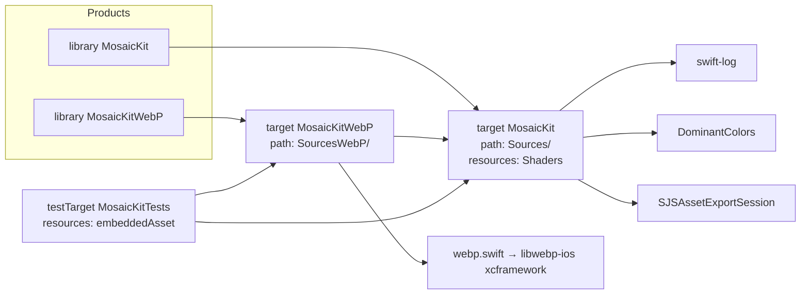
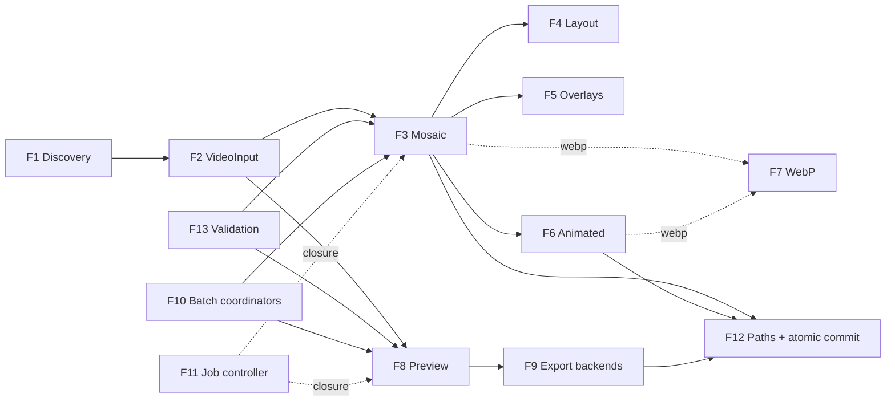
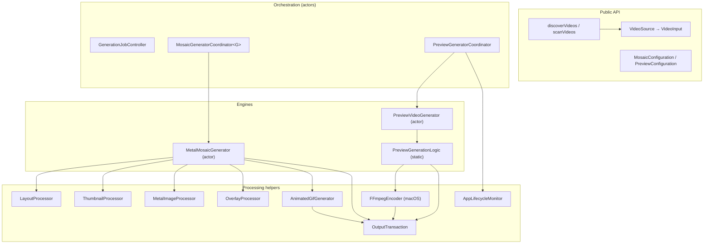
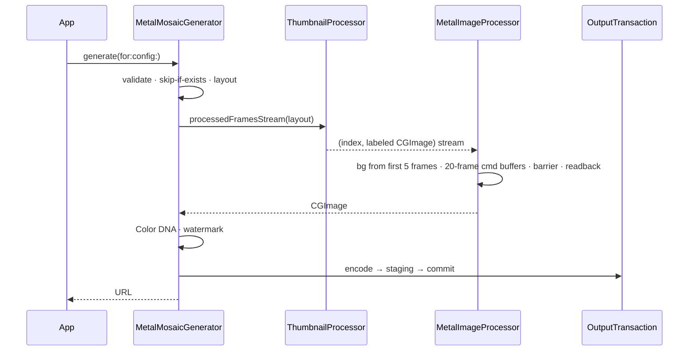
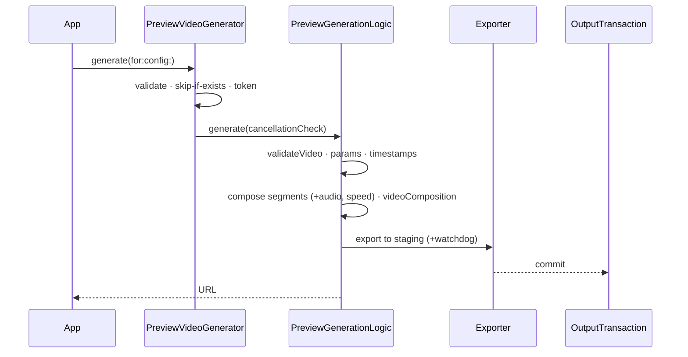
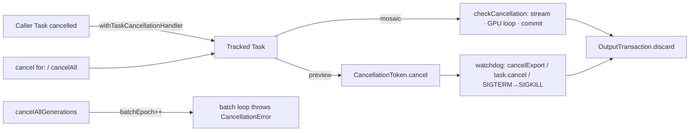

# MosaicKit — Codebase Knowledge Base

> **Purpose of this document.** A self-contained "brain dump" of the MosaicKit repository that
> another engineer or LLM can use to implement features, fix bugs, and refactor safely without
> first re-reading the whole codebase.
>
> **Build status of this document:** Phases 1–2 of 6 complete (Initial Context Scan, System
> Architecture). Sections for Phases 3–6 are stubbed and will be filled in by later passes.
>
> **Snapshot:** branch `claude/codebase-analysis-docs-ppz2yf`, based on `main` @ `8f0c82f`
> ("Update swift.yml"). README advertises release line **1.7.0**.
>
> **Conventions used here**
> - All paths are relative to the repository root.
> - File anchors use `[[F:path#line-range#hash8]]`, where `hash8` is the first 8 hex chars of the
>   file's SHA-256 at the snapshot above. If the hash no longer matches, re-verify the claim.
> - "**⚠ Finding**" marks something that disagrees with other docs or is likely to surprise you.

---

## Table of contents

1. [Part 1 — High-Level Overview (Phase 1)](#part-1--high-level-overview-phase-1)
   1. [What MosaicKit is](#11-what-mosaickit-is)
   2. [Who uses it](#12-who-uses-it)
   3. [Tech stack & dependencies](#13-tech-stack--dependencies)
   4. [Package products & targets](#14-package-products--targets)
   5. [Repository structure](#15-repository-structure)
   6. [Feature catalog & business purpose](#16-feature-catalog--business-purpose)
   7. [How the features interact](#17-how-the-features-interact)
   8. [Public entry points at a glance](#18-public-entry-points-at-a-glance)
   9. [Which existing docs to trust](#19-which-existing-docs-to-trust)
   10. [Early findings (to be expanded in Phase 4)](#110-early-findings-to-be-expanded-in-phase-4)
   11. [Phase 1 wrap-up](#111-phase-1-wrap-up)
2. [Part 2 — System Architecture (Phase 2)](#part-2--system-architecture-phase-2)
   1. [Architectural style](#21-architectural-style-in-one-paragraph)
   2. [Component map](#22-component-map)
   3. [Mosaic data flow](#23-mosaic-data-flow-f3f7)
   4. [Preview data flow](#24-preview-data-flow-f8f9)
   5. [Orchestration layer](#25-orchestration-layer-f10f11)
   6. [Concurrency & isolation](#26-concurrency--isolation-model)
   7. [Cancellation model](#27-cancellation-model)
   8. [Error model](#28-error-model)
   9. [Cross-cutting concerns](#29-cross-cutting-concerns)
   10. [Third-party boundaries](#210-third-party-integration-boundaries)
   11. [Build, test & CI](#211-build-test--ci-architecture)
   12. [Phase 2 wrap-up](#212-phase-2-wrap-up)
3. [Part 3 — Feature-by-Feature Analysis (Phase 3, pending)](#part-3--feature-by-feature-analysis-phase-3-pending)
4. [Part 4 — Things You Must Know Before Changing Code (Phase 4, pending)](#part-4--things-you-must-know-before-changing-code-phase-4-pending)
5. [Part 5 — Technical Reference & Glossary (Phase 5, pending)](#part-5--technical-reference--glossary-phase-5-pending)
6. [Appendix A — File Index](#appendix-a--file-index)
7. [Appendix B — Assumptions](#appendix-b--assumptions)
8. [Appendix C — State Block](#appendix-c--state-block)

---

## Part 1 — High-Level Overview (Phase 1)

### 1.1 What MosaicKit is

MosaicKit is a **Swift Package (library, not an app)** that turns video files into two kinds of
visual summaries:

1. **Video mosaics / contact sheets.** One large still image (HEIF, JPEG, PNG, or WebP)
   containing a grid of frames sampled across the whole video. You can add a metadata header,
   per-frame timestamps, a watermark, and a "Color DNA" strip. The package can also produce an
   **animated** version (GIF, HEICS, or animated WebP) made from the same frames.
2. **Preview videos / highlight reels.** A short video (default ~60 s) made from many short clips
   spread evenly across the source. It can be exported to a file (`.mp4`/`.mov`/`.m4v`) or
   returned as an in-memory `AVPlayerItem` for immediate playback.

Everything runs on-device with Apple frameworks: AVFoundation for decoding and export, Metal
compute shaders for compositing, and ImageIO for encoding. On macOS, previews can optionally be
transcoded by an external `ffmpeg` binary.

- **Platforms:** macOS 26+, iOS 26+, macCatalyst 26+ (`Package.swift` `platforms:`)
  [[F:Package.swift#8#f02eefa2]].
- **Language/tooling:** Swift 6.2 (`swift-tools-version: 6.2`), strict concurrency (CI builds
  iOS with `SWIFT_STRICT_CONCURRENCY=complete`).
- **License:** Apache 2.0 (`LICENSE`).
- **Size:** about 13.4k lines of Swift in `Sources/` + `SourcesWebP/`, 160 lines of Metal, and about 5.6k lines
  of tests in `Tests/`.

### 1.2 Who uses it

The package is a library. Nothing in this repo is an end-user app. Its consumers are:

| Consumer type | What they need from MosaicKit | Evidence |
|---|---|---|
| **Media-library / video-manager apps (macOS & iOS)** | Thumbnail sheets for browsing large collections of videos, and previews that play without re-encoding | `generateComposition` returns an `AVPlayerItem`; batch coordinators; `scanVideos`/`discoverVideos` folder scanning; `overwrite == false` skip-if-exists for incremental runs |
| **Batch / archival pipelines (CLI tools, daemons, XPC services)** | Unattended, resumable bulk generation with predictable output paths | `enableAppLifecycleMonitor = false` and `enableExportRetry = false` exist specifically for daemons/CLI (`Sources/Models/PreviewConfiguration.swift`); `outputDirectoryTemplate`/`filenameTemplate`; `.ffmpeg` export mode |
| **Apps with persisted work queues** | Stable job IDs, pause, retry, and cancel | `GenerationJobController`, `VideoSource` (Codable, no I/O on construction) |
| **Web/social publishing workflows** | Web-friendly formats and animated teasers | `.webp` still/animated output, `GifSize` presets, `AspectRatio.vertical` (9:16) |

The fields `postID` and `VideoMetadata.custom`, plus the removed `serviceName`/`creatorName`
fields (README "New in 1.3.0"), show that the library was first built for an app that organized
downloaded videos by **service/creator/post**. That coupling has mostly been removed, but a few
traces remain. For example, `{service}` and `{creator}` are still listed as filename tokens in
the `MosaicConfiguration.filenameTemplate` doc comment.

### 1.3 Tech stack & dependencies

**Apple frameworks used (all first-party):**

| Framework | Used for | Main files |
|---|---|---|
| AVFoundation | Asset loading, metadata, frame extraction (`AVAssetImageGenerator`), composition (`AVMutableComposition`), export (`AVAssetExportSession`) | `ThumbnailProcessor.swift`, `MosaicFrameSource.swift`, `VideoMetadataExtractor.swift`, `Preview/PreviewVideoGenerator.swift` |
| VideoToolbox | Hardware decode (implicitly through AVFoundation) | `MetalMosaicGenerator.swift` imports it |
| Metal | GPU compute kernels for scale, composite, fill, border, and shadow | `MetalImageProcessor.swift`, `Shaders/MetalShaders.metal` |
| CoreGraphics / CoreImage / ImageIO / UniformTypeIdentifiers | Text/overlay rasterization, `CGImageDestination` encoding (HEIF/JPEG/PNG/GIF/HEICS) | `ThumbnailProcessor.swift`, `OverlayProcessor.swift`, `AnimatedGifGenerator.swift` |
| QuartzCore (Core Animation) | Burned-in timestamp pills in preview video (`AVVideoCompositionCoreAnimationTool`) | `Preview/PreviewVideoGenerator.swift` |
| OSLog | Logging (`Logger(subsystem:category:)`) and `OSSignposter` performance intervals | nearly every processing file |
| Synchronization | `Mutex` for lock-protected state (`CancellationToken`, WebP registry) | `WebPSupport.swift`, `PreviewVideoGenerator.swift` |
| AppKit / UIKit | Lifecycle notifications and platform font/color/image types | `AppLifecycleMonitor.swift`, `PreviewVideoGenerator.swift`, `MosaicKitWebP.swift` |

**Third-party SPM dependencies** (`Package.swift`, pinned in `Package.resolved`):

| Package | Pinned | Linked into | Actual use |
|---|---|---|---|
| `apple/swift-log` | 1.10.1 | `MosaicKit` | **⚠ Finding: declared but never imported.** No `import Logging` exists in `Sources/`, `Tests/`, or `Examples/`. All logging uses OSLog's `Logger(subsystem: "com.mosaicKit", …)`. `CLAUDE.md` says to use swift-log `Logger(label:)`; the code does not. |
| `DenDmitriev/DominantColors` | 1.2.2 | `MosaicKit` | Dominant-color extraction for the gradient mosaic background (`MetalImageProcessor.swift` ~L593–601) |
| `samsonjs/SJSAssetExportSession` | 0.4.0 | `MosaicKit` | `.sjs` preview export mode; its `VideoOutputSettings.Codec` type also appears in the public models (`VideoFormat.swift`, `PreviewConfiguration.swift`, `PreviewExportDescription.swift`) |
| `awxkee/webp.swift` (→ `libwebp-ios` 1.1.1, a **binary xcframework**) | 1.1.2 | **`MosaicKitWebP` only** | Still and animated WebP encoding |

**Runtime (non-SPM) dependency:** an external `ffmpeg` executable. It is needed only for
`PreviewExportMode.ffmpeg` on macOS, and its path is supplied through
`PreviewConfiguration.ffmpegBinaryPath`.

**Tooling:**
- SwiftPM is the real build system: `swift build` and `swift test`.
- `Makefile` + `scripts/*.sh` are an **agent/xcodebuild scaffold** (`xcbuild.sh`, `task.sh`,
  simulator runners). `scripts/xcbuild.sh` exists and the Makefile uses it as `XCBUILD`, but
  every target builds `MosaicKit.xcodeproj` / `-scheme MosaicKit`, and **no `.xcodeproj` exists**
  in the repo. Treat the Makefile as unusable as configured. (`CLAUDE.md` also claims "There is
  no Makefile", which is out of date as well.)
- `.spi.yml` builds DocC for the Swift Package Index (macOS + iOS, Swift 6.2).
- `MosaicKitTests.xctestplan` is an Xcode test plan.

### 1.4 Package products & targets



**Why WebP is split out** (see `Sources/Processing/WebPSupport.swift` and the `Package.swift`
comments): a binary xcframework anywhere in a target's dependency graph breaks Xcode SwiftUI
Preview JIT for every client that links it. The core target therefore only declares the
`MosaicKitWebPEncoding` protocol and a `Mutex`-guarded registry
(`MosaicKitWebPSupport.encoder`). Clients that want WebP link `MosaicKitWebP` and call
`MosaicKitWebP.register()` once at startup. Without that call, any WebP request throws
`MosaicKitWebPError.encoderNotRegistered`. `MosaicConfiguration.validate()` checks this before
any work starts.

**⚠ Finding:** `CLAUDE.md` and `Examples/README.md` say to run `swift run SimpleExample` and
similar commands. `Package.swift` declares **no executable targets**, so those commands cannot
work as the package stands. The files in `Examples/` are reference snippets only.

### 1.5 Repository structure

```
.
├── Package.swift / Package.resolved   SPM manifest (2 library products, 1 test target)
├── Sources/                           → target "MosaicKit"
│   ├── Models/                        Codable+Sendable value types (configs, inputs, progress)
│   │   ├── MosaicConfiguration.swift  Mosaic config, output-path/filename templating, OutputFormat,
│   │   │                              AnimatedFormat, GifCreationMode, GifSize, MosaicColor
│   │   ├── PreviewConfiguration.swift Preview config, PreviewExportMode, extract-count math, paths
│   │   ├── ConfigurationValidation.swift  validate() for DensityConfig / MosaicConfiguration / PreviewConfiguration
│   │   ├── DensityConfig.swift        7 density presets (XXL…XXS) + custom
│   │   ├── LayoutConfiguration.swift  LayoutType, AspectRatio, VisualSettings, BorderColor, ShadowSettings
│   │   ├── MosaicLayout.swift         Computed layout (positions, sizes) + ASCII debug art
│   │   ├── OverlayConfiguration.swift FrameLabel / Header / Watermark / ColorDNA configs
│   │   ├── VideoInput.swift           Inspected video (metadata) — the unit of work everywhere
│   │   ├── VideoSource.swift          Lightweight Codable source ref + inspect() + VideoInput.validate()
│   │   ├── VideoFormat.swift          Preview containers + native/SJS presets + ExportMaxResolution
│   │   ├── FFmpegEncodingOptions.swift  Codec/CRF/preset/resolution for ffmpeg export
│   │   ├── PreviewExportDescription.swift  "What will this export produce?" description for UI
│   │   └── PreviewGenerationProgress.swift Preview status/progress/result types
│   ├── Processing/
│   │   ├── MetalMosaicGenerator.swift  ★ Main mosaic entry point (actor)
│   │   ├── MosaicGeneratorProtocol.swift  Actor-constrained generator protocol
│   │   ├── MosaicGeneratorCoordinator.swift  ★ Batch/concurrency manager (generic actor) + progress/result types
│   │   ├── GenerationJobs.swift       ★ GenerationJobController (job/attempt IDs, pause/retry)
│   │   ├── LayoutProcessor.swift      Thumbnail count + 5 layout algorithms + cache
│   │   ├── ThumbnailProcessor.swift   Frame extraction/streaming, labels, metadata header rendering
│   │   ├── MosaicFrameSource.swift    Pull-based, single-consumer bounded frame source
│   │   ├── MetalImageProcessor.swift  Metal pipeline + DominantColors background
│   │   ├── OverlayProcessor.swift     Color DNA strip, watermark, average color
│   │   ├── AnimatedGifGenerator.swift GIF/HEICS/WebP animation writer
│   │   ├── OutputTransaction.swift    Staging file + atomic rename/exclusive-create commit
│   │   ├── WebPSupport.swift          WebP encoder injection point
│   │   ├── VideoMetadataExtractor.swift  AVFoundation metadata (actor)
│   │   ├── ProcessingError.swift / VideoError.swift  MosaicError, LibraryError, VideoError
│   │   └── Preview/
│   │       ├── PreviewVideoGenerator.swift  ★ Preview entry point (actor) + PreviewGenerationLogic
│   │       ├── PreviewGeneratorCoordinator.swift  ★ Preview batch manager + background retry
│   │       ├── FFmpegEncoder.swift     Passthrough export + ffmpeg Process (macOS)
│   │       ├── AppLifecycleMonitor.swift  Foreground-wait gate (singleton actor)
│   │       └── PreviewError.swift
│   ├── Shaders/MetalShaders.metal     5 kernels: scaleTexture, compositeTextures, fillTexture, addBorder, addShadow
│   ├── VideoInputScanner.swift        scanVideos / discoverVideoSources / discoverVideos
│   └── MosaicKit.docc/                DocC catalog (8 articles)
├── SourcesWebP/MosaicKitWebP.swift    → target "MosaicKitWebP" (DefaultMosaicKitWebPEncoder + register())
├── Tests/MosaicKitTests/              Swift Testing suites (19 files) + embeddedAsset/test_video.mp4
├── Examples/                          5 illustrative .swift files (NOT wired as SPM targets)
├── Media.xcassets/                    test_video dataset (same fixture, for Xcode)
├── .github/workflows/                 swift.yml (macOS + iOS Simulator CI), claude*.yml
├── scripts/, Makefile, tasks/         Agent/xcodebuild scaffolding (see §1.3)
└── README.md, DOCUMENTATION.md, CONTRIBUTING.md, CLAUDE.md, AGENTS.md,
    MosaicKit-DeepDive.md, spec.md    Human/agent docs (reliability varies — §1.9)
```

★ = primary public entry points.

### 1.6 Feature catalog & business purpose

Each feature has a stable ID (F1…F13) that later phases reuse.

| ID | Feature | Business purpose | Primary code |
|---|---|---|---|
| **F1** | **Video discovery** | Turn a folder of videos into a work list without the app writing its own file-walking code. | `scanVideos(in:recursive:)` (lenient, legacy), `discoverVideoSources` (no I/O), `discoverVideos(in:recursive:metadataConcurrency:)` (throwing, bounded concurrency, results in filename order). All in `Sources/VideoInputScanner.swift`. Recognizes 15 extensions (mp4, mov, mkv, webm, ts, mxf, …). |
| **F2** | **Video input & inspection** | Load the metadata that sizing and labels depend on (duration, dimensions, fps, codec, bitrate, size) once, validate it, and make it serializable for queues. | `VideoSource` (Codable; `inspect()` loads metadata), `VideoInput` (inspected; `init(from:)` throws, while the legacy `init(url:…) async` never throws and falls back to the values you passed in), `VideoInput.validate()`, `VideoMetadataExtractor` actor. |
| **F3** | **Mosaic generation** | Core product: a single image that summarizes a whole video, for browsing, cataloguing, and sharing. | `MetalMosaicGenerator.generate(for:config:forIphone:) → URL`, `generateMosaicImage(…) → CGImage` (in memory, nothing saved), `generateallcombinations` (3 widths × 7 densities, always HEIF). Rejects videos shorter than **5 s**. |
| **F4** | **Layout engine** | Choose how many frames and how to arrange them so the sheet is readable at the target size and aspect ratio. | `LayoutProcessor.calculateThumbnailCount` + `calculateLayout`. 5 `LayoutType`s: `custom` (default, three-zone), `classic`, `auto` (screen-aware, not cached), `dynamic`, `iphone`. 5 `AspectRatio`s. `DensityConfig` scales frame count from 0.25× to 4×. |
| **F5** | **Overlays & annotations** | Make the sheet informative and brandable: timestamps show *where* each frame comes from, the header shows *what* the file is, the watermark shows ownership, and Color DNA gives a visual fingerprint. | `OverlayConfiguration` (`FrameLabelConfig`, `HeaderConfig` with `MetadataField`s, `WatermarkConfig`, `ColorDNAConfig`). Rendering is split between `ThumbnailProcessor` (labels, header), `OverlayProcessor` (DNA, watermark), and `MetalImageProcessor` (borders/shadow, dominant-color background). |
| **F6** | **Animated export** | A lightweight animated teaser (GIF/HEICS/WebP) for places where a big still or a video is not suitable. | `MosaicConfiguration.gifMode` (`.disabled` / `.withMosaic` / `.gifOnly`), `gifSize`, `animatedFormat` (default `.webp`), `gifFps` (default 10). Written by `AnimatedGifGenerator.save`. |
| **F7** | **Optional WebP support** | Offer web-optimized output without making every client pay the SwiftUI-Preview cost of a binary xcframework. | `MosaicKitWebP` product, `MosaicKitWebPEncoding` protocol, `MosaicKitWebPSupport.encoder` registry. |
| **F8** | **Preview video (highlight reel)** | A short watchable summary of a long video. It can play instantly (`AVPlayerItem`) or be saved to a file for sharing or storage. | `PreviewVideoGenerator.generate(for:config:progressHandler:) → URL` and `generateComposition(…) → AVPlayerItem`. Implemented by `PreviewGenerationLogic` (validate → timestamps → compose → export). Clip count comes from `PreviewConfiguration.extractCount(forVideoDuration:)`, which is a density base (4…48) plus a log-duration adjustment. |
| **F9** | **Preview export backends** | Trade speed, quality, and control: `.native` = simplest (Apple presets), `.sjs` = codec/bitrate/resolution control, `.ffmpeg` = best compression/codec choice on macOS. | `PreviewExportMode`; `exportWithNativeSession`, `exportWithSJSSession`, `exportWithFFmpeg` → `FFmpegEncoder` (passthrough `.mov` then `ffmpeg` transcode). Supporting types: `nativeExportPreset`, `SjSExportPreset`, `ExportMaxResolution`, `FFmpegEncodingOptions`, `PreviewExportDescription`. |
| **F10** | **Batch coordination** | Process many videos quickly without exhausting CPU, RAM, or hardware encoders, with per-video progress and correct cancellation. | `MosaicGeneratorCoordinator<Generator>`: dynamic limit = min(cores/2, RAM / (width·density/2000 GB)), minimum 2. `PreviewGeneratorCoordinator`: dynamic limit capped at **2** because of VideoToolbox encoder channels, plus a foreground-wait/stall retry up to 3×. Both use a `batchEpoch` so a cancelled batch stops. |
| **F11** | **Explicit job lifecycle** | Let apps with persisted queues track *jobs* (stable ID) and *attempts* (new ID per retry), and pause, retry, or cancel them independently of the video URL. | `GenerationJobController` actor, `GenerationJobID`, `GenerationAttemptID`, `GenerationJobState`, `GenerationJobSnapshot`. It wraps any `() async throws -> URL` closure; work starts only when `value(for:)` is awaited. |
| **F12** | **Output paths & atomic commit** | Predictable, idempotent output locations (skip work already done), and encoders never write directly to the final path. With `overwrite == false` there is a brief zero-byte placeholder window; see §2.9. | `MosaicConfiguration.generateOutputDirectory` / `generateFilename` / `animatedOutputURL` / `configurationHash`, `createOutputSubdirectory`, `outputDirectoryTemplate` and `filenameTemplate` tokens, `overwrite`. `OutputTransaction` (hidden `.mosaickit-<UUID>.<ext>` staging file → `rename(2)`, or with `overwrite == false` an exclusive `fopen("wx")` claim followed by rename). The preview side has its own equivalents in `PreviewConfiguration`. |
| **F13** | **Up-front validation & typed errors** | Fail fast with actionable messages before spending GPU, decoder, or encoder time. | `DensityConfig.validate`, `MosaicConfiguration.validate`, `PreviewConfiguration.validate`, `VideoInput.validate`; error enums `MosaicError`, `LibraryError`, `VideoError`, `PreviewError`, `MetalProcessorError`, `MosaicKitWebPError`. |

**Cross-cutting capabilities** (these are not features themselves; Phase 2 covers them):
cancellation propagation (tracked tasks, `withTaskCancellationHandler`, `CancellationToken`),
progress reporting (`MosaicGenerationProgress`/`Status`, `PreviewGenerationProgress`/`Status`),
performance metrics (`getPerformanceMetrics()` dictionaries, `OSSignposter` intervals), and
background/lifecycle handling (`AppLifecycleMonitor`, `ProcessInfo.beginActivity` on macOS during
preview export).

### 1.7 How the features interact



(Also stored as `codebase-analysis-docs/assets/feature-map.mmd`. The mosaic pipeline flowchart
is in `codebase-analysis-docs/assets/mosaic-pipeline.mmd`.)

**The two main flows:**

- **"Make a contact sheet":** F1/F2 produce a `VideoInput` → F13 validates `MosaicConfiguration`
  → F3 checks F12 paths (skip if the output exists) → F4 sizes the grid → frames stream through
  F5 labeling and color sampling into the Metal compositor → the F5 DNA strip and watermark are
  applied → F12 commits atomically → optionally F6 writes the animation next to the mosaic (via
  F7 if WebP).
- **"Make a highlight reel":** F2 `VideoInput` → F13 validates `PreviewConfiguration` → F8
  computes extract count/duration/speed → builds an `AVMutableComposition` (optionally with
  timestamp overlays) → returns an `AVPlayerItem` **or** hands off to F9 (native/SJS/ffmpeg) →
  F12-style staged commit.

**How they fit together:**

- The mosaic path and the preview path **share `VideoInput` and `DensityConfig`** (both use the
  same seven density names). They also share **`OutputTransaction`**: the mosaic save, the
  animated export, and all three preview exporters publish through it. A change to that type
  affects both product lines. Otherwise they are separate: configs, generators, coordinators,
  error enums, and path-templating code. A mosaic and a preview of the same video are
  independent jobs.
- **F6 depends on F3's layout.** The animation reuses `layout.thumbCount` and the mosaic's output
  directory and filename (`animatedOutputURL` = `"<gifSize> -" + mosaic base name + ext`).
  `.gifOnly` still runs layout calculation but skips compositing. In the `overwrite == false`
  early-exit path, F3 will **backfill a missing animation** next to an existing mosaic.
- **F10 wraps F3/F8. F11 is an alternative to F10, not a layer on top of it.**
  `GenerationJobController` does not know about coordinators. It runs any closure (typically
  `MetalMosaicGenerator().generate…` or `PreviewVideoGenerator().generate…`). The spec
  (`spec.md`) describes a much larger service/plan/batch-handle API. **Only the small
  `GenerationJobController` has been implemented.**
- **F12 drives incremental processing.** The skip-if-exists early return depends on the resolved
  path being deterministic. For mosaics it is. For previews in the default naming mode it is not
  (see §1.10 item 3).

**Combined value:** an app can scan a library (F1) and batch-generate (F10) a browsable,
annotated contact sheet (F3–F5) for each video, plus a playable teaser (F8/F9) or an animated
thumbnail (F6). Idempotent paths (F12) allow re-running cheaply as new files arrive. Job control
(F11) and validation (F13) keep this manageable in long-running or user-facing apps.

### 1.8 Public entry points at a glance

| Task | Call | Returns |
|---|---|---|
| Inspect one file | `try await VideoInput(from: url)` or `try await VideoSource(url:).inspect()` | `VideoInput` |
| Scan a folder | `try await discoverVideos(in: folder, recursive: true)` | `[VideoInput]` (sorted by filename) |
| One mosaic → file | `try await MetalMosaicGenerator().generate(for: video, config: config)` | `URL` |
| One mosaic → memory | `try await generator.generateMosaicImage(for:config:)` | `CGImage` |
| Mosaic batch | `try createDefaultMosaicCoordinator().generateMosaicsforbatch(videos:config:progressHandler:)` or `generateMosaicsForFiles(_:config:…)` | `[MosaicGenerationResult]` |
| One preview → file | `try await PreviewVideoGenerator().generate(for:config:)` | `URL` |
| One preview → player | `try await PreviewVideoGenerator().generateComposition(for:config:)` | `AVPlayerItem` |
| Preview batch | `PreviewGeneratorCoordinator().generatePreviewsForBatch(…)` / `generatePreviewCompositionsForBatch(…)` | `[PreviewGenerationResult]` / `[PreviewCompositionResult]` |
| Job control | `GenerationJobController().submit { … }` then `value(for:)`, `pause`, `retry`, `cancel`, `snapshot(for:)` | `GenerationJobID`, `URL` |
| Enable WebP | `MosaicKitWebP.register()` (link `MosaicKitWebP`) | — |
| Cancel | `generator.cancel(for:)` / `cancelAll()`; `coordinator.cancelGeneration(for:)` / `cancelAllGenerations()`; or cancel the awaiting `Task` | — |

Default values worth knowing:

- **`MosaicConfiguration()`:** width 5120, density `.m`, `.heif`, quality 0.4, `.custom` layout,
  metadata header on, movie-color background on, `animatedFormat` `.webp`.
- **`MosaicConfiguration.default`:** width 4000, density `.xl`. This differs from the plain
  initializer's defaults.
- **`PreviewConfiguration()`:** 60 s, `.m`, `.mp4`, quality 0.8, `.native` export.

### 1.9 Which existing docs to trust

| Doc | Reliability | Notes |
|---|---|---|
| Source code | **Authoritative** | Always verify against it. |
| `README.md` | High, with exceptions | Current through 1.7.0. Exception: "New in 1.6.2" says the default `ExportMaxResolution` is **4K**, but the code defaults to **"1080p"** (§1.10 item 4). The installation snippet still says `from: "1.2.0"`. |
| `CLAUDE.md` / `AGENTS.md` | Medium | Architecture summary is correct. Wrong on: swift-log usage, "no Makefile", `swift run` examples, the CI workflow list (`mosaickit-tests.yml` and `swift62.yml` do not exist; only `swift.yml` + `claude*.yml` do), and `Models/AspectRatio.swift` (`AspectRatio` is defined in `Models/LayoutConfiguration.swift`). `AGENTS.md` still mentions Core Graphics/vImage in pipeline step 4 and uses `VideoFormat` as the mosaic format type (it is `OutputFormat`). |
| `MosaicKit-DeepDive.md` | **Stale — do not trust architecture sections** | Describes the removed dual engine (`CoreGraphicsMosaicGenerator`, `MosaicGeneratorFactory`, vImage buffer pool) and a `.gif` still format. The coordinator concurrency formula it gives is for previews only, and the cap of 8 it quotes is really 2. |
| `spec.md` | **Design intent, only partly implemented** | Describes a `GenerationRequest/Plan`, `JobHandle/BatchHandle`, checkpoint ledger, and a single processing-service actor. None of these exist. What does exist: `VideoSource`, `OutputTransaction`, `MosaicFrameSource`, validation, `GenerationJobController`. |
| `Sources/MosaicKit.docc/*` | Not yet reviewed | `PlatformStrategy.md` is documented as historical context. To verify in Phase 2. |

### 1.10 Early findings (to be expanded in Phase 4)

These were found while scanning. Each still needs deeper confirmation in Phase 4.

1. **swift-log is an unused dependency.** Code uses OSLog only. Subsystem strings are also
   inconsistent: `"com.mosaicKit"` in most files, but `"com.mosaickit"` (lowercase k) in
   `PreviewVideoGenerator.swift` and `PreviewConfiguration.swift`. This matters when filtering
   logs in Console.
2. **Mosaic output-dimension limit.** `MetalMosaicGenerator` rejects `config.width > 16_384`
   inside generation (not in `validate()`) and videos shorter than 5 s, both as
   `MosaicError.invalidVideo`.
   [[F:Sources/Processing/MetalMosaicGenerator.swift#171-179#07857fa0]]
3. **Preview skip-if-exists never matches in default naming mode.** With `fullPathInName ==
   false` and no `filenameTemplate`, `PreviewConfiguration.generateFilename` embeds a
   run-time timestamp (`yyyy-MM-dd_HH-mm-ss`). As a result, `overwrite == false` never finds an
   existing file, and each run writes a new preview.
   [[F:Sources/Models/PreviewConfiguration.swift#517-565#bb8d3160]]
4. **Preview max-resolution default mismatch.** `_exportMaxResolutionRaw` defaults to `"1080p"`
   (the declaration, the decoder fallback, and the `init(…maxResolution:)` fallback all agree).
   Comments in two initializers say "defaults to 4K", and the README says 4K.
5. **`MosaicConfiguration` decoding is strict.** `gifMode`, `gifSize`, `animatedFormat`,
   `gifFps`, `overwrite`, and the other fields use `decode`, not `decodeIfPresent`. Only
   `createOutputSubdirectory` and the two templates are tolerant. Configs persisted before those
   fields existed will fail to decode.
6. **`generateallcombinations` ignores most of the caller's config.** It builds fresh HEIF
   configs (quality 0.4, default layout, metadata on, accurate timestamps) and does not use
   the caller's `outputdirectory`, overlay, or templates.
7. *(Resolved in §2.6: guarded by `NSRecursiveLock`; OK.)* **`LayoutProcessor` is a non-`Sendable` `final class` with mutable state.**
   `mosaicAspectRatio` and a 64-entry cache (guarded by `stateLock`) are shared by the
   generator actor. Thread-safety needs review in Phase 4.
8. **Several `MosaicConfiguration` initializers have conflicting animation defaults.** The main
   initializer uses `gifSize .nochange` and `.webp`. The overlay initializer without `gifMode`
   uses `.small` and `.webp`. The deprecated `forIphone:` initializer uses `.nochange` and
   `.gif`. The "density-only" initializer sets width 2500, quality 0.3, and **turns off** the
   movie-color background.
9. **Dead code in `MetalMosaicGenerator`.** `extractFramesWithVideoToolbox`,
   `calculateExtractionTimes`, and `calculateAspectRatio` are private and never called.
   Extraction really goes through `ThumbnailProcessor.processedFramesStream`.

### 1.11 Phase 1 wrap-up

**Decisions / findings**
- MosaicKit is a single-backend (Metal) Apple-platform library with two independent product
  lines, **Mosaic** (F3–F7) and **Preview** (F8–F9). They are joined by shared input (F1–F2),
  orchestration (F10–F11), and output/validation infrastructure (F12–F13).
- Source code is the only fully reliable reference. `MosaicKit-DeepDive.md` and parts of
  `CLAUDE.md`/`AGENTS.md` are stale.

**Open questions** (carried into the State Block)
- How exactly does `MetalImageProcessor.generateMosaicStream` bound GPU submissions, and how does
  it use `MosaicFrameSource` versus `ThumbnailProcessor.processedFramesStream`?
- Details of the `LayoutProcessor` formulas (thumbnail count vs. density vs. width) and the cache
  key contents.
- How the preview composition handles speed-up (`playbackSpeed`), audio, and orientation, and how
  the three export paths commit output (do they all use `OutputTransaction`?).
- `FFmpegEncoder` process lifecycle: termination, diagnostics, and temp cleanup.
- What the tests actually cover and which ones are skipped in CI (`MOSAICKIT_SUITE_MODE=none`).

**Next steps (Phase 2):** read `MetalImageProcessor.swift`, `ThumbnailProcessor.swift` (stream +
header), `LayoutProcessor.swift`, the rest of `PreviewVideoGenerator.swift` (compose/export),
`FFmpegEncoder.swift`, `PreviewGeneratorCoordinator.swift`, `VideoMetadataExtractor.swift`, the
error files, and the DocC `Architecture.md`/`PerformanceGuide.md`. Then produce component maps,
sequence diagrams, and the concurrency/cancellation model.

---

## Part 2 — System Architecture (Phase 2)

> Phase 2 goal: map every major component, how data moves through it, where each piece of code
> runs (actor / main actor / global executor), how cancellation and errors propagate, and the
> cross-cutting concerns. Feature IDs (F1–F13) are defined in §1.6.

### 2.1 Architectural style in one paragraph

MosaicKit is a **layered, actor-based media-processing library**:

- **Configuration** lives in immutable-by-value `Codable`/`Sendable` structs (`MosaicConfiguration`,
  `PreviewConfiguration`, `VideoInput`, …).
- **Public engines are actors.** `MetalMosaicGenerator` and `PreviewVideoGenerator` own per-job
  bookkeeping (tracked tasks, progress handlers, cancellation tokens).
- **The heavy lifting is delegated to non-actor helpers.** These are either stateless static
  namespaces (`PreviewGenerationLogic`, `FFmpegEncoder`, `OverlayProcessor`,
  `AnimatedGifGenerator`) or `Sendable` classes (`ThumbnailProcessor`, `MetalImageProcessor`,
  `LayoutProcessor` with an internal lock).
- **Coordinator actors sit on top.** `MosaicGeneratorCoordinator`, `PreviewGeneratorCoordinator`,
  and `GenerationJobController` add batching, admission control, and lifecycle.

There is **no persistence layer, no network I/O, and no database**. The only external side
effects are:

- reading video files;
- writing output files (through staging and an atomic commit);
- spawning an `ffmpeg` process (macOS, opt-in);
- creating temp files (ffmpeg passthrough).

> **Note on the "database schema" requirement of the brief:** there is no database. The
> equivalent "schema" is the Codable model graph. It is diagrammed in Part 5 (Phase 5).

### 2.2 Component map



Full version with more edges: `codebase-analysis-docs/assets/component-map.mmd`.

#### Component catalog

| Component | Kind / isolation | Owned mutable state | Talks to |
|---|---|---|---|
| `MetalMosaicGenerator` | `actor` | `generationTasks[videoID][attemptID]`, `imageGenerationTasks`, `progressHandlers[videoID]` + revision UUIDs, perf counters | `LayoutProcessor`, `ThumbnailProcessor(config: .default)`, `MetalImageProcessor`, `OverlayProcessor`, `AnimatedGifGenerator`, `OutputTransaction` |
| `MosaicGeneratorCoordinator<Generator>` | generic `actor` | `activeTasks[videoID]`, `activeImageTasks[videoID]`, `progressHandlers[videoID]`, `batchEpoch`, `concurrencyLimit` | one shared `Generator` instance |
| `PreviewVideoGenerator` | `actor` | `progressHandlers[videoID]`, `cancellationTokens[attemptID] = (sourceID, token)` | `PreviewGenerationLogic` |
| `PreviewGenerationLogic` | `struct` of static funcs; `generate` is nonisolated, `generateComposition` is **`@MainActor`** | none | AVFoundation, `SJSAssetExportSession`, `FFmpegEncoder`, `OutputTransaction` |
| `PreviewGeneratorCoordinator` | `actor` | `activeTasks[attemptID]`, `activeCompositionTasks[attemptID]`, `taskSources[attemptID] = videoID`, `batchEpoch`, `concurrencyLimit` | one `PreviewVideoGenerator`, `AppLifecycleMonitor.shared` |
| `GenerationJobController` | `actor` | `records[jobID] = (snapshot, task?, operation)` | the caller's closure only |
| `LayoutProcessor` | `public final class` (not `Sendable`); `NSRecursiveLock` guards `calculateLayout` and the aspect-ratio property | `storedAspectRatio`, `layoutCache` (≤ 64 entries) | `NSScreen` / `UIScreen` (for `.auto`) |
| `ThumbnailProcessor` | `final class: Sendable` (immutable) | none (config snapshot, `decodeQualityScale` clamped 1…4) | `AVAssetImageGenerator`, CoreText/CoreGraphics |
| `MetalImageProcessor` | `final class: @unchecked Sendable` | `MTLDevice`, one `MTLCommandQueue`, 4 pipelines, `CVMetalTextureCache`, `CIContext`, metrics `Mutex` | Metal, DominantColors, CoreImage |
| `OverlayProcessor` | `enum` (static) | none | CoreGraphics |
| `AnimatedGifGenerator` | `struct` (static `save`) | none | ImageIO, `MosaicKitWebPSupport` |
| `FFmpegEncoder` | `enum` (static); `encode`/`exportPassthrough` are **`@MainActor`**, `runFFmpeg` nonisolated | none | `Process`, `AVAssetExportSession` |
| `OutputTransaction` | internal `struct` | staging URL | Darwin `rename`, `fopen("wx")` |
| `AppLifecycleMonitor` | `actor`, singleton `shared` | `isInBackground`, waiter continuations | `NotificationCenter` (UIKit/AppKit) |
| `VideoMetadataExtractor` | internal `actor` | none | `AVURLAsset`, `FileManager` |
| `MosaicFrameSource` / `MosaicImageDecoder` | internal `actor` / class | index, times | **Not on the live path.** Only `ThumbnailProcessor.makeFrameSource` builds one, and nothing calls that method. |

### 2.3 Mosaic data flow (F3–F7)



Full sequence including the coordinator: `codebase-analysis-docs/assets/mosaic-sequence.mmd`.

#### Stage-by-stage table

The stage body is `MetalMosaicGenerator.generate`
[[F:Sources/Processing/MetalMosaicGenerator.swift#101-381#07857fa0]].

| # | Stage | Code | Runs on | Key facts |
|---|---|---|---|---|
| 0 | Validate | `MosaicConfiguration.validate()` [[F:Sources/Models/ConfigurationValidation.swift#15-66#83f12470]] | caller → actor | Checks geometry, quality, fps, colors, and whether WebP is registered. |
| 1 | Skip-if-exists | inside `generate` | generator actor | Uses one `referenceDate` for both the check and the save, so `{time}` resolves identically. With `.withMosaic`, a missing animation is backfilled. |
| 2 | Duration / AR | inside `generate` | generator actor | Uses `video.duration` if known, else loads it. Rejects `< 5 s`, `width > 16 384`, and non-finite dimensions. Aspect ratio = `video.width / video.height`. `preferredTransform` is **not** applied, so rotated sources use raw dimensions. |
| 3 | Thumbnail count | `LayoutProcessor.calculateThumbnailCount` [[F:Sources/Processing/LayoutProcessor.swift#645-675#94d44727]] | generator actor | `count = clamp((width/200 + 10·ln(duration)) × density.factor, 4, 800)`. `.auto` uses the largest screen instead: `(screenW / (160·scale)) × (screenH / (160·scale / videoAR))`, capped at 800. |
| 4 | Layout | `LayoutProcessor.calculateLayout` [[F:Sources/Processing/LayoutProcessor.swift#88-150#94d44727]] | generator actor (under `NSRecursiveLock`) | Cache key: `aspectRatio-originalAR-count-width-density-layoutType`. `.auto` is never cached. Invalid input returns an **empty** layout, which later throws "Empty mosaic layout". `.iphone` forces width 1200, 1 column, max height 8000. |
| 5 | Aspect normalization | `mutableConfig.updateAspectRatio(AspectRatio.findNearest(to: layout.mosaicSize))` | generator actor | The config passed down may carry a **different** `layout.aspectRatio` than the caller set. Path/filename generation still uses the caller's original `config`. |
| 6 | Header | `ThumbnailProcessor.createMetadataHeader` | generator actor (synchronous CPU) | Only when `includeMetadata`. Height is added on top of the layout height. |
| 7 | Frame extraction | `ThumbnailProcessor.processedFramesStream` [[F:Sources/Processing/ThumbnailProcessor.swift#138-190#5a6a2b0c]] | producer `Task` on the global executor | One `AVAssetImageGenerator` with the batched `images(for:)` API. `maximumSize` = largest cell × `decodeQualityScale` (1). Tolerance ±1 s, or 0 when `useAccurateTimestamps`. Sampling: first 20 % of frames in the first 33 % of the 5–95 % window, 60 % in the middle, 20 % in the last third [[F:Sources/Processing/ThumbnailProcessor.swift#511-544#5a6a2b0c]]. Any `.failure` throws: mosaics are strict (**no placeholder frames**). |
| 8 | Labeling + color sampling | same | child tasks, **≤ 8 in flight** | Each frame is labeled (`addTimestampToImage`). If Color DNA is on, `OverlayProcessor.averageColor` goes into `FrameColorCollector`. Results are yielded **out of order**; the index travels with each frame. |
| 9 | Background | `processImagesToMTLTexture` [[F:Sources/Processing/MetalImageProcessor.swift#580-700#260cc3a9]] | caller of `generateMosaicStream` (nonisolated) | Takes the first ≤ 5 frames. Up to 3 of them go to `DominantColors` (`.fair`, `.euclidean`, excluding black, white, and gray). The 3 lightest colors form a diagonal gradient, blurred with a CIGaussianBlur of radius 12. Falls back to gray 0.1 (or 0.5 inside the helper). When `useMovieColorsForBg == false`, uses a solid `backgroundColor`. |
| 10 | Compositing | `generateMosaicStream` [[F:Sources/Processing/MetalImageProcessor.swift#863-997#260cc3a9]], `processBatch` @L999, `renderFrame` @L1076 | nonisolated async | One setup command buffer (fill + header), awaited. Frames are then rendered in **20-frame command buffers**, committed without waiting. Each frame: `createTexture(from: CGImage)`, `scaleTexture` if the size differs, `compositeTexture`, optional `addBorder`. The shadow path draws a CPU `CGContext` shadow and composites that. Duplicate or out-of-range indices throw. **All** positions must be filled, or it throws "Missing mosaic frames". |
| 11 | GPU sync + readback | `synchronizeGPU` @L1057, `createCGImage(from:)` | nonisolated | An empty barrier command buffer is committed last and awaited. GPU errors from completion handlers are collected in `CommandBufferErrorState` and rethrown as `MetalProcessorError.commandBufferExecutionFailed`. |
| 12 | Post overlays | `OverlayProcessor.applyColorDNA`, `applyWatermark` | generator actor (synchronous CPU) | Returns a new `CGImage`. A `nil` result (failure) silently keeps the previous image. |
| 13 | Encode + commit | `saveMosaic` [[F:Sources/Processing/MetalMosaicGenerator.swift#743-852#07857fa0]] | generator actor (synchronous CPU) | Output path = `generateOutputDirectory` + `generateFilename`. Encodes with `CGImageDestination` (HEIF embeds a thumbnail, `HasAlpha = false`), or the injected WebP encoder, into the staging file. Then `OutputTransaction.commit()`. |
| 14 | Animation | `extractFramesForGif` + `AnimatedGifGenerator.save` | generator actor → global | This is a **second, full decode pass** with a separate generator: `.large` caps at 1280×720, `.small` at 960×540. Missing frames are skipped and then checked by count, so any missing frame throws. `frameDelay = 1 / gifFps`. |

**Progress reported to handlers** (`MosaicGenerationProgress.progress`):

| Status | Progress value |
|---|---|
| `.countingThumbnails` | 0 |
| `.computingLayout` | 0 |
| `.creatingMosaic` | `0.7 + 0.299 × p`, where p comes from the GPU: 0.15, 0.25, 0.25–0.95 per batch, 0.95, 1.0 |
| `.savingMosaic` | 0.9, then 0.999 |

- The coordinator adds `.queued`/`.inProgress` at 0 and `.completed` at 1.0.
- `.extractingThumbnails` is declared but **never emitted**. There is no progress signal during
  decoding; the first frames arrive before 0.745.

### 2.4 Preview data flow (F8–F9)



Full sequence including the coordinator retry: `codebase-analysis-docs/assets/preview-sequence.mmd`.

#### Stage-by-stage table

The body is `PreviewGenerationLogic.generate`
[[F:Sources/Processing/Preview/PreviewVideoGenerator.swift#255-392#18cbd999]].

| # | Stage | Code | Key facts |
|---|---|---|---|
| 0 | Validate + skip | `PreviewVideoGenerator.generate` | `PreviewConfiguration.validate()`. Skip-if-exists only works with deterministic filenames (see §1.10 item 3). |
| 1 | Keep-alive | `ProcessInfo.beginActivity([.userInitiated, .idleSystemSleepDisabled, .automaticTerminationDisabled])` | **macOS only**. Held for the whole generation. |
| 2 | Asset + validation | `validateVideo` | `AVURLAsset` with precise timing. Requires ≥ 1 video track and `duration ≥ extractDuration × extractCount`, otherwise throws `PreviewError.insufficientVideoDuration`. |
| 3 | Parameters | `PreviewConfiguration.extractCount(forVideoDuration:)` / `calculateExtractParameters` | `count = base(density) + k·ln(duration)`, with k = 8 if duration > 30 min, else 4. Base counts: XXL 4, XL 8, L 12, **M 16**, S 24, XS 32, XXS 48; custom = 16 × factor. `extractDuration = targetDuration / count`. If `minimumExtractDuration` is set and not met, playback speeds up (capped by `maximumPlaybackSpeed`). |
| 4 | Timestamps | `calculateExtractTimestamps` | Same 20/60/20 weighting over 5–95 % as mosaics. Starts are clamped so each extract fits. Near-duplicates (< 10 ms apart) are removed, so the actual count can be **lower** than planned. |
| 5 | ffmpeg preflight | `FFmpegEncoder.validate(binaryPath:)` | Resolves symlinks, then checks the file exists and is executable. Runs **before** composition. |
| 6 | Compose | `composeVideoSegments` [[F:Sources/Processing/Preview/PreviewVideoGenerator.swift#599-766#18cbd999]] | One composition video track (source `preferredTransform` copied) plus an optional audio track. For each segment: insert video, then audio, then `composition.scaleTimeRange` if speed ≠ 1. Segments are validated. Audio mix uses `.timeDomain` pitch correction only when speed ≠ 1. Overlay cues (first ≤ 1 s of each extract) are collected. |
| 7 | Video composition | `buildVideoComposition` [[F:Sources/Processing/Preview/PreviewVideoGenerator.swift#768-855#18cbd999]] | Target size = the preset's forced size (native) or the ffmpeg `maxResolution`; otherwise the `exportMaxResolution` cap, swapped for portrait. Only downscales. Returns **`nil`** when no scaling and no overlays are needed, so no render pass happens. Always uses the legacy `AVMutableVideoComposition` path on purpose (the code comment explains that the new Configuration API drops the scale transform). |
| 8a | Export `.native` | `exportWithNativeSession` [[F:Sources/Processing/Preview/PreviewVideoGenerator.swift#1453-1607#18cbd999]] — **`@MainActor`** | `AVAssetExportSession(preset: effectiveExportPreset)`, `allowsParallelizedExport` (macOS), `shouldOptimizeForNetworkUse`. Progress comes from `states(updateInterval: 5)`. The export itself runs in `Task.detached(priority: .userInitiated)`. |
| 8b | Export `.sjs` | `exportWithSJSSession` [[F:Sources/Processing/Preview/PreviewVideoGenerator.swift#1110-1325#18cbd999]] | `SJSAssetExportSession.ExportSession`. Codec and bitrate come from `videoSettings(for: compressionQuality, …)` or the `SjSExportPreset`. The render size is capped by `exportMaxResolution`. Runs as a **stored** detached task so it can be cancelled (SJS has no `cancelExport`). |
| 8c | Export `.ffmpeg` | `FFmpegEncoder.encode` (`@MainActor`) → `exportPassthrough` → `runFFmpeg` | Temp dir: `ffmpegTempFolder`, or `$TMPDIR/MosaicKitFFmpeg/<UUID>/` (auto-deleted). Requires **≥ 500 MB** free on the temp volume. Stage 1 exports a `.mov` (Passthrough preset, or **HighestQuality when an audio mix exists**; the `videoComposition` is intentionally not applied). Stage 2 runs `Process` with the arguments from `FFmpegEncodingOptions.buildArguments` (no shell). Progress is parsed from `time=` in stderr; the last 8 KB of stderr is kept for errors. |
| 9 | Commit | `OutputTransaction` (all three exporters) | Staging file sits next to the final file (same volume, so the rename is atomic). |

**Stall/cancel watchdogs** (these are the cause of `PreviewError.exportStalled`):

| Exporter | Poll interval | Stall timeout | Action taken |
|---|---|---|---|
| native / SJS | 1 s | 120 s (macOS) / 60 s (iOS) without progress change | `cancelExport()` / `exportTask.cancel()` |
| ffmpeg passthrough | 1 s | 120 s | `cancelExport()` |
| ffmpeg process | 2 s | 120 s without progress, or **3600 s** total | `SIGTERM`, then `SIGKILL` after 2 s if still running |

**Progress mapping:**

| Status | Range |
|---|---|
| `.analyzing` | 0–0.05 |
| `.composing` | 0.05–0.10 |
| `.encoding` | 0.10–1.0 (ffmpeg: passthrough 0.10–0.30, transcode 0.30–1.0) |

- Native maps `.pending`/`.waiting` to `.queued` at 0.
- `PreviewProgressDelivery` serializes callbacks and drops anything that arrives after a
  terminal status.

**Composition-only path** (`generateComposition`, `@MainActor`) differs from file export in
three ways:

- stages 5 and 8 are skipped;
- overlay cues are **never** included (Core Animation tools don't work with live
  `AVPlayerItem`);
- `customTargetSize` is `nil`, so only the `exportMaxResolution` cap (default "1080p") applies.

It returns an `AVPlayerItem` with `videoComposition` and `audioMix` attached.

### 2.5 Orchestration layer (F10–F11)

| Aspect | `MosaicGeneratorCoordinator` | `PreviewGeneratorCoordinator` | `GenerationJobController` |
|---|---|---|---|
| Admission | Sliding window over `withThrowingTaskGroup`: add until `active ≥ limit`, then `group.next()` | Same pattern | None. Work starts lazily when `value(for:)` is awaited. |
| Auto limit (`concurrencyLimit == 0`) | `min(max(2, activeCores/2), max(2, RAM_GB / (width·density.factor/2000)))`, computed **once per batch** | `min(max(2, cores−1), max(2, RAM_GB/0.5), 2)`, so **≤ 2**, re-read on every loop iteration | — |
| Mid-batch limit change | Applied only if a non-zero explicit limit was set | Always re-read | — |
| Task priority | single: `.userInitiated`; batch child: `.medium` | batch file: `.medium`; batch composition: `.utility`; single: inherits | inherits |
| Tracking key | **`video.id`**, so two concurrent jobs for the same `VideoInput` overwrite each other's entry | **attempt UUID** plus `taskSources` (safe) | `GenerationJobID` / `GenerationAttemptID` |
| Batch cancel | `batchEpoch += 1`. The loop checks it before each dequeue and after each result; children re-check before starting. | Same | `cancelAll()` cancels every record |
| Retry | none | `executeWithBackgroundRetry`: up to **3 attempts**, 1 s sleep, only for `exportStalled` or `AVFoundationErrorDomain −11847` (operation interrupted) [[F:Sources/Processing/Preview/PreviewGeneratorCoordinator.swift#462-513#86e177ee]] | explicit `retry(_:)` (new attempt ID) |
| Foreground gate | none | `AppLifecycleMonitor.waitUntilForeground()` before each attempt. It is **compiled only for non-macOS** (`#if !os(macOS)`) and only when `enableAppLifecycleMonitor`. | none |
| File-URL batch | `generateMosaicsForFiles` builds `VideoInput(url:)` lazily inside each child (a non-throwing init; metadata may be missing) | — | — |

- `prioritizeVideos` (shortest and lowest-resolution first) exists but is **not used**;
  `prioritizedVideos = videos`.
- Batch results come back in **completion order**, not input order.
- `GenerationJobController` does not call coordinators. It reports progress only as 0 → 1, and
  it never moves to `pausing` or `retryScheduled` (those states are declared but unused).

### 2.6 Concurrency & isolation model

**Rule of thumb:** actors hold bookkeeping, helpers do the work. Three facts matter most when you
change code:

1. **Mosaic generation body runs on the `MetalMosaicGenerator` actor.**
   - The tracked `Task<URL, Error> { … }` is created inside an actor method, so it inherits
     actor isolation. You can see this in the code: it calls actor methods such as
     `trackPerformance` without `await`.
   - Therefore these synchronous CPU steps run *on the actor* and serialize across all
     concurrent generations that share one generator (the coordinator shares one):
     - layout;
     - metadata header rendering;
     - Color DNA and watermark;
     - **`saveMosaic` encoding**, which includes a full-size HEIF/JPEG `CGImageDestinationFinalize`.
   - Frame decoding and GPU compositing run off-actor (the `ThumbnailProcessor` producer task;
     `MetalImageProcessor` is nonisolated async), so different jobs overlap only in those phases.
   - *Impact:* raising the coordinator's `concurrencyLimit` gives less than linear speedup.
     To be measured in Phase 4.
2. **All generations that share a `MetalMosaicGenerator` share one `MTLCommandQueue`.**
   - `synchronizeGPU` commits a barrier and waits for **every** earlier command buffer on that
     queue, including buffers from other concurrent videos. Jobs are coupled at the GPU level.
3. **Parts of the preview pipeline hop to the main actor.**
   - `generateComposition`, `exportWithNativeSession`, `FFmpegEncoder.encode`, and
     `exportPassthrough` are `@MainActor`. The actual export runs in detached tasks and the main
     actor mostly just awaits.
   - **A host that blocks the main thread**, for example a CLI tool waiting on a semaphore
     instead of using `async main`, **will deadlock `.native`/`.ffmpeg` exports and
     compositions**.

**Isolation summary:**

| Code | Executes on |
|---|---|
| `MetalMosaicGenerator.generate` body, `saveMosaic`, header/DNA/watermark | `MetalMosaicGenerator` actor |
| `ThumbnailProcessor.processedFramesStream` producer + labeling children | global concurrent executor |
| `MetalImageProcessor.generateMosaicStream` | global (nonisolated async); GPU completion handlers on Metal threads |
| `PreviewGenerationLogic.generate`, compose, SJS export | global (nonisolated static async) |
| native export, ffmpeg orchestration, `generateComposition` | **main actor** (the heavy parts are detached `.userInitiated`) |
| `runFFmpeg` wait | a `DispatchQueue.global(qos: .utility)` thread blocked in `waitUntilExit` |
| ffmpeg stderr parsing | Foundation's `readabilityHandler` queue; state behind a `Mutex` |
| `AppLifecycleMonitor` notifications | `NotificationCenter` → `Task` → actor |

**Thread-safety of non-actor shared objects:**

| Object | Mechanism | Assessment |
|---|---|---|
| `LayoutProcessor` | `NSRecursiveLock` around `calculateLayout` and the aspect-ratio property | OK. `calculateThumbnailCount` is not locked, but it touches only `NSScreen`/`UIScreen`. Doing that off the main thread is a UIKit/AppKit API-contract concern; flagged for Phase 4. |
| `MetalImageProcessor` | Metal objects are thread-safe; metrics use a `Mutex` | `nonisolated(unsafe) static let bitrateFormatter` is shared mutable state (ByteCountFormatter is thread-safe in practice). |
| Stream producer | `nonisolated(unsafe)` wrappers for `AVAsset`/`AVAssetImageGenerator` | Relies on single-producer use. |
| SJS/native export | `nonisolated(unsafe)` for the session, composition, and audio mix | Documented as safe because they are configured before transfer. |

**Backpressure:**

- Mosaic frames go through `AsyncThrowingStream.makeStream()` with the **default unbounded
  buffer**. Only labeling concurrency is bounded (8).
- If decoding outpaces GPU submission, decoded frames can queue up in memory. In practice the
  GPU side commits without waiting, so it is rarely the bottleneck.
- `MosaicFrameSource` (pull-based, bounded) was written to replace this but is not wired in.
- *(This contradicts the README 1.7.0 claim "frame extraction uses a pull-based bounded stream".)*

### 2.7 Cancellation model



(`codebase-analysis-docs/assets/cancellation-model.mmd`)

- **Mosaic:**
  - Checkpoints: `Task.checkCancellation()` at task start, per streamed frame, per GPU batch loop
    iteration, before readback, and in `OutputTransaction.commit()`.
  - Stream termination cancels both the producer task and the AVFoundation generator
    (`ImageGeneratorCancellation`).
  - Cancellation surfaces as `CancellationError`. The coordinator also treats
    `MetalProcessorError.cancelled` and `VideoError.cancelled` as cancellation.
- **Preview:**
  - Uses a token plus a poll. `cancellationCheck` closures are checked between phases, per
    composed segment, and by the watchdogs.
  - Cancellation surfaces as `PreviewError.cancelled`.
  - `PreviewVideoGenerator.cancel(for:)` cancels **every attempt** for that source ID.
- **Partial output:** every exporter writes only to a staging file, and `defer
  transaction.discard()` removes it on any exit. A cancelled or failed job therefore never leaves
  partially *encoded* data at the final path, and never deletes a pre-existing valid output. The
  exception is the `overwrite == false` zero-byte placeholder described in §2.9 (a race window,
  and it is leaked if `rename` fails).

### 2.8 Error model

| Layer | Error type | Notes |
|---|---|---|
| Input/config | `MosaicError.invalidVideo`, `.invalidConfiguration`; `PreviewError.invalidConfiguration`; `MosaicKitWebPError.encoderNotRegistered`; `DecodingError` (density) | Thrown before any heavy work |
| Mosaic processing | `MosaicError.processingFailed(String)` (missing or duplicate frames, empty layout, empty encoder output, publish errno), `.saveFailed(URL, NSError)`, `.fileExists(URL)` (exclusive create lost a race) | Many messages are free-form strings |
| GPU | `MetalProcessorError.*`, including `commandBufferExecutionFailed(context:underlying:)` | **Does not conform to `LocalizedError`**, so the user-visible text is generic |
| Preview | `PreviewError` (14 cases), wrapping AVFoundation `NSError`s in `encodingFailed` / `compositionFailed` | `exportStalled` drives the retry logic |
| Unused | `VideoError`, `LibraryError` | Declared and tested for descriptions, but **never thrown** anywhere in `Sources/` |

### 2.9 Cross-cutting concerns

**Logging & observability**

- OSLog `Logger(subsystem:category:)` everywhere.
  - Subsystem `com.mosaicKit` (mosaic side, FFmpegEncoder).
  - Subsystem `com.mosaickit` (PreviewVideoGenerator, PreviewConfiguration,
    PreviewGeneratorCoordinator).
  - Categories: `metal-mosaic-generator`, `metal-processor`, `thumbnail-processor`,
    `layout-processing`, `mosaic-coordinator`, `gif-generator`, `FFmpegEncoder`,
    `PreviewVideoGenerator`, `PreviewGenerationLogic`, `PreviewGeneratorCoordinator`,
    `PreviewConfiguration`.
- `OSSignposter` intervals wrap almost **every** method on the mosaic side (even trivial ones
  like `borderColor` and `renderRect`). This is useful in Instruments but adds overhead per frame.
- `getPerformanceMetrics()` returns `[String: Any]`: generator timings plus `metal_*` keys from
  the processor. The preview coordinator returns counts and hardware info. The value is not
  `Sendable`, so it cannot cross actors as a value.

**File system, sandboxing, security**

- *Security-scoped URLs:* `startAccessingSecurityScopedResource()` brackets appear at 10 sites
  (input discovery/inspection, output directories, staging files). Each is balanced with `defer`.
- *Atomic output:* `OutputTransaction` [[F:Sources/Processing/OutputTransaction.swift#1-62#e5da241b]].
  - Staging name: `.mosaickit-<UUID>.<ext>` in the destination directory.
  - Commit rejects empty files.
  - `overwrite == true`: `rename(2)`, which atomically replaces.
  - `overwrite == false`: `fopen(final, "wx")` creates the final name exclusively (works on SMB,
    unlike `link(2)`), then closes it and `rename`s the staging file over it. **This is not fully
    atomic:**
    - Between the exclusive create and the rename, a **zero-byte file exists at the final
      path**. Any concurrent skip-if-exists check (`FileManager.fileExists`) in another
      generation will see it and return that URL as an already-finished output.
    - If the `rename` fails, the zero-byte placeholder is **left behind**. `discard()` removes
      only the staging file, so later `overwrite == false` runs will skip that output forever.
  - Hidden staging files can be left behind on process crash; so can the placeholder above.
- *Process execution:* `.ffmpeg` runs whatever binary `ffmpegBinaryPath` points to. **Treat that
  path as trusted configuration.** Arguments are passed as an array (no shell), so there is no
  argument injection through filenames.
- *No network access; no credentials; no user data leaves the device.*
- *Temp data:* the ffmpeg passthrough `.mov` can be as large as the preview at source bitrate.
  It is removed in `defer`; the auto-created UUID dir is removed too, but a user-supplied
  `ffmpegTempFolder` is kept.

**Caching & resource reuse**

- Layout cache: 64 entries, cleared **wholesale** when full, skipped for `.auto`.
- Per-`MetalMosaicGenerator`: one Metal device, queue, pipelines (built at `init`; loaded from
  `default.metallib`, else `makeDefaultLibrary`, else compiled from `MetalShaders.metal`
  source), `CVMetalTextureCache`, `CIContext`.
  → **Create generators once and reuse them.** Each `init` recompiles pipelines.
- No frame, thumbnail, or metadata caching across calls. `VideoInput` is the only metadata
  carrier, so pass inspected inputs around rather than URLs.

**Lifecycle / background execution**

- *macOS:* the preview uses a `ProcessInfo` activity, and watchdog stall timeouts are doubled to
  120 s. The foreground gate is never used.
- *iOS:* the coordinator (not the generator) waits for foreground before each attempt and
  retries stalled exports. Direct `PreviewVideoGenerator` users get neither.
- The DocC `BackgroundProcessing.md` article documents wrapping calls in
  `BGContinuedProcessingTask` and disabling the monitor there.
- Mosaic generation has no lifecycle handling at all.

**Platform abstraction**

- `#if canImport(AppKit)` / `UIKit` for fonts, colors, screens, and `NSImage`/`UIImage` (WebP).
- `#if os(macOS)` for ffmpeg, `allowsParallelizedExport`, the activity token, and stall timeouts.
- Linux and other platforms are not supported (Metal, AVFoundation).

**Configuration validation** (one place per model, called at the top of each engine entry point).
`validate()` is **not** called by the coordinators themselves; it relies on the engine doing it.

### 2.10 Third-party integration boundaries

| Dependency | Boundary / adapter | What would break if replaced |
|---|---|---|
| DominantColors | one call in `MetalImageProcessor.processImagesToMTLTexture` | Background gradient only. Failures are logged and fall back to gray. |
| SJSAssetExportSession | `exportWithSJSSession`, **plus public model types**: `SjSExportPreset.SJSCodec → VideoOutputSettings.Codec`, and `import SJSAssetExportSession` in `VideoFormat.swift`, `PreviewConfiguration.swift`, `PreviewExportDescription.swift` | Public API surface. Replacing it is a breaking change. |
| webp.swift / libwebp | isolated behind the `MosaicKitWebPEncoding` protocol in a separate product | Nothing in core |
| swift-log | none (unused) | Nothing; it can be removed from `Package.swift` |
| ffmpeg binary | `FFmpegEncoder` + `FFmpegEncodingOptions.buildArguments` | The argument set assumes ffmpeg supports `libx264`/`libx265`/VideoToolbox encoders and `-tag:v hvc1`. To verify in Phase 3. |

### 2.11 Build, test & CI architecture

- **Build:**
  - SwiftPM, Swift 6 language mode (tools 6.2). Metal shaders are processed as a resource
    (`.process("Shaders")`), and `Bundle.module` locates `default.metallib`.
  - The test target embeds `embeddedAsset/test_video.mp4` (87 s, H.264/AAC).
- **Tests:**
  - Swift Testing, 19 files. `CombinationTests` and `PreviewCombinationTests` are `.serialized`.
  - Suites that need a media folder read `MOSAICKIT_SUITE_MODE` (`single` | `folder` | `none`;
    unrecognized values → `single`, missing → `none`) and skip in `none`.
- **CI (`.github/workflows/swift.yml`):**
  - Triggers: push to `main`/`claude/**`, and PRs to `main`.
  - *macOS job:* `swift build --build-tests` + `swift test --skip-build`, currently green.
  - *iOS Simulator job:* `xcodebuild build-for-testing` / `test-without-building -scheme MosaicKit`.
    **Currently red on `main`**: "Scheme MosaicKit is not currently configured for the
    test-without-building action". Most likely fix: `-scheme MosaicKit-Package`.
  - Plus `claude-code-review.yml` (PR review bot) and `claude.yml` (@claude mentions).

### 2.12 Phase 2 wrap-up

**Decisions / findings (new in Phase 2)**

1. The mosaic engine's synchronous CPU phases (header, overlays, **encoding**) are serialized on
   the generator actor. Concurrency helps decoding and the GPU only.
2. Several `@MainActor` hops in the preview export path mean hosts must keep the main actor
   serviced.
3. The live frame path uses an unbounded `AsyncThrowingStream`. The bounded `MosaicFrameSource`
   is dead code, which contradicts the README.
4. Mosaic frame extraction is strict (any failed frame fails the job). There is no best-effort
   mode, despite `spec.md` asking for an explicit policy.
5. `VideoFormat.exportPreset(quality:)` [[F:Sources/Models/VideoFormat.swift#397-416#26c5e961]]
   uses **exact floating-point equality**:
   - quality values other than {1.0, 0.9, 0.8, 0.7, 0.5, 0.4} fall through to
     **Passthrough**, so 0.6 or 0.75 silently produce a passthrough export;
   - the `0.7` branch is duplicated, so `AVAssetExportPresetMediumQuality` is unreachable.

   Combined with overlays or speed-changes, Passthrough may ignore the video composition or
   audio mix. `validate()` rejects overlays only when Passthrough is chosen *explicitly*.
6. `MosaicGeneratorCoordinator` tracks tasks and handlers by `video.id`, so concurrent jobs for
   the same input can clobber each other's cancellation and progress. The preview coordinator
   was fixed to use attempt IDs; the mosaic one was not.
7. `VideoError` and `LibraryError` are dead. `MetalProcessorError` lacks `LocalizedError`.
8. `prioritizeVideos` is dead. `GenerationJobState.pausing` and `.retryScheduled` are never
   entered.
9. iOS CI is red on `main` because of the scheme name (not code).
10. **Suspected: rotated sources get the wrong aspect ratio.**
    - `VideoMetadataExtractor` records `naturalSize` without applying `preferredTransform`, so a
      portrait phone video (stored 1920×1080 with a 90° transform) gets `width 1920 / height 1080`.
    - `AVAssetImageGenerator` *does* apply the transform (`appliesPreferredTrackTransform = true`),
      so the frames arrive portrait while the layout cells are landscape. `scaleTexture` then
      stretches them to fit.
    - Verify with a rotated fixture in Phase 4.
11. **`OutputTransaction` with `overwrite == false` is not fully atomic.**
    - There is a zero-byte placeholder window during which other generations' skip-if-exists
      checks treat the output as done.
    - The placeholder is leaked if the final `rename` fails (§2.9).

**Answered open questions:** Q1 (GPU batching/errors), Q2 (live path = `processedFramesStream`,
strict), Q4 (compose; all exporters use `OutputTransaction`), Q5 (ffmpeg lifecycle), Q6 (retry =
stall or −11847; foreground gate iOS-only), Q8 (DocC `Architecture.md` is accurate apart from
showing the array-based `generateMosaic(from:)` instead of the streaming path;
`PreviewExporting.md` matches the stall timeouts).

**Open questions carried forward**

- Q3′: per-layout algorithm details (custom/dynamic/classic/auto internals), for Phase 3 (F4).
- Q7: test coverage map by feature, for Phase 3.
- Q9: `FFmpegEncodingOptions.buildArguments` and `from(quality:format:)` mapping, for Phase 3 (F9).
- Q10: header rendering (`createMetadataHeader`) sizing rules and `MetadataField` rendering, for
  Phase 3 (F5).
- Q11: measure actor serialization impact (item 1), for Phase 4.

**Next steps (Phase 3):** feature-by-feature deep dives F1–F13 using the stage tables above as the
backbone. Read `LayoutProcessor` algorithms, `ThumbnailProcessor` header/label rendering,
`OverlayProcessor`, `FFmpegEncodingOptions`, `PreviewExportDescription`, `VideoFormat` presets,
`MosaicConfiguration`/`PreviewConfiguration` templating, and the test suites per feature.


## Part 3 — Feature-by-Feature Analysis (Phase 3, pending)

_To be filled: F1–F13 deep dives (entry points, internals, side effects, edge cases, hidden
dependencies) and a cross-feature interaction matrix._

## Part 4 — Things You Must Know Before Changing Code (Phase 4, pending)

_To be filled: expand §1.10 with verification, performance hotspots, security implications,
hardcoded business rules._

## Part 5 — Technical Reference & Glossary (Phase 5, pending)

_To be filled: glossary, key type/function reference, model relationship (ER-style) diagram,
API examples._

---

## Appendix A — File Index

`(#) PRIORITY | PATH | TYPE | LINES | HASH8 | NOTES`. Priority: P0 = entry point / backbone,
P1 = core feature, P2 = supporting, P3 = docs/infra.

| # | Pri | Path | Type | Lines | Hash8 | Notes |
|---|---|---|---|---|---|---|
| 1 | P0 | `Package.swift` | config | 63 | f02eefa2 | Products, targets, deps, platforms |
| 2 | P0 | `Sources/Processing/MetalMosaicGenerator.swift` | code | 865 | 07857fa0 | Mosaic entry actor; pipeline orchestration; `saveMosaic` @L743 |
| 3 | P0 | `Sources/Processing/MosaicGeneratorProtocol.swift` | code | 55 | 6997a51a | Actor protocol |
| 4 | P0 | `Sources/Processing/MosaicGeneratorCoordinator.swift` | code | 850 | e289994b | Batch actor, progress/result/status types, factory funcs @L835/843 |
| 5 | P0 | `Sources/Processing/Preview/PreviewVideoGenerator.swift` | code | 1609 | 18cbd999 | Preview actor + `PreviewGenerationLogic` (compose @L599, export paths @L1088/1110/1453) |
| 6 | P0 | `Sources/Processing/Preview/PreviewGeneratorCoordinator.swift` | code | 529 | 86e177ee | Preview batch, concurrency cap 2 @L439, retry @L462 |
| 7 | P0 | `Sources/Models/MosaicConfiguration.swift` | model | 689 | 82390038 | Config + path templating + format enums |
| 8 | P0 | `Sources/Models/PreviewConfiguration.swift` | model | 819 | bb8d3160 | Config + extract math + path templating |
| 9 | P1 | `Sources/Processing/ThumbnailProcessor.swift` | code | 1725 | 5a6a2b0c | Frame stream @L138, GIF frames @L75, header @L632/895 |
| 10 | P1 | `Sources/Processing/MetalImageProcessor.swift` | code | 1356 | 260cc3a9 | Metal pipeline, `generateMosaicStream` @L863, DominantColors @L601 |
| 11 | P1 | `Sources/Processing/LayoutProcessor.swift` | code | 745 | 94d44727 | Layout algorithms, cache @L21/108/147 |
| 12 | P1 | `Sources/Models/VideoInput.swift` | model | 133 | 08cdafc0 | Unit of work |
| 13 | P1 | `Sources/Models/VideoSource.swift` | model | 61 | 4e63687f | Lazy source + inspect + validate |
| 14 | P1 | `Sources/Processing/GenerationJobs.swift` | code | 104 | 9956571f | Job controller |
| 15 | P1 | `Sources/Processing/OutputTransaction.swift` | code | 62 | e5da241b | Atomic commit |
| 16 | P1 | `Sources/Processing/MosaicFrameSource.swift` | code | 76 | 73a43637 | Pull-based frame source |
| 17 | P1 | `Sources/Models/ConfigurationValidation.swift` | model | 102 | 83f12470 | All `validate()` |
| 18 | P1 | `Sources/Processing/Preview/FFmpegEncoder.swift` | code | 423 | 754d03e0 | ffmpeg pipeline (macOS) |
| 19 | P1 | `Sources/Processing/OverlayProcessor.swift` | code | 302 | 47e12c52 | DNA strip, watermark |
| 20 | P1 | `Sources/Models/OverlayConfiguration.swift` | model | 329 | 50177235 | Overlay configs |
| 21 | P1 | `Sources/Processing/AnimatedGifGenerator.swift` | code | 141 | bd92de71 | Animated writer |
| 22 | P1 | `Sources/Processing/WebPSupport.swift` | code | 45 | 8f928b72 | WebP injection |
| 23 | P1 | `SourcesWebP/MosaicKitWebP.swift` | code | 72 | dc374b7e | WebP encoder impl |
| 24 | P2 | `Sources/Models/DensityConfig.swift` | model | 84 | 5f791dc8 | Density presets |
| 25 | P2 | `Sources/Models/LayoutConfiguration.swift` | model | 195 | 3832ee5d | LayoutType, AspectRatio, visuals |
| 26 | P2 | `Sources/Models/MosaicLayout.swift` | model | 171 | d3f83de1 | Layout result |
| 27 | P2 | `Sources/Models/VideoFormat.swift` | model | 417 | 26c5e961 | Preview containers & presets |
| 28 | P2 | `Sources/Models/FFmpegEncodingOptions.swift` | model | 310 | 371e72a8 | ffmpeg options |
| 29 | P2 | `Sources/Models/PreviewExportDescription.swift` | model | 200 | 565ddbeb | Export description |
| 30 | P2 | `Sources/Models/PreviewGenerationProgress.swift` | model | 201 | 0318e5ee | Preview progress/results |
| 31 | P2 | `Sources/Processing/Preview/AppLifecycleMonitor.swift` | code | 80 | 8af44e3d | Foreground gate |
| 32 | P2 | `Sources/Processing/Preview/PreviewError.swift` | code | 143 | 03e8936f | Preview errors |
| 33 | P2 | `Sources/Processing/ProcessingError.swift` | code | 97 | 9896b38f | MosaicError, LibraryError |
| 34 | P2 | `Sources/Processing/VideoError.swift` | code | 156 | b03a4f41 | VideoError |
| 35 | P2 | `Sources/Processing/VideoMetadataExtractor.swift` | code | 172 | c25f1885 | Metadata actor |
| 36 | P2 | `Sources/VideoInputScanner.swift` | code | 106 | 3eee6885 | Discovery |
| 37 | P2 | `Sources/Shaders/MetalShaders.metal` | shader | 160 | 69c46806 | 5 kernels |
| 38 | P2 | `Tests/MosaicKitTests/CombinationTests.swift` | test | 709 | 0706d719 | Serialized mosaic matrix |
| 39 | P2 | `Tests/MosaicKitTests/PreviewCombinationTests.swift` | test | 686 | 7bdd7237 | Serialized preview matrix |
| 40 | P2 | `Tests/MosaicKitTests/MosaicCancellationTests.swift` | test | 375 | 125fb448 | Cancellation semantics |
| 41 | P2 | `Tests/MosaicKitTests/PreviewCancellationTests.swift` | test | 371 | a144428d | Skipped when `MOSAICKIT_SUITE_MODE=none` |
| 42 | P2 | `Tests/MosaicKitTests/InputValidationRegressionTests.swift` | test | 129 | 1f41f0d4 | Validation regressions |
| 43 | P2 | `Tests/MosaicKitTests/OutputTransactionTests.swift` | test | 43 | cd1a7e9a | Atomic commit |
| 44 | P3 | `.github/workflows/swift.yml` | ci | 135 | 1b347282 | macOS `swift test` + iOS Sim `xcodebuild` |
| 45 | P3 | `README.md` | doc | 993 | 83fe5134 | Changelog + usage |
| 46 | P3 | `spec.md` | doc | 78 | 4508df31 | Reliability spec (partially implemented) |
| 47 | P3 | `MosaicKit-DeepDive.md` | doc | 199 | 1e67bef6 | Stale architecture |
| 48 | P3 | `CLAUDE.md` | doc | 343 | 68fd1963 | Agent guide (partly stale) |
| 49 | P3 | `AGENTS.md` | doc | 300 | 78b9f6dc | Agent guide (partly stale) |

Excluded or low value: `Media.xcassets/**` (binary fixture), `Tests/MosaicKitTests/embeddedAsset/test_video.mp4`
(87 s H.264/AAC fixture), `scripts/**` + `Makefile` (xcodebuild agent scaffold for a
non-existent `.xcodeproj`), `tasks/TASKS.md` (empty backlog).

## Appendix B — Assumptions

| # | Assumption | Confidence | How to confirm |
|---|---|---|---|
| A1 | The original host app organized videos by service/creator/post (explains `postID`, `custom`, removed fields) | Medium | README 1.3.0 notes; git history |
| A2 | `Examples/*.swift` were once executable targets and were removed from `Package.swift` | Low | `git log -S SimpleExample -- Package.swift` finds nothing in the available (84-commit) history, so the examples may never have been wired up |
| A3 | `Makefile`/`scripts/` come from a generic multi-agent template and are unused for this package | High | The Makefile targets a `MosaicKit.xcodeproj` that doesn't exist (`scripts/xcbuild.sh` itself is present) |
| A4 | The `spec.md` stages beyond what is present (plans, handles, ledger) were deferred, not dropped | Low | Ask maintainer / PR history (#29, #30 and earlier) |

## Appendix C — State Block

```
INDEX_VERSION: 2 (Phases 1–2 complete)
SNAPSHOT: main@8f0c82f → branch claude/codebase-analysis-docs-ppz2yf (source files unchanged since v1; hashes in Appendix A still valid)

FILE_MAP_SUMMARY: see Appendix A (49 files indexed; P0 = 8, P1 = 15)

OPEN_QUESTIONS:
  Q3′ LayoutProcessor per-algorithm internals (custom / dynamic / classic / auto)
  Q7  Test coverage map per feature (F1–F13) and CI-skipped suites
  Q9  FFmpegEncodingOptions.buildArguments + from(quality:format:) + forPreview(quality:) mapping
  Q10 createMetadataHeader sizing + MetadataField rendering; addTimestampToImage label rules
  Q11 Measure actor-serialization impact of synchronous encode/overlay on MetalMosaicGenerator
  Q12 Confirm rotated-source aspect-ratio bug (§2.12 item 10)
  (Answered in Phase 2: Q1, Q2, Q4, Q5, Q6, Q8)

KNOWN_RISKS:
  R1 Stale docs (DeepDive, parts of CLAUDE/AGENTS; README claim of bounded pull stream)
  R2 Strict Codable in MosaicConfiguration → persisted-config breakage when adding fields
  R3 Preview default filename non-deterministic → skip-if-exists ineffective
  R4 Default preview resolution cap is 1080p despite docs saying 4K
  R5 Unused swift-log dependency; inconsistent OSLog subsystem casing
  R6 (downgraded) LayoutProcessor lock OK; screen APIs called off main thread
  R7 Main-actor hops in preview export → deadlock if host blocks main thread
  R8 exportPreset(quality:) exact-float matching → silent Passthrough; unreachable MediumQuality
  R9 Mosaic coordinator keyed by video.id → same-input concurrent jobs clobber state
  R10 Unbounded frame stream (memory) ; strict frame policy (any failed frame fails job)
  R11 Shared MTLCommandQueue barrier couples concurrent jobs
  R12 iOS CI red on main (scheme name)
  R13 ffmpegBinaryPath = trusted executable path
  R14 OutputTransaction no-overwrite path: zero-byte placeholder race + leak on rename failure

GLOSSARY_DELTA (Phase 2):
  Tracked task; attempt ID; batchEpoch; sliding-window admission; CancellationToken;
  PreviewProgressDelivery; stall watchdog; passthrough intermediate; staging file;
  setup/batch/barrier command buffer; decodeQualityScale; extract cue / overlay cue;
  effectiveExportPreset; foreground gate

NEXT_READ_QUEUE (Phase 3):
  1 Sources/Processing/LayoutProcessor.swift#150-640#94d44727
  2 Sources/Processing/ThumbnailProcessor.swift#620-1725#5a6a2b0c
  3 Sources/Processing/OverlayProcessor.swift#1-302#47e12c52
  4 Sources/Models/FFmpegEncodingOptions.swift#1-310#371e72a8
  5 Sources/Models/VideoFormat.swift#1-417#26c5e961
  6 Sources/Models/PreviewExportDescription.swift#1-200#565ddbeb
  7 Sources/Models/MosaicConfiguration.swift#420-600#82390038 (templating)
  8 Sources/Models/PreviewConfiguration.swift#560-819#bb8d3160 (templating)
  9 Sources/Models/OverlayConfiguration.swift, LayoutConfiguration.swift, MosaicLayout.swift
  10 Tests/MosaicKitTests/* (coverage map)
```
