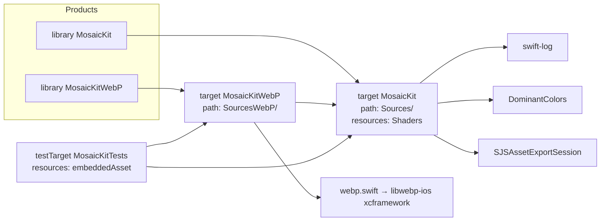
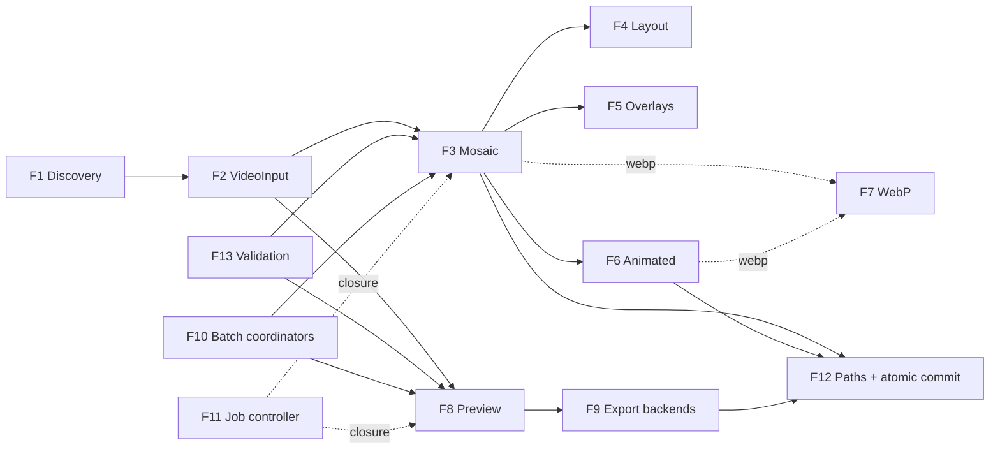

# MosaicKit — Codebase Knowledge Base

> **Purpose of this document.** A self-contained "brain dump" of the MosaicKit repository that
> another engineer or LLM can use to implement features, fix bugs, and refactor safely without
> first re-reading the whole codebase.
>
> **Build status of this document:** Phase 1 of 6 complete (Initial Context Scan).
> Sections for Phases 2–6 are stubbed at the end and will be filled in by later passes.
>
> **Snapshot:** branch `claude/codebase-analysis-docs-ppz2yf`, based on `main` @ `8f0c82f`
> ("Update swift.yml"). README advertises release line **1.7.0**.
>
> **Conventions used here**
> - All paths are relative to the repository root.
> - File anchors use `[[F:path#line-range#hash8]]`, where `hash8` is the first 8 hex chars of the
>   file's SHA-256 at the snapshot above. If the hash no longer matches, re-verify the claim.
> - "**⚠ Finding**" marks something that disagrees with other docs or is likely to surprise you.

---

## Table of contents

1. [Part 1 — High-Level Overview (Phase 1)](#part-1--high-level-overview-phase-1)
   1. [What MosaicKit is](#11-what-mosaickit-is)
   2. [Who uses it](#12-who-uses-it)
   3. [Tech stack & dependencies](#13-tech-stack--dependencies)
   4. [Package products & targets](#14-package-products--targets)
   5. [Repository structure](#15-repository-structure)
   6. [Feature catalog & business purpose](#16-feature-catalog--business-purpose)
   7. [How the features interact](#17-how-the-features-interact)
   8. [Public entry points at a glance](#18-public-entry-points-at-a-glance)
   9. [Which existing docs to trust](#19-which-existing-docs-to-trust)
   10. [Early findings (to be expanded in Phase 4)](#110-early-findings-to-be-expanded-in-phase-4)
   11. [Phase 1 wrap-up](#111-phase-1-wrap-up)
2. [Part 2 — System Architecture (Phase 2, pending)](#part-2--system-architecture-phase-2-pending)
3. [Part 3 — Feature-by-Feature Analysis (Phase 3, pending)](#part-3--feature-by-feature-analysis-phase-3-pending)
4. [Part 4 — Things You Must Know Before Changing Code (Phase 4, pending)](#part-4--things-you-must-know-before-changing-code-phase-4-pending)
5. [Part 5 — Technical Reference & Glossary (Phase 5, pending)](#part-5--technical-reference--glossary-phase-5-pending)
6. [Appendix A — File Index](#appendix-a--file-index)
7. [Appendix B — Assumptions](#appendix-b--assumptions)
8. [Appendix C — State Block](#appendix-c--state-block)

---

## Part 1 — High-Level Overview (Phase 1)

### 1.1 What MosaicKit is

MosaicKit is a **Swift Package (library, not an app)** that turns video files into two kinds of
visual summaries:

1. **Video mosaics / contact sheets.** One large still image (HEIF, JPEG, PNG, or WebP)
   containing a grid of frames sampled across the whole video. You can add a metadata header,
   per-frame timestamps, a watermark, and a "Color DNA" strip. The package can also produce an
   **animated** version (GIF, HEICS, or animated WebP) made from the same frames.
2. **Preview videos / highlight reels.** A short video (default ~60 s) made from many short clips
   spread evenly across the source. It can be exported to a file (`.mp4`/`.mov`/`.m4v`) or
   returned as an in-memory `AVPlayerItem` for immediate playback.

Everything runs on-device with Apple frameworks: AVFoundation for decoding and export, Metal
compute shaders for compositing, and ImageIO for encoding. On macOS, previews can optionally be
transcoded by an external `ffmpeg` binary.

- **Platforms:** macOS 26+, iOS 26+, macCatalyst 26+ (`Package.swift` `platforms:`)
  [[F:Package.swift#8#f02eefa2]].
- **Language/tooling:** Swift 6.2 (`swift-tools-version: 6.2`), strict concurrency (CI builds
  iOS with `SWIFT_STRICT_CONCURRENCY=complete`).
- **License:** Apache 2.0 (`LICENSE`).
- **Size:** about 13.4k lines of Swift in `Sources/` + `SourcesWebP/`, 160 lines of Metal, and about 5.6k lines
  of tests in `Tests/`.

### 1.2 Who uses it

The package is a library. Nothing in this repo is an end-user app. Its consumers are:

| Consumer type | What they need from MosaicKit | Evidence |
|---|---|---|
| **Media-library / video-manager apps (macOS & iOS)** | Thumbnail sheets for browsing large collections of videos, and previews that play without re-encoding | `generateComposition` returns an `AVPlayerItem`; batch coordinators; `scanVideos`/`discoverVideos` folder scanning; `overwrite == false` skip-if-exists for incremental runs |
| **Batch / archival pipelines (CLI tools, daemons, XPC services)** | Unattended, resumable bulk generation with predictable output paths | `enableAppLifecycleMonitor = false` and `enableExportRetry = false` exist specifically for daemons/CLI (`Sources/Models/PreviewConfiguration.swift`); `outputDirectoryTemplate`/`filenameTemplate`; `.ffmpeg` export mode |
| **Apps with persisted work queues** | Stable job IDs, pause, retry, and cancel | `GenerationJobController`, `VideoSource` (Codable, no I/O on construction) |
| **Web/social publishing workflows** | Web-friendly formats and animated teasers | `.webp` still/animated output, `GifSize` presets, `AspectRatio.vertical` (9:16) |

The fields `postID` and `VideoMetadata.custom`, plus the removed `serviceName`/`creatorName`
fields (README "New in 1.3.0"), show that the library was first built for an app that organized
downloaded videos by **service/creator/post**. That coupling has mostly been removed, but a few
traces remain. For example, `{service}` and `{creator}` are still listed as filename tokens in
the `MosaicConfiguration.filenameTemplate` doc comment.

### 1.3 Tech stack & dependencies

**Apple frameworks used (all first-party):**

| Framework | Used for | Main files |
|---|---|---|
| AVFoundation | Asset loading, metadata, frame extraction (`AVAssetImageGenerator`), composition (`AVMutableComposition`), export (`AVAssetExportSession`) | `ThumbnailProcessor.swift`, `MosaicFrameSource.swift`, `VideoMetadataExtractor.swift`, `Preview/PreviewVideoGenerator.swift` |
| VideoToolbox | Hardware decode (implicitly through AVFoundation) | `MetalMosaicGenerator.swift` imports it |
| Metal | GPU compute kernels for scale, composite, fill, border, and shadow | `MetalImageProcessor.swift`, `Shaders/MetalShaders.metal` |
| CoreGraphics / CoreImage / ImageIO / UniformTypeIdentifiers | Text/overlay rasterization, `CGImageDestination` encoding (HEIF/JPEG/PNG/GIF/HEICS) | `ThumbnailProcessor.swift`, `OverlayProcessor.swift`, `AnimatedGifGenerator.swift` |
| QuartzCore (Core Animation) | Burned-in timestamp pills in preview video (`AVVideoCompositionCoreAnimationTool`) | `Preview/PreviewVideoGenerator.swift` |
| OSLog | Logging (`Logger(subsystem:category:)`) and `OSSignposter` performance intervals | nearly every processing file |
| Synchronization | `Mutex` for lock-protected state (`CancellationToken`, WebP registry) | `WebPSupport.swift`, `PreviewVideoGenerator.swift` |
| AppKit / UIKit | Lifecycle notifications and platform font/color/image types | `AppLifecycleMonitor.swift`, `PreviewVideoGenerator.swift`, `MosaicKitWebP.swift` |

**Third-party SPM dependencies** (`Package.swift`, pinned in `Package.resolved`):

| Package | Pinned | Linked into | Actual use |
|---|---|---|---|
| `apple/swift-log` | 1.10.1 | `MosaicKit` | **⚠ Finding: declared but never imported.** No `import Logging` exists in `Sources/`, `Tests/`, or `Examples/`. All logging uses OSLog's `Logger(subsystem: "com.mosaicKit", …)`. `CLAUDE.md` says to use swift-log `Logger(label:)`; the code does not. |
| `DenDmitriev/DominantColors` | 1.2.2 | `MosaicKit` | Dominant-color extraction for the gradient mosaic background (`MetalImageProcessor.swift` ~L593–601) |
| `samsonjs/SJSAssetExportSession` | 0.4.0 | `MosaicKit` | `.sjs` preview export mode; its `VideoOutputSettings.Codec` type also appears in the public models (`VideoFormat.swift`, `PreviewConfiguration.swift`, `PreviewExportDescription.swift`) |
| `awxkee/webp.swift` (→ `libwebp-ios` 1.1.1, a **binary xcframework**) | 1.1.2 | **`MosaicKitWebP` only** | Still and animated WebP encoding |

**Runtime (non-SPM) dependency:** an external `ffmpeg` executable. It is needed only for
`PreviewExportMode.ffmpeg` on macOS, and its path is supplied through
`PreviewConfiguration.ffmpegBinaryPath`.

**Tooling:**
- SwiftPM is the real build system: `swift build` and `swift test`.
- `Makefile` + `scripts/*.sh` are an **agent/xcodebuild scaffold** (`xcbuild.sh`, `task.sh`,
  simulator runners). They reference `MosaicKit.xcodeproj`, which **does not exist** in the
  repo, and `scripts/xcbuild.sh`, which is also missing. Treat the Makefile as non-functional
  here. (`CLAUDE.md` also claims "There is no Makefile", which is out of date as well.)
- `.spi.yml` builds DocC for the Swift Package Index (macOS + iOS, Swift 6.2).
- `MosaicKitTests.xctestplan` is an Xcode test plan.

### 1.4 Package products & targets



**Why WebP is split out** (see `Sources/Processing/WebPSupport.swift` and the `Package.swift`
comments): a binary xcframework anywhere in a target's dependency graph breaks Xcode SwiftUI
Preview JIT for every client that links it. The core target therefore only declares the
`MosaicKitWebPEncoding` protocol and a `Mutex`-guarded registry
(`MosaicKitWebPSupport.encoder`). Clients that want WebP link `MosaicKitWebP` and call
`MosaicKitWebP.register()` once at startup. Without that call, any WebP request throws
`MosaicKitWebPError.encoderNotRegistered`. `MosaicConfiguration.validate()` checks this before
any work starts.

**⚠ Finding:** `CLAUDE.md` and `Examples/README.md` say to run `swift run SimpleExample` and
similar commands. `Package.swift` declares **no executable targets**, so those commands cannot
work as the package stands. The files in `Examples/` are reference snippets only.

### 1.5 Repository structure

```
.
├── Package.swift / Package.resolved   SPM manifest (2 library products, 1 test target)
├── Sources/                           → target "MosaicKit"
│   ├── Models/                        Codable+Sendable value types (configs, inputs, progress)
│   │   ├── MosaicConfiguration.swift  Mosaic config, output-path/filename templating, OutputFormat,
│   │   │                              AnimatedFormat, GifCreationMode, GifSize, MosaicColor
│   │   ├── PreviewConfiguration.swift Preview config, PreviewExportMode, extract-count math, paths
│   │   ├── ConfigurationValidation.swift  validate() for DensityConfig / MosaicConfiguration / PreviewConfiguration
│   │   ├── DensityConfig.swift        7 density presets (XXL…XXS) + custom
│   │   ├── LayoutConfiguration.swift  LayoutType, AspectRatio, VisualSettings, BorderColor, ShadowSettings
│   │   ├── MosaicLayout.swift         Computed layout (positions, sizes) + ASCII debug art
│   │   ├── OverlayConfiguration.swift FrameLabel / Header / Watermark / ColorDNA configs
│   │   ├── VideoInput.swift           Inspected video (metadata) — the unit of work everywhere
│   │   ├── VideoSource.swift          Lightweight Codable source ref + inspect() + VideoInput.validate()
│   │   ├── VideoFormat.swift          Preview containers + native/SJS presets + ExportMaxResolution
│   │   ├── FFmpegEncodingOptions.swift  Codec/CRF/preset/resolution for ffmpeg export
│   │   ├── PreviewExportDescription.swift  "What will this export produce?" description for UI
│   │   └── PreviewGenerationProgress.swift Preview status/progress/result types
│   ├── Processing/
│   │   ├── MetalMosaicGenerator.swift  ★ Main mosaic entry point (actor)
│   │   ├── MosaicGeneratorProtocol.swift  Actor-constrained generator protocol
│   │   ├── MosaicGeneratorCoordinator.swift  ★ Batch/concurrency manager (generic actor) + progress/result types
│   │   ├── GenerationJobs.swift       ★ GenerationJobController (job/attempt IDs, pause/retry)
│   │   ├── LayoutProcessor.swift      Thumbnail count + 5 layout algorithms + cache
│   │   ├── ThumbnailProcessor.swift   Frame extraction/streaming, labels, metadata header rendering
│   │   ├── MosaicFrameSource.swift    Pull-based, single-consumer bounded frame source
│   │   ├── MetalImageProcessor.swift  Metal pipeline + DominantColors background
│   │   ├── OverlayProcessor.swift     Color DNA strip, watermark, average color
│   │   ├── AnimatedGifGenerator.swift GIF/HEICS/WebP animation writer
│   │   ├── OutputTransaction.swift    Staging file + atomic rename/exclusive-create commit
│   │   ├── WebPSupport.swift          WebP encoder injection point
│   │   ├── VideoMetadataExtractor.swift  AVFoundation metadata (actor)
│   │   ├── ProcessingError.swift / VideoError.swift  MosaicError, LibraryError, VideoError
│   │   └── Preview/
│   │       ├── PreviewVideoGenerator.swift  ★ Preview entry point (actor) + PreviewGenerationLogic
│   │       ├── PreviewGeneratorCoordinator.swift  ★ Preview batch manager + background retry
│   │       ├── FFmpegEncoder.swift     Passthrough export + ffmpeg Process (macOS)
│   │       ├── AppLifecycleMonitor.swift  Foreground-wait gate (singleton actor)
│   │       └── PreviewError.swift
│   ├── Shaders/MetalShaders.metal     5 kernels: scaleTexture, compositeTextures, fillTexture, addBorder, addShadow
│   ├── VideoInputScanner.swift        scanVideos / discoverVideoSources / discoverVideos
│   └── MosaicKit.docc/                DocC catalog (8 articles)
├── SourcesWebP/MosaicKitWebP.swift    → target "MosaicKitWebP" (DefaultMosaicKitWebPEncoder + register())
├── Tests/MosaicKitTests/              Swift Testing suites (19 files) + embeddedAsset/test_video.mp4
├── Examples/                          5 illustrative .swift files (NOT wired as SPM targets)
├── Media.xcassets/                    test_video dataset (same fixture, for Xcode)
├── .github/workflows/                 swift.yml (macOS + iOS Simulator CI), claude*.yml
├── scripts/, Makefile, tasks/         Agent/xcodebuild scaffolding (see §1.3)
└── README.md, DOCUMENTATION.md, CONTRIBUTING.md, CLAUDE.md, AGENTS.md,
    MosaicKit-DeepDive.md, spec.md    Human/agent docs (reliability varies — §1.9)
```

★ = primary public entry points.

### 1.6 Feature catalog & business purpose

Each feature has a stable ID (F1…F13) that later phases reuse.

| ID | Feature | Business purpose | Primary code |
|---|---|---|---|
| **F1** | **Video discovery** | Turn a folder of videos into a work list without the app writing its own file-walking code. | `scanVideos(in:recursive:)` (lenient, legacy), `discoverVideoSources` (no I/O), `discoverVideos(in:recursive:metadataConcurrency:)` (throwing, bounded concurrency, results in filename order). All in `Sources/VideoInputScanner.swift`. Recognizes 15 extensions (mp4, mov, mkv, webm, ts, mxf, …). |
| **F2** | **Video input & inspection** | Load the metadata that sizing and labels depend on (duration, dimensions, fps, codec, bitrate, size) once, validate it, and make it serializable for queues. | `VideoSource` (Codable; `inspect()` loads metadata), `VideoInput` (inspected; `init(from:)` throws, while the legacy `init(url:…) async` never throws and falls back to the values you passed in), `VideoInput.validate()`, `VideoMetadataExtractor` actor. |
| **F3** | **Mosaic generation** | Core product: a single image that summarizes a whole video, for browsing, cataloguing, and sharing. | `MetalMosaicGenerator.generate(for:config:forIphone:) → URL`, `generateMosaicImage(…) → CGImage` (in memory, nothing saved), `generateallcombinations` (3 widths × 7 densities, always HEIF). Rejects videos shorter than **5 s**. |
| **F4** | **Layout engine** | Choose how many frames and how to arrange them so the sheet is readable at the target size and aspect ratio. | `LayoutProcessor.calculateThumbnailCount` + `calculateLayout`. 5 `LayoutType`s: `custom` (default, three-zone), `classic`, `auto` (screen-aware, not cached), `dynamic`, `iphone`. 5 `AspectRatio`s. `DensityConfig` scales frame count from 0.25× to 4×. |
| **F5** | **Overlays & annotations** | Make the sheet informative and brandable: timestamps show *where* each frame comes from, the header shows *what* the file is, the watermark shows ownership, and Color DNA gives a visual fingerprint. | `OverlayConfiguration` (`FrameLabelConfig`, `HeaderConfig` with `MetadataField`s, `WatermarkConfig`, `ColorDNAConfig`). Rendering is split between `ThumbnailProcessor` (labels, header), `OverlayProcessor` (DNA, watermark), and `MetalImageProcessor` (borders/shadow, dominant-color background). |
| **F6** | **Animated export** | A lightweight animated teaser (GIF/HEICS/WebP) for places where a big still or a video is not suitable. | `MosaicConfiguration.gifMode` (`.disabled` / `.withMosaic` / `.gifOnly`), `gifSize`, `animatedFormat` (default `.webp`), `gifFps` (default 10). Written by `AnimatedGifGenerator.save`. |
| **F7** | **Optional WebP support** | Offer web-optimized output without making every client pay the SwiftUI-Preview cost of a binary xcframework. | `MosaicKitWebP` product, `MosaicKitWebPEncoding` protocol, `MosaicKitWebPSupport.encoder` registry. |
| **F8** | **Preview video (highlight reel)** | A short watchable summary of a long video. It can play instantly (`AVPlayerItem`) or be saved to a file for sharing or storage. | `PreviewVideoGenerator.generate(for:config:progressHandler:) → URL` and `generateComposition(…) → AVPlayerItem`. Implemented by `PreviewGenerationLogic` (validate → timestamps → compose → export). Clip count comes from `PreviewConfiguration.extractCount(forVideoDuration:)`, which is a density base (4…48) plus a log-duration adjustment. |
| **F9** | **Preview export backends** | Trade speed, quality, and control: `.native` = simplest (Apple presets), `.sjs` = codec/bitrate/resolution control, `.ffmpeg` = best compression/codec choice on macOS. | `PreviewExportMode`; `exportWithNativeSession`, `exportWithSJSSession`, `exportWithFFmpeg` → `FFmpegEncoder` (passthrough `.mov` then `ffmpeg` transcode). Supporting types: `nativeExportPreset`, `SjSExportPreset`, `ExportMaxResolution`, `FFmpegEncodingOptions`, `PreviewExportDescription`. |
| **F10** | **Batch coordination** | Process many videos quickly without exhausting CPU, RAM, or hardware encoders, with per-video progress and correct cancellation. | `MosaicGeneratorCoordinator<Generator>`: dynamic limit = min(cores/2, RAM / (width·density/2000 GB)), minimum 2. `PreviewGeneratorCoordinator`: dynamic limit capped at **2** because of VideoToolbox encoder channels, plus a foreground-wait/stall retry up to 3×. Both use a `batchEpoch` so a cancelled batch stops. |
| **F11** | **Explicit job lifecycle** | Let apps with persisted queues track *jobs* (stable ID) and *attempts* (new ID per retry), and pause, retry, or cancel them independently of the video URL. | `GenerationJobController` actor, `GenerationJobID`, `GenerationAttemptID`, `GenerationJobState`, `GenerationJobSnapshot`. It wraps any `() async throws -> URL` closure; work starts only when `value(for:)` is awaited. |
| **F12** | **Output paths & atomic commit** | Predictable, idempotent output locations (skip work already done) and no half-written files, even on SMB shares. | `MosaicConfiguration.generateOutputDirectory` / `generateFilename` / `animatedOutputURL` / `configurationHash`, `createOutputSubdirectory`, `outputDirectoryTemplate` and `filenameTemplate` tokens, `overwrite`. `OutputTransaction` (hidden `.mosaickit-<UUID>.<ext>` staging file → `rename(2)`, or with `overwrite == false` an exclusive `fopen("wx")` claim followed by rename). The preview side has its own equivalents in `PreviewConfiguration`. |
| **F13** | **Up-front validation & typed errors** | Fail fast with actionable messages before spending GPU, decoder, or encoder time. | `DensityConfig.validate`, `MosaicConfiguration.validate`, `PreviewConfiguration.validate`, `VideoInput.validate`; error enums `MosaicError`, `LibraryError`, `VideoError`, `PreviewError`, `MetalProcessorError`, `MosaicKitWebPError`. |

**Cross-cutting capabilities** (these are not features themselves; Phase 2 covers them):
cancellation propagation (tracked tasks, `withTaskCancellationHandler`, `CancellationToken`),
progress reporting (`MosaicGenerationProgress`/`Status`, `PreviewGenerationProgress`/`Status`),
performance metrics (`getPerformanceMetrics()` dictionaries, `OSSignposter` intervals), and
background/lifecycle handling (`AppLifecycleMonitor`, `ProcessInfo.beginActivity` on macOS during
preview export).

### 1.7 How the features interact



(Also stored as `codebase-analysis-docs/assets/feature-map.mmd`. The mosaic pipeline flowchart
is in `codebase-analysis-docs/assets/mosaic-pipeline.mmd`.)

**The two main flows:**

- **"Make a contact sheet":** F1/F2 produce a `VideoInput` → F13 validates `MosaicConfiguration`
  → F3 checks F12 paths (skip if the output exists) → F4 sizes the grid → frames stream through
  F5 labeling and color sampling into the Metal compositor → the F5 DNA strip and watermark are
  applied → F12 commits atomically → optionally F6 writes the animation next to the mosaic (via
  F7 if WebP).
- **"Make a highlight reel":** F2 `VideoInput` → F13 validates `PreviewConfiguration` → F8
  computes extract count/duration/speed → builds an `AVMutableComposition` (optionally with
  timestamp overlays) → returns an `AVPlayerItem` **or** hands off to F9 (native/SJS/ffmpeg) →
  F12-style staged commit.

**How they fit together:**

- The mosaic path and the preview path **share `VideoInput` and `DensityConfig`** (both use the
  same seven density names). They share **nothing else at runtime**: they have separate configs,
  generators, coordinators, error enums, and path-templating code. A mosaic and a preview of the
  same video are independent jobs.
- **F6 depends on F3's layout.** The animation reuses `layout.thumbCount` and the mosaic's output
  directory and filename (`animatedOutputURL` = `"<gifSize> -" + mosaic base name + ext`).
  `.gifOnly` still runs layout calculation but skips compositing. In the `overwrite == false`
  early-exit path, F3 will **backfill a missing animation** next to an existing mosaic.
- **F10 wraps F3/F8. F11 is an alternative to F10, not a layer on top of it.**
  `GenerationJobController` does not know about coordinators. It runs any closure (typically
  `MetalMosaicGenerator().generate…` or `PreviewVideoGenerator().generate…`). The spec
  (`spec.md`) describes a much larger service/plan/batch-handle API. **Only the small
  `GenerationJobController` has been implemented.**
- **F12 drives incremental processing.** The skip-if-exists early return depends on the resolved
  path being deterministic. For mosaics it is. For previews in the default naming mode it is not
  (see §1.10 item 3).

**Combined value:** an app can scan a library (F1) and batch-generate (F10) a browsable,
annotated contact sheet (F3–F5) for each video, plus a playable teaser (F8/F9) or an animated
thumbnail (F6). Idempotent paths (F12) allow re-running cheaply as new files arrive. Job control
(F11) and validation (F13) keep this manageable in long-running or user-facing apps.

### 1.8 Public entry points at a glance

| Task | Call | Returns |
|---|---|---|
| Inspect one file | `try await VideoInput(from: url)` or `try await VideoSource(url:).inspect()` | `VideoInput` |
| Scan a folder | `try await discoverVideos(in: folder, recursive: true)` | `[VideoInput]` (sorted by filename) |
| One mosaic → file | `try await MetalMosaicGenerator().generate(for: video, config: config)` | `URL` |
| One mosaic → memory | `try await generator.generateMosaicImage(for:config:)` | `CGImage` |
| Mosaic batch | `try createDefaultMosaicCoordinator().generateMosaicsforbatch(videos:config:progressHandler:)` or `generateMosaicsForFiles(_:config:…)` | `[MosaicGenerationResult]` |
| One preview → file | `try await PreviewVideoGenerator().generate(for:config:)` | `URL` |
| One preview → player | `try await PreviewVideoGenerator().generateComposition(for:config:)` | `AVPlayerItem` |
| Preview batch | `PreviewGeneratorCoordinator().generatePreviewsForBatch(…)` / `generatePreviewCompositionsForBatch(…)` | `[PreviewGenerationResult]` / `[PreviewCompositionResult]` |
| Job control | `GenerationJobController().submit { … }` then `value(for:)`, `pause`, `retry`, `cancel`, `snapshot(for:)` | `GenerationJobID`, `URL` |
| Enable WebP | `MosaicKitWebP.register()` (link `MosaicKitWebP`) | — |
| Cancel | `generator.cancel(for:)` / `cancelAll()`; `coordinator.cancelGeneration(for:)` / `cancelAllGenerations()`; or cancel the awaiting `Task` | — |

Default values worth knowing:

- **`MosaicConfiguration()`:** width 5120, density `.m`, `.heif`, quality 0.4, `.custom` layout,
  metadata header on, movie-color background on, `animatedFormat` `.webp`.
- **`MosaicConfiguration.default`:** width 4000, density `.xl`. This differs from the plain
  initializer's defaults.
- **`PreviewConfiguration()`:** 60 s, `.m`, `.mp4`, quality 0.8, `.native` export.

### 1.9 Which existing docs to trust

| Doc | Reliability | Notes |
|---|---|---|
| Source code | **Authoritative** | Always verify against it. |
| `README.md` | High, with exceptions | Current through 1.7.0. Exception: "New in 1.6.2" says the default `ExportMaxResolution` is **4K**, but the code defaults to **"1080p"** (§1.10 item 4). The installation snippet still says `from: "1.2.0"`. |
| `CLAUDE.md` / `AGENTS.md` | Medium | Architecture summary is correct. Wrong on: swift-log usage, "no Makefile", `swift run` examples, the CI workflow list (`mosaickit-tests.yml` and `swift62.yml` do not exist; only `swift.yml` + `claude*.yml` do), and `Models/AspectRatio.swift` (`AspectRatio` is defined in `Models/LayoutConfiguration.swift`). `AGENTS.md` still mentions Core Graphics/vImage in pipeline step 4 and uses `VideoFormat` as the mosaic format type (it is `OutputFormat`). |
| `MosaicKit-DeepDive.md` | **Stale — do not trust architecture sections** | Describes the removed dual engine (`CoreGraphicsMosaicGenerator`, `MosaicGeneratorFactory`, vImage buffer pool) and a `.gif` still format. The coordinator concurrency formula it gives is for previews only, and the cap of 8 it quotes is really 2. |
| `spec.md` | **Design intent, only partly implemented** | Describes a `GenerationRequest/Plan`, `JobHandle/BatchHandle`, checkpoint ledger, and a single processing-service actor. None of these exist. What does exist: `VideoSource`, `OutputTransaction`, `MosaicFrameSource`, validation, `GenerationJobController`. |
| `Sources/MosaicKit.docc/*` | Not yet reviewed | `PlatformStrategy.md` is documented as historical context. To verify in Phase 2. |

### 1.10 Early findings (to be expanded in Phase 4)

These were found while scanning. Each still needs deeper confirmation in Phase 4.

1. **swift-log is an unused dependency.** Code uses OSLog only. Subsystem strings are also
   inconsistent: `"com.mosaicKit"` in most files, but `"com.mosaickit"` (lowercase k) in
   `PreviewVideoGenerator.swift` and `PreviewConfiguration.swift`. This matters when filtering
   logs in Console.
2. **Mosaic output-dimension limit.** `MetalMosaicGenerator` rejects `config.width > 16_384`
   inside generation (not in `validate()`) and videos shorter than 5 s, both as
   `MosaicError.invalidVideo`.
   [[F:Sources/Processing/MetalMosaicGenerator.swift#171-179#07857fa0]]
3. **Preview skip-if-exists never matches in default naming mode.** With `fullPathInName ==
   false` and no `filenameTemplate`, `PreviewConfiguration.generateFilename` embeds a
   run-time timestamp (`yyyy-MM-dd_HH-mm-ss`). As a result, `overwrite == false` never finds an
   existing file, and each run writes a new preview.
   [[F:Sources/Models/PreviewConfiguration.swift#517-565#bb8d3160]]
4. **Preview max-resolution default mismatch.** `_exportMaxResolutionRaw` defaults to `"1080p"`
   (the declaration, the decoder fallback, and the `init(…maxResolution:)` fallback all agree).
   Comments in two initializers say "defaults to 4K", and the README says 4K.
5. **`MosaicConfiguration` decoding is strict.** `gifMode`, `gifSize`, `animatedFormat`,
   `gifFps`, `overwrite`, and the other fields use `decode`, not `decodeIfPresent`. Only
   `createOutputSubdirectory` and the two templates are tolerant. Configs persisted before those
   fields existed will fail to decode.
6. **`generateallcombinations` ignores most of the caller's config.** It builds fresh HEIF
   configs (quality 0.4, default layout, metadata on, accurate timestamps) and does not use
   the caller's `outputdirectory`, overlay, or templates.
7. **`LayoutProcessor` is a non-`Sendable` `final class` with mutable state.**
   `mosaicAspectRatio` and a 64-entry cache (guarded by `stateLock`) are shared by the
   generator actor. Thread-safety needs review in Phase 4.
8. **Several `MosaicConfiguration` initializers have conflicting animation defaults.** The main
   initializer uses `gifSize .nochange` and `.webp`. The overlay initializer without `gifMode`
   uses `.small` and `.webp`. The deprecated `forIphone:` initializer uses `.nochange` and
   `.gif`. The "density-only" initializer sets width 2500, quality 0.3, and **turns off** the
   movie-color background.
9. **Dead code in `MetalMosaicGenerator`.** `extractFramesWithVideoToolbox`,
   `calculateExtractionTimes`, and `calculateAspectRatio` are private and never called.
   Extraction really goes through `ThumbnailProcessor.processedFramesStream`.

### 1.11 Phase 1 wrap-up

**Decisions / findings**
- MosaicKit is a single-backend (Metal) Apple-platform library with two independent product
  lines, **Mosaic** (F3–F7) and **Preview** (F8–F9). They are joined by shared input (F1–F2),
  orchestration (F10–F11), and output/validation infrastructure (F12–F13).
- Source code is the only fully reliable reference. `MosaicKit-DeepDive.md` and parts of
  `CLAUDE.md`/`AGENTS.md` are stale.

**Open questions** (carried into the State Block)
- How exactly does `MetalImageProcessor.generateMosaicStream` bound GPU submissions, and how does
  it use `MosaicFrameSource` versus `ThumbnailProcessor.processedFramesStream`?
- Details of the `LayoutProcessor` formulas (thumbnail count vs. density vs. width) and the cache
  key contents.
- How the preview composition handles speed-up (`playbackSpeed`), audio, and orientation, and how
  the three export paths commit output (do they all use `OutputTransaction`?).
- `FFmpegEncoder` process lifecycle: termination, diagnostics, and temp cleanup.
- What the tests actually cover and which ones are skipped in CI (`MOSAICKIT_SUITE_MODE=none`).

**Next steps (Phase 2):** read `MetalImageProcessor.swift`, `ThumbnailProcessor.swift` (stream +
header), `LayoutProcessor.swift`, the rest of `PreviewVideoGenerator.swift` (compose/export),
`FFmpegEncoder.swift`, `PreviewGeneratorCoordinator.swift`, `VideoMetadataExtractor.swift`, the
error files, and the DocC `Architecture.md`/`PerformanceGuide.md`. Then produce component maps,
sequence diagrams, and the concurrency/cancellation model.

---

## Part 2 — System Architecture (Phase 2, pending)

_To be filled: component map, sequence diagrams for mosaic and preview flows, concurrency &
cancellation model, cross-cutting concerns (logging/signposts, security-scoped resources,
caching, lifecycle), third-party integration boundaries._

## Part 3 — Feature-by-Feature Analysis (Phase 3, pending)

_To be filled: F1–F13 deep dives (entry points, internals, side effects, edge cases, hidden
dependencies) and a cross-feature interaction matrix._

## Part 4 — Things You Must Know Before Changing Code (Phase 4, pending)

_To be filled: expand §1.10 with verification, performance hotspots, security implications,
hardcoded business rules._

## Part 5 — Technical Reference & Glossary (Phase 5, pending)

_To be filled: glossary, key type/function reference, model relationship (ER-style) diagram,
API examples._

---

## Appendix A — File Index

`(#) PRIORITY | PATH | TYPE | LINES | HASH8 | NOTES`. Priority: P0 = entry point / backbone,
P1 = core feature, P2 = supporting, P3 = docs/infra.

| # | Pri | Path | Type | Lines | Hash8 | Notes |
|---|---|---|---|---|---|---|
| 1 | P0 | `Package.swift` | config | 63 | f02eefa2 | Products, targets, deps, platforms |
| 2 | P0 | `Sources/Processing/MetalMosaicGenerator.swift` | code | 865 | 07857fa0 | Mosaic entry actor; pipeline orchestration; `saveMosaic` @L743 |
| 3 | P0 | `Sources/Processing/MosaicGeneratorProtocol.swift` | code | 55 | 6997a51a | Actor protocol |
| 4 | P0 | `Sources/Processing/MosaicGeneratorCoordinator.swift` | code | 850 | e289994b | Batch actor, progress/result/status types, factory funcs @L835/843 |
| 5 | P0 | `Sources/Processing/Preview/PreviewVideoGenerator.swift` | code | 1609 | 18cbd999 | Preview actor + `PreviewGenerationLogic` (compose @L599, export paths @L1088/1110/1453) |
| 6 | P0 | `Sources/Processing/Preview/PreviewGeneratorCoordinator.swift` | code | 529 | 86e177ee | Preview batch, concurrency cap 2 @L439, retry @L462 |
| 7 | P0 | `Sources/Models/MosaicConfiguration.swift` | model | 689 | 82390038 | Config + path templating + format enums |
| 8 | P0 | `Sources/Models/PreviewConfiguration.swift` | model | 819 | bb8d3160 | Config + extract math + path templating |
| 9 | P1 | `Sources/Processing/ThumbnailProcessor.swift` | code | 1725 | 5a6a2b0c | Frame stream @L138, GIF frames @L75, header @L632/895 |
| 10 | P1 | `Sources/Processing/MetalImageProcessor.swift` | code | 1356 | 260cc3a9 | Metal pipeline, `generateMosaicStream` @L863, DominantColors @L601 |
| 11 | P1 | `Sources/Processing/LayoutProcessor.swift` | code | 745 | 94d44727 | Layout algorithms, cache @L21/108/147 |
| 12 | P1 | `Sources/Models/VideoInput.swift` | model | 133 | 08cdafc0 | Unit of work |
| 13 | P1 | `Sources/Models/VideoSource.swift` | model | 61 | 4e63687f | Lazy source + inspect + validate |
| 14 | P1 | `Sources/Processing/GenerationJobs.swift` | code | 104 | 9956571f | Job controller |
| 15 | P1 | `Sources/Processing/OutputTransaction.swift` | code | 62 | e5da241b | Atomic commit |
| 16 | P1 | `Sources/Processing/MosaicFrameSource.swift` | code | 76 | 73a43637 | Pull-based frame source |
| 17 | P1 | `Sources/Models/ConfigurationValidation.swift` | model | 102 | 83f12470 | All `validate()` |
| 18 | P1 | `Sources/Processing/Preview/FFmpegEncoder.swift` | code | 423 | 754d03e0 | ffmpeg pipeline (macOS) |
| 19 | P1 | `Sources/Processing/OverlayProcessor.swift` | code | 302 | 47e12c52 | DNA strip, watermark |
| 20 | P1 | `Sources/Models/OverlayConfiguration.swift` | model | 329 | 50177235 | Overlay configs |
| 21 | P1 | `Sources/Processing/AnimatedGifGenerator.swift` | code | 141 | bd92de71 | Animated writer |
| 22 | P1 | `Sources/Processing/WebPSupport.swift` | code | 45 | 8f928b72 | WebP injection |
| 23 | P1 | `SourcesWebP/MosaicKitWebP.swift` | code | 72 | dc374b7e | WebP encoder impl |
| 24 | P2 | `Sources/Models/DensityConfig.swift` | model | 84 | 5f791dc8 | Density presets |
| 25 | P2 | `Sources/Models/LayoutConfiguration.swift` | model | 195 | 3832ee5d | LayoutType, AspectRatio, visuals |
| 26 | P2 | `Sources/Models/MosaicLayout.swift` | model | 171 | d3f83de1 | Layout result |
| 27 | P2 | `Sources/Models/VideoFormat.swift` | model | 417 | 26c5e961 | Preview containers & presets |
| 28 | P2 | `Sources/Models/FFmpegEncodingOptions.swift` | model | 310 | 371e72a8 | ffmpeg options |
| 29 | P2 | `Sources/Models/PreviewExportDescription.swift` | model | 200 | 565ddbeb | Export description |
| 30 | P2 | `Sources/Models/PreviewGenerationProgress.swift` | model | 201 | 0318e5ee | Preview progress/results |
| 31 | P2 | `Sources/Processing/Preview/AppLifecycleMonitor.swift` | code | 80 | 8af44e3d | Foreground gate |
| 32 | P2 | `Sources/Processing/Preview/PreviewError.swift` | code | 143 | 03e8936f | Preview errors |
| 33 | P2 | `Sources/Processing/ProcessingError.swift` | code | 97 | 9896b38f | MosaicError, LibraryError |
| 34 | P2 | `Sources/Processing/VideoError.swift` | code | 156 | b03a4f41 | VideoError |
| 35 | P2 | `Sources/Processing/VideoMetadataExtractor.swift` | code | 172 | c25f1885 | Metadata actor |
| 36 | P2 | `Sources/VideoInputScanner.swift` | code | 106 | 3eee6885 | Discovery |
| 37 | P2 | `Sources/Shaders/MetalShaders.metal` | shader | 160 | 69c46806 | 5 kernels |
| 38 | P2 | `Tests/MosaicKitTests/CombinationTests.swift` | test | 709 | 0706d719 | Serialized mosaic matrix |
| 39 | P2 | `Tests/MosaicKitTests/PreviewCombinationTests.swift` | test | 686 | 7bdd7237 | Serialized preview matrix |
| 40 | P2 | `Tests/MosaicKitTests/MosaicCancellationTests.swift` | test | 375 | 125fb448 | Cancellation semantics |
| 41 | P2 | `Tests/MosaicKitTests/PreviewCancellationTests.swift` | test | 371 | a144428d | Skipped when `MOSAICKIT_SUITE_MODE=none` |
| 42 | P2 | `Tests/MosaicKitTests/InputValidationRegressionTests.swift` | test | 129 | 1f41f0d4 | Validation regressions |
| 43 | P2 | `Tests/MosaicKitTests/OutputTransactionTests.swift` | test | 43 | cd1a7e9a | Atomic commit |
| 44 | P3 | `.github/workflows/swift.yml` | ci | 135 | 1b347282 | macOS `swift test` + iOS Sim `xcodebuild` |
| 45 | P3 | `README.md` | doc | 993 | 83fe5134 | Changelog + usage |
| 46 | P3 | `spec.md` | doc | 78 | 4508df31 | Reliability spec (partially implemented) |
| 47 | P3 | `MosaicKit-DeepDive.md` | doc | 199 | 1e67bef6 | Stale architecture |
| 48 | P3 | `CLAUDE.md` | doc | 343 | 68fd1963 | Agent guide (partly stale) |
| 49 | P3 | `AGENTS.md` | doc | 300 | 78b9f6dc | Agent guide (partly stale) |

Excluded or low value: `Media.xcassets/**` (binary fixture), `Tests/MosaicKitTests/embeddedAsset/test_video.mp4`
(87 s H.264/AAC fixture), `scripts/**` + `Makefile` (xcodebuild agent scaffold for a
non-existent `.xcodeproj`), `tasks/TASKS.md` (empty backlog).

## Appendix B — Assumptions

| # | Assumption | Confidence | How to confirm |
|---|---|---|---|
| A1 | The original host app organized videos by service/creator/post (explains `postID`, `custom`, removed fields) | Medium | README 1.3.0 notes; git history |
| A2 | `Examples/*.swift` were once executable targets and were removed from `Package.swift` | Low | `git log -S SimpleExample -- Package.swift` finds nothing in the available (84-commit) history, so the examples may never have been wired up |
| A3 | `Makefile`/`scripts/` come from a generic multi-agent template and are unused for this package | High | Missing `.xcodeproj` and `scripts/xcbuild.sh` |
| A4 | The `spec.md` stages beyond what is present (plans, handles, ledger) were deferred, not dropped | Low | Ask maintainer / PR history (#29, #30 and earlier) |

## Appendix C — State Block

```
INDEX_VERSION: 1 (Phase 1 complete)
SNAPSHOT: main@8f0c82f → branch claude/codebase-analysis-docs-ppz2yf

FILE_MAP_SUMMARY: see Appendix A (49 files indexed; P0 = 8, P1 = 15)

OPEN_QUESTIONS:
  Q1 MetalImageProcessor.generateMosaicStream: batching, command-buffer error propagation, memory bounds
  Q2 ThumbnailProcessor.processedFramesStream vs MosaicFrameSource: which is on the live path, strict vs best-effort missing frames
  Q3 LayoutProcessor: count formula, per-layout algorithm, cache key composition, thread-safety of stateLock/mosaicAspectRatio
  Q4 Preview compose: speed ramp, audio mix, orientation, overlay cues; which exporters use OutputTransaction
  Q5 FFmpegEncoder: argument building, termination/force-kill, temp cleanup, progress parsing
  Q6 PreviewGeneratorCoordinator retry: which errors count as "stalled"; interaction with enableAppLifecycleMonitor
  Q7 Test coverage map and which suites run in CI
  Q8 DocC articles accuracy vs code

KNOWN_RISKS:
  R1 Stale docs (DeepDive, parts of CLAUDE/AGENTS) can mislead changes
  R2 Strict Codable in MosaicConfiguration → persisted-config breakage when adding fields
  R3 Preview default filename is non-deterministic → skip-if-exists ineffective
  R4 Default preview resolution cap is 1080p despite docs saying 4K
  R5 Unused swift-log dependency; inconsistent OSLog subsystem casing
  R6 Non-Sendable LayoutProcessor shared state

GLOSSARY_DELTA:
  Mosaic / contact sheet; Preview / highlight reel; Extract (preview clip); Density (XXL…XXS);
  Layout type (custom/classic/auto/dynamic/iphone); Color DNA; Metadata header; Frame label;
  Attempt vs Job; Staging file / OutputTransaction; batchEpoch; Passthrough export; SJS

NEXT_READ_QUEUE:
  1 Sources/Processing/MetalImageProcessor.swift#735-1260#260cc3a9
  2 Sources/Processing/ThumbnailProcessor.swift#1-300#5a6a2b0c
  3 Sources/Processing/LayoutProcessor.swift#1-745#94d44727
  4 Sources/Processing/Preview/PreviewVideoGenerator.swift#394-1609#18cbd999
  5 Sources/Processing/Preview/FFmpegEncoder.swift#75-423#754d03e0
  6 Sources/Processing/Preview/PreviewGeneratorCoordinator.swift#53-529#86e177ee
  7 Sources/Processing/VideoMetadataExtractor.swift#1-172#c25f1885
  8 Sources/Processing/{ProcessingError,VideoError}.swift
  9 Sources/MosaicKit.docc/Articles/{Architecture,PerformanceGuide,PreviewExporting,BackgroundProcessing}.md
```
