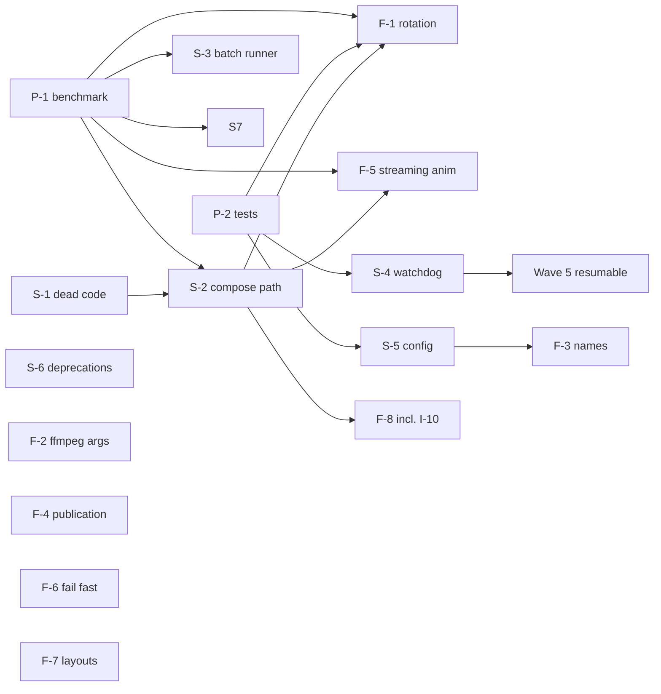

# MosaicKit — Implementation Plan (simplification + issue fixes)

Status: **proposed, 2026-09-26**. Maintainer decisions are recorded in
[CODEBASE_KNOWLEDGE.md §6.4](CODEBASE_KNOWLEDGE.md#64-maintainer-decisions-2026-09-26). Issue IDs
(`I-n`) refer to the verified issue register in
[CODEBASE_KNOWLEDGE.md §4.2](CODEBASE_KNOWLEDGE.md#42-verified-issue-register).

The plan runs in five waves:

1. **Safety net:** a benchmark and the tests that are missing today.
2. **Simplification** with no behavior change.
3. **High-severity fixes.**
4. **Medium and low fixes.**
5. **Platform and performance work** that is blocked on measurements.

Simplification comes first because it turns several fixes (I-1, I-10, I-20, the preview
watchdogs) into single-place changes.

---

## 1. Rules for every PR in this plan

- **Scope and reading:** one PR per row below, and nothing else in it. Before starting, read the
  knowledge-base sections listed in `CLAUDE.md`, "Start here".
- **Citations:** cite the `I-n` IDs or simplification IDs (`S-n`, §3) in the branch, commit and
  PR.
- **Knowledge base, same PR:**
  - update the §4.2 status and §6.1 roadmap;
  - update the affected Part 2/3 sections and §5.2/§5.6;
  - run `python3 codebase-analysis-docs/assets/doc_check.py`.
- **CI:** it must be green on both platforms (macOS and the iOS Simulator). New tests must
  compile on iOS and keep the suite fast: about 40 s on macOS and about 4 min on iOS today.
- **Performance gate (tagged ⚡ below):** any PR that touches the mosaic or animation pipeline, or
  batch scheduling, needs a before/after run of the benchmark from P-1 on the maintainer's
  machine. A throughput regression beyond noise blocks the merge. This is the lesson from 1.7.0,
  whose bounded source was reverted for being 30–45 % slower.
- **Output-location changes (tagged 📁):** these change where outputs land or what they're called
  (rules card #3–#4). Each gets a **"Behavior changes"** line in the README "Unreleased" section.
- **No test weakening:** never skip or loosen an existing test to get green.

## 2. Wave 1 — Safety net

| ID | PR | Contents | Why first |
|---|---|---|---|
| P-1 | **Opt-in throughput benchmark** | A `BenchmarkTests` suite enabled only when `MOSAICKIT_BENCHMARK=/path/to/videos` is set (the `.enabled(if:)` trait). It runs the mosaic batch at 2–3 fixed configs (for example 5120 px `.m` and 10000 px `.xs`, `custom` layout, HEIF) with concurrency 1 and N. It prints wall time, frames/s and MB/s, plus an animated-export run (`.gif`, `.webp`). No assertions; results go into the PR description. | Every ⚡ PR needs a baseline. The maintainer records the baseline on `main` once. |
| P-2 | **Missing test coverage** | (a) An 8-bit **rotated** fixture: a few seconds of portrait video with a 90° `preferredTransform`, under 1 MB, generated with ffmpeg. It gets a failing-today test that the mosaic cells keep a portrait aspect ratio; mark it `withKnownIssue` until I-1 lands. (b) A tiny **preview end-to-end smoke test**: native export of a short composition from the fixture, run in CI with lifecycle monitoring and retry disabled. Today no preview export runs in CI (rules card #14). (c) **Decode-old-payload tests**: a JSON `MosaicConfiguration` and `PreviewConfiguration` from 1.7.0, pinned as fixtures. | P-2b protects S-4. P-2a proves I-1. P-2c protects S-5 and I-24. |

## 3. Wave 2 — Simplification (no behavior change)

| ID | PR | Contents | Gate | Size |
|---|---|---|---|---|
| S-1 | **Remove unused internal code** (I-25 internal part) | Removals: `MosaicFrameSource.swift` + `makeFrameSource`; the unused private helpers in `MetalMosaicGenerator` (`extractFramesWithVideoToolbox`, its `calculateExtractionTimes`, `formatTimestamp`, `calculateAspectRatio`) and its commented-out blocks; `ThumbnailProcessor.drawMetadata`/`createDeepCopy`/`drawTimestampText`/`formatBitrate`; `LayoutProcessor.getMainScreenSize`/`adjustPortraitLayout`/`adjustLandscapeLayout`; `prioritizeVideos`, `getDuration`, `formatMetadata`; the no-op `catch { throw error }` blocks. Also **I-23**: drop the unused `swift-log` dependency and unify the OSLog subsystem on `com.mosaicKit`. | CI | ~450 lines |
| S-2 | **One mosaic composition path** ⚡ | Extract `composeMosaic(video:config:forIphone:progress:) -> (CGImage, MosaicLayout)`, shared by `generate()` and `generateMosaicImage()`; today about 110 duplicated lines. Extract `exportAnimation(video:asset:layout:config:referenceDate:)`, used by the three animated-export sites. Keep the progress values, statuses and `referenceDate` handling identical. | CI + benchmark | ~150 lines |
| S-3 | **One batch runner per coordinator** ⚡ (+ **I-15**) | Replace the four sliding-window `TaskGroup` loops with one helper. It keeps the `.queued` events, the `batchEpoch` checks before dequeuing and after each completion, the result order and the concurrency formula. `generateMosaicsForFiles` becomes "inspect inside the task, then the same runner". Key mosaic tracked tasks and progress handlers per attempt, as the preview coordinator already does (I-15). | CI + benchmark (batch) | ~250 lines |
| S-4 | **One export watchdog for previews** | A shared `ExportWatchdog` built on a `DispatchSourceTimer` on a dedicated queue, the same approach as #34's ffmpeg fix, plus one outcome mapper (stalled / cancelled / failed / missing output). Used by the native, SJS and passthrough exports. It removes the last cooperative-pool dependency in cancellation (the I-16 follow-up). | CI incl. P-2b | ~100 lines |
| S-5 | **Config models: delegate, don't duplicate** (+ **I-24**, **I-13** docs) | The secondary and deprecated `init`s call the designated `init`. Defaults move to single `static let` constants (`"1080p"` currently appears 3 times; the stale "defaults to 4K" comment goes). Every key added after 1.0 uses `decodeIfPresent ?? default`. Align the README and comments with the **1080p** default (decision D3). | CI incl. P-2c | ~80 lines |
| S-6 | **Deprecate unused public API** (decision D1) | Mark `@available(*, deprecated, message:)`, with removal in the next major version: `ThumbnailProcessor.generateMosaic`, `extractThumbnails`, `extractFramesStream`, `extractThumbnailsUI`, the legacy `createMetadataHeader(metadata:)`; `MetalImageProcessor.generateMosaic` (array path); `generateallcombinations`; `GenerationJobController` (I-14 → won't fix, deprecated); `drawMosaicASCIIArt`; `FFmpegEncodingOptions.forPreview`; the unused `PreviewGeneratorCoordinator` getters. Update the DocC `Architecture.md`, which still shows the array path. | CI | 0 lines now, ~550 at 2.0 |
| S-7 | *(opportunistic)* **Signposts and sampling** ⚡ | Keep signpost intervals only on stage-level functions and drop the redundant `emitEvent` calls (in 76 functions). Share the 20/60/20 sampling distribution between `ThumbnailProcessor` and the preview generator, keeping the preview's duration rules (rules card #9). | CI + benchmark | ~150 lines |

## 4. Wave 3 — High-severity fixes

| ID | PR | Contents | Gate |
|---|---|---|---|
| F-1 | **I-1 Rotated sources** ⚡ | Apply `preferredTransform` to `naturalSize` in `VideoMetadataExtractor` (use the absolute transformed size, as `buildVideoComposition` does). Cell aspect then matches the rotated frames. The header "Resolution" now shows display dimensions: note it in the changelog. The P-2a test must pass without `withKnownIssue`. | CI + benchmark |
| F-2 | **I-2 + I-3 ffmpeg arguments** | Aspect-preserving scale: `force_original_aspect_ratio=decrease:force_divisible_by=2`, with W/H swapped for portrait. Drop the forced `-r 30` and keep the source rate. Use `yuv420p10le` for libx265 and keep `p010le` only for VideoToolbox; this resolves Q13 without needing a 10-bit build. Add unit tests on the generated argument arrays for 16:9, 21:9 and portrait sources (macOS only). | CI |

## 5. Wave 4 — Medium and low fixes

| ID | PR | Contents | Gate |
|---|---|---|---|
| F-3 | **I-12 + I-11 deterministic names** 📁 | Remove the run timestamp from the default preview file name and offer it as an opt-in `{time}` token (D2). `{aspectRatio}` renders as `16-9` (D5). Add tests: the same config and input give the same name, and skip-if-exists now matches. | CI |
| F-4 | **I-4 Destination-aware publication** 📁 | `OutputTransaction` picks a strategy from `URLResourceValues.volumeIsLocal` (D6). **Local:** atomic no-clobber `renamex_np(…, RENAME_EXCL)`, falling back to the current path on `ENOTSUP`. **Remote (SMB/NFS):** stage in the local temp directory, copy under a hidden temporary name on the destination, then rename; non-atomic is acceptable. **Always:** delete the placeholder when the rename fails, and treat zero-byte outputs as "not done" in skip-if-exists. The strategy is injectable, so tests can force "remote". iCloud stays out of scope until Q14 is measured. Includes a manual SMB checklist in the PR. | CI + manual SMB run |
| F-5 | **I-20 Streaming animated export** ⚡ | `AnimatedGifGenerator` accepts an async sequence of frames. ImageIO frames are added to the `CGImageDestination` as they arrive; WebP frames go through the encoder's incremental `addImage`. `extractFramesForGif` yields frames instead of returning `[CGImage]`. Peak memory stops scaling with frame count × resolution. Record peak memory in the benchmark. | CI + benchmark |
| F-6 | **I-22 Fail fast on undecodable sources** | During inspection, read the video format description (codec, profile/bit depth). On iOS, H.264 High 10 fails with a new, clear `VideoError` before any extraction. The message names the codec and suggests re-encoding. Covered by a synthetic unit test on the detection function. | CI |
| F-7 | **I-8 + I-9 Layout options** | Deprecate `.dynamic` (D4): it still decodes, because persisted raw values must stay, and it is laid out as `custom`, with a one-time log warning. Fix `.auto` so it uses pixels consistently and floors the count at 4. | CI |
| F-8 | **Low-severity bundle** | I-5/I-6/I-7: one quality → preset resolver using ranges, shared by the exporters and `PreviewExportDescription`, with `renderSize` always passed to the writer. I-10: render `.colorPalette` swatches (done once S-2 exists). I-17: discovery reports per-file failures instead of failing the scan. I-18: validate the ColorDNA height and log overlay failures. I-19: steer docs and examples to `VideoInput(from:)`. | CI (⚡ for I-10) |

## 6. Wave 5 — Blocked on measurements (plan later)

| Item | Blocked on | Notes |
|---|---|---|
| Resumable preview export (OS 27, §4.9) | Q16; S-4 (shared watchdog) | Opt-in, with a stable per-job temp directory. |
| iCloud destinations (F-4 follow-up) | Q14 | Probably `NSFileCoordinator`; measure first. |
| AVIF output | Q17 | New `OutputFormat` / `AnimatedFormat` cases behind availability checks. |
| Throughput exploration: zero-copy CVPixelBuffer → Metal, encoding off the generator actor, VideoToolbox constant quality for SJS | Q11 (Instruments) | Each is ⚡, one experiment per PR, compared against the P-1 baseline. |

## 7. Order and dependencies

**Suggested sequence:**

1. P-1, P-2, S-1: can run in parallel.
2. S-2, then F-1.
3. F-2: independent; can go early because it is High severity and small.
4. S-3, S-4, S-5, S-6.
5. F-3, F-4, F-5, F-6, F-7, F-8.

**Releases:**

- **1.8.0** after waves 1–3: no breaking changes; deprecations; F-1 and F-2 fixes.
- **1.9.0** after wave 4: includes the 📁 naming and publication changes, called out in the
  changelog.
- **2.0.0** removes everything deprecated in S-6.

## 8. Tracking

Every PR updates its row here (status) and the matching §4.2 / §6.1 entries in
`CODEBASE_KNOWLEDGE.md`.

| ID | Status | PR |
|---|---|---|
| P-1 | planned | |
| P-2 | planned | |
| S-1 | planned | |
| S-2 | planned | |
| S-3 | planned | |
| S-4 | planned | |
| S-5 | planned | |
| S-6 | planned | |
| S-7 | optional | |
| F-1 | planned | |
| F-2 | planned | |
| F-3 | planned | |
| F-4 | planned | |
| F-5 | planned | |
| F-6 | planned | |
| F-7 | planned | |
| F-8 | planned | |
