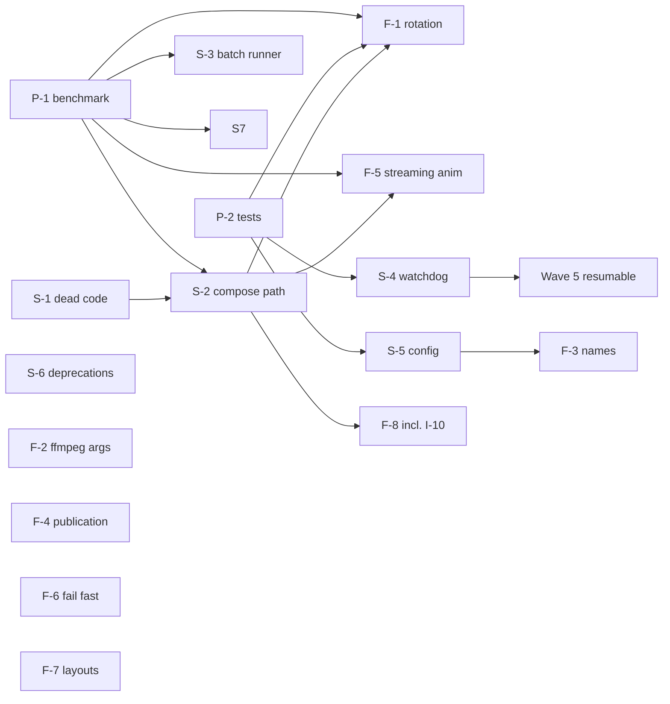

# MosaicKit — Implementation Plan (simplification + issue fixes)

Status: **proposed, 2026-09-26**. Maintainer decisions are recorded in
[CODEBASE_KNOWLEDGE.md §6.4](CODEBASE_KNOWLEDGE.md#64-maintainer-decisions-2026-09-26). Issue IDs
(`I-n`) refer to the verified issue register in
[CODEBASE_KNOWLEDGE.md §4.2](CODEBASE_KNOWLEDGE.md#42-verified-issue-register).

The plan runs in five waves:

1. **Safety net:** a benchmark and the tests that are missing today.
2. **Simplification** with no behavior change.
3. **High-severity fixes.**
4. **Medium and low fixes.**
5. **Platform and performance work** that is blocked on measurements.

Simplification comes first because it turns several fixes (I-1, I-10, I-20, the preview
watchdogs) into single-place changes.

---

## 1. Rules for every PR in this plan

- **Scope and reading:** one PR per row below, and nothing else in it. Before starting, read the
  knowledge-base sections listed in `CLAUDE.md`, "Start here".
- **Citations:** cite the `I-n` IDs or simplification IDs (`S-n`, §3) in the branch, commit and
  PR.
- **Knowledge base, same PR:**
  - update the §4.2 status and §6.1 roadmap;
  - update the affected Part 2/3 sections and §5.2/§5.6;
  - run `python3 codebase-analysis-docs/assets/doc_check.py`.
- **CI:** it must be green on both platforms (macOS and the iOS Simulator). New tests must
  compile on iOS and keep the suite fast: about 40 s on macOS and about 4 min on iOS today.
- **Performance gate (tagged ⚡ below):** any PR that touches the mosaic or animation pipeline, or
  batch scheduling, needs a before/after run of the benchmark from P-1 on the maintainer's
  machine. A throughput regression beyond noise blocks the merge. This is the lesson from 1.7.0,
  whose bounded source was reverted for being 30–45 % slower.
- **Output-location changes (tagged 📁):** these change where outputs land or what they're called
  (rules card #3–#4). Each gets a **"Behavior changes"** line in the README "Unreleased" section.
- **No test weakening:** never skip or loosen an existing test to get green.

## 2. Wave 1 — Safety net

| ID | PR | Contents | Why first |
|---|---|---|---|
| P-1 | **Opt-in throughput benchmark** | A `BenchmarkTests` suite enabled only when `MOSAICKIT_BENCHMARK=/path/to/videos` is set (the `.enabled(if:)` trait). It runs the mosaic batch at 2–3 fixed configs (for example 5120 px `.m` and 10000 px `.xs`, `custom` layout, HEIF) with concurrency 1 and N. It prints median and per-run wall time, source-seconds/s, input MB/s, output MB and process peak RSS, plus animated-export runs (`.gif`, `.webp`); see decision A-6. No assertions; results go into the PR description. | Every ⚡ PR needs a baseline. The maintainer records the baseline on `main` once. |
| P-2 | **Missing test coverage** | (a) An 8-bit **rotated** fixture: a few seconds of portrait video with a 90° `preferredTransform`, under 1 MB, generated with ffmpeg. It gets a failing-today test that the mosaic cells keep a portrait aspect ratio; mark it `withKnownIssue` until I-1 lands. (b) A tiny **preview end-to-end smoke test**: native export of a short composition from the fixture, run in CI with lifecycle monitoring and retry disabled. Today no preview export runs in CI (rules card #14). (c) **Decode-old-payload tests**: a JSON `MosaicConfiguration` and `PreviewConfiguration` from 1.7.0, pinned as fixtures. | P-2b protects S-4. P-2a proves I-1. P-2c protects S-5 and I-24. |

## 3. Wave 2 — Simplification (no behavior change)

| ID | PR | Contents | Gate | Size |
|---|---|---|---|---|
| S-1 | **Remove unused internal code** (I-25 internal part) | Removals: `MosaicFrameSource.swift` + `makeFrameSource`; the unused private helpers in `MetalMosaicGenerator` (`extractFramesWithVideoToolbox`, its `calculateExtractionTimes`, `formatTimestamp`, `calculateAspectRatio`) and its commented-out blocks; `ThumbnailProcessor.drawMetadata`/`createDeepCopy`/`drawTimestampText`/`formatBitrate`; `LayoutProcessor.getMainScreenSize`/`adjustPortraitLayout`/`adjustLandscapeLayout`; `prioritizeVideos`, `getDuration`, `formatMetadata`; the no-op `catch { throw error }` blocks. Also **I-23**: drop the unused `swift-log` dependency and unify the OSLog subsystem on `com.mosaicKit`. | CI | ~450 lines |
| S-2 | **One mosaic composition path** ⚡ | Extract `composeMosaic(video:config:forIphone:progress:) -> (CGImage, MosaicLayout)`, shared by `generate()` and `generateMosaicImage()`; today about 110 duplicated lines. Extract `exportAnimation(video:asset:layout:config:referenceDate:)`, used by the three animated-export sites. Keep the progress values, statuses and `referenceDate` handling identical. | CI + benchmark | ~150 lines |
| S-3 | **One batch runner per coordinator** ⚡ (+ **I-15**) | Replace the four sliding-window `TaskGroup` loops with one helper. It keeps the `.queued` events, the `batchEpoch` checks before dequeuing and after each completion, the result order and the concurrency formula. `generateMosaicsForFiles` becomes "inspect inside the task, then the same runner". Key mosaic tracked tasks and progress handlers per attempt, as the preview coordinator already does (I-15). | CI + benchmark (batch) | ~250 lines |
| S-4 | **One export watchdog for previews** | A shared `ExportWatchdog` built on a `DispatchSourceTimer` on a dedicated queue, the same approach as #34's ffmpeg fix, plus one outcome mapper (stalled / cancelled / failed / missing output). Used by the native, SJS and passthrough exports. It removes the last cooperative-pool dependency in cancellation (the I-16 follow-up). It must also root-cause **I-26** (the native export stalled once in CI; read the smoke test's progress trail). | CI incl. P-2b | ~100 lines |
| S-5 | **Config models: delegate, don't duplicate** (+ **I-24**, **I-13** docs) | The secondary and deprecated `init`s call the designated `init`. Defaults move to single `static let` constants (`"1080p"` currently appears 3 times; the stale "defaults to 4K" comment goes). Every key added after 1.0 uses `decodeIfPresent ?? default`; the P-2c 1.3.2 test (pre-`gifFps`) must then pass without `withKnownIssue`. Align the README and comments with the **1080p** default (decision D3). | CI incl. P-2c | ~80 lines |
| S-6 | **Deprecate unused public API** (decision D1) | Mark `@available(*, deprecated, message:)`, with removal in the next major version: `ThumbnailProcessor.generateMosaic`, `extractThumbnails`, `extractFramesStream`, `extractThumbnailsUI`, the legacy `createMetadataHeader(metadata:)`; `MetalImageProcessor.generateMosaic` (array path); `generateallcombinations`; `GenerationJobController` (I-14 → won't fix, deprecated); `drawMosaicASCIIArt`; `FFmpegEncodingOptions.forPreview`; the unused `PreviewGeneratorCoordinator` getters. Update the DocC `Architecture.md`, which still shows the array path. | CI | 0 lines now, ~550 at 2.0 |
| S-7 | *(opportunistic)* **Signposts and sampling** ⚡ | Keep signpost intervals only on stage-level functions and drop the redundant `emitEvent` calls (in 76 functions). Share the 20/60/20 sampling distribution between `ThumbnailProcessor` and the preview generator, keeping the preview's duration rules (rules card #9). | CI + benchmark | ~150 lines |

## 4. Wave 3 — High-severity fixes

| ID | PR | Contents | Gate |
|---|---|---|---|
| F-1 | **I-1 Rotated sources** ⚡ | Apply `preferredTransform` to `naturalSize` in `VideoMetadataExtractor` (use the absolute transformed size, as `buildVideoComposition` does). Cell aspect then matches the rotated frames. The header "Resolution" now shows display dimensions: note it in the changelog. The P-2a test must pass without `withKnownIssue`. | CI + benchmark |
| F-2 | **I-2 + I-3 ffmpeg arguments** | Aspect-preserving scale: `force_original_aspect_ratio=decrease:force_divisible_by=2`, with W/H swapped for portrait. Drop the forced `-r 30` and keep the source rate. Use `yuv420p10le` for libx265 and keep `p010le` only for VideoToolbox; this resolves Q13 without needing a 10-bit build. Add unit tests on the generated argument arrays for 16:9, 21:9 and portrait sources (macOS only). | CI |

## 5. Wave 4 — Medium and low fixes

| ID | PR | Contents | Gate |
|---|---|---|---|
| F-3 | **I-12 + I-11 deterministic names** 📁 | Remove the run timestamp from the default preview file name and offer it as an opt-in `{time}` token (D2). `{aspectRatio}` renders as `16-9` (D5). Add tests: the same config and input give the same name, and skip-if-exists now matches. | CI |
| F-4 | **I-4 Destination-aware publication** 📁 | `OutputTransaction` picks a strategy from `URLResourceValues.volumeIsLocal` (D6). **Local:** atomic no-clobber `renamex_np(…, RENAME_EXCL)`, falling back to the current path on `ENOTSUP`. **Remote (SMB/NFS):** stage in the local temp directory, copy under a hidden temporary name on the destination, then rename; non-atomic is acceptable. **Always:** delete the placeholder when the rename fails, and treat zero-byte outputs as "not done" in skip-if-exists. The strategy is injectable, so tests can force "remote". iCloud stays out of scope until Q14 is measured. Includes a manual SMB checklist in the PR. | CI + manual SMB run |
| F-5 | **I-20 Streaming animated export** ⚡ | `AnimatedGifGenerator` accepts an async sequence of frames. ImageIO frames are added to the `CGImageDestination` as they arrive; WebP frames go through the encoder's incremental `addImage`. `extractFramesForGif` yields frames instead of returning `[CGImage]`. Peak memory stops scaling with frame count × resolution. Record peak memory in the benchmark. | CI + benchmark |
| F-6 | **I-22 Fail fast on undecodable sources** | During inspection, read the video format description (codec, profile/bit depth). On iOS, H.264 High 10 fails with a new, clear `VideoError` before any extraction. The message names the codec and suggests re-encoding. Covered by a synthetic unit test on the detection function. | CI |
| F-7 | **I-8 + I-9 Layout options** | Deprecate `.dynamic` (D4): it still decodes, because persisted raw values must stay, and it is laid out as `custom`, with a one-time log warning. Fix `.auto` so it uses pixels consistently and floors the count at 4. | CI |
| F-8 | **Low-severity bundle** | I-5/I-6/I-7: one quality → preset resolver using ranges, shared by the exporters and `PreviewExportDescription`, with `renderSize` always passed to the writer. I-10: render `.colorPalette` swatches (done once S-2 exists). I-17: discovery reports per-file failures instead of failing the scan. I-18: validate the ColorDNA height and log overlay failures. I-19: steer docs and examples to `VideoInput(from:)`. | CI (⚡ for I-10) |

## 6. Wave 5 — Blocked on measurements (plan later)

| Item | Blocked on | Notes |
|---|---|---|
| Resumable preview export (OS 27, §4.9) | Q16; S-4 (shared watchdog) | Opt-in, with a stable per-job temp directory. |
| iCloud destinations (F-4 follow-up) | Q14 | Probably `NSFileCoordinator`; measure first. |
| AVIF output | Q17 | New `OutputFormat` / `AnimatedFormat` cases behind availability checks. |
| Throughput exploration: zero-copy CVPixelBuffer → Metal, encoding off the generator actor, VideoToolbox constant quality for SJS | Q11 (Instruments) | Each is ⚡, one experiment per PR, compared against the P-1 baseline. |

## 7. Order and dependencies

```mermaid
flowchart LR
  P1[P-1 benchmark] --> S2 & S3 & S7 & F1 & F5
  P2[P-2 tests] --> S4 & S5 & F1
  S1[S-1 dead code] --> S2
  S2[S-2 compose path] --> F1[F-1 rotation]
  S2 --> F5[F-5 streaming anim]
  S2 --> F8[F-8 incl. I-10]
  S3[S-3 batch runner]
  S4[S-4 watchdog] --> W5[Wave 5 resumable]
  S5[S-5 config] --> F3[F-3 names]
  S6[S-6 deprecations]
  F2[F-2 ffmpeg args]
  F4[F-4 publication]
  F6[F-6 fail fast]
  F7[F-7 layouts]
```

**Suggested sequence:**

1. P-1, P-2, S-1: can run in parallel.
2. S-2, then F-1.
3. F-2: independent; can go early because it is High severity and small.
4. S-3, S-4, S-5, S-6.
5. F-3, F-4, F-5, F-6, F-7, F-8.

**Releases:**

- **1.8.0** after waves 1–3: no breaking changes; deprecations; F-1 and F-2 fixes.
- **1.9.0** after wave 4: includes the 📁 naming and publication changes, called out in the
  changelog.
- **2.0.0** removes everything deprecated in S-6.

## 8. Tracking

Every PR updates its row here (status) and the matching §4.2 / §6.1 entries in
`CODEBASE_KNOWLEDGE.md`.

| ID | Status | PR |
|---|---|---|
| P-1 | done; baseline recorded 2026-09-30 (§8.1) | #39 |
| P-2 | done (found I-26) | #40 |
| S-1 | done | #38 |
| S-2 | done; benchmark gate passed (§8.1) | #41 |
| S-3 | done; A/B/A benchmark gate passed (§8.1) | #42 |
| S-4 | done; I-26 still open (see A-26) | #43 |
| S-5 | done | #45 |
| S-6 | planned | |
| S-7 | optional | |
| F-1 | planned | |
| F-2 | planned | |
| F-3 | planned | |
| F-4 | planned | |
| F-5 | planned | |
| F-6 | planned | |
| F-7 | planned | |
| F-8 | planned | |

### 8.1 Benchmark baseline

Recorded by the maintainer on 2026-09-30 from `baseline/pre-s2-2026-09-26` (`main@60d1731`), with
the P-1 command and default settings (3 timed runs after one warm-up, concurrency `1` and
`auto`). Every ⚡ PR repeats the run **on the same machine and the same 10 videos** and pastes
both tables into its description. Runs on different days vary more than runs within one session:
the S-2 after-run below makes identical calls but moved mosaic-10000-XS/auto by −14 %. So a
single before/after pair only rules out large regressions. For a PR that really changes a hot
path, run baseline and PR back to back in one session (A, B, A) and compare the medians of the
same session; treat differences within about ±5 % as noise.

Input: 10 videos, 15.6 min of source, 1677 MB.

| Scenario | Concurrency | Median (s) | Runs (s) | Source s/s | Input MB/s | Output MB | Peak RSS (MB) |
|---|---|---|---|---|---|---|---|
| mosaic-5120-M | 1 | 7.09 | 7.08, 7.09, 7.10 | 131.7 | 236.6 | 3.3 | 572 |
| mosaic-5120-M | auto | 4.30 | 4.36, 4.29, 4.30 | 217.0 | 390.1 | 3.3 | 1335 |
| mosaic-10000-XS | 1 | 23.61 | 25.05, 22.83, 23.61 | 39.5 | 71.0 | 13.0 | 1742 |
| mosaic-10000-XS | auto | 18.24 | 18.59, 18.24, 17.52 | 51.2 | 91.9 | 13.0 | 1904 |
| anim-gif-small | 1 | 10.59 | 10.59, 10.34, 10.62 | 88.2 | 158.4 | 45.9 | 1904 |
| anim-gif-small | auto | 7.92 | 8.05, 7.92, 7.80 | 117.8 | 211.7 | 45.9 | 1904 |
| anim-webp-small | 1 | 22.32 | 22.32, 21.97, 22.59 | 41.8 | 75.1 | 7.6 | 1904 |
| anim-webp-small | auto | 19.80 | 19.80, 19.82, 19.63 | 47.1 | 84.7 | 7.6 | 1904 |

Peak RSS is the process peak so far, so it only grows down the table; compare it row by row
with the same row of the other run.

**S-2 after-run** (2026-09-30, same machine and videos, PR #41). No regression beyond noise;
the refactor changes no work, so these deltas show day-to-day variance.

| Scenario | Concurrency | Baseline median (s) | S-2 median (s) | Change | S-2 runs (s) |
|---|---|---|---|---|---|
| mosaic-5120-M | 1 | 7.09 | 7.12 | +0.4 % | 7.00, 7.12, 7.13 |
| mosaic-5120-M | auto | 4.30 | 4.42 | +2.8 % | 4.42, 4.41, 4.46 |
| mosaic-10000-XS | 1 | 23.61 | 22.36 | −5.3 % | 22.36, 22.00, 22.37 |
| mosaic-10000-XS | auto | 18.24 | 15.73 | −13.8 % | 16.45, 15.73, 15.61 |
| anim-gif-small | 1 | 10.59 | 10.71 | +1.1 % | 10.73, 10.61, 10.71 |
| anim-gif-small | auto | 7.92 | 7.77 | −1.9 % | 7.85, 7.72, 7.77 |
| anim-webp-small | 1 | 22.32 | 21.92 | −1.8 % | 21.92, 21.92, 22.14 |
| anim-webp-small | auto | 19.80 | 19.51 | −1.5 % | 19.51, 19.52, 19.45 |

**S-3 A/B/A run** (2026-09-30, same machine, one session, 4 videos / 6.2 min of source /
671 MB; A = `main@f9c0405`, B = PR #42). Medians in seconds; peak RSS in MB (process maximum,
so it only grows down each table).

| Scenario | Concurrency | A1 | B | A2 | B vs mean(A) | Peak RSS A1 / B / A2 |
|---|---|---|---|---|---|---|
| mosaic-5120-M | 1 | 2.87 | 2.85 | 2.85 | −0.3 % | 567 / 566 / 569 |
| mosaic-5120-M | auto | 1.94 | 1.94 | 1.98 | −1.0 % | 1078 / 1247 / 1010 |
| mosaic-10000-XS | 1 | 9.45 | 8.73 | 8.86 | −4.6 % | 1713 / 1679 / 1457 |
| mosaic-10000-XS | auto | 6.66 | 6.11 | 6.81 | −9.3 % | 1790 / 2179 / 1882 |
| anim-gif-small | 1 | 4.16 | 4.18 | 4.14 | +0.7 % | 1790 / 2179 / 1882 |
| anim-gif-small | auto | 3.41 | 3.23 | 3.25 | −3.0 % | 1790 / 2179 / 1882 |
| anim-webp-small | 1 | 8.49 | 8.72 | 8.71 | +1.4 % | 1790 / 2179 / 1882 |
| anim-webp-small | auto | 7.99 | 7.97 | 8.27 | −2.0 % | 1790 / 2179 / 1882 |

Throughput: no row regresses (worst +1.4 % against the mean of A, +2.7 % against the faster
A). Peak RSS: B was higher in both `auto` mosaic rows (+16–23 %) in its single run. S-3 does
not change how many jobs run at once or what they hold, and identical code has moved about
20 % in these rows before, so this is recorded to recheck on the next ⚡ run rather than
treated as a regression.

## 9. Decision log (autonomous work)

The maintainer asked for autonomous progress while unavailable (2026-09-26), with every decision
logged and classified:

- **Two-way:** can be reverted cleanly, for example with `git revert` or a follow-up PR, with no
  lasting effect.
- **One-way:** hard or impossible to undo once shipped, for example a published API removal, a
  change to where existing outputs land, or anything users may already depend on.

One-way decisions are avoided where possible. When one is unavoidable, it is called out in the
PR title.

| # | Date | Context | Decision | Type | Rationale |
|---|---|---|---|---|---|
| A-1 | 2026-09-26 | Start of P-1/S-1 | Merge #37 (docs only; CI green; review findings fixed) before opening P-1/S-1, so they can update `CLAUDE.md`, the knowledge base and this plan on `main` | Two-way (revert commit) | Avoids stacked PRs and merge conflicts in the same doc lines |
| A-2 | 2026-09-26 | S-1 | Also unwrap the two no-op `do { } catch { throw error }` blocks in `MetalMosaicGenerator` in S-1 (dedent only), instead of leaving them to S-2 | Two-way | Mechanical, whitespace-only diff (`git diff -w` shows only the removed lines); keeps S-2 focused on the real merge |
| A-3 | 2026-09-26 | S-1 / I-23 | Remove `swift-log` from `Package.swift` without hand-editing `Package.resolved`; SwiftPM re-resolves on the manifest change and drops the stale pin | Two-way | Lockfiles are regenerated by tooling, never by hand; an extra pin cannot break resolution |
| A-4 | 2026-09-26 | S-1 / I-23 | Unify the OSLog subsystem on `com.mosaicKit` (the preview files used `com.mosaickit`) | Two-way | Console filters on `com.mosaickit` stop matching preview logs; note it in the changelog |
| A-5 | 2026-09-26 | S-1 | Delete `MosaicFrameSource.swift` rather than keeping it for reference; the 1.7.0 design stays in git history and in knowledge base §2.6 | Two-way (git history) | Internal type, never compiled into a code path since the revert |
| A-6 | 2026-09-26 | P-1 | Report source-seconds/s and input MB/s instead of frames/s | Two-way | Frame counts aren't exposed by `MosaicGenerationResult`; adding them would change public API for a test-only need |
| A-7 | 2026-09-26 | P-1 | Fixed scenarios, one discarded warm-up run, median of N; peak memory is process-wide `ru_maxrss` | Two-way | Stable, comparable numbers across PRs; the per-scenario memory figure is only meaningful with `--filter BenchmarkTests` |
| A-8 | 2026-09-26 | S-1 review | Keep the swift-log removal despite the Codex P1 comment asking to retain it | Two-way | The comment cited the stale pre-#37 `AGENTS.md` rule; the code never imported `Logging` (I-23) |
| A-9 | 2026-09-26 | P-1/S-1 | Merge #39 and #38 myself once CI is green on both platforms and every review thread is addressed (merge commits) | Two-way (revert commits) | Keeps the plan moving while the maintainer is away; nothing is released or tagged |
| A-10 | 2026-09-27 | Baseline | Maintainer asked for a static branch to benchmark later: `baseline/pre-s2-2026-09-26` at `main@60d1731` (includes P-1 and S-1; S-1 changes no executed code). It is never updated. Every ⚡ PR compares against it until a newer baseline is recorded | Two-way (branch can be deleted) | Lets the benchmark baseline be run days later on the exact pre-S-2 code |
| A-11 | 2026-09-27 | P-2c | The 1.7.0 payloads are hand-built from the `encode(to:)` implementations (the config models are unchanged from 1.7.0 through 1.7.4). No Swift toolchain here to generate them; CI is the check | Two-way | Same shape the encoder writes; non-default values exercise every field |
| A-12 | 2026-09-27 | P-2c | Add "legacy-minimal" payloads containing only the keys each decoder requires today | Two-way | Makes any newly required key (I-24) fail CI immediately |
| A-13 | 2026-09-27 | P-2b | The smoke test uses `AVAssetExportPresetMediumQuality` (H.264), 10 s target, no audio | Two-way | Fast and supported on the iOS Simulator; HEVC export there is slow software encoding |
| A-14 | 2026-09-27 | P-2a | The I-1 test checks inspected dimensions and the resulting classic-layout cells inside `withKnownIssue`, plus a passing check that extracted frames are portrait | Two-way | Pins the root cause and the symptom; F-1 must remove the wrapper, because a known issue that stops reproducing fails the test |
| A-15 | 2026-09-27 | P-2c | Add a pinned 1.3.2 `MosaicConfiguration` payload (last release before `gifFps`), shaped from the 1.3.2 models; it fails to decode today, so its test is wrapped in `withKnownIssue` for I-24 (review finding on #40) | Two-way | Proves I-24 on a real release shape; S-5 must remove the wrapper, because a known issue that stops reproducing fails the test |
| A-16 | 2026-09-27 | P-2b | The native smoke test stalled once in 4 macOS runs of identical code. Keep the test as is (no retry, no quarantine, no longer timeout); make it report the timestamped progress trail on failure, and register the stall as I-26 for S-4 | Two-way | Hiding the stall would remove the only signal of a possible real hang; the trail turns the next occurrence into a diagnosis |
| A-17 | 2026-09-30 | S-2 | Two shared helpers instead of one `composeMosaic`: `planMosaic` (validation, `.countingThumbnails`/`.computingLayout`, layout, aspect-snapped config) and `composeMosaic` (header, stream, Metal, ColorDNA, watermark), because `generate()` branches to `.gifOnly` between the two. `exportAnimation` takes the destination URL (every site already computes it for its existence check) and always passes `config.overwrite` (the backfill site used a literal `false`, but it only runs when `config.overwrite` is false). Side effect: `generateMosaicImage` now also logs the debug "Generation plan" line | Two-way | Same calls in the same order, so no output or progress change; ~76 fewer lines |
| A-18 | 2026-09-30 | S-2 | Add `MosaicCompositionPathTests`: `generate` and `generateMosaicImage` must give the same mosaic size, and `generateMosaicImage` must end with `.completed` | Two-way | `generateMosaicImage` had no test; this is the net for the shared path |
| A-19 | 2026-09-30 | S-2 | ⚡ PRs are not merged on green CI alone (A-9): they wait for the maintainer's after-run of the benchmark on the baseline machine | Two-way | The performance gate needs the maintainer's machine; CI cannot measure throughput |
| A-20 | 2026-09-30 | S-2 | Benchmark gate passed: no median regressed beyond noise (worst +2.8 %, mosaic-5120-M/auto, 0.12 s over 10 videos; S-2 changes no work). Future hot-path PRs use back-to-back A/B/A runs in one session and a ±5 % noise band, because day-to-day variance reached 14 % | Two-way | Different-day runs of identical code moved one scenario by −14 %, so a ±3 % band across sessions would be meaningless |
| A-21 | 2026-09-30 | S-3 | One private generic `runBatch` inside each coordinator (not one helper shared across both actors). Each keeps its own limit rule (mosaic: a non-zero limit applies before the next dequeue; preview: `effectiveConcurrencyLimit` re-read before each dequeue and while waiting), priorities (`.medium`; preview composition `.utility`), `.queued` events and epoch checks. The child-task bodies move unchanged into `job` closures. Only logs and signposts change wording | Two-way | The coordinators differ in limit semantics and result types; one runner per actor keeps each exactly as it was and avoids cross-actor isolation plumbing |
| A-22 | 2026-09-30 | S-3 / I-15 | Mosaic coordinator tracks tasks, handlers and sources per attempt. The public stored `activeTasks` becomes a read-only computed view keyed by video ID (one of the attempts when several run on one video) | Two-way | Actor properties can't be written from outside the actor, so every existing external use (reads) keeps working |
| A-23 | 2026-09-30 | S-3 | Add `BatchRunnerTests`: a fake `MosaicGeneratorProtocol` generator that only sleeps checks the mosaic runner (limit, `.queued`, results, `cancelAllGenerations`) and I-15 in milliseconds; a composition-only preview batch checks the preview runner. The generator-level `setProgressHandler(for:)` stays keyed by video (noted in the I-15 row) | Two-way | The existing batch suites need a media folder and are skipped in CI, so the runners had no CI coverage |
| A-24 | 2026-09-30 | S-3 | A/B/A benchmark gate passed (B within ±5 % of both A runs; worst +1.4 % against their mean). Merge. B's higher peak RSS in the two `auto` mosaic rows (one run, +16–23 %) is recorded in §8.1 and rechecked on the next ⚡ PR's run, not treated as a regression | Two-way | Throughput is the gate; S-3 does not change concurrency or per-job memory, and RSS peaks already varied about 20 % on identical code |
| A-25 | 2026-09-30 | S-4 | One `ExportWatchdog` class (own file) for native, SJS and passthrough: a `DispatchSourceTimer` on a dedicated queue polling every 0.5 s (was a `Task` polling every 1 s), stop action as a closure (`cancelExport()` or cancelling the SJS task), and one outcome mapper (stall → cancellation → export error → missing output). Timeouts, messages and cleanup are unchanged. Two deliberate differences: a `CancellationError` from native/passthrough export now reports `.cancelled` instead of `encodingFailed` (it already did for SJS; rule: cancelled work is never `.failed`), and the stall log includes the last progress value. The ffmpeg process watchdog keeps its own timer (SIGTERM→SIGKILL escalation) | Two-way | Removes the last cooperative-pool dependency in export cancellation; three copies of the stall/cancel logic become one tested class |
| A-26 | 2026-09-30 | S-4 / I-26 | S-4 does not claim to fix I-26. The stall reappeared once locally (first run after a fresh build, trail lost) and not in 24 reruns; I-26 stays open with the new evidence. Also left out of this PR: `Package.resolved` still pins `swift-log`, which S-1 removed from `Package.swift`; SwiftPM drops the pin on every local build, so it needs its own one-line PR (done in #44, the S-4 cleanup) | Two-way | Keeps the PR to its plan row and the issue register honest |
| A-27 | 2026-09-30 | S-5 / I-24 | Decoding fallbacks live in one private `MissingKeyDefault` enum (not public `static let`s, which would add API; public default arguments cannot reference internal constants). Keys found to be post-1.0 from the release tags: `overlay` 1.1.0; `gifMode`, `gifSize`, `animatedFormat` 1.1.11; `overwrite` 1.1.16; `gifFps` 1.4.0; `createOutputSubdirectory` 1.6.0. Nested types (layout, visual, overlay parts) have not changed shape since they were introduced, so they stay strict. Add a pinned `mosaic-config-1.0.0.json` (the oldest shape) | Two-way | Proves every post-1.0 key on a real release shape; one place to add future keys |
| A-28 | 2026-09-30 | S-5 | The secondary and deprecated initializers of both configuration types delegate to the designated one, each keeping its own values (2500 px/q0.3 preset, `.small` GIFs, `.gif` for the deprecated `forIphone` init). The README 1.6.2 "default is 4K" bullet gets an inline correction rather than a rewrite, since it is release history. `ConfigurationInitializerTests` pins every initializer's values and would crash if delegation recursed | Two-way | Removes about 60 duplicated assignment lines without changing any value |
| A-29 | 2026-09-30 | I-26 | `ExportStressTests` reproduces the stall under macOS background scheduling (0 of 640 at normal priority; 6 and 7 of 60 under `taskpolicy -b`; 0 of 60 once the process leaves it) and under a background QoS clamp (7 of 60, which a process cannot lift), matching the maintainer's observation with backgrounded apps. *Correction (same PR):* this does **not** explain the CI stall: CI run 36742667122 stalled at exactly 60 % with darwin background scheduling off. So `leaveBackground()` in the smoke test is a partial measure, and the test now logs main-thread QoS, VM and thermal state to attribute the next CI stall. I-26 stays open. The library never changes its host's scheduling. The harness is committed as the opt-in `ExportStressTests` | Two-way | Records the proven mechanism without claiming a CI fix the data refuted |
| A-30 | 2026-09-30 | I-26 | Keep `allowsParallelizedExport = true`: turning it off did not change the stall rate under background scheduling (7 vs 6 of 60) | Two-way | It was the main suspect before the measurements |
