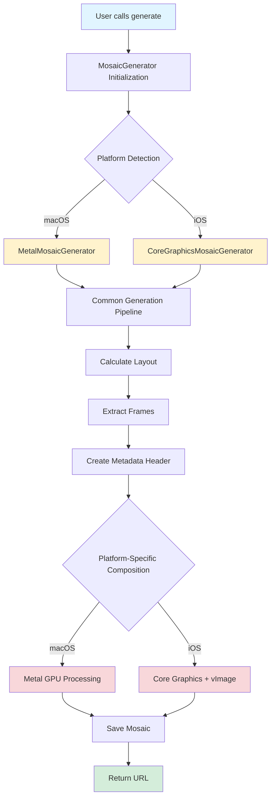
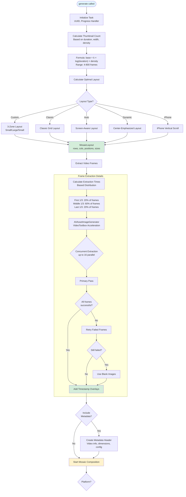
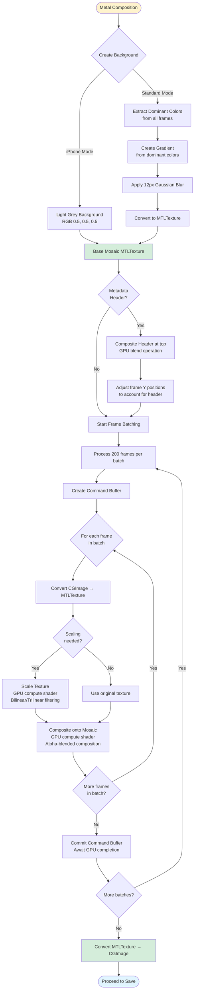
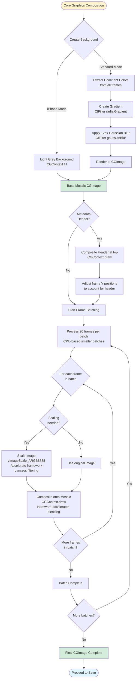
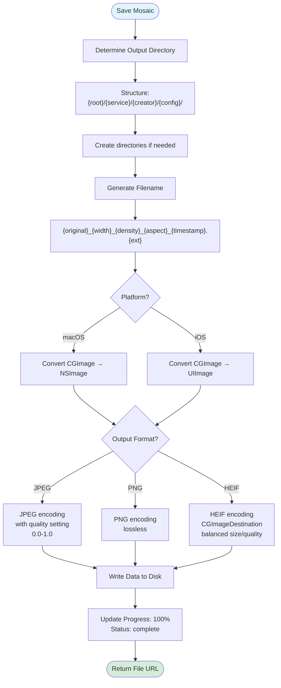
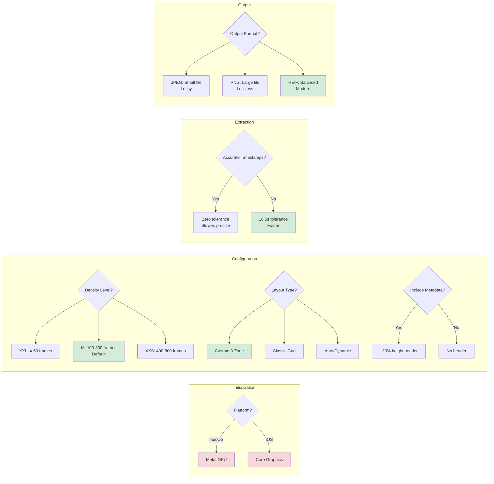
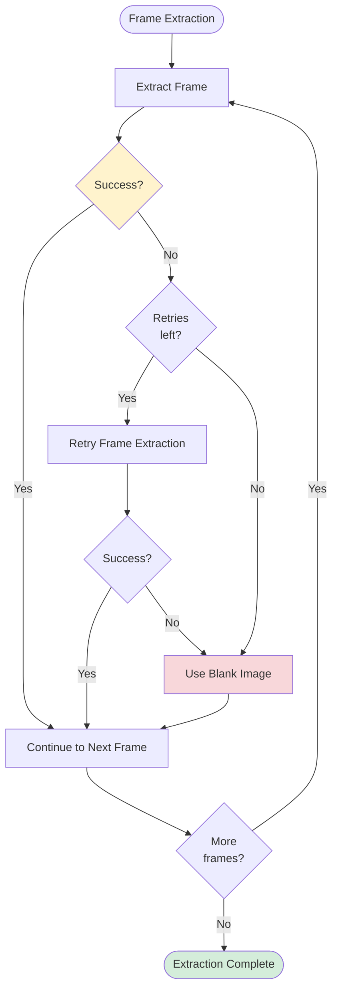
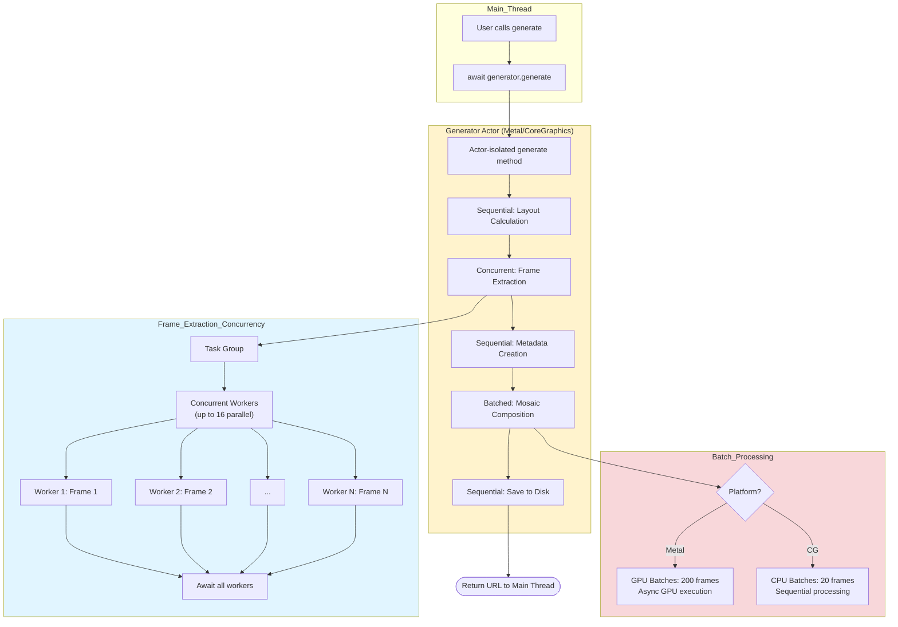

# Mosaic Generation Workflow Visualization

This document provides visual workflow diagrams for the MosaicKit mosaic generation process.

## High-Level Overview



## Detailed Generation Pipeline



## Platform-Specific Composition: Metal (macOS)



## Platform-Specific Composition: Core Graphics (iOS)



## Save & Finalization



## Progress Tracking Throughout Pipeline

```mermaid
gantt
    title Mosaic Generation Progress Timeline
    dateFormat X
    axisFormat %s%%

    section Initialization
    Count Thumbnails    :0, 0

    section Layout
    Compute Layout      :0, 10

    section Extraction
    Extract Frames      :10, 70
    Add Timestamps      :crit, 65, 70

    section Composition
    Create Background   :70, 73
    Add Metadata Header :73, 75
    Process Frame Batches :75, 90

    section Finalization
    Save to Disk        :90, 100
    Complete            :milestone, 100, 100
```



## Key Decision Points



## Performance Characteristics Comparison

| Aspect | Metal (macOS) | Core Graphics (iOS) |
|--------|---------------|---------------------|
| **Background Creation** | GPU-accelerated gradient | CIFilter + CPU rendering |
| **Image Scaling** | GPU compute shader (bilinear/trilinear) | vImage Accelerate (Lanczos) |
| **Composition** | GPU alpha-blending shader | CGContext hardware-accelerated |
| **Batch Size** | 200 frames (GPU optimized) | 20 frames (CPU optimized) |
| **Concurrency** | Asynchronous GPU batches | Sequential CPU batches |
| **Memory** | GPU VRAM + System RAM | System RAM only |
| **Typical Speed** | Very Fast (GPU parallel) | Fast (CPU SIMD) |

## Error Handling & Retry Logic



## Concurrency Model



## Complete End-to-End Timeline

```
┌─────────────────────────────────────────────────────────────────────┐
│ USER INPUT                                                          │
│ let url = try await generator.generate(from: video, config: config)│
└────────────────────────────┬────────────────────────────────────────┘
                             │
                             ▼
┌─────────────────────────────────────────────────────────────────────┐
│ INITIALIZATION (0-5% progress)                                      │
│ • Factory selects Metal (macOS) or Core Graphics (iOS)             │
│ • Create actor-based generator                                     │
│ • Load VideoInput from URL                                         │
│ • Initialize task with UUID                                        │
└────────────────────────────┬────────────────────────────────────────┘
                             │
                             ▼
┌─────────────────────────────────────────────────────────────────────┐
│ LAYOUT CALCULATION (5-10% progress)                                │
│ • Calculate thumbnail count: base + k×log(duration)×density        │
│   Example: 5120px, 60s, M density → ~250 frames                   │
│ • Calculate optimal layout (Custom 3-zone / Classic / Auto)        │
│   → Returns: rows, cols, positions, sizes                         │
└────────────────────────────┬────────────────────────────────────────┘
                             │
                             ▼
┌─────────────────────────────────────────────────────────────────────┐
│ FRAME EXTRACTION (10-70% progress) ★ MOST TIME CONSUMING ★         │
│ • Calculate extraction times with biased distribution:             │
│   - First 1/3: 20% of frames (skip intro/credits)                 │
│   - Middle 1/3: 60% of frames (capture main action)               │
│   - Last 1/3: 20% of frames (skip outro)                          │
│ • AVAssetImageGenerator with VideoToolbox acceleration            │
│ • Concurrent extraction (up to 16 parallel workers)                │
│ • Primary pass → Retry failed → Blank fallback                    │
│ • Add timestamp overlays to each frame                             │
│   Example: 250 frames @ 1080p extracted in ~15-30 seconds         │
└────────────────────────────┬────────────────────────────────────────┘
                             │
                             ▼
┌─────────────────────────────────────────────────────────────────────┐
│ METADATA HEADER (70-72% progress, optional)                        │
│ • Create header with video info if config.includeMetadata = true  │
│ • Height = 30% of thumbnail height                                 │
│ • Contains: filename, duration, dimensions, FPS, codec, bitrate    │
└────────────────────────────┬────────────────────────────────────────┘
                             │
                             ▼
┌─────────────────────────────────────────────────────────────────────┐
│ MOSAIC COMPOSITION (72-90% progress)                               │
│                                                                     │
│ ┌─────────────────────┬─────────────────────────────────────────┐ │
│ │ Metal (macOS)       │ Core Graphics (iOS)                     │ │
│ ├─────────────────────┼─────────────────────────────────────────┤ │
│ │ 1. Create gradient  │ 1. Create gradient background         │ │
│ │    background via   │    via CIFilter + Gaussian blur       │ │
│ │    GPU              │                                         │ │
│ │ 2. Convert to       │ 2. Render to CGImage                  │ │
│ │    MTLTexture       │                                         │ │
│ │ 3. Process in       │ 3. Process in 20-frame batches        │ │
│ │    200-frame        │                                         │ │
│ │    batches          │                                         │ │
│ │ 4. For each batch:  │ 4. For each frame:                    │ │
│ │    - Create command │    - Scale with vImage (Lanczos)      │ │
│ │      buffer         │    - Composite with CGContext.draw    │ │
│ │    - Scale frames   │                                         │ │
│ │      (GPU shader)   │                                         │ │
│ │    - Composite      │                                         │ │
│ │      (GPU shader)   │                                         │ │
│ │    - Commit batch   │                                         │ │
│ │ 5. Convert texture  │ 5. Final CGImage ready                │ │
│ │    to CGImage       │                                         │ │
│ └─────────────────────┴─────────────────────────────────────────┘ │
│                                                                     │
│ Example: 250 frames @ 200×150px → 5120×2880px mosaic              │
│          Metal: ~5-10 seconds   CG: ~10-20 seconds                 │
└────────────────────────────┬────────────────────────────────────────┘
                             │
                             ▼
┌─────────────────────────────────────────────────────────────────────┐
│ SAVE TO DISK (90-100% progress)                                    │
│ • Determine output directory structure                             │
│   {root}/{service}/{creator}/{config}/                            │
│ • Generate filename                                                 │
│   {original}_{width}_{density}_{aspect}_{timestamp}.{ext}         │
│ • Convert CGImage → NSImage/UIImage                               │
│ • Encode based on format (JPEG/PNG/HEIF)                          │
│ • Write to disk                                                     │
│   Example: 5120×2880 HEIF → ~3-8 MB file in ~1-2 seconds          │
└────────────────────────────┬────────────────────────────────────────┘
                             │
                             ▼
┌─────────────────────────────────────────────────────────────────────┐
│ COMPLETION (100% progress)                                         │
│ • Update performance metrics                                       │
│ • Return file URL to user                                          │
│ • Fire completion progress handler                                 │
└─────────────────────────────────────────────────────────────────────┘

Total Time Example (1080p 60s video, 250 frames, 5120px width):
• Metal (macOS): ~25-45 seconds
• Core Graphics (iOS): ~35-60 seconds
```

## Summary

The mosaic generation workflow is a sophisticated pipeline that:

1. **Adapts to platform** - Automatically selects optimal processing backend
2. **Optimizes frame selection** - Biased distribution captures important moments
3. **Leverages hardware acceleration** - Metal GPU (macOS) or vImage/Accelerate (iOS)
4. **Processes efficiently** - Batched composition prevents timeouts
5. **Provides transparency** - Real-time progress tracking with 5 distinct phases
6. **Handles errors gracefully** - Retry logic with fallback to blank frames
7. **Delivers quality** - High-quality scaling and multiple output formats

The entire process is thread-safe via Swift actors, async/await concurrency, and platform-specific optimizations that make full use of available hardware resources.
